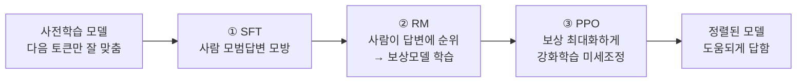

# RLHF / RLAIF — 모델을 '말 잘 듣게' 만드는 정렬(Alignment)

> 학습용 문서. 요약 → 상세 → "알면 AI를 더 잘 쓰는 법" 순. 인용은 검증된 arXiv만.

## 요약 (3줄)

- 사전학습만 한 LLM은 "다음 토큰"만 잘 맞출 뿐, **사람이 원하는 대로 답하진 않는다.**
- 그걸 사람(또는 AI)의 **선호 피드백으로 교정**하는 과정이 RLHF(사람)/RLAIF(AI).
- 그래서 같은 베이스 모델도 **정렬 방식에 따라 성격·말투·거부 행동이 완전히 달라진다.**

## 상세

### 1. 왜 필요한가 — 사전학습의 빈틈
사전학습 모델은 인터넷 텍스트의 분포를 흉내 낼 뿐이라, "질문에 도움되게 답하라"는
목표가 없다. → **정렬(alignment)** 단계가 베이스 모델을 '비서'로 바꾼다.

### 2. RLHF 3단계 (InstructGPT 파이프라인)
[InstructGPT, Ouyang 외 2022, arXiv:2203.02155](https://arxiv.org/abs/2203.02155)
```
① SFT   : 사람이 쓴 모범 답변으로 지도학습 (Supervised Fine-Tuning)
② RM    : 사람이 여러 답변에 순위 매김 → 보상모델(Reward Model) 학습
③ PPO   : 보상모델 점수를 강화학습으로 최대화하게 본 모델을 미세조정
```
- 충격적 결과: **1.3B RLHF 모델이 175B GPT-3보다 선호됨** → 크기보다 정렬이 중요.



### 3. RLAIF — 사람 대신 AI가 피드백
[Constitutional AI, Bai 외 2022, arXiv:2212.08073](https://arxiv.org/abs/2212.08073)
- 사람 라벨링은 비싸고 느림 → **모델이 '헌법(원칙)'에 비춰 자기 답을 비판·수정**.
- 그 자기 생성 선호쌍으로 보상모델 학습 → RLAIF(RL from AI Feedback).
- "도움됨 + 무해함" 같은 원칙을 명시적으로 주입 → Claude의 거부/안전 행동의 뿌리.

### 4. DPO — 보상모델·RL 없이 더 간단하게
[DPO, Rafailov 외 2023, arXiv:2305.18290](https://arxiv.org/abs/2305.18290)
- 별도 보상모델·PPO 없이, 선호쌍으로 **모델을 직접 최적화**. 안정적이고 구현이 단순.
- 이후 KTO, IPO, ORPO 등 변형 다수. → "정렬 = 고정 기술"이 아니라 **빠르게 진화 중**.

### 5. 정렬세(alignment tax)와 부작용
- 너무 강하게 정렬하면 **성능 저하·과도한 거부·아첨(sycophancy)** 이 생길 수 있음.
- → 정렬은 "안전 vs 유용성"의 줄다리기. (환각-창의 트레이드오프와 같은 결의 문제)

### 6. 정렬 방법 계보 (나열) — RLHF만 있는 게 아니다
- **SFT(지도 미세조정)**: 모범답변 모방. 정렬의 기본 토대.
- **RLHF (PPO)**: 보상모델 + 강화학습. 강력하지만 파이프라인이 복잡(RM·PPO 불안정).
- **RLAIF / Constitutional AI**: 사람 대신 AI가 원칙 기준으로 피드백 → 라벨링 비용↓.
- **DPO**: 보상모델·RL 없이 선호쌍으로 직접 최적화. 단순·안정 → 최근 많이 쓰임.
- **그 외 변형**: KTO(좋음/나쁨 이진 신호), IPO(과적합 완화), ORPO(SFT+선호 한 번에) 등.
  → "정렬 = 한 기술"이 아니라 **목적(안정성/비용/품질)에 따라 고르는 도구 모음**.

### 7. 정렬이 만드는 행동들 (체감 사례)
- **거부(refusal)**: 위험·민감 요청 차단 — Constitutional 원칙의 결과.
- **아첨(sycophancy)**: 사용자가 좋아할 답으로 기울기 — RLHF 보상의 부작용.
- **장황함/면책**: "일반적으로는…" 같은 회피 — 평가가 안전한 답을 보상해서.
- **거짓 자신감**: 모르면서 단정 — [환각 논문](../papers/hallucination-reasoning-emergence.md)의
  "찍기 보상"과 같은 뿌리.

## 알면 AI를 더 잘 쓰는 법 (어필 포인트)

> **핵심: "AI를 잘 쓴다 = AI가 왜 그렇게 답하는지 알고 쓴다."**

- **거부/회피를 만나면**: 모델의 안전 정렬(Constitutional) 때문임을 알고, 맥락·의도를
  명확히 줘서 우회가 아니라 **정당한 요청임을 전달**한다.
- **아첨(무조건 동의)을 의심**: RLHF는 "사람이 좋아할 답"을 보상하므로, 모델이
  내 의견에 영합할 수 있다 → **반대 근거를 일부러 요구**해 검증. (이번 세션 내내 한 검증과 동일)
- **모델 선택 감각**: 같은 작업도 정렬 성향이 다르면 결과가 다르다 → 보수적 답이
  필요하면 안전 정렬 강한 모델, 자유로운 발상엔 덜 정렬된/temperature 높은 설정.
- **프롬프트 = 미니 정렬**: system prompt로 "원칙"을 주는 건 Constitutional AI의 축소판.
  역할·제약·금지사항을 명시하면 그 방향으로 행동이 정렬된다.

## 관련 문서

- [LLM이란 무엇인가](../llm/what-is-llm.md) — 사전학습 단계
- [논문: 환각·추론·창발](../papers/hallucination-reasoning-emergence.md) — 정렬세·환각과 연결
- [카파시 접근법](../llm/karpathy-approach.md)
