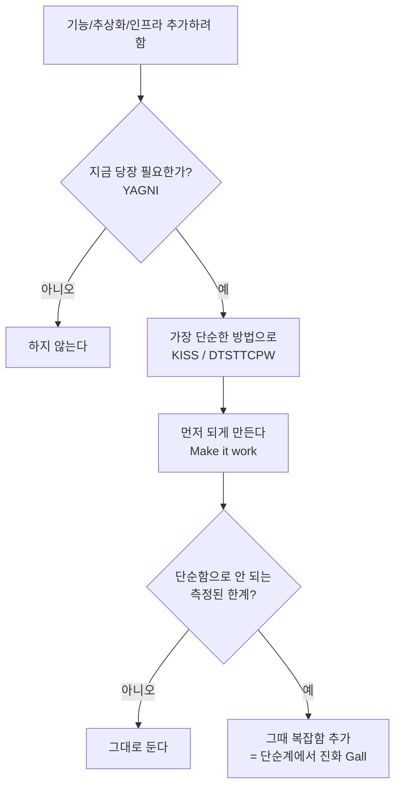

# 단순함 원칙 — YAGNI를 중심으로

> 같은 뿌리("불필요한 복잡함을 피하라")를 가진 원칙 묶음. **YAGNI**가 대표.
> 단, 이 원칙들은 "무엇을 하지 말지"의 *지침*일 뿐, **"지금 여기에 적용할지"의 판단은 사람 몫**이다.
> 그 판단력 = 추론 → [추론 기법](../thinking/reasoning-methods.md).

## 핵심 — YAGNI (You Aren't Gonna Need It)

> **필요해지기 전엔 만들지 마라.** "나중에 쓸지도 몰라"로 미리 짓지 않는다.

- 출처: [YAGNI (Wikipedia)](https://en.wikipedia.org/wiki/You_aren%27t_gonna_need_it) — 익스트림 프로그래밍(XP)에서 유래.
- 왜: 안 쓸 기능은 **만드는 비용 + 유지·이해·버그의 비용**까지 계속 든다. 미래 예측은 대개 빗나간다.

## 같은 결의 원칙들

| 원칙 | 한 줄 | 강조점 |
|------|-------|--------|
| **YAGNI** | 필요할 때까지 만들지 마라 | **현재에 국한** |
| **KISS** (Keep It Simple) | 가능한 한 단순하게 | 복잡함 자체를 줄임 |
| **DTSTTCPW** | "지금 동작할 가장 단순한 것"부터 | 시작점 |
| **Make it work → right → fast** (Kent Beck) | 되게 → 옳게 → 빠르게 **순서대로** | 단계적 escalation |
| **Gall's Law** | 동작하는 복잡계는 **동작하던 단순계에서 진화**했다 | 처음부터 복잡 설계 금지 |

> Gall's Law: "처음부터 복잡하게 설계한 시스템은 절대 안 돈다. 동작하는 단순한 것에서 시작해 키워라."
> ([출처](https://deviq.com/laws/galls-law/)) — CORBA(복잡 명세, 실패) vs 웹(단순→진화, 성공)이 대표 대비.

## 한 흐름으로 보면

## ★ 가장 중요한 것 — 판단은 사람이 한다

이 원칙들은 **"언제 멈추고 언제 더할지"를 자동으로 정해주지 않는다.** "지금 필요한가?",
"이게 측정된 한계인가, 그냥 불안인가?"를 **판단하는 건 사람의 추론**이다.
LLM은 근거를 빨리 찾아주지만, 판단까지 위탁하면 사고력이 준다(→ [추론 기법](../thinking/reasoning-methods.md)).

## 우리 사례와 연결 (모두 같은 정신)

- **Redis 걷어내고 db-row-lock/atomic** — 지금 분산이 필요 없으니 Redis의 분산 능력을 버린
  계산된 YAGNI 베팅. ([tradeoffs 사례1](../tradeoffs/no-single-right-answer.md))
- **중소 회사 4사례** — 모놀리스+검증된 기술로 시작, 측정된 병목일 때만 확장. ([scale-reality](../cs-fundamentals/scale-reality-small-medium.md))
- **lab-benchmarks** — "필요해서"가 아니라 측정으로 결정.

## 관련 문서

- [추론 기법](../thinking/reasoning-methods.md) — 적용 판단을 위한 사고법
- [정답은 없다 — 경험담](../tradeoffs/no-single-right-answer.md)
- [트레이드오프 읽는 법](../tradeoffs/reading-tradeoffs-and-metrics.md)
- [카파시 접근법](../llm/karpathy-approach.md)
