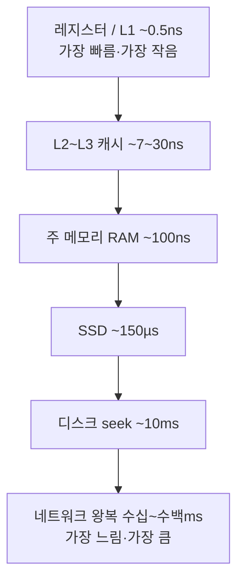

# 메모리 계층과 지연시간 — '하드웨어를 의식하는' 사고의 출발점

> 학습용 문서. 요약 → 상세 → 실무 연결 순.
> 핵심은 숫자 암기가 아니라 **상대적 차이의 직관**을 갖는 것.

## 요약 (3줄)

- CPU는 빠르고, 메모리·디스크·네트워크로 갈수록 **기하급수적으로 느려진다.**
- 그래서 "어디서 데이터를 읽느냐"가 성능을 좌우한다 (계산량보다 **데이터 이동**이 병목).
- 좋은 코드는 **가까운 곳(cache/RAM)의 데이터를 잘 재사용**한다 (mechanical sympathy).

## 상세

### 1. 메모리 계층 (위로 갈수록 빠르고 작고 비쌈)
```
레지스터      < 1ns    수십 바이트   ← CPU 안
L1 캐시       ~0.5ns   수십 KB
L2 캐시       ~7ns     수백 KB
L3 캐시       ~30ns    수~수십 MB    ← 코어 간 공유
주 메모리(RAM) ~100ns   수~수백 GB
SSD(랜덤 4K)  ~150µs   수백 GB~TB
디스크 seek   ~10ms    TB~
네트워크 왕복  수십~수백 ms          ← 데이터센터 간
```
[Latency Numbers (Jeff Dean) gist](https://gist.github.com/jboner/2841832),
[인터랙티브 버전](https://colin-scott.github.io/personal_website/research/interactive_latency.html)


> 위로 갈수록 빠르고 작고 비싸다. 한 칸 내려갈 때마다 **수십~수만 배** 느려진다.

### 2. 직관 — 스케일을 사람 시간으로 환산
L1을 1초로 치면: RAM ≈ 약 3-4분, SSD ≈ 며칠, 디스크 seek ≈ 1년, 네트워크 ≈ 수년.
→ "RAM에서 읽기 vs 디스크에서 읽기"는 **수만 배** 차이. 알고리즘 빅오보다
   "어느 계층을 건드리나"가 체감 성능을 더 좌우하는 경우가 많다.

### 3. 왜 캐시가 그렇게 중요한가
- **지역성(locality)**: 방금 쓴 데이터(시간적)·근처 데이터(공간적)를 또 쓸 확률이 높다.
  하드웨어는 이를 노리고 캐시 라인 단위(보통 64B)로 미리 가져온다.
- 그래서 **연속된 메모리(배열)** 순회가 **흩어진 메모리(링크드리스트/포인터 추적)** 보다
  훨씬 빠르다 — 빅오가 같아도. (cache miss가 진짜 비용)

### 4. 숫자는 변한다, 비율은 남는다
하드웨어는 매년 빨라진다 → **절대 수치 암기는 무의미**. 변치 않는 건
**계층 간 상대 비율**과 "데이터 이동이 비싸다"는 원칙. (이 레포의 다른 문서들처럼,
변하는 값보다 변치 않는 원리를 적는다.)

## 실무 연결 — 이걸 알면 무엇이 달라지나

- **성능 튜닝의 시작점**: "CPU를 더 쓸까"가 아니라 "**불필요한 데이터 이동(메모리·디스크·
  네트워크 왕복)을 줄일까**"를 먼저 본다. N+1 쿼리, 반복 디스크 읽기가 대표적 범인.
- **자료구조 선택**: 단순 순회가 잦으면 배열/연속 메모리가 유리 (캐시 친화).
- **캐싱 설계**: 비싼 계층(DB·네트워크) 결과를 가까운 계층(메모리)에 둔다 = 모든 캐시의 본질.
- **LLM과의 연결**: context window도 일종의 "빠른 메모리". 거기 안 든 건 매번 다시
  찾아야(=느린 계층) 하므로, **무엇을 context에 둘지**가 곧 성능 설계다.

## 관련 문서

- [scale-up vs scale-out](scaling-up-vs-out.md)
- [Reusable Workflows](../github-actions/reusable-workflows.md) — runner CPU/RAM 고려
