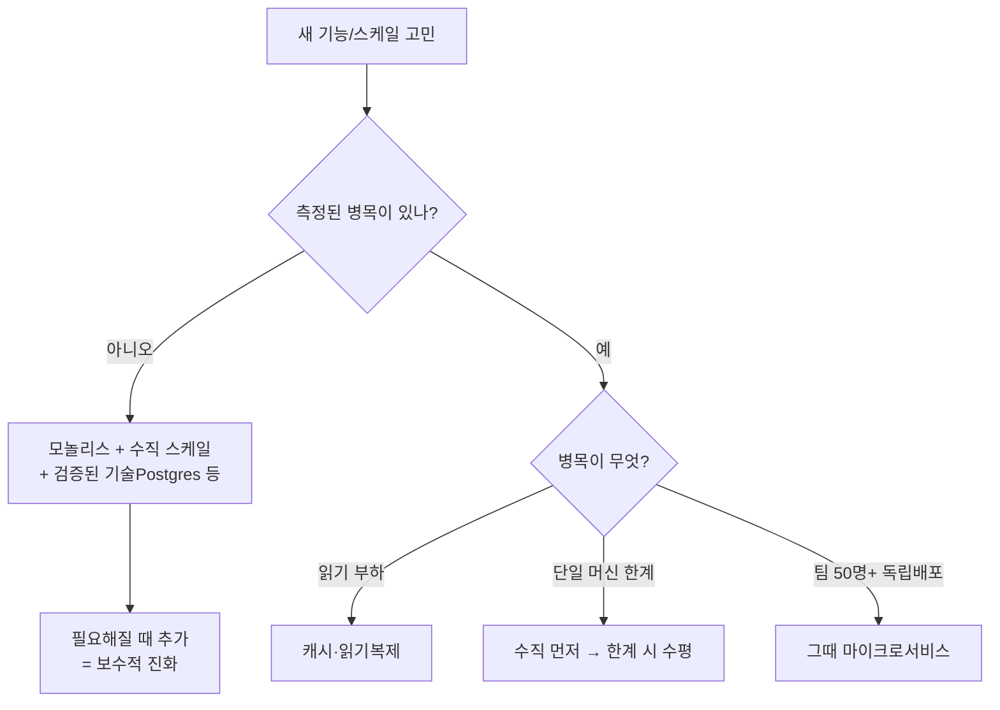

# 스케일의 현실 — 중소 회사 기준 4개 회사 사례

> 학습용 문서. 구글·넷플릭스 사례는 **하이퍼스케일**이라 중소 회사엔 대개 안 맞는다.
> "그들이 쓰니까"가 가장 비싼 아키텍처 실수다. 중소~중견 규모에서 배울 검증된 사례 4개.

## 큰 그림 — "You are not Google"

> 아마존·넷플릭스·구글이 마이크로서비스를 쓰니 정답이라는 추론은, 지난 10년간 가장
> 많은 엔지니어링 비용을 낭비한 결정이다. 당신은 구글이 아니다(그만한 장애내성 불필요).
> ([출처](https://medium.com/@neerupujari5/youre-still-writing-microservices-google-moved-on-2-years-ago-2c46bcb33746))

- 흔한 실패: **조기 마이크로서비스가 ~1,000 동시 사용자에서 병목**으로 드러남.
- 임계치(검증): **마이크로서비스는 엔지니어 50명+ / 독립 배포가 필요할 때.**
  팀이 **5–15명이면 조직적 분리가 불필요** → 모놀리스가 맞다.

---

## 사례 1. Stack Overflow — 9대 서버 모놀리스 (수직 스케일)

- 월 **1억+ 방문**을, **온프렘 9대 서버 모놀리스**로 처리. 쿠버네티스·마이크로서비스 **안 씀**.
- 비결: **DB 쿼리 극한 최적화 + 캐싱**. Redis는 **캐시 용도로만**, 검색은 Elasticsearch.
- 교훈: **수직 스케일 + 최적화**가 생각보다 아주 멀리 간다. 단일 코드베이스가 유지보수도 쉬움.
- 출처: [9서버 온프렘 모놀리스(DCD)](https://www.datacenterdynamics.com/en/news/stack-overflow-still-on-prem-runs-qa-platform-off-just-nine-servers/),
  [HN 토론](https://news.ycombinator.com/item?id=34950843)

## 사례 2. 37signals (Basecamp/HEY) — Majestic Monolith + 클라우드 탈출

- **10명 운영팀**, Rails **모놀리스**. AWS **연 $3.2M → 베어메탈 ~$360K** (90%↓).
- 클라우드를 떠나도 인력 추가 불필요(colo 업체가 물리 설치, 원격 관리).
- 교훈: **중견 규모에선 모놀리스 + 자체 서버**가 비용·단순성에서 합리적일 수 있다.
- 출처: [Why we're leaving the cloud(DHH)](https://world.hey.com/dhh/why-we-re-leaving-the-cloud-654b47e0),
  [The Majestic Monolith](https://medium.com/@dhh/see-the-majestic-monolith-https-m-signalvnoise-com-the-majestic-monolith-29166d022228-159794d8da25)

## 사례 3. Instagram — 13명(엔지니어 3명)에 단순 스택으로 수백만 사용자

- $10억에 인수될 때 **직원 13명**, 핵심 엔지니어 **3명**. 스택: **Django + PostgreSQL + Memcached**,
  Redis는 **피드·세션 등 특정 용도**. AWS EC2.
- 원칙 3가지: **단순하게 / 바퀴 재발명 금지 / 검증된 견고한 기술 사용**.
- 교훈: 작은 팀도 **단순·검증된 스택**으로 대규모까지 간다. 복잡도는 필요할 때 추가.
- 출처: [3명이 1400만까지](https://read.engineerscodex.com/p/how-instagram-scaled-to-14-million),
  [What Powers Instagram](https://instagram-engineering.com/what-powers-instagram-hundreds-of-instances-dozens-of-technologies-adf2e22da2ad)

## 사례 4. Amazon Prime Video — 분산 되돌리기 (반례 보강)

- 하이퍼스케일러조차 마이크로서비스/서버리스 → **모놀리스로 통합, 비용 90%↓**.
- 교훈: **큰 회사도 과한 분산을 되돌린다.** "분산 = 진보"가 아니다. (앞 [tradeoffs 사례2](../tradeoffs/no-single-right-answer.md) 참고)
- 출처: [thestack 정리](https://www.thestack.technology/amazon-prime-video-microservices-monolith/)

---

## 중소 회사 기준 — 종합 판단

**기본값(중소~중견):**
1. **모놀리스 + 수직 스케일 + 검증된 기술**(Postgres 한 개로 캐시·큐·검색까지도)
2. **Redis/Kafka/MSA/scale-out은 "측정된 병목"이 강제할 때만** 추가
3. 하이퍼스케일러 블로그는 **그들 규모의 문제 해결책** — 내 규모에 복붙 금지

## 우리 벤치마크와 연결

[lab-benchmarks](https://github.com/mgj96/lab-benchmarks)에서 본 것처럼, 동시성 제어도
**Redis가 "필요해서"가 아니라 측정된 병목일 때.** 단일 DB로 충분하면 `db-atomic` 같은
단순 해법이 더 빠르고 단순하다. 위 4개 회사의 "단순함 우선"과 같은 결.

## 관련 문서

- [Scale-up vs Scale-out](scaling-up-vs-out.md)
- [정답은 없다 — 경험담](../tradeoffs/no-single-right-answer.md)
- [트레이드오프 읽는 법](../tradeoffs/reading-tradeoffs-and-metrics.md)
