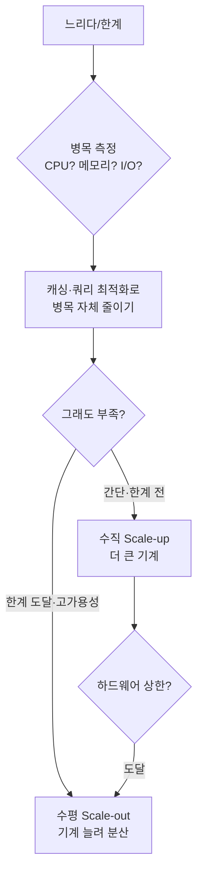

# Scale-up vs Scale-out — 더 큰 기계냐, 더 많은 기계냐

> 학습용 문서. 요약 → 상세 → 실무 연결 순.

## 요약 (3줄)

- **Scale-up(수직)**: 한 기계에 CPU·RAM을 더 붙인다. 단순·저지연, 한계가 빨리 옴.
- **Scale-out(수평)**: 기계 수를 늘려 일을 나눈다. 거의 무한 확장, 복잡함·지연 증가.
- 정답은 **병목이 어디인지** 먼저 찾는 것. 병목을 모르고 늘리면 돈만 쓴다.

## 상세

### 1. 정의
- 수직(scale-up): 더 강한 단일 머신. 코드·구조 변경 거의 없음.
- 수평(scale-out): 인스턴스를 여러 개 두고 부하 분산(load balancer). 분산 시스템이 됨.
[IBM: Scale-up vs Scale-out](https://www.ibm.com/think/topics/scale-up-vs-scale-out)

### 2. 트레이드오프
| 측면 | Scale-up (수직) | Scale-out (수평) |
|------|----------------|------------------|
| 지연(latency) | **낮음** (네트워크·동일 메모리/캐시) | 높아질 수 있음 (노드 간 통신) |
| 처리량(throughput) | 한계 있음 | **거의 무한** |
| 복잡도 | 단순 | 높음 (상태공유·일관성·장애처리) |
| 비용 | 초기 저렴, 곧 급증 | 점진적, 운영 복잡 |
| 한계 | 하드웨어 상한에 빨리 도달 | 설계만 맞으면 계속 |

- 왜 수직이 지연에 유리? 모든 처리가 **한 메모리/캐시 계층** 안에서 일어나 네트워크 왕복이 없음.
  (→ [메모리 계층](memory-hierarchy-and-latency.md)과 직결)

### 3. 병목은 옮겨 다닌다
자원을 늘리면 병목이 **다른 곳으로 이동**한다. 예: 메모리 100%·CPU 70% 상태에서
메모리를 2배로 → 이번엔 CPU 100%·메모리 80%. → **늘리기 전에 측정**(프로파일링)이 먼저.

### 4. 실전 순서
```
1. 측정: 진짜 병목이 CPU? 메모리? I/O? 네트워크? (추측 금지)
2. 가까운 해법: 캐싱·쿼리 최적화로 병목 자체를 줄인다 (스케일링 전에)
3. 수직: 간단하면 일단 더 큰 기계 (한계 전까지 가성비 좋음)
4. 수평: 한계 도달/고가용성 필요 시 분산 (상태 분리 설계 필수)
```



## 실무 연결 — 이걸 알면 무엇이 달라지나

- **AI/Claude Code에 일 시킬 때**: "확장성 좋게 만들어줘"는 모호하다 →
  "**현재 병목은 DB I/O, 트래픽 1만 rps 목표, 우선 수직 스케일 가정**" 처럼
  병목·목표·전략을 명시해야 제대로 된 결과가 나온다. ([코드베이스 분석](../llm/codebase-analysis.md))
- **GitHub Actions runner**: 기본 runner(2코어/7GB)로 부족하면 → 큰 runner(수직) vs
  matrix 병렬(수평)을 병목 기준으로 선택. ([Reusable Workflows](../github-actions/reusable-workflows.md))
- **MoE 모델 셀프호스팅**: 활성 파라미터는 작아도 전체를 적재해야 하므로,
  메모리가 병목 → 수직(큰 VRAM) 우선 판단. ([MoE](../concepts/mixture-of-experts.md))

## 관련 문서

- [메모리 계층과 지연시간](memory-hierarchy-and-latency.md)
- [Reusable Workflows](../github-actions/reusable-workflows.md)
