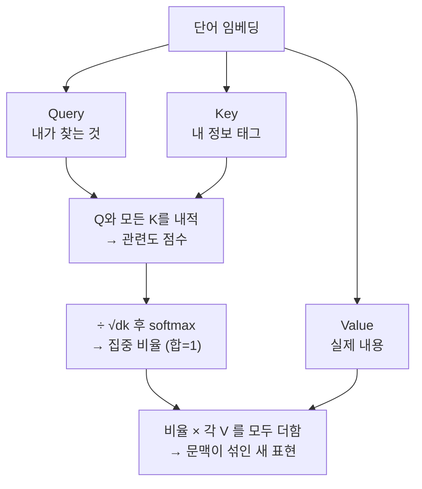
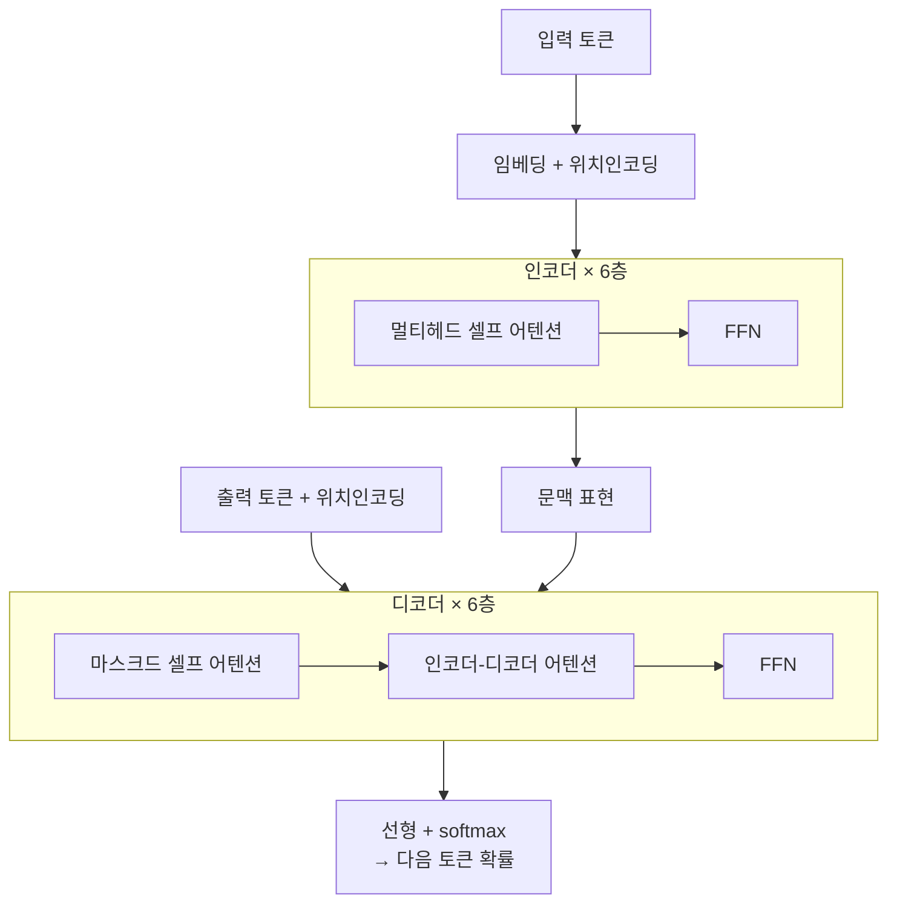

# 딥다이브 — 어텐션과 트랜스포머 (논문 기반)

> 기반 논문: **Vaswani et al. (2017), "Attention Is All You Need"** — [arXiv:1706.03762](https://arxiv.org/abs/1706.03762)
> 해설 참고: [The Illustrated Transformer](https://jalammar.github.io/illustrated-transformer/) · [The Annotated Transformer](https://nlp.seas.harvard.edu/annotated-transformer/) · [Lilian Weng – Attention](https://lilianweng.github.io/posts/2018-06-24-attention/)
> 형식: 12살 요약 → 논문 수준 심화. 얕은 버전은 [qna.md](qna.md), [concept.md](concept.md).

---

## 0. 30초 직관 — "그것"은 무엇을 가리키나

한 문장을 떠올려 보자.

> "그 **동물**은 길을 건너지 않았다. 너무 피곤했기 때문이다."

"너무 피곤했"던 건 누구일까? 당연히 **동물**이다. 그런데 컴퓨터에게는 이게 하나도 당연하지 않다. '피곤'이라는 단어에서 저 앞의 '동물'까지 **어떻게 선을 이어야 하는지**를 가르쳐줘야 한다. 이 "어디를 봐야 하는가" 문제가 언어 이해의 핵심이다.

**어텐션(attention)**의 발상은 놀랍도록 단순하다. 각 단어가 문장 속 **모든 단어를 한 번씩 훑어보며** "너, 나랑 얼마나 관련 있어?"를 점수로 매긴다. '피곤'은 '동물'에게 높은 점수(강한 집중)를, '길'에는 낮은 점수를 준다. 어두운 방에서 **손전등**을 관련 단어에만 세게 비추는 셈이다.

이 손전등을 **여러 개 동시에**(멀티헤드) 켜고, 그 과정을 **여러 층** 쌓아 올린 구조가 바로 **트랜스포머(Transformer)** — ChatGPT와 Claude를 포함한 오늘날 거의 모든 대형 언어 모델의 심장이다.

아래부터는 이 손전등이 **정확히 어떤 수학으로** 작동하는지 논문의 수식까지 한 겹씩 벗겨본다.

---

## 1. 왜 어텐션이 나왔나 — RNN의 두 한계

트랜스포머 이전엔 문장을 **RNN/LSTM**으로 단어 하나씩 순서대로 읽으며 "기억"을 넘겼다. 두 가지 큰 문제:

1. **장거리 의존성(long-range dependency)**: 문장이 길면 앞 단어 정보가 뒤까지 흐려진다. 두 단어 사이 "정보가 지나야 하는 경로 길이"가 멀수록 학습이 어렵다.
2. **병렬화 불가**: 순서대로 처리해야 해 GPU를 충분히 못 쓴다 → 느리다.

논문의 핵심 주장: 순환(recurrence)을 **완전히 버리고 어텐션만으로** 시퀀스를 처리하면, 모든 단어 쌍을 **한 번에 직접** 연결하고 병렬 처리도 된다. (제목 "Attention Is All You Need"의 뜻)

### 복잡도 비교 (논문 Table 1)

| 레이어 종류 | 레이어당 복잡도 | 순차 연산 | 최대 경로 길이 |
|-------------|-----------------|-----------|----------------|
| **셀프 어텐션** | O(n²·d) | **O(1)** | **O(1)** |
| 순환(RNN) | O(n·d²) | O(n) | O(n) |
| 합성곱(CNN) | O(k·n·d²) | O(1) | O(log_k n) |

- `n` = 문장 길이(토큰 수), `d` = 표현 차원.
- **핵심**: 셀프 어텐션은 **최대 경로 길이 O(1)** — 아무리 멀리 떨어진 두 단어도 한 번에 연결. 순차 연산도 O(1)이라 병렬화가 쉽다.
- 대가: 레이어당 O(n²·d) — 문장이 길면 n²이 커진다(긴 문맥의 비용 문제, 후속 연구들이 이걸 줄이려 함).
- 논문 주석: 셀프 어텐션이 순환보다 빠른 조건은 **n < d**일 때 (번역 문장에서 흔함).

---

## 2. 셀프 어텐션 — 6단계로 계산 (Illustrated Transformer)

한 단어의 새 표현을 만드는 과정. Jay Alammar의 정리를 따라 단계별로:

1. **Q·K·V 벡터 만들기** — 각 단어 임베딩(차원 512)에 학습된 세 행렬 `W^Q, W^K, W^V`를 곱해 **Query·Key·Value**(각 차원 64)를 만든다.
   - Q("내가 찾는 것") / K("내가 가진 정보 태그") / V("실제 전달 내용").
2. **점수(score) 계산** — 대상 단어의 Q와 문장 모든 단어의 K를 **내적(dot product)**. 이 점수가 "다른 단어에 얼마나 집중할지"를 정한다. (원문: 점수는 *"how much focus to place on other parts of the input sentence"*)
3. **스케일링** — 점수를 **8로 나눔** = √d_k = √64. (아래 3장에서 이유)
4. **소프트맥스(softmax)** — 점수를 0~1 확률로 바꿔 "집중 비율"로. 다 더하면 1.
5. **V에 가중치 곱** — 각 단어의 V에 그 비율을 곱한다.
6. **가중합** — 전부 더해 그 단어의 **새 표현**을 얻는다. (관련 단어의 정보가 많이 섞인 벡터)

이걸 문장의 모든 단어에 대해 **동시에(행렬 한 번으로)** 처리한다.

**한눈에 보는 셀프 어텐션**

> **기억용 비유 — 도서관 사서.** 내가 책 한 권(단어)을 들고 사서에게 간다. 내 **질문(Query)**은 "이런 내용을 찾아요". 서가의 모든 책엔 **색인표(Key)**가 붙어 있다. 사서는 내 질문과 각 색인표를 대조해 **얼마나 맞는지 점수**를 매기고, 잘 맞는 책일수록 그 **내용(Value)**을 더 많이 퍼 와 섞어 건넨다. 어텐션이 하는 일이 딱 이것 — **Query로 묻고, Key로 맞춰보고, Value를 비율대로 섞어 답을 만든다.** 이 세 글자(Q·K·V)만 기억하면 어텐션의 절반은 잡은 거다.

---

## 3. 수식: Scaled Dot-Product Attention

논문의 핵심 공식:

$$
\text{Attention}(Q,K,V) = \text{softmax}\!\left(\frac{QK^{\top}}{\sqrt{d_k}}\right)V
$$

- `Q·Kᵀ` : 모든 (질문, 열쇠) 쌍의 유사도 행렬 (n×n).
- `/ √d_k` : **스케일링**. d_k=64이면 √64=8로 나눔.
- `softmax` : 각 행을 확률(집중 비율)로.
- `· V` : 그 비율로 값들을 가중합.

### 왜 √d_k로 나누나? (중요)
차원 d_k가 크면 내적값의 **크기(분산)가 커진다**. 그러면 softmax가 한쪽으로 **너무 뾰족**해져서, 그 지점 바깥의 **기울기(gradient)가 0에 가까워진다**(gradient vanishing) → 학습이 안 된다. √d_k로 나누면 값의 크기를 정규화해 **기울기 흐름을 안정**시킨다. (Lilian Weng: 스케일이 없으면 "softmax gradients become extremely small")

> 직관: 내적을 그냥 쓰면 점수 편차가 극단적이 됨 → 한 단어만 100% 보고 나머진 무시 → 미세 조정 학습이 막힘. 스케일링이 이를 완화.

---

## 4. 멀티헤드 어텐션 (Multi-Head)

어텐션을 한 번만 하지 않고 **여러 개(head)를 병렬로**.

**하이퍼파라미터 (논문 base 모델)**
- `h = 8` 헤드
- `d_model = 512` (전체 차원)
- `d_k = d_v = d_model / h = 64` (헤드당 차원)

**공식**
$$
\text{MultiHead}(Q,K,V) = \text{Concat}(\text{head}_1,\dots,\text{head}_8)\,W^O
$$
$$
\text{head}_i = \text{Attention}(QW_i^Q,\ KW_i^K,\ VW_i^V)
$$
- `Wᵢ^Q, Wᵢ^K, Wᵢ^V ∈ ℝ^(512×64)`, `W^O ∈ ℝ^(512×512)`.

**왜 여러 헤드?** 각 헤드가 **서로 다른 "표현 부분공간(representation subspace)"**에서 관계를 본다 — 하나는 문법 관계, 하나는 지시 대상, 하나는 의미 유사성… 논문은 단일 헤드로는 이런 다양성이 **평균으로 뭉개진다(averaging inhibits)**고 지적. 8개 결과를 이어붙여(Concat) `W^O`로 합친다.

---

## 5. 위치 인코딩 (Positional Encoding)

셀프 어텐션은 모든 단어를 동시에 봐서 **순서 정보가 없다.** ("개가 사람을 물다" ≠ "사람이 개를 물다"를 구분 못 함) → 각 단어 임베딩에 **위치 벡터를 더해** 순서를 알려준다.

논문은 **사인·코사인** 함수를 사용:
$$
PE_{(pos,\,2i)} = \sin\!\left(\frac{pos}{10000^{2i/d_{model}}}\right),\qquad
PE_{(pos,\,2i+1)} = \cos\!\left(\frac{pos}{10000^{2i/d_{model}}}\right)
$$
- `pos` = 단어 위치, `i` = 차원 인덱스.
- 파장이 위치마다 다른 파동을 각 차원에 넣어, 상대적 위치를 표현. 문장 길이에 제한이 없다는 장점.
- (후속 모델들은 학습형 위치 임베딩·RoPE 등 다른 방식도 사용.)

---

## 6. 전체 트랜스포머 구조

**인코더-디코더**, 각각 **6개 층**을 쌓음(base 모델).

### 인코더 (한 층 = 서브층 2개)
1. **멀티헤드 셀프 어텐션**
2. **피드포워드 신경망(FFN)**

각 서브층은 **잔차 연결 + 층 정규화**로 감싼다:
$$
\text{LayerNorm}(x + \text{Sublayer}(x))
$$
- **잔차 연결(residual)**: 입력 x를 출력에 그대로 더함 → 깊은 층에서도 기울기가 잘 흐름.
- **층 정규화(LayerNorm)**: 값 분포를 안정화.

**FFN 공식** (위치마다 독립 적용):
$$
\text{FFN}(x) = \max(0,\ xW_1 + b_1)\,W_2 + b_2
$$
- 내부 차원 `d_ff = 2048` (512 → 2048 → 512), 활성화는 ReLU(`max(0, ·)`).

### 디코더 (한 층 = 서브층 3개)
1. **마스크드(masked) 멀티헤드 셀프 어텐션** — 미래 단어를 못 보게 가림(생성은 앞→뒤 순서라 정답 유출 방지).
2. **인코더-디코더 어텐션** — Query는 디코더에서, Key·Value는 **인코더 출력**에서. "입력 문장의 어디를 볼지" 연결.
3. **FFN**.

### 흐름 요약

---

## 7. 왜 이게 판을 바꿨나

- **병렬화**: 순차 처리를 없애 대규모 학습이 가능 → 모델·데이터를 키우기 쉬움(스케일링 법칙의 토대).
- **장거리 관계**: 경로 길이 O(1)로 먼 단어도 직접 연결.
- **범용성**: 번역용으로 나왔지만, 인코더만(BERT류 이해), 디코더만(GPT류 생성)으로 갈라져 오늘날 거의 모든 LLM의 뼈대가 됨.
- **남은 과제**: O(n²) 때문에 긴 문맥이 비쌈 → FlashAttention·희소 어텐션·선형 어텐션 등 후속 연구가 이를 공략.

---

## 용어 사전 (핵심)
| 용어 | 뜻 |
|------|-----|
| Q·K·V | Query(질문)·Key(열쇠)·Value(값) 벡터 |
| Scaled Dot-Product | QKᵀ/√d_k 후 softmax로 가중합 |
| √d_k 스케일 | 내적 크기를 줄여 gradient 안정화 |
| Multi-Head | h=8개 어텐션을 병렬로, 다양한 관계 포착 |
| Positional Encoding | sin/cos로 순서 정보 주입 |
| Residual + LayerNorm | 깊은 층 학습 안정화 |
| Masked Attention | 디코더가 미래 토큰을 못 보게 가림 |

## 출처
- Vaswani, Shazeer, Parmar, Uszkoreit, Jones, Gomez, Kaiser, Polosukhin (2017). *Attention Is All You Need.* NeurIPS. — https://arxiv.org/abs/1706.03762 (HTML: https://arxiv.org/html/1706.03762v7)
- Alammar, J. *The Illustrated Transformer.* — https://jalammar.github.io/illustrated-transformer/
- Rush, A. 외. *The Annotated Transformer* (Harvard NLP). — https://nlp.seas.harvard.edu/annotated-transformer/
- Weng, L. (2018). *Attention? Attention!* — https://lilianweng.github.io/posts/2018-06-24-attention/

_수치·공식은 논문 base 모델 기준. 짧은 인용은 출처 표기, 나머지는 재정리._
