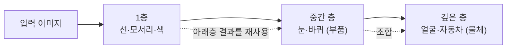

# 딥다이브 — 깊이·층별 특화·레이어 제어, 그리고 YOLO

> 기반: **Olah et al., *Feature Visualization / Zoom In: Circuits* (Distill)** · **Zeiler & Fergus (2014)** · **Tenney et al. (2019)** · **Ultralytics YOLO Docs**
> 형식: 30초 직관 → 심화. 얕은 버전은 [qna.md](qna.md), [concept.md](concept.md). 경사하강 수학은 [deep-neural-backprop.md](deep-neural-backprop.md), 표현 학습은 [deep-representation.md](deep-representation.md).

---

## 0. 30초 직관 — 레고와 화가

신경망을 **깊게** 쌓으면, 아래층이 만든 조각(선·모서리)을 위층이 **재사용**해 더 복잡한 것(눈·얼굴)을 만든다. 그래서 깊은 망은 **적은 부품(파라미터)**으로 많은 걸 표현한다 — 대신 층을 **순서대로** 통과해야 해서 **지연(latency)**이 는다. 각 층이 뭘 배울지는 **학습이 알아서** 나누지만(내가 "너는 눈 담당" 하고 지정 못 함), 층을 **얼리고·들여다보고·갈아끼우는** 제어는 코드로 직접 할 수 있다. YOLO 같은 실전 모델도 정확히 이 원리로 **학습**되고, 우리는 보통 그 결과(가중치)를 **가져다 쓰거나 파인튜닝**한다.

---

## 1. 왜 깊게 쌓나 — 깊이·폭·지연 트레이드오프

핵심 직관: **깊이 = 재사용.**

- **얕은 망**: 모든 모양마다 **전용 완제품 블록**이 필요하다. 표현할 패턴 수만큼 뉴런(파라미터)이 있어야 한다 → **파라미터 폭발 → 메모리 큼.**
- **깊은 망**: 기본 블록(선 → 부품 → 물체)을 **층층이 조합**한다. 아래층 결과를 위층이 재사용하므로 **적은 파라미터**로 많은 걸 만든다.

### 왜 깊이가 파라미터를 아끼나 (depth efficiency)
조합은 곱셈처럼 불어난다. 층을 하나 더 쌓으면 표현 가능한 패턴이 **지수적으로** 는다. 같은 표현력을 **얕게** 내려면 폭(뉴런 수)을 지수적으로 늘려야 한다 → 파라미터·메모리 폭발. 그래서 "깊이 +1 ≈ 폭 몇 배"를 절약한다.

### "느림"의 진짜 정체 — 순차 의존성
흔한 오해: "깊으면 연산량이 많아 느리다." 실제로는 —

- 층 N은 **층 N-1의 결과를 기다려야** 시작한다. 깊이 L이면 **L번 줄줄이** 실행 = **지연 증가**.
- GPU는 **한 층 안**(뉴런·배치)은 병렬 처리하지만, **층과 층 사이**는 건너뛰지 못한다.
- 오히려 **총 연산량(FLOPs)** 은 파라미터가 적으니 **줄 수도** 있다.

| | 얕고 넓은 망 | 깊고 좁은 망 |
|---|---|---|
| 파라미터·메모리 | 많음 | 적음 |
| 병렬화 | 쉬움 | 층 사이는 불가 |
| 지연(latency) | 짧음 | 김 (순차 단계 ↑) |

> 정리: 깊이의 비용은 "연산량"이 아니라 **"순서대로 기다리는 단계 수(지연)"** 와 **학습 난이도**(3장 기울기 소실).

---

## 2. 층별 특화 — 계층적 특징

각 층은 서로 다른 **추상화 수준**에 특화된다. 그리고 한 층 안의 **개별 필터**도 각자 특정 패턴을 맡는다. **누가 시켜서가 아니라 학습(경사하강)이 저절로** 역할을 나눈다(emergent).

**"화가의 작업 단계" 비유**
- **밑그림 층**: 선·윤곽만. (CNN 1층 필터 = 모서리·색 얼룩)
- **형태 층**: 선을 모아 눈·바퀴 같은 **부품**. (중간 층)
- **완성 층**: 부품을 조합해 얼굴·자동차. (깊은 층)



*(도식 설명: 입력 이미지가 1층에서 선·모서리·색으로, 중간 층에서 눈·바퀴 같은 부품으로, 깊은 층에서 얼굴·자동차 같은 물체로 점점 추상화된다. 위층은 아래층이 만든 특징을 재사용·조합한다.)*

각 층은 **바로 아래층 결과만** 재료로 쓸 수 있어, 낮은 층은 자연히 "어디에나 쓰이는 기본 재료(선)"를, 높은 층은 "완성품"을 배운다. **재사용 구조가 특화를 강제**한다(1장과 같은 원리).

Transformer라면 **어텐션 헤드(head)**가 특화된다 — 한 헤드는 문법 관계, 다른 헤드는 대명사가 가리키는 명사를 맡는 식(→ [deep-attention.md](deep-attention.md)).

---

## 3. 그걸 어떻게 검증하나 — "보인다"를 넘어서

정당한 의심: **"학습이 알아서 나눈 걸 우리가 그렇게 보고 싶어서 그렇게 보는 것(파레이돌리아) 아니냐?"** 연구자들도 이 함정을 경계해, "눈으로 보기"만으론 부족하다고 보고 **상관 → 인과 → 재현** 3층위로 검증했다.

### 먼저 — 무엇이 "블랙박스"인가 (관측 가능 ≠ 해석 가능)

흔한 오해부터 정리하자. 세 가지는 서로 다르다:

| 대상 | 알 수 있나 |
|------|-----------|
| **역전파(backprop)** = 학습 알고리즘 | ✅ 완전히 알려진 수학(연쇄법칙) — 신비롭지 않다 |
| **가중치(학습 결과, 숫자)** | ✅ `.pt`에 전부 저장 — 몇십억 개든 다 열람 가능 |
| **"왜 그 답을 골랐나"(사람 말로 된 이유)** | ❌ 알기 어렵다 ← **이게 블랙박스** |

- **역전파는 블랙박스가 아니다.** 오히려 가장 명확한 부분. 역전파가 "역으로 추적"하는 건 *이유*가 아니라 **"오차에 각 가중치가 얼마나 책임 있나(기울기)"** 다 (→ [deep-neural-backprop.md](deep-neural-backprop.md)).
- **가중치도 다 보인다.** 그냥 저장된 숫자다.
- **모르는 건 "의미".** 하나의 판단이 수백만 숫자에 **잘게 흩어져(distributed)** 담기고 라벨이 없어, "이 뉴런 = 고양이 귀"처럼 읽히지 않는다. → **관측 가능 ≠ 해석 가능. 알고리즘을 아는 것 ≠ 의미를 아는 것.**

> 비유: 오케스트라 악보(가중치)의 모든 음표를 볼 수 있고 조율 규칙(역전파)도 명확하지만, "왜 이 화음이 감동을 주는가"를 음표 하나로 설명하긴 어렵다.

그래서 아래 3층위(관찰→개입→재현)는 **"흩어진 숫자에서 의미를 읽어내려는"** 시도다. 블랙박스를 여는 작업.

> **"역방향" 두 개 구분**: ① *학습*의 역전파(오차→기울기→가중치 **수정**) vs ② *설명*의 역추적(예측을 입력에 **귀속** — Grad-CAM·SHAP·LIME). 둘 다 gradient를 쓰지만, 하나는 모델을 **고치려고**, 하나는 **이해하려고** 간다. 후자도 "어느 픽셀이 기여했나"까지지 완전한 인간적 이유는 아니다.

### A. 관찰 (상관 — 하지만 정량화)
1. **최대 활성 이미지 (Zeiler & Fergus, 2014)**: 데이터셋에서 그 뉴런을 가장 세게 켜는 **실제 사진**을 모은다. 1층=줄무늬, 깊은 층=개 얼굴로 일관되게 모인다.
2. **특징 시각화 (Olah et al., 2017)**: 뉴런을 최대로 켜는 입력을 역으로 생성. (규제 없으면 환각 무늬가 나와 조심 — 5장 한계)
3. **Network Dissection (Bau et al., 2017)**: 유닛 반응을 라벨된 개념 마스크와 겹쳐 **일치율을 숫자로** 매긴다.
4. **선형 프로브 (Alain & Bengio, 2016)**: 층 출력을 얼리고 그 위에 단순 선형 분류기를 붙여 "이 층 정보로 모서리/품사/구문을 맞힐 수 있나"를 측정. 낮은 층=단순, 높은 층=추상이 수치로 드러난다.
   - NLP 결정타: **Tenney et al. (2019), "BERT Rediscovers the Classical NLP Pipeline"** — BERT 층이 아래→위로 **품사 → 구문 → 의미** 순으로 정보를 담는 걸 프로브로 보였다.

### B. 개입 (여기서 상관이 인과로)
5. **어블레이션(ablation)**: 특정 유닛·채널을 0으로 죽이고 성능 변화를 본다. "곡선 검출기"를 껐더니 곡선 과제만 무너지면 → **그 유닛이 진짜 그 일을 한다는 인과 증거.**
6. **통제된 합성 자극**: 곡선을 조금씩 회전시키면 곡선 검출기 반응이 **각도에 따라 예측대로** 오르내린다 (Cammarata et al., *Curve Detectors*, 2020). 우연이면 이런 규칙성이 안 나온다.

### C. 재현 (파레이돌리아를 깨는 결정타)
7. **보편성(universality; Olah et al., *Circuits*, 2020)**: 독립적으로 학습한 다른 망에서도 1층 가버 엣지, 곡선 검출기가 **반복 등장**. 다른 아키텍처·데이터셋, 심지어 생물 시각피질(V1)에서도 유사 → "이 모델 하나에서 우연히"가 아님.

> 직접 재현: 작은 CNN 두 개를 **다른 시드로** 학습시켜 1층 필터를 시각화하면 둘 다 비슷한 엣지 필터가 나온다. 또는 층 출력에 선형 프로브를 붙여 "깊은 층일수록 추상 라벨을 잘 맞힌다"를 그래프로 확인할 수 있다.

---

## 4. 레이어를 실제로 어떻게 제어하나 (PyTorch)

레이어는 코드상 **일급 객체**다. **구조·학습·관찰·교체**는 층별로 직접 제어할 수 있다. 단 **"무엇을 배울지(의미)"는 직접 명령 불가** — 유도만 가능(5장).

**1. 층을 하나씩 정의 — 종류·크기·활성함수**
```python
import torch.nn as nn
model = nn.Sequential(
    nn.Conv2d(3, 32, kernel_size=3),   # 1층: 채널 32, 커널 3
    nn.ReLU(),
    nn.Conv2d(32, 64, kernel_size=3),  # 2층: 더 넓게
    nn.ReLU(),
    nn.Flatten(),
    nn.Linear(64*26*26, 10),           # 마지막: 분류 헤드
)
```

**2. 층별 동결(freeze) — 전이 학습의 핵심**
```python
for name, p in model.named_parameters():
    if name.startswith("0.") or name.startswith("2."):  # 앞쪽 층
        p.requires_grad = False        # 얼림 → 학습 안 됨
# 낮은 층(선·질감)은 고정, 마지막 헤드만 새로 학습
```

**3. 층별 학습률 — 앞 층은 살살, 뒤 층은 세게 (discriminative LR)**
```python
optimizer = torch.optim.Adam([
    {"params": model[0].parameters(), "lr": 1e-5},  # 앞 층: 작게
    {"params": model[6].parameters(), "lr": 1e-3},  # 헤드: 크게
])
```

**4. 층 출력 훔쳐보기 — 훅(hook)** (3장의 프로브·시각화가 이걸로 층 출력을 꺼낸다)
```python
acts = {}
def grab(name):
    return lambda m, inp, out: acts.__setitem__(name, out.detach())
model[0].register_forward_hook(grab("layer1"))
# forward 하면 acts["layer1"]에 1층 활성값이 담김
```

**5. 특정 층만 교체** — 헤드 갈아끼우기 (클래스 수가 바뀔 때)
```python
model[6] = nn.Linear(64*26*26, 100)  # 10 → 100 클래스
```

**실무 주의**
- 보통 층 하나가 아니라 **stage/block 그룹** 단위로 제어한다(ResNet은 층이 50~150개).
- 대부분은 **end-to-end 전체 학습**이 성능이 좋다. 층별 미세제어는 **전이학습·디버깅·해석·효율화(LoRA)** 같은 특정 목적에서 꺼내 쓰는 도구(YAGNI — 필요할 때만).

---

## 5. YOLO — 학습 시점 vs 사용 시점

YOLO도 **레이어 + 경사하강으로 만든 딥 CNN**이다. "그냥 가져다 쓴다"는 건 **학습 끝난 가중치로 추론(forward)만** 하는 것이다. 핵심은 **두 시점을 나누는 것.**

| 시점 | 무슨 일이 | 경사하강? |
|------|-----------|-----------|
| **학습(training)** | 레이어를 쌓고 라벨 데이터로 가중치를 맞춤 → `.pt` 생성 | 돎 |
| **사용(inference)** | 그 `.pt`를 불러 forward만 → 박스 출력 | 안 돎 |

**YOLO의 몸통 — 지금까지 개념이 다 들어있다**
```
입력 이미지
  → [Backbone]  특징 추출: 선→부품→물체   (← 2장 "층별 특화")
  → [Neck]      여러 층 특징 융합 (FPN/PAN)
  → [Head]      "여기 박스, 클래스=고양이, 확신도 0.9" 예측
```

**학습 시점 — 여기서 경사하강이 돎**
1. 라벨된 이미지 준비: 사진 + "이 위치에 개(박스 좌표)" 정답.
2. Forward → 예측 박스.
3. **손실** = 위치 오차 + 분류 오차 + objectness 오차.
4. **경사하강**으로 backbone·neck·head 전체 가중치를 조정.
5. 수만~수십만 장 반복 → 학습된 `.pt` 완성.

**사용 시점 — 경사하강 없음**
```python
from ultralytics import YOLO
model = YOLO("yolov8n.pt")     # 학습 끝난 가중치 로드 (가져다 씀)
model.predict("image.jpg")     # forward만 → 박스
```

**내 데이터로 파인튜닝 — 4장의 층별 제어가 여기서**
```python
model = YOLO("yolov8n.pt")                    # pretrained 시작점
model.train(data="my_data.yaml", epochs=100)  # 여기서 경사하강 다시 돎
```

**세 가지 사용 모드**

| 모드 | 언제 |
|------|------|
| as-is 추론 | 내 대상이 COCO 클래스에 있음(사람·차·개…) |
| 파인튜닝 | 내 전용 클래스(불량품·특정 부품). head 교체 후 재학습 |
| from scratch | 도메인이 완전히 다름(의료·위성) + 데이터 충분. 드묾 |

> 왜 "가져다" 쓰나: from scratch 학습은 거대 데이터 + GPU가 필요하다. 이미 COCO로 backbone이 일반 시각 특징을 배워둬서, 내 문제엔 **head만 살짝 재학습**하면 적은 데이터로 빠르게 된다(전이 학습의 정석). 버전(v1→v11)의 진화는 **구조 개선**이지 원리(CNN + 경사하강)는 동일.

---

## 용어 사전
| 용어 | 뜻 |
|------|-----|
| depth efficiency | 깊이가 파라미터를 지수적으로 아끼는 성질 |
| latency(지연) | 층을 순서대로 통과하는 데 걸리는 시간 |
| 계층적 특징 | 낮은 층=단순, 깊은 층=추상으로 나뉨 |
| 선형 프로브 | 층 출력 위에 붙인 단순 분류기로 정보량 측정 |
| ablation | 유닛을 꺼서 인과 역할 확인 |
| 보편성(universality) | 다른 망에서도 같은 특징이 재등장 |
| freeze(동결) | 특정 층 가중치를 학습에서 제외 |
| 전이 학습 | pretrained 모델을 내 문제에 재사용 |
| Backbone/Neck/Head | YOLO의 특징추출/융합/예측 부분 |
| 학습 시점 vs 사용 시점 | 경사하강 돎(train) vs forward만(inference) |

## 연결 지도
- **경사하강 수학**: → [deep-neural-backprop.md](deep-neural-backprop.md)
- **표현 학습(층이 배우는 표현)**: → [deep-representation.md](deep-representation.md)
- **어텐션 헤드 특화**: → [deep-attention.md](deep-attention.md)
- **박싱→힙→GC(파라미터·메모리 비용)**: → [../unity/deep-gc.md](../unity/deep-gc.md)

## 출처
- Olah, et al. *Feature Visualization.* Distill, 2017 — https://distill.pub/2017/feature-visualization/
- Olah, et al. *Zoom In: An Introduction to Circuits.* Distill, 2020 — https://distill.pub/2020/circuits/zoom-in/
- Cammarata, et al. *Curve Detectors.* Distill, 2020 — https://distill.pub/2020/circuits/curve-detectors/
- Zeiler & Fergus. *Visualizing and Understanding Convolutional Networks.* ECCV 2014 — https://arxiv.org/abs/1311.2901
- Bau, et al. *Network Dissection.* CVPR 2017 — https://arxiv.org/abs/1704.05796
- Alain & Bengio. *Understanding intermediate layers using linear classifier probes.* 2016 — https://arxiv.org/abs/1610.01644
- Tenney, et al. *BERT Rediscovers the Classical NLP Pipeline.* ACL 2019 — https://arxiv.org/abs/1905.05950
- Ultralytics YOLO Docs — https://docs.ultralytics.com/

_짧은 인용은 출처 표기. 프레임워크·모델 버전에 따라 세부는 달라질 수 있으니 최신 문서 확인._
