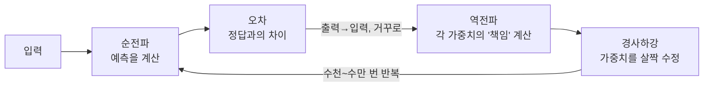

# 딥다이브 — 신경망과 역전파 수학 (논문·교재 기반)

> 기반: **Michael Nielsen, *Neural Networks and Deep Learning*, Ch.2** ([링크](http://neuralnetworksanddeeplearning.com/chap2.html)) · **Stanford CS231n – Backprop** ([링크](https://cs231n.github.io/optimization-2/)) · **3Blue1Brown – Backpropagation** ([링크](https://www.3blue1brown.com/lessons/backpropagation))
> 형식: 12살 요약 → 수식 심화. 얕은 버전은 [qna.md](qna.md), [concept.md](concept.md).

---

## 0. 30초 직관 — 눈 감고 과녁 맞히기

눈을 가린 채 다트를 던진다고 해보자. 처음엔 엉뚱한 데 꽂힌다. 그런데 옆에서 친구가 매번 **"왼쪽으로 5cm 빗나갔어"**라고 알려준다면? 다음엔 오른쪽으로 조금, 그다음엔 더 조금… 결국 과녁 한가운데를 맞히게 된다.

신경망 학습이 정확히 이것이다. 처음엔 **아무렇게나** 답하고 → **정답과 얼마나 틀렸는지(오차)**를 재고 → 그 오차를 **출력에서 입력 쪽으로 거꾸로 되짚으며** 모든 연결에게 "너는 이만큼 잘못했으니 이 방향으로 살짝 고쳐"라고 전한다. 이 "거꾸로 되짚기"가 **역전파(backpropagation)**, "살짝 고치기"가 **경사하강(gradient descent)**이다.



*(도식 설명: 예측 → 오차 측정 → 역전파(각 가중치의 책임 계산) → 경사하강(수정)의 네 단계가 하나의 고리를 이루고, 이 고리를 수없이 반복할수록 신경망이 정확해진다.)*

핵심 마법은 **"틀린 책임을 어떻게 각 가중치에 정확히 나눠주느냐"** — 그 답이 아래 **연쇄법칙**과 **4대 방정식**이다.

---

## 1. 순전파 복습 — 뉴런의 계산

한 뉴런은 입력에 가중치를 곱해 더하고(=`z`), 활성화 함수 σ를 통과시킨다(=`a`).
```
zˡ = wˡ · aˡ⁻¹ + bˡ        (가중합)
aˡ = σ(zˡ)                  (활성화, 예: 시그모이드·ReLU)
```
- `l` = 층 번호, `w` = 가중치, `b` = 편향, `a` = 활성값.
- 입력층 → 은닉층 → 출력층으로 이 계산이 흘러가는 게 **순전파(forward)**.

---

## 2. 손실과 경사하강

**손실(cost) C**: 예측이 정답과 얼마나 다른지 하나의 숫자로. (예: 평균제곱오차, 교차엔트로피)

목표는 C를 **최소화**하는 w, b를 찾는 것. 방법은 **경사하강**:
$$
w \leftarrow w - \eta\,\frac{\partial C}{\partial w},\qquad
b \leftarrow b - \eta\,\frac{\partial C}{\partial b}
$$
- `∂C/∂w` = 기울기(gradient): C가 가장 가파르게 커지는 방향. 그 **반대**로 이동.
- `η` = **학습률(learning rate)**: 한 걸음 크기. 크면 발산, 작으면 느림.
- 비유: 안개 낀 산에서 발밑 경사만 보고 가장 낮은 골짜기로 한 걸음씩 내려가기.

핵심 질문: 층이 여러 개인데 **각 w, b의 기울기 ∂C/∂w를 어떻게 구하나?** → **역전파**.

---

## 3. 연쇄법칙과 계산 그래프 (CS231n)

역전파의 본질은 **연쇄법칙(chain rule)의 반복 적용**이다. 복잡한 함수를 작은 연산(게이트)들의 그래프로 쪼개고, 각 게이트는 두 가지를 안다:
1. 순전파 때의 **출력값**,
2. **지역 기울기(local gradient)** — 그 연산만의 미분.

역전파 때 각 게이트는 뒤에서 오는 **상류 기울기(upstream gradient)**를 받아, `상류 × 지역기울기`로 입력 쪽 기울기를 구한다.

### 게이트별 기울기 흐름 (직관)
- **덧셈 게이트**: 지역 기울기 +1 → *"gradient on its output and distributes it equally to all of its inputs"* (기울기를 그대로 양쪽에 분배).
- **곱셈 게이트**: 지역 기울기 = 상대 입력값(뒤바뀜) → "기울기 스위처". 작은 입력 × 큰 상류기울기 = 그 입력에 큰 기울기.
- **max 게이트**: 순전파 때 **가장 컸던 입력**에만 기울기를 그대로 보내고 나머지는 0.

> CS231n: 이 곱셈(연쇄법칙) 덕에 "single and relatively useless gate"가 신경망이라는 거대한 회로의 톱니가 된다.

---

## 4. 역전파 4대 방정식 (Nielsen)

`δˡ_j = ∂C/∂zˡ_j` 를 "층 l의 뉴런 j의 **오차**"로 정의하면, 역전파는 4개의 방정식으로 요약된다. (⊙ = 원소별 곱, Hadamard product)

**BP1 — 출력층 오차**
$$
\delta^L = \nabla_a C \odot \sigma'(z^L)
$$
"출력이 정답과 얼마나 다른가(∇_a C)"에 "활성화의 민감도(σ′)"를 곱함.

**BP2 — 오차를 한 층 뒤로 전파**
$$
\delta^l = \big((w^{l+1})^{\top}\delta^{l+1}\big)\odot \sigma'(z^l)
$$
다음 층 오차 δˡ⁺¹를 가중치로 거꾸로 끌어와, 이 층의 활성화 민감도를 곱함. → **뒤에서 앞으로** 오차가 흐른다.

**BP3 — 편향의 기울기**
$$
\frac{\partial C}{\partial b^l_j} = \delta^l_j
$$
편향 기울기는 그 뉴런의 오차와 같다.

**BP4 — 가중치의 기울기**
$$
\frac{\partial C}{\partial w^l_{jk}} = a^{l-1}_k\,\delta^l_j
$$
"입력 활성값 × 출력 오차". 입력이 크고 오차가 클수록 그 가중치를 많이 고친다.

> 이 4식으로 **모든 층의 ∂C/∂w, ∂C/∂b**를 한 번의 역방향 통과로 전부 구한다. (그래서 빠르다)

---

## 5. 역전파 알고리즘 (한 스텝)

1. **순전파(feedforward)**: 입력 → 각 층의 z, a 계산·저장.
2. **출력 오차**: BP1로 δᴸ 계산.
3. **역전파(backpropagate)**: BP2로 δᴸ⁻¹, …, δ² 를 뒤로 차례로 계산.
4. **기울기**: BP3·BP4로 ∂C/∂b, ∂C/∂w 계산.
5. **갱신**: 경사하강으로 w, b 업데이트.
6. 데이터 배치마다 1~5 반복(미니배치 SGD).

---

## 6. 활성화 함수와 기울기 소실

- **시그모이드(sigmoid)**: 출력 0~1. 하지만 입력이 크거나 작으면 σ′ ≈ 0 → BP2에서 오차가 계속 작아짐 → **기울기 소실(vanishing gradient)**, 깊은 망 학습이 어려움.
- **ReLU** (`max(0,x)`): 양수 구간에서 기울기 1이라 소실이 덜함 → 딥러닝을 실용화한 핵심. (단 음수는 0 → "죽은 ReLU" 문제)
- 이 "기울기 소실" 때문에 잔차 연결(ResNet)·정규화 같은 기법이 나왔고, **트랜스포머의 잔차+LayerNorm**도 같은 맥락(→ [deep-attention.md](deep-attention.md) 6장).

---

## 7. 왜 중요한가

- 역전파는 **모든 딥러닝의 학습 엔진**. 트랜스포머·CNN·확산모델 전부 이걸로 학습된다.
- 계산 그래프 + 연쇄법칙 = 오늘날 **자동 미분(autograd)** 프레임워크(PyTorch·TensorFlow)의 원리. 우리가 수식을 직접 안 짜도 프레임워크가 계산 그래프를 만들어 역전파를 자동 수행.

---

## 용어 사전
| 용어 | 뜻 |
|------|-----|
| 순전파 | 입력→출력 계산 |
| 손실(cost) | 예측과 정답의 차이 |
| 경사하강 | 기울기 반대로 파라미터 이동 |
| 학습률 η | 한 걸음 크기 |
| 연쇄법칙 | 합성함수 미분 = 지역기울기 곱 |
| δ (delta) | 층·뉴런의 오차 ∂C/∂z |
| 기울기 소실 | 깊은 층에서 gradient가 0에 수렴 |
| autograd | 계산그래프로 역전파 자동화 |

## 출처
- Nielsen, M. *Neural Networks and Deep Learning*, Ch.2 "How the backpropagation algorithm works." — http://neuralnetworksanddeeplearning.com/chap2.html
- Stanford CS231n. *Backpropagation, Intuitions.* — https://cs231n.github.io/optimization-2/
- 3Blue1Brown. *Backpropagation / Backpropagation calculus.* — https://www.3blue1brown.com/lessons/backpropagation

_4대 방정식은 Nielsen 표기 기준. 짧은 인용은 출처 표기, 나머지는 재정리._
