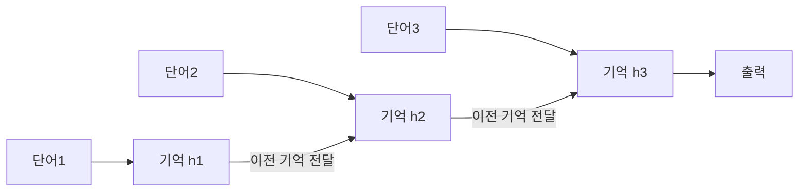
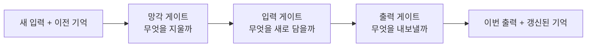

# 딥다이브 — RNN과 LSTM (어텐션 이전의 순서 처리)

> 기반: **Christopher Olah, "Understanding LSTM Networks"** ([링크](https://colah.github.io/posts/2015-08-Understanding-LSTMs/)) · **CS231n / d2l.ai RNN 장**
> 형식: 12살 요약 → 심화. 이 노트는 [deep-attention.md](deep-attention.md)의 "왜 어텐션이 나왔나"를 뒤에서 받쳐준다.

---

## 0. 30초 직관 — 문장을 "한 글자씩 기억하며" 읽기

어텐션이 등장하기 전, 컴퓨터는 문장을 **사람이 소리 내 읽듯 한 단어씩 순서대로** 읽었다. 읽으면서 지금까지의 내용을 **작은 메모(기억)**에 요약해두고, 다음 단어를 읽을 때 그 메모를 참고한다. 이 "메모를 이어가며 읽는" 신경망이 **RNN(순환 신경망)**이다. 그런데 문장이 길어지면 **앞부분 메모가 흐려지는** 문제가 생겼고, 이를 보완한 게 **LSTM**이다. 결국 이 방식의 한계(장거리·속도) 때문에 **어텐션**이 왕좌를 가져갔다.

---

## 1. RNN — 기억을 이어가며 읽기

**핵심**: 같은 신경망을 매 단어마다 반복 적용하되, **이전 단계의 출력(은닉 상태 h)**을 다음 단계 입력으로 넘긴다. 이 "넘김"이 곧 기억이다.

*(도식 설명: RNN은 단어를 하나씩 읽으며 '기억(h)'을 다음 단계로 계속 넘긴다. h2는 단어2와 h1을 함께 보고 만들어지므로, 앞 내용이 뒤로 흐른다.)*

**한계 — 기울기 소실**: 기억을 여러 번 곱하며 넘기다 보면, 문장이 길 때 **앞 단어의 영향이 지수적으로 흐려진다**(→ [deep-neural-backprop.md](deep-neural-backprop.md)의 기울기 소실과 같은 원리). "저 앞에서 나온 주어"를 뒤에서 기억 못 하는 것.

---

## 2. LSTM — "게이트"로 기억을 관리

**LSTM(Long Short-Term Memory)**은 기억을 **셀 상태(cell state)**라는 별도 컨베이어 벨트에 싣고, **세 개의 게이트**로 그 위 정보를 조절한다.

*(도식 설명: LSTM은 '망각→입력→출력' 세 게이트로 기억을 관리한다. 필요 없는 건 지우고(망각), 중요한 건 새로 담고(입력), 지금 쓸 것만 내보낸다(출력). 그래서 긴 문장에서도 중요한 정보를 오래 유지한다.)*

- **망각 게이트(forget)**: 이전 기억 중 버릴 것을 정함.
- **입력 게이트(input)**: 새 정보 중 저장할 것을 정함.
- **출력 게이트(output)**: 기억 중 지금 출력에 쓸 것을 정함.
- 이 "덧셈 위주" 경로 덕에 기울기가 덜 소실 → **RNN보다 훨씬 긴 의존성**을 학습. (변형: GRU — 게이트 2개로 단순화)

---

## 3. 왜 어텐션에 밀렸나

LSTM도 두 벽을 완전히 못 넘었다:
1. **여전한 장거리 한계**: 아무리 게이트로 관리해도 정보가 **한 줄(순차)로만** 흐른다. 아주 먼 단어 관계는 경로가 길다.
2. **병렬화 불가**: 단어를 **순서대로** 처리해야 해 GPU를 충분히 못 쓴다 → 대규모 학습이 느리다.

**어텐션**은 이 둘을 한 번에 깼다 — 모든 단어 쌍을 **동시에·직접** 연결(경로 O(1))하고, 순서 의존이 없어 **병렬 처리**가 된다. (→ [deep-attention.md](deep-attention.md) 1장 복잡도 표)

**핵심 요약**: RNN=기억을 이어가며 순차 처리, LSTM=게이트로 기억 관리해 장기 의존성 개선. 그러나 순차·장거리 한계로 어텐션에 대체됨.

## 출처
- Olah, C. (2015). *Understanding LSTM Networks.* — https://colah.github.io/posts/2015-08-Understanding-LSTMs/
- *Dive into Deep Learning* – RNN/LSTM 장 — https://d2l.ai/chapter_recurrent-modern/
- Stanford CS231n / CS224n RNN 강의 노트
