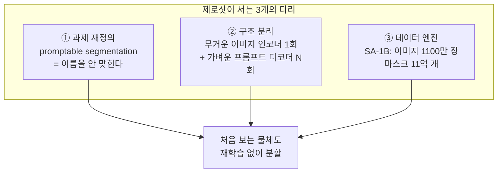
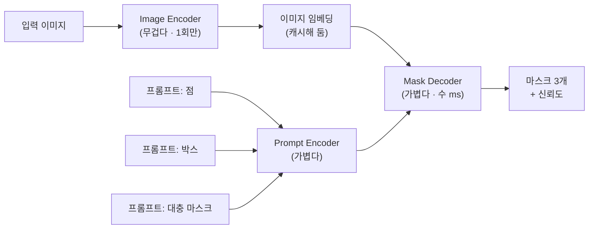
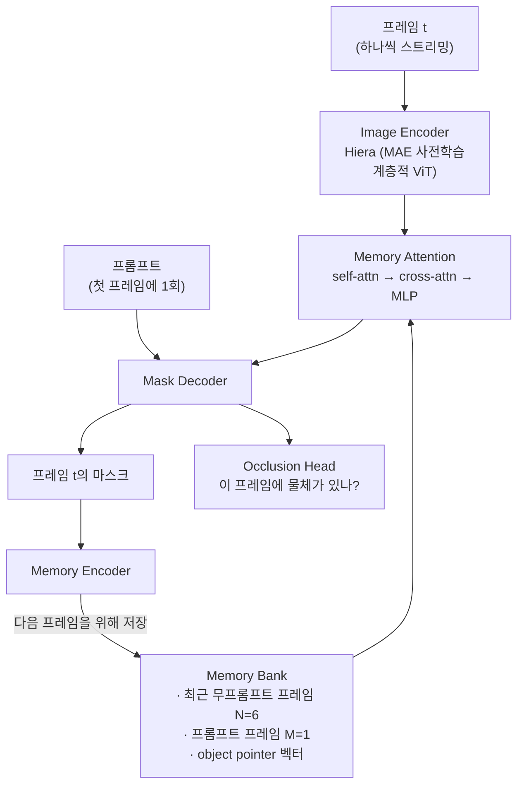
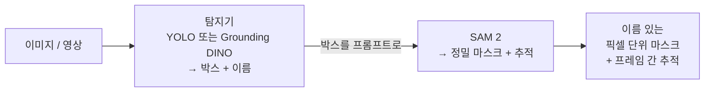
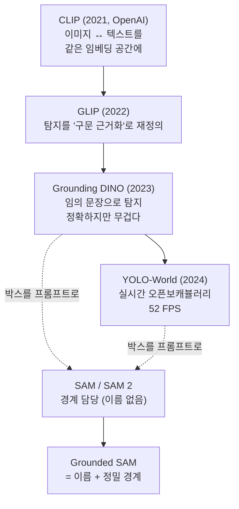

# 딥다이브 — YOLO vs SAM 2: 탄생 배경, 제로샷의 원리, 그리고 "뭐가 더 나은가"

> 기반: **Redmon et al., *You Only Look Once* (CVPR 2016)** · **Kirillov et al., *Segment Anything* (ICCV 2023)** · **Ravi et al., *SAM 2* (Meta, 2024)** · **Ryali et al., *Hiera* (ICML 2023)** · **Cheng et al., *YOLO-World* (CVPR 2024)** · **Perazzi et al., *DAVIS Benchmark* (CVPR 2016)**
> 형식: 30초 직관 → **왜 만들어졌나(역사)** → 원리 → 실전. 레이어·YOLO 학습/사용 시점은 [deep-layers-and-yolo.md](deep-layers-and-yolo.md), 표현 학습은 [deep-representation.md](deep-representation.md), 어텐션은 [deep-attention.md](deep-attention.md).

---

## 0. 30초 직관 — "이름표 기계" vs "가위"

식당 주방에 두 직원이 있다고 하자.

- **YOLO는 "이름표 붙이는 직원"**이다. 메뉴판에 적힌 80가지 재료만 안다. 사진을 던져주면 **혼자서** "여기 사람, 저기 자동차, 확신도 0.9" 하고 네모 상자에 이름표를 붙인다. 빠르다. 대신 메뉴판에 없는 **처음 보는 재료는 아예 안 보인다.**
- **SAM 2는 "가위질하는 직원"**이다. 재료 이름을 하나도 모른다. 대신 손가락으로 **"이거"** 하고 가리키면, 그게 뭐든 **경계를 정확히 따라 오려낸다.** 이름을 모르니 처음 보는 물체도 똑같이 잘 오려낸다. 그리고 영상에서는 **아까 오려낸 그것을 기억**해서 프레임마다 계속 따라간다.

여기서 이 노트의 가장 중요한 한 문장이 나온다:

> **SAM이 제로샷인 이유는 "엄청 많이 배워서"가 아니라, 애초에 "이름 맞히기"를 과제에서 빼버렸기 때문이다.**

배우지 않은 클래스가 없으려면? 클래스를 안 배우면 된다. 이게 발상의 전환이고, 3장에서 자세히 푼다.

### 자바 개발자용 한 줄 매핑

```java
// YOLO — 컴파일 타임에 고정된 enum
enum CocoClass { PERSON, CAR, DOG, /* ... 80개 */ }
List<Detection<CocoClass>> detect(Image img);   // 혼자 다 함. 대신 enum 밖은 표현 불가.

// SAM 2 — 제네릭 인터페이스. 무엇이든 받지만, 반환에 "이름"이 없다
Mask segment(Image img, Prompt p);              // p = 점 / 박스 / 대충 그린 마스크
// 반환 타입에 클래스 정보가 없다 == class-agnostic
```

`enum`에 새 값을 넣으려면 **재컴파일**이 필요하다. YOLO에 새 클래스를 넣으려면 **재학습**이 필요하다. 같은 이야기다.

---

## 1. 역사 ① — YOLO는 무엇에 화가 나서 태어났나

### 1-1. 2015년 이전 — "탐지 = 분류기를 수천 번 돌리기"

당시 물체 탐지의 지배적 패러다임은 **분류기를 재활용**하는 것이었다. 원논문 첫 문장이 이걸 정확히 겨냥한다:

> "Prior work on object detection **repurposes classifiers** to perform detection."
> — Redmon et al. (2015), [arXiv:1506.02640](https://arxiv.org/abs/1506.02640)

계보를 보면 이렇다:

| 시기 | 방법 | 방식 | 문제 |
|---|---|---|---|
| 2008~ | **DPM** (Felzenszwalb) | 슬라이딩 윈도우 — 창문을 옮겨가며 이미지 전체를 훑음 | 위치×크기 조합마다 분류 → 느림 |
| 2014 | **R-CNN** (Girshick) | Selective Search로 후보 영역 ~2000개 → **각각** CNN에 투입 | 이미지 1장에 수십 초 |
| 2015 | **Fast / Faster R-CNN** | 특징 공유·RPN으로 가속 | 여전히 **2단계**(후보 생성 → 분류) |

**핵심 문제는 속도 그 자체가 아니라 구조였다.** "먼저 후보를 뽑고, 그다음 분류한다"는 2단계 파이프라인은 부품이 여러 개고, 각각 따로 학습되며, 전체를 한 번에 최적화할 수 없었다. 그리고 **자율주행·로봇처럼 실시간이 필수인 곳에서는 아예 쓸 수 없었다.**

### 1-2. YOLO의 발상 — "탐지를 회귀 문제로 다시 쓰자"

2015년, 워싱턴대의 **Joseph Redmon**과 Santosh Divvala, **Ross Girshick**, Ali Farhadi가 논문을 낸다.

> 🎭 **재미있는 지점**: 공저자 **Ross Girshick은 R-CNN을 만든 본인**이다. 자기가 만든 2단계 패러다임을 뒤엎는 논문에 이름을 올렸다. 좋은 연구자는 자기 결과물에 감정적으로 묶이지 않는다는 걸 보여주는 사례.

발상 전환은 한 문장이다:

> "Instead, we frame object detection as a **regression problem** to spatially separated bounding boxes and associated class probabilities. A **single neural network** predicts bounding boxes and class probabilities directly from full images in **one evaluation**."

**"You Only Look Once"** = 이미지를 **딱 한 번의 forward**로 통과시킨다. 이미지를 격자로 나누고, 각 격자 칸이 "내 담당 구역에 물체가 있나? 박스는 어디? 클래스는?"을 **직접 숫자로 출력**한다. 후보 생성 단계가 사라졌다.

**추구한 목표: 속도와 단순함. 실시간으로 못 돌면 의미 없다.**

성과: 기본 YOLO **45 FPS**, 경량 Fast YOLO **155 FPS**.

### 1-3. 그 목표가 치른 대가 (트레이드오프)

논문이 스스로 인정하는 부분이 오히려 중요하다:

- **위치 정확도가 나빴다.** 논문 표현으로 "occasional localization errors". 격자 칸당 예측할 수 있는 박스 수가 제한돼 있어서, **작은 물체가 몰려 있으면**(새 떼, 군중) 놓친다.
- 대신 **false positive는 적었다.** 이미지 전체를 한 번에 보니 문맥을 이해했다. 배경을 물체로 착각하는 실수가 R-CNN보다 훨씬 적었다.
- 흥미롭게도 **일반화는 더 좋았다.** 논문은 자연 사진으로 학습한 YOLO가 **피카소 그림·예술 작품**에서도 사람을 잘 찾는다고 보고한다. 부분이 아니라 전체 형태를 보기 때문.

> **이게 YOLO 전체 역사의 씨앗이다.** 이후 v2~v11의 거의 모든 개선(앵커 박스, 다중 스케일, FPN, anchor-free)은 결국 **"1-3에서 잃은 위치 정확도를 속도를 유지한 채 되찾는" 작업**이었다.

### 1-4. 창시자의 퇴장 (2020) — 기술사에서 드문 장면

2020년 2월, Joseph Redmon은 트위터로 **컴퓨터 비전 연구를 그만둔다**고 선언한다. 이유는 성능도 자금도 아니었다 — **군사적 활용과 프라이버시 우려**였다.

그는 자기 기술이 "almost no upside and enormous downside risk"를 가진다고 봤고, **"과학은 정치와 무관하며 연구는 주제와 상관없이 객관적으로 도덕적"이라 믿었던 것을 부끄러워한다**고 말했다. 이 발언은 NeurIPS가 논문에 윤리적 영향 기술을 요구하기 시작한 논의 중에 나왔다.

([Synced 보도](https://syncedreview.com/2020/02/24/yolo-creator-says-he-stopped-cv-research-due-to-ethical-concerns/) · [DeepLearning.AI The Batch](https://www.deeplearning.ai/the-batch/code-no-evil))

> 💡 **이 노트에서 이 사건이 중요한 이유**: 기술의 "용도와 의도"를 이해한다는 건 성능표만 읽는 게 아니다. YOLO는 **실시간·저비용·엣지 배포**를 목표로 설계됐고, 정확히 그 성질 때문에 **CCTV·드론·군사 감시**에 이상적인 도구가 됐다. 설계 목표가 곧 남용 경로가 된 것 — 창시자 본인이 그걸 보고 떠났다.

### 1-5. 그 뒤 — YOLO는 "브랜드"가 아니라 "아이디어 이름"이 되었다

원저자가 떠나자 이름을 이어받는 팀이 계속 나타났다. 그래서 **YOLO 버전 번호는 하나의 연속된 계보가 아니다.**

| 버전 | 연도 | 만든 곳 |
|---|---|---|
| v1 ~ v3 | 2015~2018 | **Redmon & Farhadi** (원저자) |
| v4 | 2020 | Alexey Bochkovskiy 외 |
| **v5** | 2020 | **Ultralytics** (논문 없이 코드로만 공개 → 이름 논란) |
| v6 | 2022 | Meituan (중국) — 양자화·증류 등 배포 최적화 중심 |
| v7 | 2022 | Chien-Yao Wang, Bochkovskiy, Liao (v4·YOLOR 계열) |
| v8 | 2023 | Ultralytics |
| v9 | 2024 | Wang, Yeh, Liao |
| v10 | 2024 | 칭화대 (Wang 외) — NMS 제거, end-to-end |
| v11 | 2024 | Ultralytics |

**실무에 직결되는 함의 두 가지:**

1. **"버전 숫자가 크다 = 더 좋다"가 아니다.** 계보가 다르니 직접 비교가 안 된다. 실제로 여러 도메인 벤치마크 연구가 "최신 YOLO가 항상 낫지는 않다"고 보고한다([ODverse33, 2025](https://arxiv.org/abs/2502.14314)). **내 데이터로 직접 비교해야 한다.**
2. **라이선스를 반드시 확인하라.** Ultralytics 계열(v5·v8·v11)은 **AGPL-3.0**이다. AGPL은 네트워크로 서비스만 해도 소스 공개 의무가 걸릴 수 있어, 상용 제품에 넣으려면 상용 라이선스를 사야 한다. 성능표에 안 적히지만 **채택 여부를 실제로 결정하는 건 이쪽인 경우가 많다.**

---

## 2. 역사 ② — SAM은 무엇을 부러워해서 태어났나

### 2-1. 2020~2022, NLP에서 벌어진 일

같은 시기 자연어 쪽에서는 판이 뒤집혔다. GPT-3가 나오면서, **하나의 거대 모델이 프롬프트만 바꿔서** 번역·요약·질의응답을 다 해냈다. 과제마다 모델을 따로 학습하던 시대가 끝났다.

**비전은 여전히 구식이었다.** 데이터셋 하나에 모델 하나. COCO용 모델, Cityscapes용 모델, 의료용 모델이 전부 따로였다.

Meta FAIR(Kirillov, **Ross Girshick 또 등장**, Dollár 외)가 던진 질문은 이거였다:

> **"비전에도 파운데이션 모델이 가능한가? 가능하다면, NLP의 '다음 단어 맞히기'에 해당하는 범용 사전학습 과제는 무엇인가?"**

### 2-2. 답 — "프롬프트 가능한 분할"

NLP의 성공 공식을 분해하면 세 개다. **① 프롬프트로 표현되는 범용 과제 ② 그 과제에 맞는 구조 ③ 웹 규모 데이터.** SAM 논문은 이 셋을 각각 새로 만들었다고 명시한다:

> "We introduce the Segment Anything (SA) project: **a new task, model, and dataset** for image segmentation. ... The model is designed and trained to be **promptable**, so it can transfer **zero-shot** to new image distributions and tasks."
> — Kirillov et al. (2023), [arXiv:2304.02643](https://arxiv.org/abs/2304.02643)

**진짜 목표는 "분할을 잘하는 모델"이 아니었다.** 논문이 반복해서 강조하는 건 **조합 가능성(composability)** — **다른 시스템에 부품으로 꽂히는 모델**을 만드는 것이었다. 그래서 출력을 일부러 "이름 없는 마스크"로 남겼다. 이름은 다른 모델이 붙이면 된다.

> 자바로 치면 **완성된 애플리케이션이 아니라 라이브러리를 만들겠다**는 결정이다. 라이브러리는 도메인 개념을 몰라야 어디든 꽂힌다.

### 2-3. SAM 2 (2024) — 목표는 "시간 축 통합"

SAM은 이미지 전용이었다. 영상에 쓰려면 **프레임마다 클릭**해야 한다 — 30fps 1분 영상이면 1800번. 실용성이 없었다.

한편 영상 물체 분할(VOS)은 DAVIS 벤치마크를 중심으로 **따로** 발전 중인 별개 분야였다. SAM 2는 이 둘을 합치려 했다.

> "a foundation model towards solving promptable visual segmentation **in images and videos** ... a simple transformer architecture with **streaming memory** for real-time video processing."
> — Ravi et al. (2024), [arXiv:2408.00714](https://arxiv.org/abs/2408.00714)

핵심 설계 결정: **이미지를 "프레임이 1개인 영상"으로 취급**해 두 과제를 한 모델로 통합했다. 별도 모델 두 개가 아니다.

목표한 성과도 명확했다 — **클릭 횟수를 줄이는 것.** 결과는 "3× fewer interactions".

---

## 3. 제로샷의 진짜 원리 — 3개의 다리

SAM이 제로샷인 건 한 가지 트릭 때문이 아니다. **과제(task) · 구조(model) · 데이터(data)** 세 다리가 동시에 있어야 선다.



*(도식 설명: SAM의 제로샷 능력은 ① 클래스 이름을 맞히지 않도록 과제를 재정의한 것, ② 무거운 이미지 인코더를 한 번만 돌리고 가벼운 프롬프트 디코더를 여러 번 돌리도록 구조를 분리한 것, ③ 이미지 1100만 장·마스크 11억 개 규모의 SA-1B 데이터셋, 이 세 가지가 함께 받쳐서 성립한다.)*

### 다리 ① — 과제 재정의: "이름 맞히기"를 뺐다

**이게 가장 중요하다.** 일반적인 탐지 모델의 과제는 두 개다.

| 과제 | YOLO | SAM |
|------|------|-----|
| 어디까지가 한 덩어리인가 (localization) | 함 | **함** |
| 그게 무엇인가 (classification) | 함 | **안 함** |

SAM은 두 번째를 **통째로 버렸다**. 이걸 **클래스 독립적(class-agnostic)** 이라고 한다.

왜 이게 제로샷을 만드나? 논리가 단순하다:

> 제로샷의 반대 = "학습 때 못 본 클래스는 못 한다"
> → 그런데 SAM은 **클래스라는 개념 자체가 없다**
> → "못 본 클래스"가 정의될 수 없다
> → 원천적으로 제로샷

**"경계를 찾는 능력"은 보편적**이라는 통찰이 깔려 있다. 어떤 물체든 배경과 다른 색·질감·윤곽으로 구분된다. 그 "덩어리다움(objectness)"은 개든 화성 암석이든 세포 조직이든 같은 원리다. 반면 **"이름"은 보편적이지 않다** — 도메인마다 완전히 다른 목록이 필요하다. SAM은 **보편적인 절반만 배우고, 안 보편적인 절반은 사용자에게 넘겼다.**

**애매함(ambiguity) 처리**: "가위"에게 옷 입은 사람의 셔츠를 가리키면, 셔츠를 오릴까 사람을 오릴까? SAM은 **마스크 3개(부분/일부/전체)를 동시에 출력**하고 각각의 신뢰도를 매긴다. 정답을 하나로 강제하지 않은 것도 제로샷 일반화에 기여한다.

<details><summary>더 깊이: 왜 "지도학습을 이기는" 경우가 생기나</summary>

논문은 제로샷 성능이 "often competitive with or even superior to prior fully supervised results"라고 보고한다. 아무것도 안 배운 모델이 그 데이터로 통째로 학습한 모델을 이긴다는 뜻인데, 왜일까?

지도학습 분할 모델은 특정 데이터셋의 **라벨 관습**까지 함께 배운다. 예를 들어 "사람"을 라벨링할 때 들고 있는 가방을 포함하는지 아닌지는 데이터셋마다 다르다. 새 도메인에 가면 이 관습이 안 맞아 오히려 방해가 된다. SAM은 관습을 안 배우고 **순수한 경계**만 배웠기 때문에, 도메인이 바뀌어도 성능이 덜 떨어진다. **지도학습 모델의 강점(그 데이터셋에 딱 맞음)이 도메인이 바뀌는 순간 약점이 된다.**

</details>

### 다리 ② — 구조 분리: 무거운 건 한 번, 가벼운 건 여러 번



*(도식 설명: 이미지는 무거운 인코더를 딱 한 번 통과해 임베딩으로 캐시된다. 그 뒤 사용자가 점·박스·대충 그린 마스크 등 프롬프트를 바꿔가며 여러 번 클릭해도, 매번 도는 것은 가벼운 프롬프트 인코더와 마스크 디코더뿐이라 수 밀리초 만에 응답한다.)*

**이 분리는 UX 요구에서 나온 설계다.** 라벨링 도구에서 클릭할 때마다 수백 ms를 기다리면 아무도 안 쓴다. "브라우저에서 실시간으로 반응해야 한다"는 제약이 구조를 결정했다.

**자바 비유 — 전략 패턴 + 캐싱**

```java
// 무거운 계산은 한 번, 결과를 필드에 캐시
ImageEmbedding cached = heavyEncoder.encode(image);   // ~수백 ms, 1회

// 프롬프트만 갈아끼우며 반복 호출 — 각 호출은 수 ms
Mask m1 = lightDecoder.decode(cached, new PointPrompt(x1, y1));
Mask m2 = lightDecoder.decode(cached, new BoxPrompt(box));
Mask m3 = lightDecoder.decode(cached, new MaskPrompt(rough));
```

`Prompt`가 **인터페이스**라는 게 핵심이다. 점이든 박스든 마스크든 같은 자리에 꽂힌다. 그래서 **다른 모델의 출력을 프롬프트로 꽂을 수 있다** — 이게 6장의 실무 조합 패턴을 가능하게 만든 결정적 설계다.

### 다리 ③ — 데이터 엔진: 모델이 자기 학습 데이터를 만든다

과제와 구조만으로는 부족하다. 규모가 있어야 "경계를 찾는 보편 능력"이 실제로 학습된다. 그런데 마스크 11억 개를 사람이 그릴 수는 없다. 그래서 **모델을 루프에 넣었다**(model-in-the-loop):

1. **보조 수동** — 사람이 SAM 초기 버전의 도움을 받아 마스크를 그린다 → 그 데이터로 SAM 재학습
2. **반자동** — SAM이 확실한 것들을 먼저 자동으로 잡고, 사람은 **놓친 것만** 추가한다 (다양성 확보)
3. **완전 자동** — 이미지에 격자로 점을 뿌려 SAM이 전부 자동 분할

결과가 **SA-1B: 이미지 1,100만 장 · 마스크 11억 개**. 논문 표현 그대로 "the largest segmentation dataset to date (by far)".

> **닭과 달걀을 동시에 키우는 구조.** 모델이 좋아지면 데이터가 늘고, 데이터가 늘면 모델이 좋아진다. SAM 2도 같은 방식으로 영상 데이터셋 **SA-V(영상 50.9K개 · masklet 642.6K개 · 마스크 3,550만 개)** 를 만들었다.

---

## 4. SAM 1 → SAM 2 — 무엇이 바뀌었나

| 부품 | SAM (2023) | SAM 2 (2024) | 왜 바꿨나 |
|---|---|---|---|
| **이미지 인코더** | ViT-H (약 632M 파라미터) | **Hiera** (MAE 사전학습 계층적 ViT) | 속도 + 다중 스케일 특징 |
| **메모리** | 없음 | **Memory Encoder / Bank / Attention** 신설 | 프레임 간 추적 |
| **부재 처리** | 없음 | **Occlusion Head** 신설 | 영상에선 "물체가 없는 프레임"이 정상 |
| **입력 단위** | 이미지 1장 | 프레임 스트림 (이미지 = 길이 1) | 두 과제 통합 |
| **데이터** | SA-1B (이미지 11M) | **SA-V** (영상 50.9K · masklet 642.6K) | 시간 축 라벨이 필요 |
| **속도** | 기준 | **6× 빠름** (A100 44 FPS) | 실시간 목표 |

### 왜 ViT를 버리고 Hiera로 갔나

Hiera(Ryali et al., 2023, [arXiv:2306.00989](https://arxiv.org/abs/2306.00989))의 주장은 도발적이다:

> 기존 계층적 ViT들은 분류 성능을 위해 **vision-specific 부품("bells-and-whistles")** 을 잔뜩 붙였는데, 그게 FLOPs는 예쁘게 만들지만 **실제로는 순정 ViT보다 느리게** 만들었다. 그런데 **MAE라는 강한 사전학습 과제**를 쓰면 그 부품들 없이도 정확도가 유지된다 — 그러니 다 떼어내자.

즉 **"복잡한 구조로 넣던 귀납 편향을, 사전학습 과제로 대신 넣는다"**는 아이디어다. 결과는 더 단순하고 더 빠르고 더 정확한 인코더. SAM 2의 6배 속도 향상 중 상당 부분이 여기서 나온다.

> **자바 비유**: 온갖 설정 옵션과 특수 케이스 분기로 떡칠된 클래스를, 좋은 기본 설계 하나로 갈아엎어 코드는 줄고 성능은 오른 리팩터링. "복잡도를 구조에 넣지 말고 다른 층에서 해결하라."

여기에 더해 Hiera는 **계층적**이라 여러 해상도의 특징을 준다. 픽셀 단위 경계를 그려야 하는 분할 과제에는 순정 ViT의 단일 해상도보다 유리하다.

### 경량화 계보

SAM 2도 무겁다는 압박은 계속됐고, 후속 경량 변종이 나왔다 — **EfficientTAM**(ICCV 2025), **MobileSAM** 등. 방향은 대부분 같다: 인코더를 작게 바꾸고 메모리 연산을 단순화. 온디바이스가 목표면 이쪽을 봐야 한다.

---

## 5. SAM 2의 "모션 인식" — 실은 옵티컬 플로우가 아니라 **기억**이다

여기가 가장 오해가 많은 부분이다. 결론부터:

> **SAM 2는 움직임 벡터를 계산하지 않는다. 이전 프레임을 "기억"하고 현재 프레임과 대조할 뿐이다.**

전통적인 추적은 **옵티컬 플로우(optical flow)** 를 쓴다 — 픽셀이 프레임 사이에 어디로 이동했는지 벡터를 명시적으로 계산한다. SAM 2는 그런 모듈이 아예 없다. 대신 **어텐션으로 "대응(correspondence)"을 찾는다.** "지난 프레임에서 내가 오려낸 그 물체의 특징이, 이번 프레임 어디에 있지?"를 cross-attention이 답한다.

### 5-1. 구조



*(도식 설명: 영상은 프레임 하나씩 순차로 들어온다. Hiera 인코더가 프레임을 특징으로 바꾸면, Memory Attention이 메모리 뱅크에 저장된 과거 프레임 특징과 object pointer를 cross-attention으로 참조해 "그 물체가 지금 어디 있는지"를 찾는다. 디코더가 마스크를 뽑고, 그 결과는 다시 메모리 인코더를 거쳐 뱅크에 저장돼 다음 프레임에 쓰인다. 별도 occlusion head가 물체가 이 프레임에 아예 없는 경우를 따로 판정한다.)*

### 5-2. 각 부품이 하는 일 — 자바로 옮기면

| SAM 2 부품 | 하는 일 | 자바 비유 |
|---|---|---|
| **스트리밍 처리** | 프레임을 하나씩 소비, 전체 영상을 안 올림 | `Iterator` / `Stream` — 지연 평가 |
| **Memory Bank** | 최근 무프롬프트 프레임 `N=6` + 프롬프트 프레임 `M=1` 저장 | 고정 크기 `ArrayDeque` FIFO 큐 |
| **Object Pointer** | 물체의 고수준 의미를 담은 256차원 벡터 (64차원 토큰 4개로 쪼개 cross-attention) | 객체의 압축 식별자 — `hashCode()`의 의미 버전 |
| **Memory Attention** | 현재 프레임 ↔ 과거 기억 대조 | 캐시 조회 후 병합 |
| **Occlusion Head** | 물체가 이 프레임에 없을 가능성 예측 | `Optional<Mask>` — 부재를 타입으로 표현 |

**메모리 뱅크가 고정 크기(`N=6`)** 라는 게 중요하다. 영상이 10초든 10분이든 **메모리 사용량이 O(1)** 이다. 그래서 실시간·긴 영상이 된다. `ArrayDeque`에 `addFirst` 하고 넘치면 `removeLast` 하는 것과 정확히 같은 구조.

**Object pointer가 왜 따로 필요한가**: 특징 맵(spatial feature map)은 "어디에 무엇처럼 생긴 게 있다"는 **공간 정보**다. 반면 object pointer는 "내가 쫓는 그 물체는 이런 놈이다"라는 **정체성 정보**다. 물체가 화면을 가로질러 완전히 다른 위치로 가도, 공간 정보는 쓸모없어지지만 정체성 벡터는 유효하다. 둘 다 있어야 추적이 된다.

### 5-3. 그 설계가 치른 대가

**고정 크기 메모리가 실시간을 샀고, 대신 이걸 팔았다:**

1. **드리프트(drift)**: 프레임 t의 오류가 메모리에 저장되고, 그게 t+1의 입력이 된다. 오류가 **누적**된다. 자기 출력을 자기 입력으로 먹는 모든 순차 구조의 숙명 (→ [deep-rnn.md](deep-rnn.md)의 오류 전파와 같은 계열).
2. **긴 가림(occlusion)**: 물체가 6프레임보다 오래 가려지면 기억에서 밀려난다. 다시 나타나도 못 알아본다.
3. **유사 물체 혼동**: 똑같이 생긴 물체 여럿이 교차하면 정체성이 뒤바뀐다(ID switch).

→ 그래서 후속 연구가 나왔다. **SAM2Long** (2024, [arXiv:2410.16268](https://arxiv.org/abs/2410.16268))은 학습 없이 메모리를 **트리 구조**로 확장해 여러 가설을 동시에 유지하며 긴 영상 성능을 올렸다. FIFO 큐 하나 대신 여러 후보 경로를 살려두는 것 — 탐색 알고리즘의 **백트래킹**과 같은 발상이다.

---

## 6. 성능 — "뭐가 더 나은가"가 성립하지 않는 이유

> **두 모델은 경쟁 관계가 아니다. 축이 다르다.** 망치와 톱 중 뭐가 더 좋냐는 질문과 같다.

### 6-1. 축별 비교

| 축 | YOLO | SAM 2 |
|---|---|---|
| **출력** | 박스 + **클래스 이름** + 확신도 | 픽셀 단위 마스크 (**이름 없음**) |
| **어휘** | 닫힘 (COCO 80개 등 고정) | 없음 (class-agnostic) |
| **입력** | 이미지만 | 이미지 + **프롬프트 필수** |
| **자동화** | **완전 자동** | 반자동 (누가 가리켜야 함) |
| **처음 보는 물체** | 못 봄 | **잘 오려냄** |
| **속도** | nano 모델은 엣지/모바일에서 실시간 | A100에서 44 FPS (**GPU 필요**) |
| **영상 추적** | 별도 트래커(ByteTrack 등) 필요 | **내장** (메모리) |
| **크기** | 수 MB ~ 수십 MB | 수백 MB ~ GB |

### 6-2. 크기 차이는 생각보다 극단적이다

Ultralytics 공식 벤치마크의 숫자([SAM 2 Docs](https://docs.ultralytics.com/models/sam-2/)):

| 모델 | 크기 | 파라미터 | CPU 추론 |
|---|---|---|---|
| Meta SAM2-b | 162 MB | 80.8 M | 28,867 ms/장 |
| Meta SAM2-t | 78.1 MB | 38.9 M | 23,430 ms/장 |
| YOLO(n-seg 급) | **6.7 MB** | **2.7 M** | **25.2 ms/장** |

CPU에서 **약 930배** 차이다. SAM 2로 CPU 추론을 하면 이미지 한 장에 **29초**가 걸린다. **"제로샷"의 진짜 가격표가 이거다.**

### 6-3. 결정적 차이 — "누가 시작 버튼을 누르나"

- **YOLO는 스스로 시작한다.** CCTV에 꽂아두면 사람이 지나갈 때마다 알아서 박스를 뱉는다. **감시·자율주행·불량 검출**처럼 사람이 붙어 있을 수 없는 곳에 쓴다.
- **SAM 2는 누가 가리켜야 시작한다.** 혼자 두면 아무것도 안 한다. 그래서 **라벨링 도구·영상 편집·의료 영상 판독**처럼 사람이 개입하는 곳에 쓴다.

> "제로샷"이 공짜가 아니다. SAM은 **"무엇을"을 사람에게 떠넘긴 대가로** 제로샷을 얻었다.

### 6-4. 그래서 실무에서는 — 조합한다



*(도식 설명: YOLO나 Grounding DINO 같은 탐지기가 먼저 "여기 개가 있다"는 박스와 이름을 뽑고, 그 박스를 그대로 SAM 2의 박스 프롬프트로 넘긴다. SAM 2는 그 영역을 픽셀 단위 마스크로 정밀하게 오려내고 이후 프레임까지 추적한다. 결과적으로 이름과 정밀 경계를 모두 얻는다.)*

**두 모델의 약점이 정확히 서로의 강점이다.** 3장에서 본 "프롬프트가 인터페이스"라는 설계 덕분에 가능하다 — SAM은 박스가 **어디서** 왔는지 신경 쓰지 않는다.

---

## 7. 성능 숫자를 읽는 법 — 지표 사용설명서

성능표를 읽으려면 지표가 **무엇을 재고 무엇을 안 재는지** 알아야 한다.

### 7-1. 지표 사전

| 지표 | 무엇을 재나 | 주의할 점 |
|---|---|---|
| **IoU (Jaccard)** | 교집합 ÷ 합집합. 0~1 | 큰 물체에 관대하다. 얇은 구조(머리카락·다리)는 IoU로 안 잡힘 |
| **AP / mAP** | Precision-Recall 곡선 아래 면적, 클래스 평균 | **어느 IoU 기준인지**가 핵심 (아래) |
| **mAP50** | IoU 0.5 이상이면 정답 | 후하다. 대충 겹쳐도 통과 |
| **mAP50-95** | IoU 0.5~0.95를 0.05 간격으로 평균 | 엄격하다. **논문 비교는 보통 이쪽** |
| **J&F** | 영상용. J=영역 IoU, F=경계 정확도의 평균 | DAVIS 벤치마크 표준 |
| **FPS** | 초당 프레임 | **하드웨어 없이는 무의미** |

### 7-2. J&F를 따로 만든 이유 — IoU만으로는 안 되는 것

**J&F**는 Perazzi et al.(2016)의 DAVIS 벤치마크에서 나왔다.

- **J (Jaccard, region similarity)** = 마스크끼리의 IoU. **면적**이 맞는지.
- **F (F-measure, contour accuracy)** = 두 마스크의 **경계 픽셀끼리 매칭**해서 계산한 정밀도·재현율의 F값. **테두리**가 맞는지.

왜 F가 따로 필요한가? **큰 물체는 경계를 엉망으로 그려도 IoU가 잘 나오기 때문이다.** 사람 실루엣을 그릴 때 머리카락 한 올 한 올을 무시하고 뭉뚱그려도 면적 비율은 별로 안 떨어진다. 하지만 영상 편집·합성에서는 바로 그 경계가 품질을 결정한다. **면적 지표만 쓰면 정작 쓸모를 결정하는 부분이 측정에서 빠진다.**

> 이게 지표 설계의 일반 교훈이다 — **"평균이 좋아 보이는데 실제로는 못 쓰겠다"** 싶으면, 대개 중요한 축이 지표에서 빠져 있다.

### 7-3. 벤치마크가 다르면 숫자를 비교할 수 없다

| 벤치마크 | 클래스 수 | 성격 |
|---|---|---|
| **COCO** | 80 | 흔한 물체 위주. 오픈보캐뷸러리 평가엔 **너무 쉽다** |
| **LVIS** | 1,200+ | 롱테일 — 희귀 클래스가 대부분. **제로샷 평가의 표준** |
| **DAVIS / SA-V** | — | 영상 물체 분할. J&F로 측정 |

YOLO-World의 "LVIS 35.4 AP"가 COCO의 50+ AP보다 낮아 보여도 **더 어려운 시험을 본 것**이다. 시험지가 다르면 점수를 비교할 수 없다.

### 7-4. 체크리스트 — 숫자를 볼 때 같이 물어야 할 것

- [ ] **어느 벤치마크?** (COCO 80 vs LVIS 1200 — 난이도가 완전히 다름)
- [ ] **어느 IoU 기준?** (mAP50 vs mAP50-95)
- [ ] **FPS는 어느 하드웨어?** (A100 44 FPS와 2015년 GPU 155 FPS는 비교 불가)
- [ ] **전처리·후처리 포함인가?** (NMS·리사이즈 제외하고 잰 FPS가 흔하다)
- [ ] **배치 크기는?** (배치 32의 처리량을 실시간 지연시간처럼 쓰면 안 됨)
- [ ] **제로샷인가 파인튜닝인가?** (같은 표에 섞여 있는 경우가 많다)

---

## 8. 오픈보캐뷸러리 계보 — 닫힌 집합을 어떻게 열었나

### 8-1. 왜 YOLO는 제로샷이 안 되나 — 구조적 이유

"학습을 덜 해서"가 아니다. **출력층의 모양 자체가 클래스 수에 못 박혀 있어서**다.

```
Head의 마지막:  Linear(..., num_classes)
                              ↑
              클래스 = 출력 뉴런의 "인덱스"
```

클래스 "개"는 모델 안 어디에도 *개*라는 의미로 존재하지 않는다. 그냥 **16번 출력 뉴런**이다. 이름은 나중에 사람이 `coco.names` 파일에서 16번째 줄을 읽어 붙이는 것뿐이다.

```java
String[] names = {"person", "bicycle", "car", /* ... */};  // 모델 밖의 배열
int idx = argmax(logits);       // 모델은 여기까지만 안다
return names[idx];              // 의미는 여기서 처음 생긴다
```

**81번째 클래스는 존재할 자리가 없다.**

### 8-2. 계보



*(도식 설명: 2021년 CLIP이 이미지와 텍스트를 같은 임베딩 공간에 놓는 방법을 제시한 뒤, 그 아이디어가 탐지로 옮겨가 GLIP·Grounding DINO로 이어졌고, 실시간성을 되찾은 것이 YOLO-World다. 이들은 이름을 알지만 박스만 준다. 그래서 박스를 SAM/SAM 2에 프롬프트로 넘겨 정밀 경계를 얻는 Grounded SAM 식 조합이 표준 패턴이 되었다.)*

### 8-3. YOLO-World — 병목을 어떻게 없앴나

> "The YOLO series of detectors ... their reliance on **predefined and trained object categories** limits their applicability in open scenarios."
> — Cheng et al. (2024), [arXiv:2401.17270](https://arxiv.org/abs/2401.17270)

8-1의 병목(`Linear(..., num_classes)`)을 제거했다:

```
기존 YOLO:      특징 → Linear(..., 80) → 80개 중 argmax
                                ↑ 여기가 벽

YOLO-World:     특징 ─┐
                      ├→ 유사도 비교 → 점수
   텍스트 인코더 ─────┘
   ("얼룩말", "드론", 뭐든 문장으로)
```

**클래스를 "출력 뉴런의 인덱스"에서 "텍스트 임베딩과의 유사도"로 바꿨다.** 인덱스는 개수가 고정이지만 임베딩 공간은 무한하다. 학습은 **region-text contrastive loss**(이미지 영역과 텍스트를 같은 공간으로 끌어당김), 구조는 **RepVL-PAN**이 시각·언어 정보를 섞는다.

성능: **LVIS 제로샷 35.4 AP를 V100에서 52.0 FPS**로 — **제로샷이면서 실시간**이다.

```java
// before — 컴파일 타임 고정
enum CocoClass { PERSON, CAR, /* ... */ }

// after — 런타임에 어휘를 주입
List<Detection> detect(Image img, List<String> vocabulary);
detect(img, List.of("얼룩말", "드론", "찌그러진 캔"));  // 재학습 없이 즉시
```

> **정리: 제로샷의 열쇠는 "이름을 인덱스가 아닌 임베딩으로 다루는 것"이다.** SAM은 이름을 **아예 버려서**, YOLO-World는 이름을 **연속 공간으로 옮겨서** 같은 목적지에 도착했다. 길이 둘일 뿐 원리는 하나 — **고정 크기 출력층이라는 병목의 제거.**

### 8-4. 선택 기준

| 상황 | 선택 |
|---|---|
| 클래스가 고정 + 최고 속도/최소 크기 | **YOLO** (파인튜닝) |
| 클래스가 자주 바뀜 + 실시간 필요 | **YOLO-World** |
| 클래스가 자주 바뀜 + 정확도 우선, 속도 무관 | **Grounding DINO** |
| 픽셀 단위 경계가 필요 | **+ SAM 2** |
| 영상에서 특정 물체 추적 | **SAM 2** (또는 탐지기 + 트래커) |

---

## 9. 실전 — 코드와 파이프라인

> ⚠️ API는 버전에 따라 바뀐다. 아래는 공식 문서 기준이며, 실제로는 [facebookresearch/sam2](https://github.com/facebookresearch/sam2)와 [Ultralytics Docs](https://docs.ultralytics.com/models/sam-2/)를 확인할 것.

### 9-1. SAM 2 공식 — 이미지

```python
import torch
from sam2.build_sam import build_sam2
from sam2.sam2_image_predictor import SAM2ImagePredictor

checkpoint = "./checkpoints/sam2.1_hiera_large.pt"
model_cfg = "configs/sam2.1/sam2.1_hiera_l.yaml"
predictor = SAM2ImagePredictor(build_sam2(model_cfg, checkpoint))

with torch.inference_mode(), torch.autocast("cuda", dtype=torch.bfloat16):
    predictor.set_image(image)        # ← 무거운 인코더, 1회 (3장 '다리 ②')
    masks, scores, _ = predictor.predict(box=box)   # ← 가벼운 디코더, 여러 번
```

`set_image()`와 `predict()`가 나뉘어 있는 게 우연이 아니다. **3장의 구조 분리가 그대로 API로 드러난 것**이다. 같은 이미지에 클릭을 10번 하면 `set_image`는 1번, `predict`는 10번 호출한다.

### 9-2. SAM 2 공식 — 영상 (메모리가 여기서 작동)

```python
from sam2.build_sam import build_sam2_video_predictor

predictor = build_sam2_video_predictor(model_cfg, checkpoint)

with torch.inference_mode(), torch.autocast("cuda", dtype=torch.bfloat16):
    state = predictor.init_state(video_path)     # 메모리 뱅크 초기화

    # 첫 프레임에만 프롬프트를 준다
    frame_idx, object_ids, masks = predictor.add_new_points_or_box(
        state, frame_idx=0, obj_id=1, box=box)

    # 나머지 프레임은 메모리가 알아서 전파(propagate)
    for frame_idx, object_ids, masks in predictor.propagate_in_video(state):
        ...
```

**`propagate_in_video`가 5장의 메모리 루프 그 자체다.** 사람은 첫 프레임에 한 번만 가리키고, 이후는 memory bank ↔ memory attention이 프레임을 이어간다. `state`가 메모리 뱅크를 들고 있는 객체다 — 자바로 치면 `Iterator`가 내부 커서를 들고 있는 것과 같다.

### 9-3. Ultralytics 간편 버전

```python
from ultralytics import SAM

model = SAM("sam2.1_b.pt")
results = model("image.jpg", bboxes=[100, 100, 200, 200])   # 박스 프롬프트
results = model("image.jpg", points=[900, 370], labels=[1]) # 점 프롬프트 (1=포함)
```

`labels=[1]`은 "이 점은 물체에 **포함**"이라는 뜻이고, `0`이면 "이 점은 **배경**, 빼라"는 뜻이다. 포함/제외 점을 번갈아 찍어 마스크를 다듬는 게 실제 라벨링 작업 흐름이다.

### 9-4. 조합 파이프라인 — YOLO가 가리키고 SAM 2가 오려낸다

6-4장의 그림을 코드로 옮기면 이렇게 된다:

```python
from ultralytics import YOLO, SAM

detector = YOLO("yolo11n.pt")      # 이름 담당 (작고 빠름)
segmenter = SAM("sam2.1_b.pt")     # 경계 담당 (크고 정확)

det = detector("image.jpg")[0]
boxes = det.boxes.xyxy.tolist()                    # 박스 좌표
names = [det.names[int(c)] for c in det.boxes.cls] # 클래스 이름

seg = segmenter("image.jpg", bboxes=boxes)         # 박스를 프롬프트로 전달
# → names[i] 와 seg[0].masks[i] 를 짝지으면 "이름 있는 정밀 마스크"
```

자바로 옮기면 정확히 이거다 — **서로 다른 두 구현을 인터페이스로 연결**:

```java
for (Detection d : yolo.detect(frame)) {                       // 이름 담당
    Mask m = sam2.segment(frame, new BoxPrompt(d.box()));      // 경계 담당
    results.add(new Labeled(d.className(), m));                // 합치면 완성품
}
```

### 9-5. 가장 현실적인 용도 — 라벨링 자동화

SAM을 실무에서 쓰는 **1순위 용도**는 추론이 아니라 **학습 데이터 만들기**다. 3장의 데이터 엔진을 내 프로젝트에서 재현하는 셈이다.

```
① 라벨 없는 내 이미지 1000장
② SAM 2로 마스크 자동 생성 (사람은 클릭 몇 번 / 또는 탐지기 박스로 자동)
③ 사람이 틀린 것만 수정          ← 처음부터 그리는 것보다 몇 배 빠름
④ 그 라벨로 가볍고 빠른 YOLO 학습
⑤ 배포는 YOLO만 (6.7 MB, CPU에서 25 ms)
```

> **핵심 통찰**: SAM 2는 **배포용이 아니라 제작 도구**로 쓸 때 가치가 제일 크다. 무거운 제로샷 모델로 라벨을 만들고, 가볍고 빠른 닫힌 집합 모델을 학습시켜 배포한다. **제로샷의 유연성과 지도학습의 효율을 시간축에서 분리**해 둘 다 갖는 것 — 이게 2026년 현재 가장 흔한 실무 패턴이다.

### 9-6. SAM 2를 쓰면 안 되는 경우

- **CPU/엣지 배포** — 이미지 한 장에 29초(6-2장). 후보에서 제외하거나 경량 변종을 봐야 한다.
- **완전 무인 자동화** — 프롬프트를 줄 사람이 없다. 탐지기와 반드시 붙여야 한다.
- **클래스 이름이 결과에 필요** — SAM 2 단독으로는 절대 이름이 안 나온다.
- **수천 개 물체를 매 프레임** — 물체마다 메모리를 유지해야 해서 비용이 선형으로 는다.

---

## 10. 3단 요약 (암기용)

### Q1. YOLO는 왜 제로샷이 안 되고 SAM은 되나?

- **① 결론 · WHAT** — YOLO는 출력층 크기가 클래스 수에 고정돼 있고(닫힌 집합), SAM은 **클래스를 아예 안 배우기 때문**(class-agnostic)이다.
- **② 원리 · HOW** — YOLO의 클래스는 `Linear(..., 80)`의 **출력 인덱스**다. 81번째가 들어갈 자리가 물리적으로 없다. SAM은 과제를 "프롬프트 가능한 분할"로 재정의해 이름 맞히기를 뺐다. 학습한 클래스가 없으니 **"못 본 클래스"라는 개념이 성립하지 않는다.**
- **③ 확장 · TRADE-OFF** — 제로샷은 공짜가 아니다. SAM은 "무엇인가"를 **사람에게 떠넘긴 대가**로 얻었고, 크기로도 값을 치렀다(CPU에서 약 930배 느림). YOLO-World는 제3의 길 — 인덱스 대신 텍스트 임베딩 유사도를 써서 닫힌 집합을 열었다.

### Q2. SAM 2는 어떻게 모션을 인식하나?

- **① 결론 · WHAT** — 움직임 벡터를 계산하지 않는다. **스트리밍 메모리 뱅크 + cross-attention**으로 과거 프레임의 기억과 현재 프레임을 대조한다.
- **② 원리 · HOW** — 최근 무프롬프트 프레임 `N=6` + 프롬프트 프레임 `M=1`의 특징 맵과 **object pointer**(정체성을 담은 256차원 벡터)를 고정 크기 큐에 유지한다. 프레임마다 self-attention → 메모리로의 cross-attention → MLP를 거쳐 "그 물체가 지금 어디 있는지"를 찾는다. 별도 **occlusion head**가 물체 부재를 판정한다.
- **③ 확장 · TRADE-OFF** — 메모리가 고정 크기라 **영상 길이와 무관하게 O(1) 메모리**로 실시간(A100 44 FPS)이 된다. 대신 ① 자기 출력을 다시 입력으로 먹어 **오류가 누적**(드리프트)되고, ② 6프레임보다 긴 가림은 놓치며, ③ 유사 물체 간 ID가 바뀔 수 있다. SAM2Long이 메모리를 트리로 확장해 완화한다.

### Q3. 둘 중 뭘 써야 하나?

- **① 결론 · WHAT** — 경쟁 관계가 아니다. **이름이 필요하면 YOLO, 정밀한 경계가 필요하면 SAM 2, 둘 다면 붙여 쓴다.**
- **② 원리 · HOW** — 결정 기준은 **"누가 시작 버튼을 누르나"**. 사람 없는 자동 파이프라인(감시·자율주행·불량 검출)이면 YOLO. 사람이 개입하는 도구(라벨링·편집·의료 판독)면 SAM 2. 표준 조합은 **탐지기의 박스를 SAM 2의 박스 프롬프트로 꽂는 것** — 프롬프트가 인터페이스라 출처를 안 가린다.
- **③ 확장 · TRADE-OFF** — 실무에서 가장 남는 패턴은 **시간축 분리**다. SAM 2로 라벨을 만들고(제작), 가벼운 YOLO를 학습시켜 배포(운영). 제로샷의 유연성과 지도학습의 효율을 둘 다 갖는다.

### Q4. YOLO 버전은 왜 이렇게 많고, 최신이 최선인가?

- **① 결론 · WHAT** — **아니다.** YOLO는 상표가 아니라 아이디어 이름이 되어, 서로 다른 팀들이 각자 v4~v11을 붙였다. **계보가 갈라져 있어 번호로 우열을 못 매긴다.**
- **② 원리 · HOW** — v1~v3는 원저자 Redmon·Farhadi, v4는 Bochkovskiy, v5·v8·v11은 Ultralytics, v6은 Meituan, v7·v9는 Wang·Liao 계열, v10은 칭화대다. 2020년 Redmon이 **군사 활용·프라이버시 우려로 CV 연구를 그만두면서** 중심이 사라진 결과다.
- **③ 확장 · TRADE-OFF** — 선택 기준은 번호가 아니라 ① **내 데이터에서의 실측**과 ② **라이선스**다. Ultralytics 계열은 AGPL-3.0이라 상용 서비스에 넣으려면 상용 라이선스가 필요할 수 있다. 성능표에 안 적히지만 채택을 실제로 좌우하는 건 이쪽인 경우가 많다.

### Q5. 성능 숫자를 어떻게 읽어야 하나?

- **① 결론 · WHAT** — 숫자 하나만 보면 안 된다. **어느 벤치마크·어느 IoU 기준·어느 하드웨어**인지가 숫자 자체보다 중요하다.
- **② 원리 · HOW** — mAP50은 후하고 mAP50-95는 엄격하다. COCO(80클래스)는 쉽고 LVIS(1200+, 롱테일)는 어렵다 — LVIS 35.4 AP가 COCO 50 AP보다 어려운 성취일 수 있다. 영상은 **J&F**를 쓰는데, J(영역 IoU) 외에 F(경계 정확도)를 따로 두는 이유는 **큰 물체는 테두리를 엉망으로 그려도 IoU가 잘 나오기 때문**이다.
- **③ 확장 · TRADE-OFF** — 지표는 항상 무언가를 못 잰다. 실무 지표(FPS·메모리·모델 크기·라이선스)는 논문 표에 거의 없다. **논문 표에서 이기는 모델과 제품에 들어가는 모델은 자주 다르다.**

---

## 용어 사전

| 용어 | 뜻 |
|------|-----|
| closed-set / closed-vocabulary | 학습 시 정한 클래스 목록 밖은 다룰 수 없음 |
| open-vocabulary | 텍스트로 임의의 클래스를 런타임에 지정 가능 |
| class-agnostic | 클래스를 구분·명명하지 않음. 경계만 다룸 |
| zero-shot | 해당 과제·도메인 데이터로 재학습 없이 수행 |
| promptable segmentation | 점·박스·마스크 등 프롬프트를 받아 분할하는 과제 |
| composability | 다른 시스템의 부품으로 꽂힐 수 있는 성질 (SAM의 설계 목표) |
| data engine | 모델을 루프에 넣어 학습 데이터를 스스로 확장하는 방식 |
| masklet | 영상에서 한 물체의 프레임별 마스크를 이은 시공간 단위 |
| memory bank | 과거 프레임 특징을 담는 고정 크기 큐 |
| object pointer | 추적 대상의 정체성을 담은 고수준 벡터 |
| occlusion head | 물체가 현재 프레임에 존재하는지 판정하는 출력 |
| Hiera | MAE로 사전학습된 계층적 ViT. SAM 2의 이미지 인코더 |
| MAE | Masked Autoencoder. 가린 패치를 복원하며 배우는 자기지도 사전학습 |
| drift | 자기 예측을 입력으로 재사용하며 오류가 누적되는 현상 |
| region-text contrastive | 이미지 영역과 텍스트를 같은 임베딩 공간으로 끌어당기는 학습 |
| IoU / Jaccard | 교집합 ÷ 합집합. 영역 일치도 |
| mAP50-95 | IoU 0.5~0.95 평균 AP. 엄격한 표준 지표 |
| J&F | 영상 분할 지표. 영역 IoU(J)와 경계 정확도(F)의 평균 |
| LVIS | 1,200+ 롱테일 클래스 벤치마크. 제로샷 평가 표준 |

## 연결 지도

- **YOLO의 레이어 구조·학습 vs 사용 시점**: → [deep-layers-and-yolo.md](deep-layers-and-yolo.md)
- **순차 구조의 오류 누적**: → [deep-rnn.md](deep-rnn.md)
- **cross-attention 원리**: → [deep-attention.md](deep-attention.md)
- **텍스트·이미지 임베딩 공간 (CLIP의 기반)**: → [deep-embedding.md](deep-embedding.md)
- **자기지도 학습 (MAE의 기반)**: → [learning-signal.md](learning-signal.md)
- **자바 개발자 관점 ML 매핑**: → [for-java-devs.md](for-java-devs.md)
- **모델 비교·선택 기준**: → [model-editing-and-security.md](model-editing-and-security.md), [nn-types.md](nn-types.md)

## 출처

**원논문**
- Redmon, Divvala, Girshick, Farhadi. *You Only Look Once: Unified, Real-Time Object Detection.* CVPR 2016 — https://arxiv.org/abs/1506.02640
- Kirillov, et al. *Segment Anything.* ICCV 2023 — https://arxiv.org/abs/2304.02643
- Ravi, et al. *SAM 2: Segment Anything in Images and Videos.* Meta AI, 2024 — https://arxiv.org/abs/2408.00714
- Ryali, et al. *Hiera: A Hierarchical Vision Transformer without the Bells-and-Whistles.* ICML 2023 — https://arxiv.org/abs/2306.00989
- Cheng, et al. *YOLO-World: Real-Time Open-Vocabulary Object Detection.* CVPR 2024 — https://arxiv.org/abs/2401.17270
- Ding, et al. *SAM2Long: Training-Free Memory Tree for Long Video Segmentation.* 2024 — https://arxiv.org/abs/2410.16268
- Perazzi, et al. *A Benchmark Dataset and Evaluation Methodology for Video Object Segmentation (DAVIS).* CVPR 2016 — https://davischallenge.org/

**역사·맥락**
- Synced, *YOLO Creator Joseph Redmon Stopped CV Research Due to Ethical Concerns* (2020-02) — https://syncedreview.com/2020/02/24/yolo-creator-says-he-stopped-cv-research-due-to-ethical-concerns/
- DeepLearning.AI The Batch, *Why YOLO's Co-Creator No Longer Works on Computer Vision* — https://www.deeplearning.ai/the-batch/code-no-evil
- *ODverse33: Is the New YOLO Version Always Better?* (2025) — https://arxiv.org/abs/2502.14314

**문서·구현**
- facebookresearch/sam2 (공식 구현) — https://github.com/facebookresearch/sam2
- Ultralytics, *SAM 2 Docs* (벤치마크 표) — https://docs.ultralytics.com/models/sam-2/
- Encord, *SAM 2 & SA-V Dataset Explained* — https://encord.com/blog/segment-anything-model-2-sam-2/

_짧은 인용은 출처 표기. 모델 버전·벤치마크 수치·API는 갱신되므로 최신 문서 확인._
