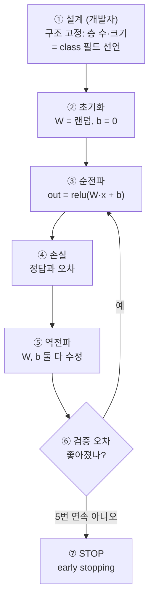

# 자바 개발자를 위한 ML — 아는 걸로 이해하기

> 관점: ML은 **새 개념이 아니라 이미 아는 것의 재배치**. 당신이 아는 Java/OOP 개념으로 번역한다.
> 관련: [ml-curriculum.md](ml-curriculum.md) · [concept.md](concept.md) · [../roadmap.md](../roadmap.md).

---

## 0. 한 장 요약 — ML ↔ Java 대응표

| ML 개념 | Java로 치면 | 한 줄 |
|---------|------------|-------|
| **모델(model)** | **상태(필드)를 가진 객체** | 학습된 파라미터 = 객체의 필드값 |
| **가중치(weights)·파라미터** | **멤버 변수(필드)** | 학습으로 채워지는 값 |
| **하이퍼파라미터** | **설정 파일**(application.yml) | 개발자가 정하는 값(층 수·학습률) |
| **학습(training)** | **빌드·컴파일 타임** | 무겁게 한 번 |
| **추론(inference)** | **런타임 실행** | 가볍게 반복 |
| **가중치 파일(.pt)** | **직렬화 객체·.jar** | 저장·배포 |
| **레이어(layer)** | **Stream 파이프라인 단계**(.map) | 데이터가 변환되며 흐름 |
| **순전파(forward)** | **함수 합성** f(g(h(x))) | 입력 → 출력 |
| **역전파(backprop)** | **옵티마이저가 필드를 자동 튜닝** | 학습 알고리즘(명확한 계산) |
| **손실 함수(loss)** | **테스트 assertion**(기대 vs 실제 차이) | 오차 측정 |
| **경사하강(gradient descent)** | **자동 튜닝 루프** (cf. APR·유전 프로그래밍) | 오차 줄이는 방향으로 필드값 수정 |
| **에폭(epoch)** | **전체 테스트 스위트 1회 실행** | 데이터 한 바퀴 |
| **오버피팅(overfitting)** | **테스트 케이스를 외운 하드코딩** | 새 입력엔 실패(일반화 실패) |
| **전이학습(transfer learning)** | **상속 후 메서드 오버라이드** | 사전학습 재사용, 마지막 층만 교체 |
| **텐서(tensor)** | **다차원 배열** float[][][] | 데이터 컨테이너 |
| **활성함수(activation)** | 비선형 변환 스텝 | 층 사이 가공 |
| **데이터셋** | 입력 데이터·테스트 픽스처 | 학습 재료 |

---

## 1. "ML이 뭐냐" — 인터페이스는 있는데 구현이 없다

- **기존 방식**: 당신이 직접 짠다.
  ```java
  boolean isCat(Image img) {
      if (hasPointyEars(img) && hasWhiskers(img)) return true;  // 규칙을 손코딩
      // ... 끝없는 예외 처리
  }
  ```
- **ML 방식**: 몸통을 안 쓴다. **예시(고양이 사진 수천 장)로 그 메서드를 자동 생성.**
  - 마치 **인터페이스만 선언**하고, 구현체를 **런타임에 데이터가 채워주는** 느낌.
  - 규칙이 너무 복잡해 손으로 못 짜는 문제(사진·음성)에 쓴다.

> 핵심: **"규칙을 코딩" → "규칙을 데이터로 학습".** 개발자의 일은 규칙 작성이 아니라 **데이터·목표(손실) 설계**로 옮겨간다.

---

## 2. "어떻게 배우나" — 자동화된 TDD

자바 개발자가 아는 **TDD 사이클**과 똑같다:

| TDD | ML 학습 |
|-----|---------|
| 기대값 있는 테스트 작성 | 정답(label) 준비 |
| 코드 실행 | 예측(순전파) |
| assertion 실패 확인 | 오차(손실) 계산 |
| 코드 수정 | 가중치 수정(경사하강) |
| 초록불 될 때까지 반복 | 오차 줄 때까지 반복 |

**차이 딱 하나**: 코드를 **사람이 아니라 옵티마이저가** 고친다. 역전파가 "어느 필드를 얼마나 고칠지"를 자동 계산(→ [deep-neural-backprop.md](deep-neural-backprop.md)).

> 💡 이 "자동으로 고치는 루프"는 진짜 있는 개념이다: 소프트웨어 연구의 **APR(Automated Program Repair, 예: GenProg)** — 패치 시도 → 테스트 → 나아지면 유지 → 반복. 경사하강과 판박이. (단 `ESLint --fix`·IDE 리팩터는 정해진 규칙 적용일 뿐, 이 탐색 루프가 아니다.)

---

## 3. "여정" — 라이브러리 → 직접 조립 → 프레임워크

| 단계 | Java 감각 |
|------|-----------|
| **고전 ML**(sklearn) | 잘 만든 **라이브러리 API 갖다쓰기** (`model.fit()` 한 줄) |
| **신경망**(PyTorch) | 레이어를 **직접 조립**(빌더 패턴처럼 쌓음) |
| **LLM**(HuggingFace) | **Spring 같은 거대 프레임워크** 위에서 |

---

## 4. 비유가 깨지는 지점 (주의)

분석 도구지 100% 등가는 아니다. 다른 점:

- **결정적이지 않다**: 일반 메서드는 같은 입력에 같은 출력. 학습에는 **랜덤성**(가중치 초기화·데이터 순서)이 있어 매번 조금 다른 모델이 나온다. (추론은 보통 결정적)
- **필드를 못 읽는다**: 가중치는 필드지만 **의미 라벨이 없다**(블랙박스). "이 필드 = 고양이 귀"처럼 안 읽힘 (→ [deep-layers-and-yolo.md](deep-layers-and-yolo.md)).
- **테스트 철학이 반대**: 코딩은 테스트 통과가 목표지만, ML은 **"안 본 데이터"** 로 시험한다. 훈련 데이터를 잘 맞히는 건 오히려 **오버피팅** 경고 (→ [learning-signal.md](learning-signal.md)).

---

## 5. 신경망 내부 한 조각 — 구조·가중치·편향 (코드+그림)

### 구조는 고정, 값은 학습
| | 누가 정하나 | 시작값 |
|---|---|---|
| **구조(층 수·크기)** | **개발자가 설계(고정)** = class 필드 선언 | — |
| **가중치 `W`** | **학습(경사하강)** | 랜덤 (대칭 깨기) |
| **편향 `b`** | **학습(경사하강)** | 보통 0 |

### 내부는 HashMap이 아니라 "행렬(배열) + 곱셈"
```java
class Layer {
    float[][] W;   // [출력뉴런수][입력수] — 랜덤으로 시작하는 숫자판
    float[]   b;   // 편향 — 보통 0으로 시작

    float[] forward(float[] x) {           // 순전파 = 행렬곱 + 활성함수
        float[] out = new float[W.length];
        for (int i = 0; i < W.length; i++) {
            float sum = b[i];              // ← 편향에서 출발
            for (int j = 0; j < x.length; j++)
                sum += W[i][j] * x[j];     // 가중치 곱해서 더하기
            out[i] = Math.max(0, sum);     // ReLU 활성함수
        }
        return out;
    }
}
```
저장 구조는 **`float[][]` 숫자판**이지 `HashMap.get(key)` 같은 **정확 조회가 아니다.** "key-value처럼"은 **동작 비유**(연구가 FFN을 연상 메모리로 해석):

| | HashMap | 신경망 층 |
|---|---|---|
| 조회 | 정확한 키 매칭 | 입력과 **내적(유사도)** |
| 결과 | value 딱 하나 | 여러 패턴이 **섞인** 값 |
| 성격 | 이산·O(1) | **흐릿(soft)·일반화** |

### 편향(bias) = `y = ax + b`의 b
- `W`가 기울기, **`b`가 y절편.** 편향이 없으면 직선이 **원점을 반드시 통과**해 자유도가 없다.
- 뉴런에선 **"얼마나 쉽게 켜질까(발화 문턱)"** 를 미는 값. 학습이 `W`와 **나란히** 조정한다:
```java
W[i][j] -= lr * gradW[i][j];   // 가중치 수정
b[i]    -= lr * gradB[i];      // 편향도 똑같이 수정
```

### 몇 번 반복(epoch)? = early stopping
숫자로 안 정한다. **검증 오차가 나빠지기 직전까지.**
```
오차
 │＼
 │  ＼＿＿＿＿＿  ← 훈련 오차: 계속 내려감 (외우는 중)
 │    ＼
 │      ╲    ／  ← 검증 오차: 내려가다 다시 올라감
 │        ╲ ／
 │         ●   ← 여기서 STOP (검증 오차 최저 = 최적)
 └──────────────── 반복 횟수(epoch)
```
```java
float best = Float.MAX_VALUE; int patience = 0;
for (int epoch = 1; epoch <= MAX; epoch++) {
    trainOneEpoch(trainData);                  // 예측→오차→W,b 수정
    float valLoss = evaluate(validationData);  // 안 본 데이터로 채점
    if (valLoss < best) { best = valLoss; save(); patience = 0; }
    else if (++patience >= 5) break;           // 5번 연속 개선 없으면 정지
}
```
> 자바 렌즈: **유닛 테스트(훈련 데이터)** 만 100% 맞추려 튜닝하지 말고, **통합 테스트(검증셋)** 통과율이 안 오르면 멈춘다.

### 한 장 그림 — 전체 흐름


*(도식 설명: 개발자가 구조를 고정하면 W는 랜덤·b는 0으로 초기화되고, 순전파로 예측→손실 계산→역전파로 W와 b를 함께 수정하는 루프를 돈다. 검증 오차가 좋아지면 반복하고, 5번 연속 나빠지면 early stopping으로 멈춘다.)*

---

## 한 줄 요약

ML을 자바로 번역하면: **모델 = 상태 가진 객체, 가중치 = 필드, 학습 = 자동 TDD로 필드 채우기, 추론 = 런타임 실행.** 새 언어를 배우는 게 아니라 **아는 개념의 재배치**다. 단, **비결정성·블랙박스·"안 본 데이터로 시험"** 세 가지만 다르다는 걸 기억하면 된다.

## 참조
- [ml-curriculum.md](ml-curriculum.md) · [concept.md](concept.md) · [nn-types.md](nn-types.md) · [../roadmap.md](../roadmap.md)
