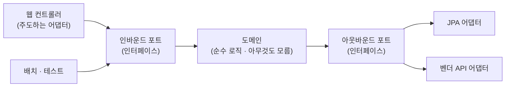

# 아키텍처 설계 — 개념 노트 (설계서부터 구조를 잡기까지)

> 용도: **새로 만들 때 구조를 어떻게 고르고 긋는가.** 설계서 작성 → 형식(스타일) 선택 → 실제 경계 긋기 순서.
> 기반: **Cockburn, *Ports and Adapters* (2005)** · **Conway, *How Do Committees Invent?* (Datamation 1968)** · **Nygard, *Documenting Architecture Decisions* (2011)** · **Brown, *C4 Model*** · **Ford et al., *Building Evolutionary Architectures* (2017)**
> 관련: 트랜잭션 경계는 [../lang/java/deep-spring-transaction.md](../lang/java/deep-spring-transaction.md), 서비스 경계와 정합성은 [../cs/deep-distributed-consistency.md](../cs/deep-distributed-consistency.md), 학습 순서는 [../backend-roadmap.md](../backend-roadmap.md).

---

## 0. 30초 직관 — 아키텍처는 그림이 아니라 "결정의 목록"

아키텍처를 물어보면 대부분 **네모와 화살표 그림**을 그린다. 그런데 그 그림은 아키텍처의 **결과**지 아키텍처가 아니다.

> **아키텍처 = 나중에 바꾸기 어려운 결정들의 집합.**

무엇이 "바꾸기 어려운"가? 컨트롤러 메서드 이름은 언제든 바꾼다. 하지만 **"주문과 결제를 한 DB에 둘 것인가"** 는 6개월 뒤에 바꾸려면 프로젝트가 멈춘다.

그래서 설계서의 본체는 그림이 아니라 **"무엇을 왜 그렇게 정했고, 무엇을 포기했는가"** 다. 이게 1장이다.

**그리고 아키텍처를 실제로 결정하는 건 기능이 아니다.**

> "주차 요금을 계산한다"는 요구는 **어떤 아키텍처로도** 만들 수 있다.
> 구조를 가르는 건 **"정산이 1초 안에 끝나야 한다"**, **"현장 서버가 끊겨도 차는 나가야 한다"** 같은 **품질 속성**이다.

---

## 1. 설계서부터 잡기

### 1-1. 왜 설계서인가 — 코드는 WHY를 버린다

코드를 읽으면 **무엇을 하는지(WHAT)** 와 **어떻게 하는지(HOW)** 는 알 수 있다. 하지만 —

- 왜 **A 대신 B**를 골랐는지
- 무엇을 **일부러 안 했는지**
- 어떤 **제약** 때문에 이 모양이 됐는지

이건 코드에 안 남는다. 그래서 6개월 뒤 누군가(대개 미래의 나)가 "이거 왜 이렇게 짰지?" 하며 **이미 검토하고 기각한 대안을 다시 검토**한다.

> **설계서의 진짜 가치는 "재작업 방지"다.** 문서가 예뻐서가 아니라, **기각된 대안을 기록해두면 같은 논의를 두 번 안 하기 때문**이다.

### 1-2. 설계서 6단계 — 이 순서를 지켜라

```
① 문제 정의     무엇을 푸는가 + 무엇은 안 푸는가(non-goals)
       ↓
② 제약 조건     기술·조직·일정·규제 — 바꿀 수 없는 것들
       ↓
③ 품질 속성     성능·가용성·보안·변경용이성 중 무엇이 1순위인가  ⭐ 여기가 핵심
       ↓
④ 후보 2~3개    각각의 트레이드오프
       ↓
⑤ 결정 + 근거   왜 이걸 골랐나 / 무엇을 포기했나 (= ADR)
       ↓
⑥ 리스크·검증   어떻게 틀렸음을 알아챌 것인가
```

**①의 non-goals를 빠뜨리면 안 된다.** "무엇을 안 할 것인가"를 안 적으면 범위가 계속 샌다. 그리고 나중에 "왜 이건 안 했냐"는 질문에 답할 근거가 없다.

**④에 후보가 하나뿐이면 그건 설계서가 아니라 통보다.** 대안 없이 쓴 문서는 검토받을 수 없다.

**⑥이 없는 설계서는 검증 불가능한 주장이다.** "확장성이 좋아집니다"가 아니라 "동시 접속 3천에서 p99가 500ms를 넘으면 이 설계는 실패한 것"이라고 써야 한다.

### 1-3. ⭐ 품질 속성이 아키텍처를 결정한다

이게 설계의 핵심이고, 대부분이 건너뛰는 부분이다.

| 1순위 품질 속성 | 끌려나오는 구조 |
|---|---|
| **응답 속도** | 캐시 계층, 비정규화, 읽기 복제본, CQRS |
| **가용성 (일부 죽어도 동작)** | 서비스 분리, 비동기 메시징, 결함 내성 |
| **정합성 (돈·재고)** | 한 트랜잭션 경계 안에 모으기, 서비스 **덜** 쪼개기 |
| **변경 용이성** | 포트/어댑터, 의존성 역전, 모듈 경계 |
| **팀 독립 배포** | 마이크로서비스, 모듈러 모놀리스 |
| **규제·감사** | 이벤트 소싱, 이력 테이블, 불변 로그 |

> **주목**: "가용성"과 "정합성"이 **정반대 구조**를 요구한다. 가용성은 쪼개라 하고, 정합성은 모으라 한다.
> [분산 정합성 노트](../cs/deep-distributed-consistency.md)에서 본 CAP이 설계 문서 수준에서 나타나는 지점이 여기다.
> **둘 다 1순위일 수는 없다.** 설계서는 이 순위를 정하는 문서다.

### 1-4. 품질 속성은 "시나리오"로 써야 한다

❌ **나쁜 요구**: "성능이 좋아야 한다", "확장성이 있어야 한다"
→ 측정 불가. 아무 설계나 통과한다.

✅ **품질 속성 시나리오** (SEI/ATAM 방식) — 6요소로 쓴다:

| 요소 | 예시 |
|---|---|
| 자극원 | 출차 게이트 |
| 자극 | 차량 출차 요청이 동시에 200건 |
| 환경 | 피크 시간, 중앙 서버 정상 |
| 대상 | 요금 계산 API |
| 응답 | 요금을 계산해 차단기 개방 신호 전송 |
| **응답 측정** | **p99 1초 이내, 실패율 0.1% 미만** |

**마지막 줄이 전부다.** 측정 기준이 없으면 아키텍처가 성공했는지 알 수 없다.

### 1-5. ADR — 결정을 한 장씩 남기기

**Architecture Decision Record.** Michael Nygard가 2011년에 제안한 형식으로, 지금은 사실상 표준이다.

```markdown
# ADR-007: 출차 이벤트 발행에 Outbox 패턴 사용

## 상태
승인됨 (2026-08-08)

## 배경
출차 완료를 DB에 저장하고 정산 시스템에 이벤트를 보내야 한다.
두 시스템을 원자적으로 갱신할 방법이 없다(dual write).

## 결정
outbox 테이블에 이벤트를 업무 데이터와 같은 트랜잭션으로 저장하고,
별도 릴레이가 폴링해 발행한다.

## 고려한 대안
- 2PC: 외부 정산 시스템이 prepare 단계를 지원하지 않음 → 불가
- 트랜잭션 안에서 직접 발행: 롤백 시 이미 나간 메시지를 되돌릴 수 없음
- CDC(Debezium): 지연이 적지만 인프라 추가 부담 → 트래픽 증가 시 재검토

## 결과
- ✅ 이벤트 유실 없음
- ⚠️ at-least-once만 보장 → **소비자가 멱등해야 함** (ADR-008로 연결)
- ⚠️ 폴링 주기만큼 지연(최대 5초)
- ⚠️ outbox 테이블 정리 배치 필요
```

**핵심은 "고려한 대안"과 "결과"의 ⚠️ 항목이다.** 장점만 적힌 ADR은 쓸모없다. **무엇을 포기했는지가 나중에 이 결정을 뒤집을지 판단하는 근거**가 된다.

> 파일로 `docs/adr/0007-outbox.md`처럼 **번호를 붙여 저장소에 함께 커밋**한다. 코드와 같이 버전 관리되는 게 요점이다.
> 결정이 뒤집히면 **지우지 말고** 상태를 `대체됨(superseded by ADR-015)`으로 바꾼다. 틀린 결정의 기록도 자산이다.

### 1-6. C4 모델 — 그림을 어느 축척으로 그릴 것인가

설계서의 그림이 뒤죽박죽이 되는 이유는 **축척이 섞여서**다. 한 그림에 "사용자"와 "UserRepository 클래스"가 같이 있으면 아무도 못 읽는다.

Simon Brown의 **C4 모델**은 축척을 4단계로 나눈다 — 지도의 축척과 같은 개념이다:

| 레벨 | 무엇을 보여주나 | 독자 |
|---|---|---|
| **1. Context** | 시스템과 **바깥 세계**(사용자·외부 시스템) | 모두 (비개발자 포함) |
| **2. Container** | 배포 단위 (웹앱·API·DB·큐) | 개발·운영 |
| **3. Component** | 컨테이너 안의 주요 모듈 | 개발자 |
| **4. Code** | 클래스 다이어그램 | 거의 안 그림 (IDE가 대신함) |

> **실무 조언**: **1·2단계만 그려도 대부분 충분하다.** 3은 자주 바뀌어 금방 낡고, 4는 그릴 가치가 거의 없다.
> 설계서에 딱 두 장 — **"바깥과의 관계 한 장, 배포 단위 한 장"** 이면 대화가 된다.

---

## 2. 아키텍처 형식 — 카탈로그

### 2-1. 레이어드 (Layered)

가장 익숙한 형태. `Controller → Service → Repository → DB`.

```
[Controller]  ← 위에서 아래로만 의존
     ↓
[Service]
     ↓
[Repository] → DB
```

- **최적화**: 단순함. 누구나 안다. 파일 위치를 즉시 안다.
- **포기**: **도메인이 DB에 의존한다.** Service가 Repository를 직접 알기 때문에, DB를 바꾸거나 DB 없이 테스트하기가 어렵다.
- **언제**: 대부분의 CRUD 중심 애플리케이션. **가장 흔하고, 대개 이걸로 충분하다.**

### 2-2. 헥사고날 (Ports & Adapters) — Cockburn, 2005

레이어드의 문제(도메인이 인프라에 의존)를 **의존성 역전**으로 뒤집는다.



*(도식 설명: 웹 컨트롤러나 배치·테스트가 인바운드 포트라는 인터페이스를 통해 도메인을 호출한다. 도메인은 바깥을 직접 알지 못하고, DB나 외부 API가 필요하면 아웃바운드 포트 인터페이스만 호출한다. 실제 JPA 구현이나 벤더 API 호출은 그 인터페이스를 구현한 어댑터가 담당한다. 도메인은 어느 쪽으로도 바깥 기술을 모른다.)*

> 🎭 **육각형에 아무 의미가 없다.** 6이라는 숫자에 뜻이 있는 게 아니라, **당시 모든 아키텍처 그림이 네모라서** Cockburn이 겹치지 않는 대칭 도형을 원했고, **포트를 여러 변에 자유롭게 붙이기 편해서** 육각형을 골랐을 뿐이다.
> 원래 이름도 **"Ports and Adapters"** 이고, 본인도 이 이름을 더 정확하다고 본다.

- **최적화**: **교체 가능성과 테스트.** DB 없이 도메인 테스트가 된다. 원래 목적이 정확히 이것이었다 — "사용자·프로그램·자동 테스트·배치가 **동등하게** 애플리케이션을 구동할 수 있게".
- **포기**: **파일 수와 매핑 코드.** 인터페이스 + 구현 + DTO 변환이 늘어난다.
- **언제**: 도메인 로직이 두껍고, 외부 연동이 여러 개이고, 그게 자주 바뀔 때. **CRUD에 적용하면 순수한 낭비다.**

### 2-3. 클린 · 어니언 = 사실상 같은 말

| 이름 | 제안 | 핵심 |
|---|---|---|
| Ports & Adapters | Cockburn, 2005 | 포트로 안팎을 분리 |
| Onion | Palermo, 2008 | 동심원, 안쪽이 바깥을 모름 |
| Clean | Martin, 2012 | 동심원 + 의존성 규칙 |

> **셋의 실질적 차이는 거의 없다.** 전부 **"의존성은 안쪽(도메인)을 향한다"** 한 문장이다. 용어와 그림만 다르다.
> 면접에서 "클린 아키텍처와 헥사고날의 차이"를 물으면, **"같은 원칙의 다른 표현이고, 굳이 나누면 클린이 계층을 더 세분화한 것"** 이 정확한 답이다.

### 2-4. 이벤트 드리븐

호출 대신 **사건을 발행**하고, 관심 있는 쪽이 구독한다.

- **최적화**: **결합도.** 발행자는 구독자를 모른다. 새 구독자를 추가해도 발행자를 안 고친다.
- **포기**: **추적 가능성.** "이 이벤트 다음에 무슨 일이 일어나는가"가 코드에 안 보인다. 디버깅이 어려워지고, 순서·중복·유실 문제가 따라온다(→ [분산 정합성](../cs/deep-distributed-consistency.md)).
- **언제**: 한 사건에 여러 후속 처리가 붙고, 그 목록이 계속 늘어날 때.

### 2-5. 모듈러 모놀리스

**하나로 배포하되, 안에서 모듈 경계를 엄격히 지킨다.**

- **최적화**: **하나의 트랜잭션·하나의 배포**를 유지하면서 **경계는 확보**한다. 나중에 쪼갤 수 있는 준비 상태.
- **포기**: 팀별 독립 배포는 안 된다.
- **언제**: **대부분의 경우 여기가 정답이다.** 마이크로서비스로 갈지 확신이 없으면 여기서 시작한다.

### 2-6. 마이크로서비스

- **최적화**: **팀 독립성과 개별 확장.** 기술적 이점보다 **조직적 이점**이 본체다(→ 3-2 콘웨이).
- **포기**: **원자성.** 서비스를 나누는 순간 `@Transactional`이 경계를 못 넘고, 멱등성·Outbox·Saga가 전부 필요해진다. 운영 복잡도(배포·모니터링·추적)가 급증한다.
- **언제**: **팀이 여러 개고, 배포 주기가 서로 달라야 할 때.** 팀이 하나면 대부분 손해다.

### 2-7. CQRS

읽기 모델과 쓰기 모델을 분리한다.

- **최적화**: 읽기와 쓰기의 **요구가 정반대일 때** 각각 최적화 가능(쓰기는 정규화, 읽기는 비정규화).
- **포기**: **두 모델의 동기화 지연**과 코드 중복.
- **언제**: 조회가 압도적으로 많고 화면 요구가 복잡할 때. **기본값으로 쓰면 안 된다.**

### 2-8. 한 장 비교

| 스타일 | 최적화 | 포기 | 적정 규모 |
|---|---|---|---|
| 레이어드 | 단순함 | 도메인의 독립성 | 대부분 |
| 헥사고날 | 교체·테스트 | 파일 수·매핑 | 도메인이 두꺼울 때 |
| 이벤트 드리븐 | 결합도 | 추적 가능성 | 후속 처리가 늘 때 |
| 모듈러 모놀리스 | 경계 + 원자성 | 독립 배포 | **기본 선택** |
| 마이크로서비스 | 팀 독립성 | 원자성·운영 단순함 | 팀이 여러 개 |
| CQRS | 읽기/쓰기 각각 최적화 | 동기화 지연 | 조회가 압도적일 때 |

---

## 3. 결국 구조를 잡는 법 — 경계 긋기

스타일을 고르는 건 사실 쉽다. **어려운 건 경계를 어디에 긋느냐다.** 잘못 그은 경계는 어떤 스타일로도 구제되지 않는다.

### 3-1. 콘웨이 법칙 — 조직이 구조를 결정한다

> "Any organization that designs a system will produce a design whose **structure is a copy of the organization's communication structure**."
> — Melvin Conway, *How Do Committees Invent?*, [Datamation, 1968](https://www.melconway.com/Home/Conways_Law.html)

> 🎭 **이 논문은 원래 거절당했다.** Conway는 1967년 **하버드 비즈니스 리뷰**에 냈다가 **"주장을 증명하지 못했다"** 는 이유로 반려됐다. 이듬해 당시 대표 IT 매거진 *Datamation*에 실렸고, Fred Brooks가 *The Mythical Man-Month*(1975)에서 인용하며 **"콘웨이 법칙"** 이라는 이름을 붙였다.
> 증명 못 했다고 거절당한 관찰이, 50년 뒤 마이크로서비스 설계의 제1원칙이 됐다.

**실무적 의미가 무섭다:**

- 팀이 **프론트팀 / 백엔드팀 / DBA팀**으로 나뉘어 있으면 → **3계층 구조**가 나온다. 자연스럽게.
- 팀이 **주차팀 / 정산팀 / 회원팀**으로 나뉘어 있으면 → **도메인별 서비스**가 나온다.
- **조직을 안 바꾸고 구조만 바꾸려는 시도는 대개 실패한다.** 조직 구조가 계속 원래 모양으로 되돌린다.

**역콘웨이 기동(Inverse Conway Maneuver)**: 원하는 아키텍처가 있으면 **먼저 팀을 그 모양으로 재편**한다. 구조가 따라온다.

> 🔎 **더 깊이 →** 개발 주체가 AI 에이전트 팀이 되면 이 법칙은 어떻게 되나 — 죽는 게 아니라 **부호가 바뀐다**(소통 구조가 제약에서 튜닝 변수로). ChatDev·MetaGPT·GPTSwarm·IMACS 논문 기반: [deep-conway-and-ai-agents.md](deep-conway-and-ai-agents.md)

### 3-2. 경계 후보를 찾는 기준 4개

| 기준 | 질문 | 신호 |
|---|---|---|
| **① 변경 이유** | 이 둘은 **같은 이유로** 바뀌는가? | 항상 같이 고쳐진다 = 한 덩어리여야 함 |
| **② 데이터 소유권** | 이 데이터를 **쓰는(write)** 주체는 누구인가? | 쓰는 쪽이 하나면 그게 경계 |
| **③ 트랜잭션** | 이 둘이 **한 트랜잭션에 묶여야** 하는가? | 묶여야 하면 **쪼개지 마라** |
| **④ 팀** | 다른 팀이 **다른 주기로** 배포하는가? | 그렇다면 쪼갤 이유가 생김 |

> **③이 가장 강한 제약이다.** 트랜잭션이 필요한 둘을 쪼개면 [분산 정합성](../cs/deep-distributed-consistency.md)의 도구를 전부 동원해야 한다.
> **"쪼갤 수 있다"와 "쪼개야 한다"는 다르다.** 기본값은 **합쳐두는 것**이고, 쪼개는 쪽이 근거를 대야 한다.

> 🔎 **더 깊이 →** 이 기준 4개가 **어느 이론에서 왔는지** — Parnas 정보 은닉(1972)·결합도/응집도·커너선스·Martin 메트릭(SDP/SAP)·DDD 바운디드 컨텍스트: [deep-modularity-theory.md](deep-modularity-theory.md)

**①은 단일 책임 원칙의 진짜 의미이기도 하다** — "하나의 일만 한다"가 아니라 **"바뀌는 이유가 하나"** 다.

### 3-3. 패키지 구조 — 계층별 vs 기능별

```
계층별 (package-by-layer)          기능별 (package-by-feature)
  controller/                        parking/
    ParkingController                  ParkingController
    PaymentController                  ParkingService
  service/                             ParkingRepository
    ParkingService                   payment/
    PaymentService                     PaymentController
  repository/                          PaymentService
    ParkingRepository                  PaymentRepository
    PaymentRepository
```

| | 계층별 | 기능별 |
|---|---|---|
| 새 기능 추가 | **3개 폴더를 오간다** | **한 폴더 안에서 끝난다** |
| 경계 강제 | 불가 — 아무 서비스나 아무 리포지토리 호출 가능 | 패키지 private으로 **막을 수 있다** |
| 나중에 쪼개기 | 어렵다 (기능이 흩어져 있음) | **폴더째 떼어내면 됨** |

> **기능별이 거의 항상 낫다.** 특히 **나중에 모듈이나 서비스로 쪼갤 가능성이 있으면** 사실상 필수다.
> 계층별은 "파일 종류로 정리한 것"이지 **"관심사로 정리한 것"이 아니다.** 옷장을 색깔별로 정리한 것과 같다.

### 3-4. 의존성 방향을 강제하는 법

문서에 "도메인은 인프라를 모른다"고 써놔도, **아무도 안 지킨다.** 사람 규율이 아니라 **빌드가 막아야** 한다.

```java
// ArchUnit — 테스트로 아키텍처 규칙을 검증
@Test
void 도메인은_인프라를_모른다() {
    noClasses().that().resideInAPackage("..domain..")
        .should().dependOnClassesThat().resideInAPackage("..infrastructure..")
        .check(new ClassFileImporter().importPackages("com.example"));
}
```

> **이게 아키텍처를 "지키는" 유일한 현실적 방법이다.** 규칙을 **테스트로 만들면** CI가 위반을 잡는다.
> 문서에만 있는 아키텍처는 **첫 번째 급한 배포에서 무너진다.**

### 3-5. 피트니스 함수 — 설계서 ⑥번의 실체

*Building Evolutionary Architectures*(Ford et al., 2017)의 개념. **아키텍처 특성을 자동으로 측정하는 것**을 전부 피트니스 함수라 부른다.

| 지키고 싶은 것 | 피트니스 함수 |
|---|---|
| 의존성 방향 | ArchUnit 테스트 |
| 응답 시간 p99 | CI의 부하 테스트 임계값 |
| 모듈 간 결합도 | 순환 참조 검출 |
| 번들 크기 | 빌드 시 크기 상한 |

> **핵심 발상**: 아키텍처는 한 번 정하고 끝나는 게 아니라 **계속 침식된다.** 그래서 **"침식을 감지하는 자동 장치"** 를 설계 시점에 같이 만든다.
> 1-2의 ⑥번("어떻게 틀렸음을 알아챌 것인가")이 코드로 구현된 게 이것이다.

---

## 4. 실전 절차 — 체크리스트

새 시스템 설계를 맡았을 때 순서대로:

- [ ] **1. 안 할 것을 먼저 적는다** (non-goals) — 범위가 새는 걸 막는다
- [ ] **2. 제약을 적는다** — WAS 지정, 전자정부 프레임워크 강제, 망분리, 납기 등 **못 바꾸는 것**
- [ ] **3. 품질 속성 순위를 정한다** — 가용성 vs 정합성 중 무엇이 위인지 **명시적으로**
- [ ] **4. 품질 속성을 시나리오로 쓴다** — 측정 가능한 숫자 포함
- [ ] **5. C4 Level 1·2를 그린다** — 바깥과의 관계 한 장, 배포 단위 한 장
- [ ] **6. 경계를 긋는다** — 3-2의 기준 4개로. **트랜잭션이 필요하면 쪼개지 않는다**
- [ ] **7. 스타일을 고른다** — 경계를 먼저 긋고 스타일은 나중. 기본값은 **모듈러 모놀리스 + 기능별 패키지**
- [ ] **8. 후보 2~3개를 비교한다** — 하나만 있으면 통보다
- [ ] **9. ADR로 결정과 포기를 남긴다** — ⚠️ 항목이 핵심
- [ ] **10. 피트니스 함수를 만든다** — ArchUnit + 성능 임계값. 없으면 6개월 뒤 무너진다

> **가장 흔한 실패**: 3·4를 건너뛰고 7(스타일 선택)부터 시작하는 것.
> 그러면 **"요즘 다들 MSA 쓰니까"** 같은 근거로 구조가 정해지고, 정작 필요한 정합성을 잃는다.

---

## 5. 3단 요약 (암기용)

### Q1. 아키텍처 설계는 무엇부터 시작하나?

- **① 결론 · WHAT** **품질 속성의 순위 결정**부터다. 기능 요구는 아키텍처를 결정하지 못한다.
- **② 원리 · HOW** "요금을 계산한다" 같은 기능은 **어떤 구조로도** 구현된다. 구조를 가르는 건 "p99 1초 이내", "현장 서버가 끊겨도 동작" 같은 **품질 속성**이다. 그래서 설계서는 `문제 → 제약 → 품질 속성 순위 → 후보 비교 → 결정(ADR) → 검증 방법` 순서로 쓴다. 품질 속성은 **측정 가능한 시나리오**로 적어야 한다 — "성능이 좋아야 한다"는 아무 설계나 통과시킨다.
- **③ 확장 · TRADE-OFF** **가용성과 정합성은 정반대 구조를 요구한다.** 가용성은 쪼개라 하고 정합성은 모으라 한다. 둘 다 1순위일 수 없으므로 설계서는 결국 **무엇을 포기할지 정하는 문서**다. 그 포기를 ADR의 ⚠️ 항목으로 남겨야 나중에 결정을 뒤집을지 판단할 수 있다.

### Q2. 클린 아키텍처와 헥사고날의 차이는?

- **① 결론 · WHAT** **실질적으로 같다.** 둘 다 **"의존성은 도메인을 향한다"** 한 문장이고, 용어와 그림만 다르다.
- **② 원리 · HOW** Cockburn의 Ports & Adapters(2005), Palermo의 Onion(2008), Martin의 Clean(2012)은 전부 **의존성 역전으로 도메인을 인프라에서 떼어내는** 같은 발상이다. 굳이 나누면 클린이 계층을 더 세분화했다. 참고로 **육각형에는 아무 의미가 없다** — 당시 그림이 다 네모라서 겹치지 않는 대칭 도형이 필요했고, 포트를 여러 변에 붙이기 편해서 골랐을 뿐이다.
- **③ 확장 · TRADE-OFF** 얻는 건 **교체 가능성과 테스트 용이성**이고, 값은 **파일 수와 매핑 코드**다. 도메인 로직이 얇은 CRUD에 적용하면 **순수한 낭비**다. "좋은 아키텍처"가 아니라 **"도메인이 두껍고 외부 연동이 자주 바뀔 때 값을 하는 아키텍처"** 로 이해해야 한다.

### Q3. 서비스 경계를 어떻게 긋나?

- **① 결론 · WHAT** 기준은 **① 같은 이유로 바뀌는가 ② 데이터를 쓰는 주체가 누구인가 ③ 한 트랜잭션에 묶여야 하는가 ④ 다른 팀이 다른 주기로 배포하는가**. 그리고 **기본값은 쪼개지 않는 것**이다.
- **② 원리 · HOW** ③이 가장 강한 제약이다 — 트랜잭션이 필요한 둘을 쪼개면 원자성을 잃고 멱등성·Outbox·Saga를 전부 동원해야 한다. 또 **콘웨이 법칙**에 따라 조직 구조가 시스템 구조를 복제하므로, **조직을 그대로 두고 구조만 바꾸면 되돌아간다.** 원하는 구조가 있으면 팀부터 재편해야 한다(역콘웨이 기동).
- **③ 확장 · TRADE-OFF** 마이크로서비스의 본체 이득은 기술이 아니라 **조직(팀 독립 배포)** 이다. 팀이 하나라면 대부분 손해다. 그래서 실무 기본값은 **모듈러 모놀리스 + 기능별 패키지** — 경계는 확보하되 원자성과 단순 배포를 유지하고, 필요해지면 폴더째 떼어낸다. 그리고 어떤 경계든 **ArchUnit 같은 피트니스 함수로 강제하지 않으면** 첫 급한 배포에서 무너진다.

---

## 용어 사전

| 용어 | 뜻 |
|------|-----|
| 품질 속성 | 성능·가용성·보안·변경용이성 등 기능 외 요구. 아키텍처를 실제로 결정 |
| 품질 속성 시나리오 | 자극·환경·응답·**측정 기준**을 갖춘 검증 가능한 요구 서술 |
| non-goals | 이번에 **안 할 것**을 명시한 목록 |
| ADR | Architecture Decision Record. 결정 1건 = 문서 1장 |
| C4 모델 | Context·Container·Component·Code 4단계 축척 다이어그램 |
| 포트 / 어댑터 | 도메인이 정의한 인터페이스 / 그 구현체 |
| 의존성 역전 | 상위 정책이 하위 세부에 의존하지 않게 방향을 뒤집는 것 |
| 콘웨이 법칙 | 시스템 구조는 조직의 소통 구조를 복제한다 |
| 역콘웨이 기동 | 원하는 구조에 맞춰 조직을 먼저 재편하는 것 |
| 모듈러 모놀리스 | 단일 배포이되 내부 모듈 경계를 엄격히 지키는 구조 |
| 피트니스 함수 | 아키텍처 특성을 자동 측정·검증하는 장치 |
| ArchUnit | 자바에서 아키텍처 규칙을 테스트로 검증하는 라이브러리 |

## 연결 지도
- **트랜잭션 경계 (경계 긋기의 제약)**: → [../lang/java/deep-spring-transaction.md](../lang/java/deep-spring-transaction.md)
- **쪼갠 뒤의 정합성 비용**: → [../cs/deep-distributed-consistency.md](../cs/deep-distributed-consistency.md)
- **프로세스가 여러 개일 때의 동시성**: → [../cs/deep-redis-cache-and-lock.md](../cs/deep-redis-cache-and-lock.md)
- **GoF 패턴 (한 단계 아래 층)**: → [../lang/java/design-patterns.md](../lang/java/design-patterns.md)
- **설계 원칙·트레이드오프 렌즈**: → [../engineering-concepts-map.md](../engineering-concepts-map.md)
- **학습 순서**: → [../backend-roadmap.md](../backend-roadmap.md)

## 출처
- Cockburn, A. *Hexagonal Architecture (Ports and Adapters).* 2005 — https://alistair.cockburn.us/hexagonal-architecture/
- Conway, M. *How Do Committees Invent?* Datamation, April 1968 — https://www.melconway.com/Home/Conways_Law.html
- Nygard, M. *Documenting Architecture Decisions.* 2011 — https://cognitect.com/blog/2011/11/15/documenting-architecture-decisions
- Brown, S. *The C4 Model for Visualising Software Architecture* — https://c4model.com/
- Ford, N., Parsons, R., Kua, P. *Building Evolutionary Architectures.* O'Reilly, 2017 — 피트니스 함수
- Martin, R. C. *The Clean Architecture.* 2012 — https://blog.cleancoder.com/uncle-bob/2012/08/13/the-clean-architecture.html
- Brooks, F. *The Mythical Man-Month.* 1975 — 콘웨이 법칙 명명
- ArchUnit — https://www.archunit.org/

_짧은 인용은 출처 표기. 이 문서는 **설계(신규 구축)** 관점이다. 기존 구조를 진단·개선하는 관점은 별도._
