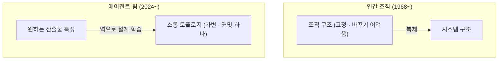

# 딥다이브 — 콘웨이 법칙은 AI 에이전트 시대에 죽었나

> 기반: **Conway, *How Do Committees Invent?* (1968)** · **Qian et al., *ChatDev* (ACL 2024)** · **Hong et al., *MetaGPT* (ICLR 2024)** · **Zhuge et al., *GPTSwarm* (ICML 2024)** · **Zhang et al., *Cut the Crap / AgentPrune* (2024)** · **Chen et al., *IMACS: Toward an Organizational Science of Multi-Agent LLM Systems* (2026)** · **Skelton & Pais, *Team Topologies* 블로그 (2025)**
> 형식: 30초 직관 → 근거 논문 → 원리 → 트레이드오프.
> **선행**: 콘웨이 법칙 원형과 역콘웨이 기동은 [concept.md](concept.md) 3-1장. 멀티에이전트의 기반인 LLM 자체는 [../ai-ml/deep-attention.md](../ai-ml/deep-attention.md).

---

## 0. 30초 직관 — 조직도가 소스코드가 됐다

콘웨이 법칙(1968)의 핵심은 이거였다:

> **시스템의 구조는 그것을 만든 조직의 소통 구조를 복제한다.**

이 법칙이 58년간 "법칙"으로 군림한 진짜 이유는 따로 있다 — **조직은 바꾸기 어렵기 때문**이다. 팀을 재편하려면 채용·평가·정치·감정이 얽혀 몇 달이 걸린다. 그래서 조직 구조는 사실상 **상수**였고, 시스템은 그 상수에 끌려갔다.

그런데 개발 주체가 AI 에이전트 팀이 되면 상황이 뒤집힌다:

```yaml
# 에이전트 팀의 "조직 개편" — 걸리는 시간: 0초
agents:
  - role: architect
    reports_to: lead        # ← 이 줄을 바꾸면 조직이 바뀐다
  - role: coder
  - role: reviewer
```

**조직도가 설정 파일이 됐다.** [concept.md](concept.md)에서 본 **역콘웨이 기동**(원하는 구조에 맞춰 조직을 먼저 재편하기)은 인간 조직에선 대수술이지만, 에이전트 팀에선 **커밋 하나**다.

그럼 콘웨이 법칙은 죽었나? **아니다 — 오히려 더 정확하게, 더 빠르게 작동한다.** 이 노트는 논문들이 실제로 보여준 3단계 변화를 따라간다:

```
1단계: 법칙의 적용   — 에이전트 팀도 소통 구조를 복제한다 (ChatDev·MetaGPT)
2단계: 법칙의 역전   — 소통 구조가 "튜닝 가능한 하이퍼파라미터"가 된다 (GPTSwarm 계열)
3단계: 조직과학 재수입 — 인간 조직 이론이 에이전트 설계로 돌아온다 (IMACS)
```

---

## 1. 1단계 — 법칙은 에이전트에게도 성립한다

### 1-1. ChatDev·MetaGPT: 에이전트로 "소프트웨어 회사"를 흉내 내다

2023년, LLM 에이전트 여러 개로 소프트웨어를 만들게 하려는 시도들이 나왔다. 흥미로운 건 **그들이 고른 조직 형태**다:

| 프레임워크 | 조직 구조 |
|---|---|
| **MetaGPT** | PM → 아키텍트 → 프로젝트 매니저 → 엔지니어 → QA. **인간 회사의 SOP(표준 절차)를 그대로** 에이전트에 이식 |
| **ChatDev** | 설계 → 코딩 → 테스트 → 문서화 4단계. 각 단계를 프로그래머·리뷰어·테스터 역할 에이전트의 **채팅 체인**으로 분해 |

즉 첫 세대 멀티에이전트는 **폭포수(waterfall) 회사의 조직도를 복사**했다. 그리고 결과물은 정확히 그 파이프라인의 모양을 닮았다 — 단계별 산출물, 역할별 책임, 순차 흐름.

> **이게 콘웨이 법칙의 실증이다.** 에이전트에게 어떤 소통 구조를 주느냐가 산출물의 구조를 결정했다.
> 법칙은 "인간 심리"의 법칙이 아니라 **"소통 경로를 따라 정보가 흐르는 모든 시스템"의 법칙**이었던 것이다.
> 1968년 원문도 조직을 "defined broadly"라고 썼다 — Conway는 처음부터 인간만 말한 게 아니었다.

### 1-2. 그리고 같은 병도 물려받았다

인간 폭포수 조직의 고질병 — **앞 단계의 오류가 뒤로 전파되고, 단계 사이에서 정보가 유실되는 것** — 을 에이전트 팀도 그대로 앓았다. 에이전트를 늘리고 대화를 늘리면:

- **토큰 비용이 폭증**한다 (모든 대화가 과금되는 조직)
- **환각이 전파**된다 — 한 에이전트의 잘못된 확신이 다음 에이전트의 "사실"이 된다
- 합의가 안 되는 게 아니라 **너무 쉽게 합의**된다 (동조 편향)

> **"에이전트를 더 넣으면 좋아진다"는 "사람을 더 넣으면 빨라진다"만큼 틀렸다.**
> Brooks의 법칙(*맨먼스 미신*, 1975)이 에이전트 버전으로 부활한 셈이다 — 소통 경로는 인원의 제곱으로 늘고, 이제 그 경로마다 토큰 청구서가 붙는다.

---

## 2. 2단계 — 법칙의 역전: 토폴로지가 하이퍼파라미터가 되다

여기서 재밌는 전환이 일어난다. 인간 조직에서 소통 구조는 **주어진 제약**이었다. 에이전트 팀에서는 **최적화 변수**다.

### 2-1. 소통 구조를 "학습"하는 연구들

| 연구 | 발상 |
|---|---|
| **GPTSwarm** (ICML 2024) | 에이전트들을 **그래프**로 보고, 어느 연결을 살릴지 자체를 **학습**한다 |
| **DyLAN** | 태스크마다 **필요 없는 에이전트를 동적으로 쳐낸다** |
| **AgentPrune / "Cut the Crap"** (2024) | 통신 그래프에서 **불필요한 메시지 경로를 가지치기** — 성능 유지하며 토큰 대폭 절감 |
| **AgentDropout** | 대화 라운드마다 에이전트를 **드롭아웃**시켜 토큰 효율과 성능을 동시에 |
| Shen et al. (EMNLP 2025) | 토폴로지에 따라 **정보(와 오류)가 어떻게 전파되는지** 자체를 분석 |

공통 결론: **토폴로지가 성능을 좌우하며, 태스크마다 최적 토폴로지가 다르다.**

### 2-2. 뒤집힌 콘웨이 법칙



*(도식 설명: 인간 조직에서는 바꾸기 어려운 조직 구조가 원인이고 시스템 구조가 결과였다. 에이전트 팀에서는 방향이 뒤집혀, 원하는 산출물 특성에서 출발해 소통 토폴로지를 역으로 설계하거나 학습시킨다. 법칙 자체는 그대로인데 어느 쪽이 변수인지가 바뀌었다.)*

> **법칙이 죽은 게 아니라 부호가 바뀌었다.**
> 콘웨이 법칙: "소통 구조 → 시스템 구조"라는 인과는 여전히 성립한다.
> 달라진 것: 이제 **원인 쪽(소통 구조)을 우리가 마음대로, 심지어 자동으로 바꿀 수 있다.**
> 역콘웨이 기동이 "가끔 하는 대수술"에서 **"매 태스크마다 실행되는 최적화 루프"** 가 됐다.

**자바 비유**: 인간 조직의 소통 구조가 `final` 필드였다면, 에이전트 토폴로지는 **런타임에 갈아끼우는 전략(Strategy) 객체**다. 문제마다 다른 구현을 주입한다.

---

## 3. 3단계 — 조직과학의 재수입 (IMACS, 2026)

그런데 토폴로지를 마음대로 바꿀 수 있게 되자, 역설적으로 **"그럼 어떤 조직이 좋은 조직인가"** 라는 인간 조직론의 질문이 그대로 돌아왔다.

2026년 7월의 **IMACS** 논문(Chen et al.)은 이 질문을 정면으로 다룬다. 멀티에이전트 프레임워크들이 뒤엉켜 다루던 세 가지를 분리하자는 제안이다:

> "who is on the team (**organization**), how members align (**coordination**), and which algorithm fuses their work (**collaboration protocol**)"
> — [Chen et al., 2026 (arXiv:2607.25446)](https://arxiv.org/abs/2607.25446)

**누가 팀에 있나 / 어떻게 조율하나 / 어떤 알고리즘으로 합치나** — 이 셋을 독립적으로 갈아끼울 수 있는 층으로 나눈다. 그리고 인간 조직론의 고전 도구들을 그대로 수입한다: **Belbin 역할 이론, Mintzberg 조정 메커니즘, RACI 책임 매트릭스.** 1960~80년대 경영학이 2026년 에이전트 설계 언어가 된 것이다.

### 실증 결과 두 개가 중요하다

**① 책임 배치가 결과를 바꾼다 — 단, 조건부로**

> "accountability placement changes outcomes **exactly when the protocol routes the deliverable through the accountable agent**"

"누가 최종 책임자인가"를 바꾸면 산출물이 달라진다. 단 **산출물이 실제로 그 책임자를 거쳐 갈 때만**. 직함만 있고 결재 라인에 없는 책임자는 아무 효과가 없다 — 인간 조직에서 늘 보던 그 현상이 에이전트에서 정량 재현됐다.

**② 최적 조직은 모델마다 다르다 — 조직 설계를 하드코딩할 수 없다**

> "the winning placement **flips across model families**, so organizational design cannot be hard-coded; it must be **revalidated, or learned**, for each model binding"

GPT 계열에서 이긴 조직 구조가 다른 모델 계열에선 진다. 즉 **"모범 조직도" 같은 건 없고**, 모델(=구성원의 인지 특성)이 바뀔 때마다 조직을 재검증해야 한다.

> 이건 인간 조직론의 **상황적합이론(contingency theory)** — "유일한 최선의 조직은 없고 상황에 달렸다" — 의 에이전트 버전이다. 60년 된 경영학 논쟁이 실험 가능한 과학이 됐다.

---

## 4. 인간 쪽 콘웨이는 안 죽었다 — 오히려 병목이 됐다

에이전트가 코드를 다 짜는 시대에도 인간 조직의 콘웨이 법칙은 두 경로로 살아남는다.

### 4-1. 사일로 조직은 실패하는 에이전트를 만든다

실무 보고들의 공통 관찰: **기업 AI 도입의 최대 장애물은 모델이 아니라 조직의 지식 공유 구조다.** 에이전트의 성능은 컨텍스트(문서·데이터·암묵지)의 질이 결정하는데, **부서 간 장벽으로 지식이 단절된 조직은 그 단절된 컨텍스트를 에이전트에게 물려준다.** 조직의 소통 구조가 이번엔 시스템이 아니라 **에이전트의 지식 지도**를 복제하는 것이다.

### 4-2. 하이브리드 팀에서 "소통 경로"는 문서다

Team Topologies 진영은 2025년 초부터 "에이전트가 팀의 50~90%를 차지하면 어떻게 되나"를 논의해 왔다. 핵심 관찰:

> 인간-에이전트 팀의 소통 경로는 회의나 메신저가 아니라 **문서**다 — `CLAUDE.md`, 스펙 문서, ADR, 코딩 컨벤션.
> 그렇다면 콘웨이 법칙의 새 형태는 이렇다: **시스템의 구조는 컨텍스트 문서의 구조를 복제한다.**

이건 이 저장소 사용자에게 낯설지 않은 얘기다 — **spec-driven 개발, 설계·실행계획 문서, ADR·메모리 체계**는 정확히 "에이전트와의 소통 구조를 명시적으로 설계하는" 작업이다. 문서 체계가 곧 조직도인 시대에는, **문서를 잘 구조화하는 사람이 곧 조직 설계자**다.

---

## 5. 실무 함의 — [concept.md](concept.md)의 절차에 무엇이 추가되나

| concept.md의 항목 | 에이전트 시대의 확장 |
|---|---|
| 콘웨이 법칙 (3-1) | 인간 팀 + **에이전트 팀 토폴로지**까지 설계 대상 |
| 역콘웨이 기동 | 대수술 → **설정 파일 수정.** 대신 "어떤 조직이 좋은가"를 매번 검증해야 |
| ADR (1-5) | **에이전트 팀 구성·역할·책임 배치도 ADR로 남길 결정**이다 — 모델 바꾸면 뒤집힐 수 있으므로 |
| 피트니스 함수 (3-5) | 아키텍처 침식 감지처럼, **에이전트 토폴로지도 성능·비용을 자동 측정**해 재검증 (IMACS의 Adaptive Org Routing이 이 방향) |
| 경계 긋기 기준 4개 (3-2) | "다른 팀이 다른 주기로 배포하는가"에 **"다른 에이전트 워크플로우가 독립적으로 도는가"** 가 추가 |

> **한 줄 요약**: 아키텍트의 일에서 "조직도 그리기"가 사라지는 게 아니라,
> **사람 조직도 + 에이전트 조직도 + 그 둘을 잇는 문서 구조**까지로 **세 배가 됐다.**

---

## 6. 3단 요약 (암기용)

### Q1. AI 에이전트 시대에 콘웨이 법칙은 유효한가?

- **① 결론 · WHAT** **유효하다 — 오히려 더 강하게.** 다만 소통 구조가 "고정된 제약"에서 **"튜닝 가능한 변수"** 로 바뀌었다.
- **② 원리 · HOW** ChatDev·MetaGPT는 인간 회사의 SOP를 에이전트에 이식했고 산출물이 그 파이프라인을 복제했다 — 법칙이 인간 심리가 아니라 **소통 경로를 따라 정보가 흐르는 모든 시스템**의 법칙임이 실증됐다. 이어서 GPTSwarm·DyLAN·AgentPrune 계열이 토폴로지 자체를 **학습·가지치기**하기 시작했다 — 원인 쪽을 조작할 수 있게 된 것이다.
- **③ 확장 · TRADE-OFF** 역콘웨이 기동이 공짜가 된 대신, **"어떤 조직이 좋은가"를 매번 다시 물어야 한다.** IMACS(2026)의 발견 — 최적 조직 구조가 **모델 패밀리마다 뒤집힌다** — 은 모범 조직도를 하드코딩할 수 없고 재검증·학습해야 함을 뜻한다.

### Q2. 에이전트를 많이 넣으면 좋아지나?

- **① 결론 · WHAT** **아니다.** "사람을 더 넣으면 빨라진다"(Brooks가 반박한 미신)의 에이전트 버전이다.
- **② 원리 · HOW** 소통 경로는 구성원 수의 제곱으로 늘고, 에이전트 팀에서는 **모든 경로에 토큰 비용이 붙는다.** 게다가 한 에이전트의 환각이 다음 에이전트의 "사실"이 되어 **오류가 경로를 따라 전파**된다(폭포수 조직의 고질병과 동형). 그래서 AgentPrune·AgentDropout 같은 연구가 **경로를 줄여서** 성능을 유지하며 비용을 낮춘다.
- **③ 확장 · TRADE-OFF** 정답은 개수가 아니라 **토폴로지**다 — 태스크마다 최적 구조가 다르고(EMNLP 2025), 책임 배치가 산출물이 실제로 그 경로를 지날 때만 효과를 낸다(IMACS). 에이전트 팀 설계는 "몇 명 쓸까"가 아니라 **"누가 누구와, 무엇을 근거로 말하게 할까"** 의 문제다.

### Q3. 그럼 인간 조직 설계는 필요 없어지나?

- **① 결론 · WHAT** **반대로 더 중요해졌다.** 병목이 코드 작성에서 **조직의 지식 구조**로 옮겨갔기 때문이다.
- **② 원리 · HOW** 에이전트의 산출물 품질은 컨텍스트가 결정하는데, 컨텍스트는 조직의 문서·데이터·암묵지에서 나온다. **사일로 조직은 단절된 컨텍스트를 에이전트에게 물려주고**, 그 에이전트는 단절된 시스템을 만든다 — 콘웨이 법칙이 한 다리 건너 작동한다. 하이브리드 팀의 소통 경로는 회의가 아니라 **문서**(스펙·ADR·컨벤션)이므로, **문서 구조가 곧 조직도**다.
- **③ 확장 · TRADE-OFF** 그래서 spec-driven 개발과 결정 기록(ADR)이 "문서화 잘하기"가 아니라 **조직 설계 행위**가 된다. 비용은 문서 유지보수이고, 이득은 에이전트든 신규 입사자든 **같은 소통 구조로 온보딩**된다는 것 — 사람과 기계가 처음으로 같은 조직도를 공유한다.

---

## 용어 사전

| 용어 | 뜻 |
|------|-----|
| 콘웨이 법칙 | 시스템 구조는 조직의 소통 구조를 복제한다 (1968) |
| 역콘웨이 기동 | 원하는 시스템 구조에 맞춰 조직을 먼저 재편 |
| SOP | 표준 운영 절차. MetaGPT가 에이전트에 이식한 것 |
| 채팅 체인 | ChatDev의 단계별 에이전트 대화 파이프라인 |
| 토폴로지 | 에이전트 간 통신 연결의 그래프 구조 |
| 가지치기(pruning) | 불필요한 통신 경로를 제거해 비용·오류 전파를 줄임 |
| 책임 배치(accountability placement) | 최종 산출물의 책임 에이전트를 어디에 둘 것인가 |
| 상황적합이론 | 유일한 최선의 조직은 없고 상황에 달렸다는 경영학 이론 |
| RACI | 책임(R)·최종책임(A)·자문(C)·통보(I) 매트릭스 |
| Brooks의 법칙 | 늦은 프로젝트에 인원을 더하면 더 늦어진다 (1975) |
| spec-driven | 명세 문서를 에이전트와의 주 소통 수단으로 삼는 개발 방식 |

## 연결 지도
- **콘웨이 법칙 원형·역콘웨이 기동 (선행)**: → [concept.md](concept.md) 3-1장
- **ADR·피트니스 함수 (확장되는 대상)**: → [concept.md](concept.md) 1-5·3-5장
- **LLM·어텐션 (에이전트의 기반)**: → [../ai-ml/deep-attention.md](../ai-ml/deep-attention.md)
- **학습 신호·확증편향 (환각 전파의 뿌리)**: → [../ai-ml/learning-signal.md](../ai-ml/learning-signal.md)
- **학습 순서**: → [../backend-roadmap.md](../backend-roadmap.md)

## 출처
- Conway, M. *How Do Committees Invent?* Datamation, 1968 — https://www.melconway.com/Home/Conways_Law.html
- Qian, C. et al. *ChatDev: Communicative Agents for Software Development.* ACL 2024 — https://arxiv.org/abs/2307.07924
- Hong, S. et al. *MetaGPT: Meta Programming for Multi-Agent Collaborative Framework.* ICLR 2024 — https://arxiv.org/abs/2308.00352
- Zhuge, M. et al. *GPTSwarm: Language Agents as Optimizable Graphs.* ICML 2024 — https://arxiv.org/abs/2402.16823
- Zhang, G. et al. *Cut the Crap: An Economical Communication Pipeline for LLM-based Multi-Agent Systems (AgentPrune).* 2024 — https://arxiv.org/abs/2410.02506
- Chen, H. et al. *Toward an Organizational Science of Multi-Agent LLM Systems: Decoupling Who, How, and Which Algorithm (IMACS).* 2026 — https://arxiv.org/abs/2607.25446
- Shen, X. et al. *Understanding the Information Propagation Effects of Communication Topologies in LLM-based Multi-Agent Systems.* EMNLP 2025
- Team Topologies, *The Future of Team Topologies: When AI Agents Dominate.* 2025 — https://teamtopologies.com/news-blogs-newsletters/2025/1/14/the-future-of-team-topologies-when-ai-agents-dominate
- Brooks, F. *The Mythical Man-Month.* 1975 — Brooks의 법칙

_짧은 인용은 출처 표기. 이 분야는 매우 빠르게 움직인다 — 2026년 기준 정리이며, 결론보다 **질문의 틀**(적용→역전→재수입)을 가져갈 것._
