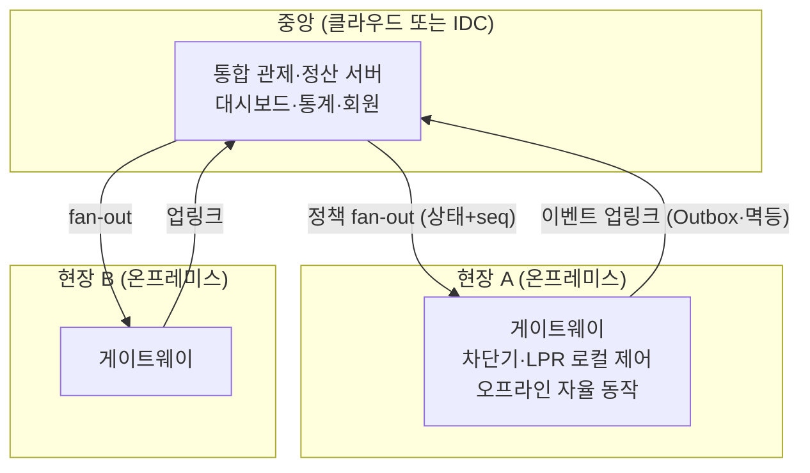

# 딥다이브 — 온프레미스는 왜 아직 사는가: 클라우드 20년 뒤의 배치 결정

> 기반: **AWS EC2 출시 (2006) 전후의 역사** · **Dropbox Infrastructure Optimization (2016–17, SEC 공시 기반 보도)** · **37signals/Basecamp *Leaving the Cloud* (2022–24)** · **국내 공공·금융 규제 환경(망분리·CSAP)**
> 형식: 30초 직관 → 역사 → 온프레미스가 살아남는 이유 5개 → 하이브리드가 실제 정답인 이유 → 대가 → 판단 기준.
> 관련: 현장-중앙 전파는 [../cs/deep-grpc-idempotency-and-fanout.md](../cs/deep-grpc-idempotency-and-fanout.md), 배치가 낳는 정합성 문제는 [../cs/deep-distributed-consistency.md](../cs/deep-distributed-consistency.md), 품질 속성 결정은 [concept.md](concept.md) 1-3장.

---

## 0. 30초 직관 — "온프레미스"라는 말은 클라우드가 만들었다

재미있는 사실부터: **클라우드 이전에는 "온프레미스"라는 말 자체가 없었다.** 모두가 자기 서버실에서 돌렸으니 그냥 "전산실"이었고, 이름이 필요 없었다. 클라우드가 나오고 나서야 **기존 방식을 구분해 부를 이름**이 소급해서 생겼다 — 전기 기타가 나온 뒤에야 "어쿠스틱 기타"라는 말이 생긴 것과 같다(이런 단어를 **레트로님**이라 한다).

> 📝 **표기 참고**: 정확한 영어는 **on-premises**(구내·건물이라는 뜻의 premises)다. premise(전제)가 아니라. 업계에서 on-premise로 굳어져 둘 다 통용되지만, 문서에 쓸 땐 on-premises가 맞다.

그리고 이 노트의 중심 질문:

> 클라우드가 나온 지 20년. "서버 관리는 낡은 일"이라던 시대에, **왜 주차장마다 온프레미스 게이트웨이가 돌고, Dropbox와 Basecamp는 클라우드에서 나왔는가?**

답은 "클라우드가 과대평가라서"가 아니다. **배치(deployment)는 이념이 아니라 품질 속성의 함수**라서다 — 어떤 속성(생존성·지연·규제·비용 구조)은 구조적으로 클라우드가 만족시킬 수 없다.

---

## 1. 역사 — 진자는 세 번 흔들렸다

### 1-1. 중앙 → 분산 → 다시 중앙

| 시대 | 배치 | 왜 그랬나 |
|---|---|---|
| 1960~70s | **메인프레임** (중앙) | 컴퓨터가 방 하나 크기·초고가 → 공유가 유일한 선택 |
| 1980~90s | **클라이언트-서버** (분산) | PC가 싸짐 → 각자 계산, 서버는 데이터만 |
| 2000s | 자체 전산실 전성기 | 웹 서비스마다 서버 구매·상면 임대 — 스타트업의 최대 초기비용 |
| **2006** | **클라우드** (다시 중앙) | AWS EC2 출시 — "시간당 빌려 쓰는 서버" |
| 2015~ | **회귀와 엣지** (다시 분산) | 아래 1-3 |

### 1-2. 2006년 — 무엇이 그렇게 혁명이었나

아마존은 자사 커머스를 돌리려 만든 표준화된 인프라를 외부에 팔기 시작했다(2006.08 EC2). 베조스가 내건 논리는 **"undifferentiated heavy lifting"** — 서버 조달·상면·전원·네트워크 구축은 **어느 회사가 해도 똑같은, 차별화가 안 되는 밑일**이니 우리가 대신 해주겠다는 것.

핵심 전환은 기술이 아니라 **회계**였다:

> **CapEx(자본지출: 서버를 산다) → OpEx(운영지출: 시간당 빌린다).**
> 스타트업이 서버 살 돈 없이 창업할 수 있게 됐고, 수요 예측 실패의 비용(과잉 구매/용량 부족)이 사라졌다. 2010년대 스타트업 붐의 물적 토대다.

### 1-3. 2015~ — 진자가 되돌아오다: 회귀(repatriation)와 엣지

클라우드 전성기에 반대 방향 사건 두 갈래가 나타났다.

**비용 회귀** — 규모가 크고 부하가 예측 가능하면 "빌리는 값"이 "사는 값"을 역전한다:

- **Dropbox (2015–16)**: S3에서 자체 인프라로 이전. SEC 공시 기준 **2년간 약 7,460만 달러** 운영비 절감 ([GeekWire 보도](https://www.geekwire.com/2018/dropbox-saved-almost-75-million-two-years-building-tech-infrastructure/)). 스토리지가 사업 본체라 규모·예측 가능성이 극단적이었던 사례.
- **37signals/Basecamp (2022–24)**: DHH가 "클라우드 청구서가 그로테스크하다"며 탈출 선언. 약 60만 달러어치 서버를 사서 이전, 연 클라우드 지출 **320만 → 130만 달러** ([Leaving the Cloud](https://basecamp.com/cloud-exit), [The Register](https://www.theregister.com/2024/10/21/37signals_aws_savings/)). 인력 추가 없이 해냈다는 점이 논쟁의 핵심이었다.

**엣지(edge)** — 지연·생존성 때문에 **계산이 현장으로 돌아왔다.** 공장·매장·차량·주차장. 클라우드의 반대말이 아니라 보완이다(3장).

> **정리**: 역사는 "온프레미스 → 클라우드"의 일방통행이 아니라 **중앙↔분산의 진자 운동**이다. 흔드는 힘은 그때그때 다르다 — 하드웨어 가격, 회계 구조, 지연, 규제.

---

## 2. 온프레미스가 살아남는 이유 5개

### ① 생존성 — 끊겨도 동작해야 한다

주차장 차단기가 좋은 예다. **인터넷이 끊겨도 차는 나가야 한다.** 요금 계산·차단기 제어가 클라우드에만 있으면, 통신 장애 = 주차장 마비다. 그래서 현장에 온프레미스 게이트웨이를 두고 **로컬에서 자율 동작**하게 한다 — 중앙과는 복구 후 동기화한다.

> 이게 [gRPC 노트](../cs/deep-grpc-idempotency-and-fanout.md) 5장의 배경이다 — 현장 자율 동작에는 peer 전파·멱등 apply·전진 복구(선통과 후정산)가 세트로 필요하다. **온프레미스를 두는 순간 분산 시스템 설계가 시작된다.**

### ② 지연 — 물리 법칙은 협상이 안 된다

차단기·LPR 카메라·PLC 같은 **하드웨어 제어는 밀리초 단위 로컬 루프**다. 서울-리전 왕복 수십 ms조차 못 견디는 제어가 있고, 대역폭도 문제다(카메라 영상 전량을 클라우드로 올리는 건 비용·회선 낭비 — 현장에서 처리하고 결과만 올린다).

### ③ 규제 — 선택권이 없는 경우

국내 실무에서 자주 결정적인 이유:

- **공공**: 행정망 **망분리** 환경, 클라우드를 쓰려면 **CSAP**(클라우드 보안인증) 받은 서비스만 — 선택지가 좁다
- **금융**: 전자금융감독규정의 망분리·자료 보관 요건
- **개인정보·주권**: 데이터가 어느 국가 법역에 있는지가 계약 요건인 경우

> 이때 온프레미스는 트레이드오프 분석의 결과가 아니라 **제약 조건**이다 — [concept.md](concept.md) 설계서 6단계에서 "② 제약"에 적히는 항목.

### ④ 비용 역전 — 빌리는 값 > 사는 값이 되는 지점

클라우드의 탄력성은 **변동 부하**에 대한 보험이다. 부하가 **크고 안정적이고 예측 가능**하면 보험료만 내는 셈이 된다. Dropbox·Basecamp가 정확히 이 조건이었다. 거꾸로 말하면 —

> **부하가 들쭉날쭉하거나 미래를 모르면 클라우드가 싸고, 부하가 크고 평평하면 온프레미스가 싸진다.**
> 손익분기는 "인건비 포함 3~5년 TCO"로 계산해야 하며, 서버 가격만 비교하면 반드시 틀린다.

### ⑤ 통제 — 성능·하드웨어·이웃

전용 하드웨어(GPU 구성·NVMe 직결), noisy neighbor 없음, 커널·네트워크 튜닝 자유. 성능 꼬리(p99)를 직접 통제해야 하는 워크로드에서 유효하다.

---

## 3. 실전의 정답은 "vs"가 아니라 배치도다

주차 플랫폼의 전형적 구조를 보면 "클라우드 vs 온프레미스" 질문 자체가 틀렸음이 보인다:



*(도식 설명: 통계·정산·대시보드처럼 모아야 값이 나는 것은 중앙(클라우드/IDC)에, 차단기 제어처럼 끊겨도 돌아야 하는 것은 현장 온프레미스 게이트웨이에 둔다. 중앙에서 현장으로는 버전 붙은 정책을 fan-out하고, 현장에서 중앙으로는 이벤트를 Outbox·멱등 처리로 올린다. 배치 결정이 곧 통신·정합성 설계를 결정한다.)*

**무엇을 어디에 두는가의 원리:**

| 워크로드 성질 | 배치 |
|---|---|
| 모아야 가치가 남 (통계·정산·검색) | 중앙 |
| 끊겨도 돌아야 함 (제어·안전) | **현장** |
| 밀리초 로컬 루프 (하드웨어) | **현장** |
| 부하 변동 큼 (이벤트·프로모션) | 클라우드 (탄력) |
| 규제 대상 데이터 | 규제가 지정한 곳 |

> **핵심 통찰**: 배치를 나누는 순간 [분산 정합성](../cs/deep-distributed-consistency.md)의 모든 문제(타임아웃=모름, 멱등성, 전진 복구)를 상속한다. **온프레미스 게이트웨이는 "작은 서버"가 아니라 "분산 시스템의 한 노드"다.** 이 관점 전환이 이 주제에서 가장 중요한 배움이다.

---

## 4. 온프레미스의 대가 — 청구서는 다른 형태로 온다

클라우드 요금이 안 나가는 대신 치르는 것들:

| 대가 | 내용 | 완화 |
|---|---|---|
| **운영 부담** | 하드웨어 고장·전원·백업·보안 패치가 전부 내 일 | 표준화·자동화, 원격 관리(IPMI) |
| **탄력성 없음** | 피크 대비 용량을 미리 사야 함. 수요 예측 실패의 비용 부활 | 변동 부하만 클라우드로 (하이브리드) |
| **현장 N개 배포** | 수십 현장에 버전을 뿌리고 확인하는 일 자체가 시스템 | CI/CD 파이프라인 + [fan-out 설계](../cs/deep-grpc-idempotency-and-fanout.md), 마더쉽/현장 fork 형상관리 |
| **형상 드리프트** | 현장마다 조금씩 달라진 설정·버전이 누적 | desired state 선언 + 주기 비교(반엔트로피와 동형) |
| **관측성** | 현장 장애를 중앙에서 알기 어려움 | 하트비트·메트릭 업링크, 오프라인 버퍼링 |
| **하드웨어 수명** | 3~5년 주기 교체 계획·감가 | TCO에 처음부터 포함 |

> **현장 N개 배포·형상 드리프트가 실무에서 가장 아픈 항목**이다. 클라우드에선 배포가 "한 곳에 올리면 끝"이지만, 온프레미스 현장이 늘수록 **배포·형상관리 자체가 제품의 일부**가 된다 — 마더쉽/현장 fork 전략, 무손실 이관, CI/CD 재구축 같은 작업이 바로 이 비용에 대한 투자다.

---

## 5. 판단 기준 — 순서대로 묻기

```
1. 규제가 배치를 지정하는가?           → 예: 그대로 따른다 (선택이 아님)
2. 끊겨도 돌아야 하는 기능인가?         → 예: 현장 온프레미스 + 자율 동작 설계
3. 밀리초 로컬 루프·대용량 로컬 데이터?  → 예: 현장 처리, 결과만 업링크
4. 부하가 크고 평평하고 예측 가능한가?   → 예: 온프레미스/IDC TCO 계산 가치 있음
   부하가 변동·불확실한가?             → 예: 클라우드 (탄력이 보험)
5. 운영 인력·역량이 있는가?            → 없으면 온프레미스 절감분은 환상이다
```

> 그리고 마지막 확인: **온프레미스를 두기로 했다면, 분산 시스템 설계(멱등·fan-out·오프라인 동기화)와 배포 파이프라인 비용을 계획에 넣었는가?** 이 둘을 빼먹은 온프레미스 계획은 서버 가격표일 뿐이다.

---

## 6. 3단 요약 (암기용)

### Q1. 클라우드 시대에 왜 온프레미스를 쓰나?

- **① 결론 · WHAT** 배치는 이념이 아니라 **품질 속성의 함수**다. 다섯 힘이 온프레미스를 강제한다 — **생존성**(끊겨도 동작), **지연**(하드웨어 로컬 루프), **규제**(망분리·CSAP·데이터 주권), **비용 역전**(크고 평평한 부하), **통제**(전용 하드웨어·p99).
- **② 원리 · HOW** 클라우드의 본질은 기술이 아니라 **회계 전환(CapEx→OpEx)** 과 탄력성이다. 탄력성은 변동 부하에 대한 보험이므로, 부하가 크고 예측 가능하면 보험료가 낭비가 된다 — Dropbox(2년 약 7,500만 달러 절감)와 Basecamp(연 320만→130만 달러)가 그 실증. 반대로 부하가 불확실하면 클라우드가 압도적으로 유리하다.
- **③ 확장 · TRADE-OFF** 온프레미스의 청구서는 요금 대신 **운영 부담·탄력성 상실·현장 배포·형상 드리프트·하드웨어 수명**으로 온다. 특히 현장이 N개면 배포·형상관리가 제품의 일부가 된다. 운영 인력 없는 온프레미스 절감 계산은 환상이다.

### Q2. 현장 게이트웨이(엣지 온프레미스)는 무엇이 다른가?

- **① 결론 · WHAT** "작은 서버"가 아니라 **분산 시스템의 한 노드**다. 배치를 나누는 순간 분산 정합성의 전 문제를 상속한다.
- **② 원리 · HOW** 끊겨도 돌아야 하므로 로컬 자율 동작 + 복구 후 동기화가 필요하고, 그 동기화는 타임아웃=모름 위에서 돌아가므로 **멱등 apply·버전 붙은 상태 fan-out·Outbox 업링크·전진 복구(선통과 후정산)** 가 세트로 요구된다. 모아야 값이 나는 것(통계·정산)만 중앙에 두고, 끊기면 안 되는 것(제어)은 현장에 둔다.
- **③ 확장 · TRADE-OFF** 자율성을 줄수록 현장별 상태·버전이 갈라지는 **드리프트**가 커진다 — desired state 선언과 주기적 비교(반엔트로피)로 눌러야 한다. 자율성을 줄이면 드리프트는 줄지만 통신 장애가 곧 현장 장애가 된다. 이 다이얼이 곧 설계다.

### Q3. 클라우드 vs 온프레미스, 어떻게 결정하나?

- **① 결론 · WHAT** "vs"가 아니라 **워크로드별 배치도**를 그린다. 순서: 규제 확인 → 생존성 요구 → 지연/데이터 지역성 → 부하 형태(평평/변동) → 운영 역량.
- **② 원리 · HOW** 규제는 트레이드오프가 아니라 제약이므로 가장 먼저 확인한다. 이후는 [concept.md](concept.md)의 품질 속성 우선순위 결정 그대로다 — 가용성·지연이 1순위인 기능은 현장으로, 탄력·집계가 1순위인 기능은 클라우드로. 비용 비교는 서버 가격이 아니라 **인건비 포함 3~5년 TCO**로 한다.
- **③ 확장 · TRADE-OFF** 하이브리드는 양쪽 장점을 얻는 대신 **경계 설계 비용**(통신·정합성·배포)을 새로 치른다. 이 비용을 계획에 안 넣은 하이브리드가 최악의 선택이 된다 — 결국 이것도 "경계를 긋는 순간 강한 결합을 경계 너머에 두지 마라"([모듈성 이론](deep-modularity-theory.md))의 물리 배치 버전이다.

---

## 용어 사전

| 용어 | 뜻 |
|------|-----|
| on-premises | 자기 구내(전산실·현장)에 직접 설치·운영. 표준 표기는 -es |
| 레트로님 | 새것이 나온 뒤 옛것에 소급해 붙는 이름 (어쿠스틱 기타) |
| CapEx / OpEx | 자본지출(사기) / 운영지출(빌리기). 클라우드의 본질적 전환 |
| 탄력성(elasticity) | 부하에 따라 자원을 즉시 늘리고 줄이는 능력 |
| 회귀(repatriation) | 클라우드에서 자체 인프라로 되돌아가는 것 |
| 엣지 컴퓨팅 | 지연·생존성 때문에 계산을 현장 가까이 두는 배치 |
| 망분리 | 업무망과 인터넷망을 물리·논리적으로 분리하는 국내 규제 |
| CSAP | 국내 공공 클라우드 보안인증. 공공은 인증 서비스만 사용 가능 |
| TCO | 총소유비용. 하드웨어+상면+전력+인건비를 수년 단위로 합산 |
| noisy neighbor | 같은 물리 자원을 쓰는 다른 세입자의 부하 간섭 |
| 형상 드리프트 | 현장별 설정·버전이 조금씩 달라져 누적되는 현상 |
| desired state | 각 현장이 도달해야 할 선언된 목표 상태 |

## 연결 지도
- **현장-중앙 전파의 구현 (fan-out·gossip·멱등)**: → [../cs/deep-grpc-idempotency-and-fanout.md](../cs/deep-grpc-idempotency-and-fanout.md)
- **배치 분리가 상속시키는 문제들**: → [../cs/deep-distributed-consistency.md](../cs/deep-distributed-consistency.md)
- **품질 속성이 구조를 결정한다 (선행)**: → [concept.md](concept.md) 1-3장
- **경계와 강한 결합 (이론)**: → [deep-modularity-theory.md](deep-modularity-theory.md)
- **연결 유지 비용 (하트비트·프록시)**: → [../cs/web-communication.md](../cs/web-communication.md) 5장

## 출처
- Amazon EC2 출시 (2006.08) — https://en.wikipedia.org/wiki/Amazon_Elastic_Compute_Cloud · TechCrunch, *How AWS came to be* (2016)
- GeekWire, *Dropbox saved almost 75 million dollars over two years...* (2018, SEC 공시 기반) — https://www.geekwire.com/2018/dropbox-saved-almost-75-million-two-years-building-tech-infrastructure/
- 37signals/Basecamp, *Leaving the Cloud* — https://basecamp.com/cloud-exit · The Register (2023–24) 후속 보도
- 클라우드컴퓨팅법·CSAP — 국내 공공 클라우드 보안인증 제도
- Kleppmann, M. *Designing Data-Intensive Applications.* 2017 — 신뢰성·분산의 기반

_짧은 인용은 출처 표기. 비용 수치는 해당 기업 공시·발표 기준이며 일반화할 수 없다 — 반드시 자기 워크로드로 TCO를 계산할 것._
