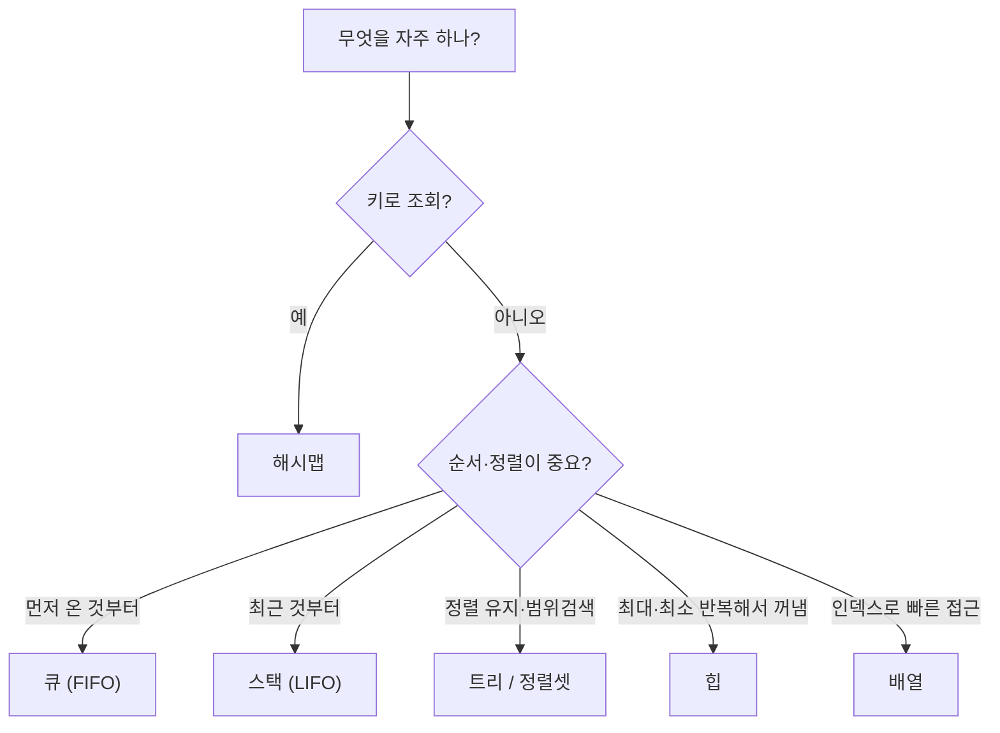
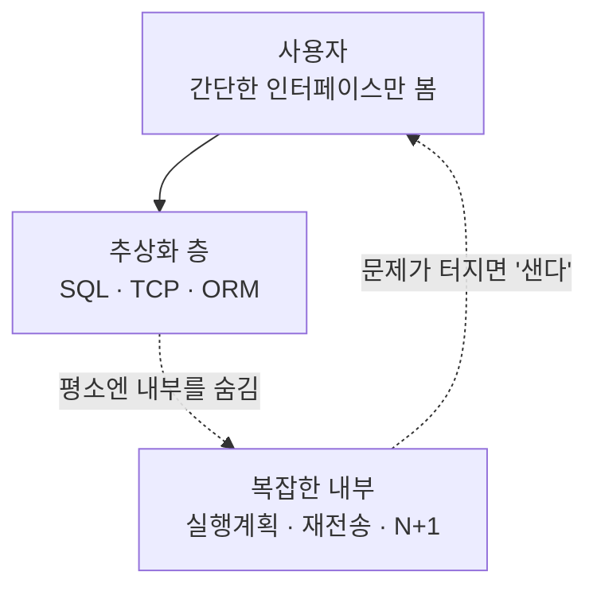

# CS 사고법: 알고리즘 추론 · 자료구조 선택 · 추상화의 명암

> **목적**: "언제 어떤 자료구조/변수를 쓸지" 추론하는 힘 + **추상화의 강점과 약점**을 균형 있게 이해.
> **관점**: 추상화는 강력하지만 공짜가 아니다. 강점과 한계를 함께 말할 수 있어야 한다. (→ trade-off 사고)
> **관련**: [../engineering-concepts-map.md](../engineering-concepts-map.md) · [../interview/explain-your-code.md](../interview/explain-your-code.md)

---

## 0. 큰 그림 — 왜 어떤 코드는 1초, 어떤 코드는 10분일까

똑같은 결과를 내는 두 프로그램인데, 하나는 눈 깜짝할 새 끝나고 하나는 몇 분을 잡아먹는다. 대개 그 차이는 **어떤 자료구조·알고리즘을 골랐는가**에서 갈린다.

좋은 개발자는 코드를 "돌아가게" 짜는 걸 넘어 **"왜 이 자료구조를, 왜 이 방식으로"**를 추론한다. 그 추론의 두 축이 (1) **효율성 분석(Big-O)** 과 (2) **자료구조·변수 선택**이다. 그리고 이 모든 걸 편하게 해주는 게 **추상화**인데 — 추상화는 복잡도를 숨겨 생산성을 주지만, **"모든 비자명한 추상화는 샌다(leaky)"**. 그래서 강점과 약점을 같이 알아야 한다.

---

# 1부. 알고리즘 추론 — Big-O

## 1. Big-O란

**Big-O 표기**: 입력 크기 n이 커질 때 **연산 횟수(또는 메모리)가 얼마나 빨리 증가하는가**를 나타내는 척도. 실제 시간(초)이 아니라 **증가율(scale)**을 본다.

- 왜: n=10에선 다 빠르다. **n=100만일 때 누가 살아남나**를 보려는 것.
- 보통 **최악의 경우(worst case)**를 기준으로 말한다.

## 2. 자주 나오는 복잡도 (빠른 순)

| 표기 | 이름 | 예 | 체감 |
|------|------|-----|------|
| O(1) | 상수 | 해시맵 조회, 배열 인덱스 접근 | 항상 즉시 |
| O(log n) | 로그 | 이진 탐색, 균형 트리 | 매우 좋음 |
| O(n) | 선형 | 배열 전체 순회 | 무난 |
| O(n log n) | 선형로그 | 좋은 정렬(병합·퀵) | 정렬의 현실적 한계 |
| O(n²) | 제곱 | 이중 반복(버블 정렬) | n 커지면 위험 |
| O(2ⁿ)·O(n!) | 지수·팩토리얼 | 완전탐색, 순열 | 사실상 사용 불가 |

## 3. 추론하는 법
- **입력 크기 n을 먼저 정의**한다(배열 길이? 사용자 수?).
- **반복이 몇 겹인가**: 한 겹 O(n), 두 겹 중첩 O(n²).
- **반씩 줄어드나**: 이진 탐색·분할정복 → O(log n) 요소.
- **공간복잡도도** 같이: 속도를 위해 메모리를 더 쓰는 trade-off(예: 캐싱).

**핵심 요약**: Big-O = 입력이 커질 때의 증가율. 반복 겹수·분할 여부로 추론하고, 최악의 경우로 말한다.

`참조`: [Big-O Cheat Sheet](https://www.bigocheatsheet.com/) · [위키백과: 점근 표기법](https://ko.wikipedia.org/wiki/점근_표기법)

---

# 2부. 언제 어떤 자료구조·변수를 쓸까

## 4. 자료구조 선택 가이드

접근 패턴이 선택을 결정한다. "무엇을 자주 하는가?"를 먼저 물어라.

| 자료구조 | 강점(빠른 연산) | 약점 · **숨은 함정(겉보기와 다름)** | 언제 쓰나 |
|----------|------------------|------|-----------|
| **배열(Array)** | 인덱스 접근 O(1) | 중간 삽입·삭제 O(n) · **크기 고정 → 초과 시 통째 복사** | 개수·접근 패턴이 정해져 있을 때 |
| **동적 배열/리스트** | 끝 추가 분할상환 O(1) | 중간 삽입 O(n) · **용량 초과 시 재할당·복사(숨음)** | 순서 있는 가변 목록 |
| **연결 리스트** | 앞/중간 삽입·삭제 O(1) | **조회 O(n)·캐시 미스·노드 메모리** — "O(1) 삽입"에 속기 쉬움 | 앞쪽 삽입·삭제 잦을 때(실은 드묾) |
| **해시맵/셋** | 조회·삽입·삭제 평균 O(1) | **최악 O(n)** · 순서 없음 · 나쁜 hashCode면 충돌 · **rehash 비용** · 메모리↑ | **키로 빠른 조회**, 중복 제거 |
| **스택(LIFO)** | push/pop O(1) | 임의 접근 불가 · **Java `Stack`은 레거시 → `ArrayDeque`** | 되돌리기, 재귀·괄호 검사 |
| **큐(FIFO)** | enqueue/dequeue O(1) | 임의 접근 불가 · **`LinkedList` 큐는 느림 → `ArrayDeque`** | 순서 처리, BFS, 작업 대기열 |
| **트리(균형 BST)** | 정렬 유지 + 탐색 O(log n) | **O(1)이 아님(log n)** · 비교 비용 · 구현 복잡 | **정렬 상태 유지 + 범위 검색** |
| **힙(Heap)** | 최소/최대 O(1) 조회 | **전체 정렬 아님**(부분 순서) · 임의 원소 검색 O(n) | 우선순위 큐, top-K |

> 💧 "숨은 함정" 칸이 곧 **새는 추상화**(7장) — 깔끔한 인터페이스가 가린 **진짜 비용**이다. 겉보기 O(1)에 속지 말 것.

**빠른 판단 규칙**
- "키로 조회가 잦다" → **해시맵**
- "순서대로 처리" → **큐**, "최근 것부터" → **스택**
- "정렬을 유지하며 삽입·범위검색" → **트리/정렬셋**
- "가장 큰/작은 것 반복해서 꺼냄" → **힙**
- "인덱스로 빠르게 접근, 크기 안정" → **배열**

**결정 트리로 한눈에**



*(도식 설명: '무엇을 자주 하나'로 갈라진다 — 키로 조회면 해시맵, 순서 처리면 큐/스택, 정렬·범위검색이면 트리, 최대·최소 반복이면 힙, 인덱스 접근이면 배열을 고른다.)*

> ☕ **자바 클래스·import 매핑**(`ArrayList`·`HashMap`·`ArrayDeque` + import 문)은 → [data-structures-java.md](data-structures-java.md).

## 5. 변수·원시 타입 선택 (언제 어떤 타입)

- **정수 크기**: 값 범위가 크면 `int`(약 21억)로 부족 → `long`. **오버플로**는 흔한 버그.
- **실수 정밀도**: `float`/`double`은 **근사값** → 돈 계산엔 부적합, `BigDecimal`(Java) 같은 정밀 타입.
- **불변 vs 가변**: 불변(immutable)은 안전·동시성에 유리, 가변은 성능. (예: Java `String` 불변)
- **널 가능성**: null을 허용할지 → `Optional` 등으로 명시하면 NPE 예방.
- **선택 기준**: "이 변수가 가질 수 있는 값의 **범위·정밀도·불변성·null 여부**"를 먼저 생각.

**핵심 요약**: 자료구조·타입은 "무슨 연산이 잦은가 + 값의 범위·정밀도"로 고른다. 접근 패턴이 자료구조를, 값의 성질이 타입을 결정한다.

`참조`: [Big-O Cheat Sheet – Data Structures](https://www.bigocheatsheet.com/) · [HackerEarth – Big-O & 자료구조](https://www.hackerearth.com/practice/notes/big-o-cheatsheet-series-data-structures-and-algorithms-with-thier-complexities-1/)

---

# 3부. 추상화의 강점과 약점

## 6. 추상화의 강점

**추상화(abstraction)**: 복잡한 내부를 숨기고 **핵심 인터페이스만** 노출하는 것. (예: `list.sort()` 하나로 정렬 — 내부 알고리즘은 몰라도 됨)

| 강점 | 설명 |
|------|------|
| **복잡도 관리** | 세부를 숨겨 큰 그림에 집중 |
| **생산성** | 매번 바닥부터 안 짜도 됨(라이브러리·API) |
| **재사용·협업** | 인터페이스만 맞추면 팀이 병렬 작업 |
| **변경 격리** | 내부 구현을 바꿔도 사용부는 그대로 |

→ 시스템이 복잡할수록 추상화에 **더 의존**할 수밖에 없다.

### 왜 복잡할수록 더 의존하나 (이유)
취향이 아니라 **뇌의 한계 + 구조적 폭발** 때문에 불가피하다.

1. **작업기억 한계(7±2)**: 사람이 동시에 머리에 올릴 수 있는 "덩어리"는 몇 개뿐. 부품이 많을수록 세부를 **한 개념으로 압축**해야 담긴다. (`list.sort()` = 정렬을 1덩어리로)
2. **상호작용은 N² 폭발**: 부품 N개면 얽힘은 약 N². 캡슐화로 내부를 숨겨 **따져야 할 얽힘을 잘라야** 한다.
3. **층(layer) 위에 서기**: `HashMap`·TCP·JVM·GC를 다시 검증하지 않고 믿고 쌓는다. 탑이 높을수록 **아래층을 안 뜯어보는 신뢰**에 의존.
4. **분업(팀)**: 팀이 병렬로 일하려면 **인터페이스만 합의**하고 내부는 서로 몰라야 한다.

> ☕ 자바 렌즈: 큰 앱 = 클래스 수천 개. 각각을 `interface` 뒤 블랙박스로 취급해야 산다. 코드가 클수록 라이브러리·인터페이스에 더 기댄다. (비유: 오두막은 못 하나까지 알지만, 초고층 빌딩은 아무도 모든 볼트를 모른다 — 표준 인터페이스 덕에 선다.)

### 관점: 추상화 = "사람 친화(자연어 쪽)로 끌어올리기"
추상화는 설명의 수준을 **기계 세부 → 사람 개념**으로 올린다. `list.sort()`는 거의 영어("정렬해")처럼 읽힌다. 프로그래밍 언어의 역사가 그 방향이다:

```
기계어(0101) → 어셈블리 → C → Java → 고수준 API → (지금) 자연어 프롬프트(LLM)
← 기계에 가까움                                   사람/자연어에 가까움 →
```

→ "복잡함을 사람이 다룰 수 있는 **친숙한 개념으로 번역**하는 것"이 추상화다. (LLM에게 자연어로 시키는 건 추상화의 끝판.)

> ⚠️ **단, 친숙함이 기계 현실을 완전히 가리진 못한다.** 예: `list.get(i)`는 O(1)처럼 친숙해 보이지만 **`LinkedList`면 O(n)** — 숨긴 비용이 샌다. 그래서 추상화는 "몰라도 되게" 해주지만, **성능·한계가 중요할 땐 아래층을 알아야** 한다. (→ 7장 새는 추상화, [data-structures-java.md](data-structures-java.md))

## 7. 추상화의 약점 — 새는 추상화 (Law of Leaky Abstractions)

> **Joel Spolsky (2002)**: **"모든 비자명한 추상화는, 어느 정도 샌다(All non-trivial abstractions, to some degree, are leaky)."**

추상화가 숨기려던 **내부 세부가 결국 밖으로 새어 나와**, 사용자가 그 내부를 알아야만 문제를 풀 수 있게 되는 현상.



*(도식 설명: 추상화는 평소 복잡한 내부를 숨겨 사용자가 간단한 인터페이스만 쓰게 해준다. 하지만 성능·오류 문제가 터지면 그 내부 세부가 밖으로 새어 나와, 결국 사용자가 내부를 알아야 해결할 수 있다.)*

**대표 사례**
- **TCP**: "신뢰적 연결"을 추상화하지만, 재전송이 생기면 **성능이 요동**치고 연결이 끊기기도 → 내부가 샌다.
- **SQL**: "무엇을 원하는지"만 쓰면 되지만, 논리적으로 같은 쿼리가 **수천 배 느릴** 수 있음 → 실행계획(내부)을 알아야 함.
- **2차원 배열 순회**: 가로/세로 순서에 따라 **캐시 미스**로 속도가 크게 다름 → 메모리 배치(내부)가 샌다.
- **컬렉션 인터페이스**: `List.get(i)`가 `ArrayList`면 O(1), `LinkedList`면 O(n) → 같은 인터페이스라도 **내부 구현이 성능으로 샌다**. (→ [data-structures-java.md](data-structures-java.md))
- **ORM**: 객체로 DB를 다루지만, N+1 쿼리 문제처럼 결국 **SQL(내부)**을 알아야 함.

**핵심 함정**
> "추상화는 **일하는 시간**은 줄여주지만, **배우는 시간**은 줄여주지 않는다."
> 즉, 편하게 쓰다가도 문제가 터지면 **결국 커튼 뒤(내부)를 배워야** 한다.

**과한 추상화(over-abstraction)의 약점**
- 계층이 너무 많으면 오히려 **이해·디버깅이 어려움**.
- 성능 오버헤드(간접 호출·래핑).
- YAGNI 위반: 필요 없는 유연성을 위한 추상화는 복잡도만 늘림.

## 8. 균형 잡기 (실전 지침)
- **평소엔 추상화를 신뢰**하되, **성능·버그가 걸리면 한 층 아래를 열어본다.**
- 자신이 쓰는 추상화의 **비용(내부에서 무슨 일이 일어나는지)**을 대략 알아둔다.
- 추상화를 **만들 때**: 꼭 필요한 만큼만(YAGNI), 새는 부분을 문서화.

**핵심 요약**: 추상화는 복잡도를 숨겨 생산성을 주지만 **완벽히 숨기진 못한다(leaky)**. 강점을 누리되 내부를 알아둬야 문제를 푼다.

`참조`: [Joel Spolsky – The Law of Leaky Abstractions](https://www.joelonsoftware.com/2002/11/11/the-law-of-leaky-abstractions/) · [Wikipedia – Leaky abstraction](https://en.wikipedia.org/wiki/Leaky_abstraction)

---

## 9. CS 지식 응용 Q&A (실전 예시)

> "CS 지식으로 문제를 이해·해결한다"의 대표 예. 표면 현상 뒤의 **원리(내부)**를 알아야 답이 나온다 — 곧 *새는 추상화*를 들여다보는 연습.

**Q1. 게임 서버의 Thread 수는 CPU Core 수에 비례할까?**
- **비례하지 않는다(경우에 따라).** CPU를 계속 쓰는 작업(**CPU-bound**)이면 스레드가 코어 수를 넘어봤자 **컨텍스트 스위칭 비용**만 늘어 최적은 ≈코어 수.
- 하지만 게임 서버는 네트워크·디스크 **대기(I/O-bound)**가 많아, 대기 중 스레드는 CPU를 안 쓰므로 **코어보다 훨씬 많이** 둬도 이득. → 워크로드가 결정한다(요즘은 비동기 I/O·스레드풀).

**Q2. 렌더링에서 Texture 크기가 2의 거듭제곱인 이유는?**
- **밉맵**을 만들 때 반씩(÷2) 줄이는데, 2의 거듭제곱이라야 끝까지 **딱 나눠떨어짐**.
- GPU가 주소를 **비트 연산(shift)**으로 계산·정렬해 **메모리 접근이 빠름**, 타일링(반복)도 깔끔.
- (요즘 GPU는 NPOT도 지원하지만, 밉맵·성능 때문에 여전히 2의 거듭제곱 선호.)

**Q3. 남은 메모리보다 작은 공간을 할당하는데 왜 Out of Memory?**
- **메모리 단편화(fragmentation)**. 남은 총량은 충분해도 **연속된(contiguous)** 빈 공간이 없으면, 요청한 크기의 **한 덩어리**를 못 잡아 실패.
- 그 외: 32비트 **주소공간 한계**, 프로세스별 메모리 제한, 가상↔물리 매핑 문제.

**Q4. 부동소수점 연산인데 같은 식의 결과가 왜 달라질까?**
- 부동소수점은 **근사값**이라 매 연산에 **반올림 오차**가 있고, 덧셈이 **결합법칙이 안 성립** → `(a+b)+c ≠ a+(b+c)`.
- 그래서 **연산 순서**가 바뀌면(컴파일러 최적화, SIMD 병렬합산, **FMA**, float↔double 정밀도 차이) 결과가 미세하게 달라진다.

**핵심 요약**: 네 문제 모두 "겉보기"가 아니라 **내부(스케줄링·GPU 메모리·힙 단편화·IEEE754)**를 알아야 풀린다. 이게 CS를 배우는 이유.

---

## 한 줄 용어 사전 (한↔영)

| 한국어 | English | 뜻 |
|--------|---------|-----|
| 시간복잡도 | time complexity | 입력 대비 연산 증가율(Big-O) |
| 최악의 경우 | worst case | 가장 느린 상황 기준 |
| 분할상환 | amortized | 평균적으로 본 비용(가끔 비쌈) |
| 해시맵 | hash map | 키→값 O(1) 조회 구조 |
| 이진탐색트리 | BST | 정렬 유지 + O(log n) 탐색 |
| 힙 | heap | 최소/최대 우선 구조 |
| 오버플로 | overflow | 타입 범위 초과 버그 |
| 불변 | immutable | 생성 후 못 바꿈(안전) |
| 추상화 | abstraction | 내부를 숨기고 인터페이스만 노출 |
| 새는 추상화 | leaky abstraction | 내부 세부가 새어 나오는 현상 |

---

## NotebookLM 활용 팁
- "자료구조 선택 기준을 결정 트리(flowchart)로 만들어줘"
- "Big-O 복잡도별로 예시 알고리즘 5문항 퀴즈"
- "새는 추상화 사례(TCP·SQL·ORM)를 각각 3줄로 설명"
- "추상화의 강점과 약점을 면접 답변용으로 정리(WHAT·HOW·TRADE-OFF)"

## 검색 기록 (2026-07-15)
- 쿼리: `Law of Leaky Abstractions Joel Spolsky abstraction strengths weaknesses tradeoffs` → [Joel on Software](https://www.joelonsoftware.com/2002/11/11/the-law-of-leaky-abstractions/), [Wikipedia](https://en.wikipedia.org/wiki/Leaky_abstraction). "모든 비자명한 추상화는 샌다", TCP·SQL·2D배열·ORM 사례, "일하는 시간은 줄이나 배우는 시간은 안 줄인다" 확인.
- 쿼리: `Big-O cheat sheet data structures when to use array vs hashmap vs tree` → [bigocheatsheet.com](https://www.bigocheatsheet.com/), HackerEarth. 자료구조별 평균/최악 복잡도, 선택 기준 확인.

## 전체 참조 출처
- Joel Spolsky – The Law of Leaky Abstractions — https://www.joelonsoftware.com/2002/11/11/the-law-of-leaky-abstractions/
- Wikipedia – Leaky abstraction — https://en.wikipedia.org/wiki/Leaky_abstraction
- Big-O Cheat Sheet — https://www.bigocheatsheet.com/
- HackerEarth – Big-O & 자료구조 — https://www.hackerearth.com/practice/notes/big-o-cheatsheet-series-data-structures-and-algorithms-with-thier-complexities-1/

_작성: 2026-07 · 개념·추론 정리. 세부 구현·언어별 타입은 공식 문서 확인._
