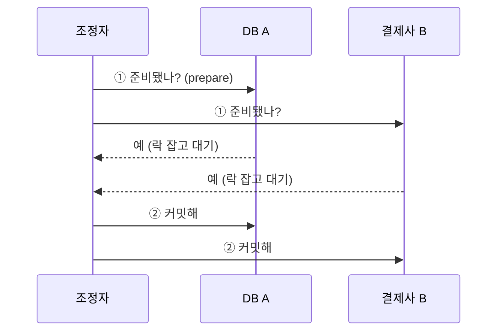
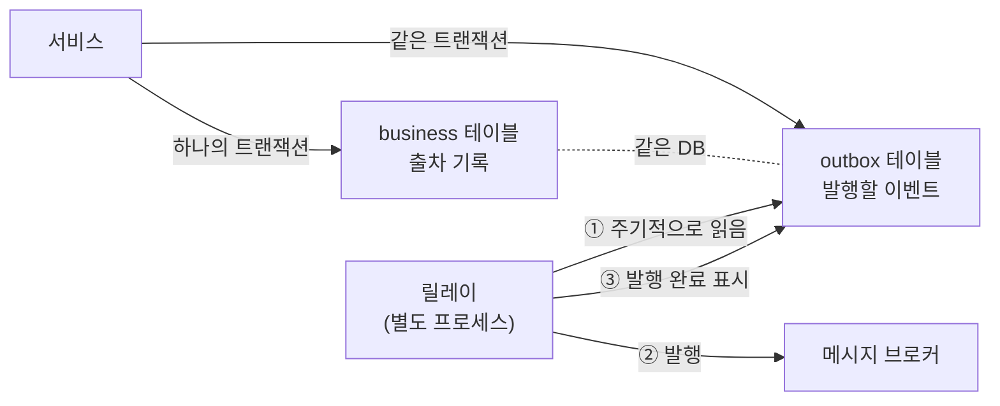

# 딥다이브 — 분산 정합성: 원자성을 포기한 대가 (멱등성 · Outbox · Saga)

> 기반: **Gray, *Notes on Data Base Operating Systems* (1978, 2PC)** · **Gilbert & Lynch, *Brewer's Conjecture...* (2002, CAP 증명)** · **Garcia-Molina & Salem, *Sagas* (SIGMOD 1987)** · **Richardson, *Transactional Outbox* (microservices.io)**
> 형식: 30초 직관 → **왜 이 문제가 생겼나** → 원리 → 트레이드오프.
> **선행**: 단일 노드 트랜잭션은 [../lang/java/deep-spring-transaction.md](../lang/java/deep-spring-transaction.md), 분산 락은 [deep-redis-cache-and-lock.md](deep-redis-cache-and-lock.md). 학습 순서는 [../backend-roadmap.md](../backend-roadmap.md).

---

## 0. 30초 직관 — 결제는 됐는데 주문이 없다

```java
@Transactional
public void pay(Order o) {
    orderRepository.save(o);      // ① 우리 DB
    paymentGateway.charge(o);     // ② 외부 결제사  ← 여기서 타임아웃
}
```

②에서 **타임아웃**이 났다. 트랜잭션은 롤백되고 주문은 사라진다. **그런데 결제사 쪽은?**

> **타임아웃은 "실패"가 아니다. "모른다"이다.**
>
> 결제가 안 된 것일 수도, **됐는데 응답만 유실된 것**일 수도 있다. 우리는 구분할 수 없다.

여기서 재시도하면 **이중과금**이 난다. 재시도하지 않으면 **돈은 나갔는데 주문이 없는** 상태가 된다. 어느 쪽도 안전하지 않다.

**이 노트 전체가 이 한 상황에서 나온다.** `@Transactional`은 하나의 DB 안에서만 원자성을 준다. 시스템 경계를 넘는 순간 그 보장이 사라지고, 우리는 **원자성을 포기한 채 다른 방법으로 정합성을 만들어야** 한다.

---

## 1. 역사 — 원자성을 지키려던 시도와 그 포기

### 1-1. 2PC (1978) — "그럼 모두를 묶어버리자"

Jim Gray가 정리한 **2단계 커밋(Two-Phase Commit)** 은 정직한 해법이다. **조정자(coordinator)** 가 모든 참여자에게 두 번 묻는다.



*(도식 설명: 조정자가 먼저 모든 참여자에게 "커밋할 준비가 됐는지" 묻고, 전원이 동의하면 두 번째 라운드에서 실제 커밋을 지시한다. 준비 응답을 보낸 참여자는 조정자의 결정이 올 때까지 자원을 잠근 채 기다려야 한다.)*

**왜 안 쓰게 됐나 — 세 가지 치명상**

1. **블로킹**: "예"라고 답한 참여자는 조정자의 결정이 올 때까지 **락을 쥐고 기다린다.** 조정자가 그 사이에 죽으면? **영원히 못 푼다.**
2. **조정자가 단일 장애점**이다.
3. **참여자가 지원해야 한다.** 외부 결제사 API가 "prepare 단계"를 제공할 리 없다.

3번이 결정적이다. **남의 회사 API에는 2PC를 걸 수 없다.**

### 1-2. CAP (2000/2002) — 포기는 선택이 아니라 사실

Eric Brewer가 2000년에 추측으로 제시하고, **Gilbert & Lynch가 2002년에 증명**했다. 흔히 "일관성·가용성·분할내성 중 둘만 고른다"로 알려져 있는데, **이 요약이 오해를 만든다.**

> **정확한 진술**: 네트워크 **분할(P)은 고르는 게 아니라 일어나는 것**이다. 케이블은 끊어지고 패킷은 유실된다.
> 우리가 실제로 고르는 건 **분할이 일어났을 때** 일관성을 지킬 것인가(요청 거부) 가용성을 지킬 것인가(낡은 값이라도 응답)뿐이다.

**그래서 "CP를 선택했다"는 말은 성립하지만 "CA 시스템"은 분산 환경에 존재하지 않는다.**

### 1-3. Saga (1987) — 40년 전에 이미 나온 답

[deep-spring-transaction.md](../lang/java/deep-spring-transaction.md) 5장에서 본 그 논문이다. Garcia-Molina & Salem은 **긴 트랜잭션(LLT)** 문제를 이렇게 풀었다:

> 긴 트랜잭션 하나를 **짧은 트랜잭션의 연속**으로 쪼갠다. 실패하면 이미 커밋된 것들을 **보상 트랜잭션(compensating transaction)** 으로 되돌린다.

```
정상:  T1 → T2 → T3 → T4
실패:  T1 → T2 → T3 ✗
       C3 ← C2 ← C1        (보상 트랜잭션 역순 실행)
```

> 🎭 **이 논문은 마이크로서비스를 상상조차 하지 않고 쓰였다.** 1987년의 문제는 **단일 DB 안의 긴 배치**였다. 그런데 40년 뒤 분산 정합성의 표준 해법 이름이 됐다. 문제의 형태가 같았기 때문이다 — **"원자성을 포기하고 보상으로 대신한다."**

**핵심 전환**: 2PC는 원자성을 **지키려는** 시도였고, Saga는 **포기하고 사후 수습하는** 전략이다. 현대 분산 시스템은 대부분 후자를 택했다.

---

## 2. dual write 문제 — 모든 것의 출발점

DB에 저장하고 메시지를 발행해야 한다. 두 개의 시스템, 하나의 트랜잭션은 불가능하다.

```java
@Transactional
public void completeExit(Exit e) {
    exitRepository.save(e);           // ① DB
    messageBroker.publish(e);         // ② 브로커  ← 서로 다른 시스템
}
```

**순서를 어떻게 바꿔도 구멍이 남는다:**

| 순서 | 사이에서 죽으면 |
|---|---|
| DB 먼저 → 발행 | DB엔 있는데 **이벤트가 안 나감** (후속 시스템이 모름) |
| 발행 먼저 → DB | 이벤트는 나갔는데 **DB엔 없음** (유령 이벤트) |
| `@Transactional` 안에 발행 | 롤백돼도 **이미 나간 메시지는 못 되돌림** |

이걸 **dual write 문제**라고 한다. **두 시스템을 원자적으로 갱신할 방법이 없다**는, 피할 수 없는 사실이다.

> ⚠️ 특히 세 번째가 흔한 착각이다. `@Transactional` 안에서 발행하면 안전할 것 같지만, **브로커는 스프링 트랜잭션에 참여하지 않는다.** 롤백은 DB만 되돌린다.

---

## 3. exactly-once는 왜 원리적으로 불가능한가

"딱 한 번만 처리"는 모두가 원하지만, **네트워크 위에서는 만들 수 없다.**

이유는 0장에서 이미 봤다:

> **요청을 보내고 응답을 못 받았을 때, "처리가 안 됨"과 "처리는 됐는데 응답이 유실됨"을 구분할 방법이 없다.**

선택지는 둘뿐이다:

| 방식 | 재시도 | 결과 |
|---|---|---|
| **at-most-once** | 안 함 | 유실 가능. "돈은 안 빠지지만 주문이 안 될 수 있다" |
| **at-least-once** | 함 | 중복 가능. "주문은 되지만 이중과금 위험" |

**exactly-once는 이 둘 사이 어디에도 없다.** 그런데 현실에는 필요하다. 그래서 나온 게 이 조합이다:

```
at-least-once (재시도) + 멱등성 (중복이 와도 결과가 같음)
        = effectively-once (사실상 한 번)
```

> **발상의 전환**: "중복이 오지 않게 한다"를 포기하고, **"중복이 와도 괜찮게 만든다"** 로 목표를 바꾼다.
> 통제할 수 없는 것(네트워크)을 통제하려 하지 않고, 통제할 수 있는 것(내 처리 로직)을 바꾼다.

---

## 4. 멱등성 설계 — 실무의 핵심

**멱등(idempotent)** = 몇 번 실행해도 결과가 같음. `x = 5`는 멱등이고 `x += 1`은 아니다.

### 4-1. 멱등키를 무엇으로 잡나

| 후보 | 평가 |
|---|---|
| **클라이언트 생성 UUID** | ✅ 가장 안전. 재시도 시 **같은 키를 다시 보내는 게 핵심** |
| 업무 키 (주문번호 등) | ⚠️ 자연스럽지만, "같은 주문의 정당한 두 번째 결제"를 막아버릴 수 있음 |
| 요청 본문 해시 | ⚠️ 타임스탬프 한 글자만 달라도 다른 키가 됨 |

> **가장 흔한 실수**: 재시도할 때 **키를 새로 만드는 것.** 그러면 멱등성이 통째로 무의미해진다.
> 키는 **"이 논리적 시도 하나"** 를 식별해야지, "이 HTTP 요청 하나"를 식별하면 안 된다.

### 4-2. 동시에 같은 키로 두 요청이 오면?

여기가 진짜 어려운 부분이다. "먼저 조회하고 없으면 처리"는 **경쟁 상태**가 있다:

```
요청A: 키 조회 → 없음 ─────────→ 처리 → 저장
요청B:      키 조회 → 없음 ──→ 처리 → 저장     ← 둘 다 처리됨
```

**해법: 조회하지 말고, 먼저 쓰고 실패를 이용한다.**

```java
try {
    idempotencyRepository.insert(key, IN_PROGRESS);   // 유니크 제약
} catch (DuplicateKeyException e) {
    return waitOrReturnPrevious(key);                 // 이미 누가 잡음
}
// 여기 도달한 요청은 단 하나임이 DB가 보장
```

> **DB 유니크 제약이 곧 락이다.** [deep-redis-cache-and-lock.md](deep-redis-cache-and-lock.md) 6장에서 본 결론과 정확히 같다 — **최종 저장 지점에서 검증한다.** Redis 락으로 거르는 건 최적화일 뿐, 보증은 DB가 한다.

### 4-3. 보관 기간

멱등키를 영원히 보관할 수는 없다. 그런데 **너무 일찍 지우면 늦게 도착한 재시도가 중복 처리된다.**

- 실무 기준: **재시도 정책의 최대 기간보다 넉넉히 길게** (보통 24시간~7일)
- 정산·결제처럼 되돌리기 어려운 도메인은 더 길게

### 4-4. HTTP의 멱등성과 다르다

`GET`·`PUT`·`DELETE`가 "멱등 메서드"라고 배운다([qna/network.md](qna/network.md)). 그건 **명세상의 약속**이지 구현이 보장해주는 게 아니다. `PUT`을 구현하면서 내부에서 카운터를 증가시키면 그건 멱등이 아니다. **멱등성은 메서드가 아니라 내가 만드는 것이다.**

---

## 5. Outbox 패턴 — dual write를 없애는 방법

2장의 문제를 우아하게 푼다. **핵심 아이디어 한 줄:**

> **메시지를 브로커에 보내지 말고, 같은 DB의 테이블에 저장하라.** 그러면 하나의 트랜잭션이다.



*(도식 설명: 서비스는 업무 데이터와 발행할 이벤트를 같은 데이터베이스의 두 테이블에 하나의 트랜잭션으로 저장한다. 둘 다 같은 DB이므로 원자성이 보장된다. 별도의 릴레이 프로세스가 outbox 테이블을 주기적으로 읽어 브로커에 발행하고, 발행 완료를 표시한다.)*

```java
@Transactional
public void completeExit(Exit e) {
    exitRepository.save(e);
    outboxRepository.save(new OutboxEvent("EXIT_COMPLETED", toJson(e)));
    // 두 테이블 = 같은 DB = 하나의 트랜잭션 = 원자적  ✅
}
```

### 그런데 릴레이가 두 번 발행하면?

발행한 뒤 "발행 완료" 표시를 하기 전에 릴레이가 죽으면, 다시 읽어서 **또 발행한다.**

**이건 버그가 아니라 설계다.** Outbox는 **at-least-once를 보장**한다. 중복은 **소비자 쪽 멱등성**(4장)이 흡수한다.

> **두 패턴은 한 세트다.** Outbox는 "유실 없음"을, 멱등성은 "중복 무해"를 담당한다.
> 둘을 합쳐야 3장의 effectively-once가 완성된다. 하나만 쓰면 반쪽이다.

### 릴레이 구현 두 가지

| 방식 | 방법 | 특징 |
|---|---|---|
| **폴링** | 주기적으로 `SELECT ... WHERE published = false` | 단순. 지연 존재. 인덱스 필수 |
| **CDC** | DB 트랜잭션 로그를 읽음 (Debezium 등) | 지연 적고 DB 부하 낮음. 인프라 복잡 |

---

## 6. 보상이 불가능할 때 — 전진 복구

Saga는 실패 시 보상 트랜잭션으로 되돌린다. **그런데 되돌릴 수 없는 것들이 있다:**

- 이미 나간 **이메일·SMS**
- 이미 **열린 차단기** (차량이 이미 나갔다)
- 이미 승인된 **결제** (취소는 "되돌리기"가 아니라 **새로운 환불 거래**다)

> **중요한 구분**: 보상은 **롤백이 아니다.** 롤백은 흔적이 없지만, 보상은 **새로운 사실을 하나 더 만든다.**
> 결제 취소를 하면 "결제됨"과 "환불됨" 두 기록이 남는다. 회계상 이게 오히려 맞다.

**되돌릴 수 없으면 전진 복구(roll-forward)** 를 쓴다 — 뒤로 못 가니 **앞으로 나아가서** 정합을 맞춘다.

| 상황 | 후진(보상) | 전진 |
|---|---|---|
| 결제 후 재고 부족 | 결제 환불 | 재고를 확보해서 배송 |
| 차단기 열린 뒤 요금 계산 실패 | 불가 | **미납 처리 후 사후 정산** |
| 이메일 발송 후 주문 실패 | 불가 | **정정 안내 메일 추가 발송** |

**차단기 예시가 이 개념의 핵심을 보여준다.** 차가 이미 나갔으면 되돌릴 방법이 없다. 그래서 **"미납"이라는 새 상태를 만들어 앞으로 나아간다.** 되돌릴 수 없는 물리적 동작이 있는 시스템은 애초에 보상이 아니라 전진으로 설계해야 한다.

---

## 7. 정리 — 도구 선택 지도

| 상황 | 도구 |
|---|---|
| 하나의 DB 안 | `@Transactional` (그냥 쓰면 됨) |
| DB + 메시지 발행 | **Outbox** |
| 외부 API 호출 (결제 등) | **멱등키** + 재시도 |
| 여러 서비스에 걸친 업무 흐름 | **Saga** + 보상/전진 |
| 여러 서버의 선착순 | 원자적 연산(`INCR`) + **DB 유니크 제약** |
| 진짜로 원자성이 필요 | **설계를 바꿔서 하나의 DB로 모아라** |

> **마지막 줄이 제일 중요하다.** 분산 정합성 도구는 전부 **차선책**이다.
> 원자성이 꼭 필요한 데이터는 **애초에 같은 트랜잭션 경계 안에 두는 게** 최선이고,
> 서비스 분리 경계는 정확히 그 기준으로 그어야 한다.

---

## 8. 3단 요약 (암기용)

### Q1. 결제 API 호출 중 타임아웃이 났다. 재시도해야 하나?

- **① 결론 · WHAT** **멱등키가 있으면 재시도하고, 없으면 재시도하면 안 된다.** 타임아웃은 실패가 아니라 **"모름"** 이기 때문이다.
- **② 원리 · HOW** 네트워크는 "처리 안 됨"과 "처리됐는데 응답 유실"을 **구분할 수단을 주지 않는다.** 그래서 exactly-once는 원리적으로 불가능하다. 현실 해법은 **at-least-once(재시도) + 멱등성(중복 무해) = effectively-once**다. 멱등키는 클라이언트가 만든 UUID로 잡고, **재시도할 때 반드시 같은 키를 다시 보내야 한다.**
- **③ 확장 · TRADE-OFF** 멱등키는 공짜가 아니다 — **저장소·보관 기간·동시 요청 경쟁**을 관리해야 한다. 동시에 같은 키가 오는 경우는 "조회 후 처리"로는 못 막고 **유니크 제약에 먼저 INSERT하고 실패를 이용**해야 한다. 보관 기간이 재시도 정책보다 짧으면 늦게 온 재시도가 중복 처리된다.

### Q2. DB 저장과 메시지 발행을 어떻게 원자적으로 하나?

- **① 결론 · WHAT** **못 한다.** 대신 **Outbox 패턴**으로 두 시스템 문제를 **한 DB 안의 두 테이블 문제**로 바꾼다.
- **② 원리 · HOW** 브로커는 스프링 트랜잭션에 참여하지 않으므로 순서를 어떻게 바꿔도 구멍이 남는다(**dual write 문제**). Outbox는 이벤트를 브로커 대신 **같은 DB의 `outbox` 테이블**에 업무 데이터와 함께 저장한다 — 같은 DB니까 원자적이다. 별도 릴레이가 그 테이블을 읽어 발행한다.
- **③ 확장 · TRADE-OFF** 릴레이가 발행 후 표시 전에 죽으면 **중복 발행**된다. 즉 Outbox는 **at-least-once만 보장**한다. 그래서 **소비자가 멱등해야 한다** — Outbox와 멱등성은 한 세트다. 그 외 비용은 릴레이라는 컴포넌트 추가, 폴링 지연, outbox 테이블 정리 작업이다.

### Q3. 2PC는 왜 안 쓰나?

- **① 결론 · WHAT** **블로킹·단일 장애점·참여자 지원 필요** 세 가지 때문. 특히 **외부 회사 API에는 애초에 걸 수 없다.**
- **② 원리 · HOW** 참여자가 "준비됨"을 답한 뒤에는 조정자의 결정이 올 때까지 **자원을 잠근 채 대기**해야 한다. 조정자가 그 사이 죽으면 참여자는 영원히 풀지 못한다. 게다가 결제사 API가 "prepare 단계"를 제공할 리 없다.
- **③ 확장 · TRADE-OFF** 그래서 현대 시스템은 **원자성을 지키려는 시도(2PC)를 포기하고, 포기한 뒤 수습하는 전략(Saga)** 으로 갔다. 대가는 **중간 상태가 외부에 노출된다는 것**이다 — 잠깐이지만 "결제됨, 배송 대기" 같은 어중간한 상태를 사용자가 볼 수 있다. 그걸 감수하는 대신 가용성과 확장성을 얻는다.

---

## 용어 사전

| 용어 | 뜻 |
|------|-----|
| dual write | 두 시스템을 원자적으로 갱신할 수 없는 근본 문제 |
| 2PC | 조정자가 준비·커밋 2단계로 묻는 분산 트랜잭션 프로토콜 |
| CAP | 분할 발생 시 일관성과 가용성 중 하나를 골라야 한다는 정리 |
| at-most-once / at-least-once | 재시도 안 함(유실 가능) / 재시도 함(중복 가능) |
| effectively-once | at-least-once + 멱등성으로 만든 사실상의 한 번 |
| 멱등(idempotent) | 몇 번 실행해도 결과가 같음 |
| 멱등키 | 논리적 시도 하나를 식별하는 키. 재시도 시 동일해야 함 |
| Outbox | 이벤트를 같은 DB 테이블에 저장해 원자성을 확보하는 패턴 |
| CDC | DB 트랜잭션 로그를 읽어 변경을 포착하는 방식 |
| Saga | 긴 트랜잭션을 짧은 것들로 쪼개고 보상으로 수습하는 전략 |
| 보상 트랜잭션 | 커밋된 작업을 되돌리는 **새로운** 트랜잭션 (롤백 아님) |
| 전진 복구 | 되돌릴 수 없을 때 앞으로 나아가 정합을 맞추는 방식 |

## 연결 지도
- **단일 노드 트랜잭션 (선행)**: → [../lang/java/deep-spring-transaction.md](../lang/java/deep-spring-transaction.md)
- **분산 락과 최종 검증 (선행)**: → [deep-redis-cache-and-lock.md](deep-redis-cache-and-lock.md)
- **JVM 안의 원자성**: → [deep-jmm.md](deep-jmm.md)
- **DB 격리수준·락**: → [qna/database.md](qna/database.md)
- **HTTP 메서드의 멱등성**: → [qna/network.md](qna/network.md)
- **통신 방식 (동기·비동기)**: → [web-communication.md](web-communication.md)
- **학습 순서**: → [../backend-roadmap.md](../backend-roadmap.md)

## 출처
- Gray, J. *Notes on Data Base Operating Systems.* 1978 — 2PC의 정리
- Gilbert, S. & Lynch, N. *Brewer's Conjecture and the Feasibility of Consistent, Available, Partition-Tolerant Web Services.* ACM SIGACT News, 2002 — CAP 증명
- Brewer, E. *CAP Twelve Years Later: How the "Rules" Have Changed.* IEEE Computer, 2012 — 본인의 오해 정정
- Garcia-Molina, H. & Salem, K. *Sagas.* ACM SIGMOD 1987 — https://dl.acm.org/doi/10.1145/38713.38742
- Richardson, C. *Pattern: Transactional outbox.* microservices.io — https://microservices.io/patterns/data/transactional-outbox.html
- Kleppmann, M. *Designing Data-Intensive Applications.* O'Reilly, 2017 — 9장(일관성과 합의)

_짧은 인용은 출처 표기. 패턴 구현은 스택·브로커에 따라 세부가 달라진다._
