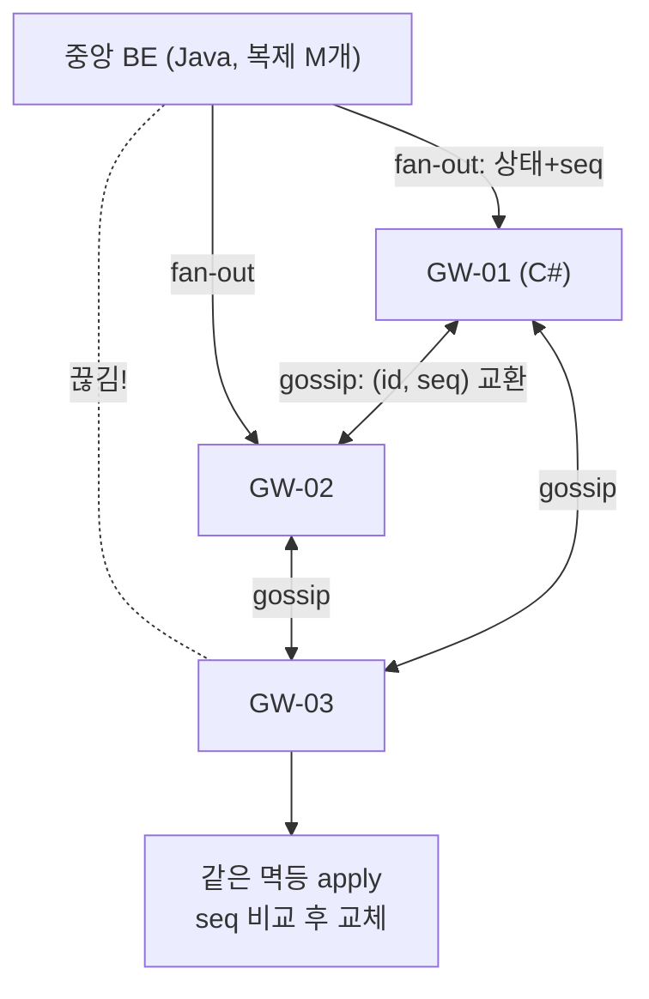

# 딥다이브 — gRPC 크로스랭귀지 멱등성 가이드: Java↔C# 통신, fan-out, peer 전파

> 기반: **gRPC 공식 문서 *Retry / Service Config*** · **gRPC 제안서 A6 *Client Retries* (재시도·헤징 설계)** · **Microsoft Learn *Transient fault handling with gRPC retries*** · **Demers et al., *Epidemic Algorithms for Replicated Database Maintenance* (PODC 1987, 가십의 원전)**
> 형식: 시나리오 → 커넥션의 실체 → 재시도 3층 → 멱등성 구축(코드) → fan-out → peer 전파 → 체크리스트.
> **선행**: 멱등성·Outbox의 원리는 [deep-distributed-consistency.md](deep-distributed-consistency.md), gRPC가 뭔지는 [web-communication.md](web-communication.md), 연결 유지 비용은 같은 문서 5장.

---

## 0. 30초 직관 — "차단기 열어라"를 두 번 보내면

무대는 실무에서 흔한 배치다:

```
[중앙 서버 · Java/Spring]  ──gRPC──▶  [현장 게이트웨이 · C#/.NET]  ──▶  차단기
```

중앙이 `OpenGate` RPC를 쐈는데 **타임아웃**이 났다. [분산 정합성 노트](deep-distributed-consistency.md)의 그 문장이 그대로 돌아온다 — **타임아웃은 실패가 아니라 "모름"이다.** 차단기가 안 열린 건지, 열렸는데 응답만 유실된 건지 구분할 수 없다.

- 재시도 안 하면 → 차가 못 나간다 (요금 낸 고객이 갇힘)
- 재시도하면 → 이미 열렸는데 또 명령이 간다. 차단기라 다행이지, **"요금 청구해라"였으면 이중과금**이다

여기에 문제가 하나 더 얹힌다. 중앙 서버를 **복제**하고, 게이트웨이가 **수십 개**이고, 정책 변경 하나를 **연결된 모든 프로세스에 전파(fan-out)** 해야 하며, 중앙이 끊겼을 땐 **게이트웨이끼리(peer)** 상태를 맞춰야 한다면?

> 이 노트의 결론을 미리 말하면: **모든 경로(재시도·fan-out·peer 전파)가 결국 하나의 설계로 수렴한다 —
> "받는 쪽의 멱등한 apply 함수 하나"를 만들고, 나머지는 전부 그 위에 얹는다.**

---

## 1. 커넥션의 실체 — 채널은 소켓이 아니다

### 1-1. 채널(Channel) = 커넥션 관리자

gRPC에서 클라이언트가 만드는 건 소켓이 아니라 **채널**이다. 채널은 내부에 HTTP/2 커넥션(들)을 관리하는 **상태 머신**이다:

```
IDLE → CONNECTING → READY ⇄ TRANSIENT_FAILURE(백오프 후 재접속) → SHUTDOWN
```

**작업 규칙 1: 채널은 재사용한다.** 호출마다 채널을 만들면 매번 TCP+TLS 핸드셰이크를 치른다. 채널은 앱 수명 동안 하나(대상 서버당)를 유지하고, 끊김·재접속은 채널이 알아서 한다.

```java
// Java — 앱 시작 시 한 번
ManagedChannel channel = ManagedChannelBuilder.forAddress("gateway-03", 5001)
    .keepAliveTime(30, TimeUnit.SECONDS)      // 유휴여도 30초마다 PING
    .keepAliveTimeout(5, TimeUnit.SECONDS)
    .enableRetry()                            // 2장의 재시도 정책 활성화
    .build();
```

```csharp
// C# — GrpcChannel도 동일하게 싱글턴으로
var channel = GrpcChannel.ForAddress("https://central:5001", new GrpcChannelOptions {
    HttpHandler = new SocketsHttpHandler {
        KeepAlivePingDelay   = TimeSpan.FromSeconds(30),
        KeepAlivePingTimeout = TimeSpan.FromSeconds(5),
        EnableMultipleHttp2Connections = true
    }
});
```

### 1-2. keepalive가 없으면 생기는 일

[web-communication.md](web-communication.md) 5-4장의 함정이 여기서 재현된다 — gRPC 연결은 **긴 연결**이므로 중간의 LB·방화벽·Nginx가 유휴 커넥션을 조용히 끊는다. 끊긴 걸 모르는 채 RPC를 쏘면 **첫 호출만 이상하게 실패**하는 미스터리가 된다. keepalive PING이 그 절단을 조기 감지하고 재접속시킨다. (단, 너무 짧게 잡으면 서버가 `GOAWAY too_many_pings`로 오히려 끊는다 — 서버 허용치와 맞출 것.)

### 1-3. 데드라인은 전파된다

```java
stub.withDeadlineAfter(3, TimeUnit.SECONDS).openGate(req);   // Java
```
```csharp
client.OpenGateAsync(req, deadline: DateTime.UtcNow.AddSeconds(3));  // C#
```

**작업 규칙 2: 모든 RPC에 데드라인을 건다.** 데드라인 없는 RPC는 영원히 대기할 수 있고, 그 대기가 스레드·커넥션을 쥔다 — [성능 공학 노트](deep-performance-engineering.md)의 Little's Law가 말하는 "응답시간 열화 = 점유 폭증"의 입구다. gRPC는 데드라인을 **호출 체인을 따라 전파**하므로(중앙→게이트웨이→하위 장치), 최상위에서 건 3초가 전체 예산이 된다.

---

## 2. 재시도의 3층 — "어떤 실패를 다시 보내도 되는가"

gRPC의 재시도는 세 층이고, 층마다 **안전 근거가 다르다**:

| 층 | 언제 재시도 | 안전 근거 |
|---|---|---|
| **투명 재시도** (기본) | **서버가 처리 안 한 게 확실**할 때만 (커넥션 수립 실패 등 저수준 경합) | gRPC 런타임이 미처리를 보증 |
| **재시도 정책** (설정) | 지정한 상태 코드로 실패 시, 백오프 두고 순차 재시도 | **내가 멱등성으로 보증해야 함** |
| **헤징(hedging)** | 응답이 늦으면 **같은 RPC를 병렬로 여러 개** 발사 | 마찬가지 — 더 강하게 필요 |

정책은 채널 생성 시 **service config**(JSON)로 준다:

```java
// Java — defaultServiceConfig
Map<String, Object> retryPolicy = Map.of(
    "maxAttempts", 4.0,
    "initialBackoff", "0.2s", "maxBackoff", "3s", "backoffMultiplier", 2.0,
    "retryableStatusCodes", List.of("UNAVAILABLE"));
```

```csharp
// C# — MethodConfig
var config = new MethodConfig {
    Names = { MethodName.Default },
    RetryPolicy = new RetryPolicy {
        MaxAttempts = 4,
        InitialBackoff = TimeSpan.FromMilliseconds(200),
        MaxBackoff = TimeSpan.FromSeconds(3),
        BackoffMultiplier = 2,
        RetryableStatusCodes = { StatusCode.Unavailable }
    }
};
```

### 상태 코드 선택이 곧 멱등성 선언이다

- **`UNAVAILABLE`만 기본으로 넣는 이유**: 대부분 "서버에 닿지도 못함"이라 재시도가 비교적 안전하다.
- **`DEADLINE_EXCEEDED`를 넣는 순간**: "처리 중이었을 수도 있는" 요청을 다시 보내는 것이다. **서버 측 멱등 처리(3장) 없이는 절대 넣으면 안 된다.**
- **헤징은 멱등성의 최상급 시험**이다: 같은 요청이 **동시에 여러 개** 서버에 도착하는 게 정상 동작이다.

> **정리**: gRPC 재시도 설정은 편의 기능이 아니라 **"이 RPC는 중복 실행돼도 안전하다"는 서명**이다. 서명을 먼저 이행(3장)하고 설정한다.

---

## 3. 멱등성 구축 — 계약부터 서버 dedup까지

### 3-1. 계약(proto)에 request_id를 넣는다

```protobuf
message OpenGateRequest {
  string request_id = 1;   // 클라이언트가 생성한 UUID — "이 논리적 시도 하나"의 식별자
  string gate_id    = 2;
  int64  policy_seq = 3;   // 4장 fan-out에서 쓸 단조 버전
}
message OpenGateResponse {
  bool   opened   = 1;
  string result_code = 2;
}
```

**메타데이터가 아니라 본문에 넣는 이유**: 멱등키는 감사 로그·DB·재처리 큐까지 **요청과 함께 살아남아야** 한다. 메타데이터(헤더)는 미들웨어 층에선 편하지만, 저장·로깅 경로에서 빠뜨리기 쉽다. **계약의 일부로 승격**시키는 게 크로스랭귀지(Java·C#가 같은 proto를 컴파일)에서 특히 값지다 — 언어가 달라도 계약이 강제한다.

### 3-2. 클라이언트(C#) — 재시도해도 키는 그대로

```csharp
var request = new OpenGateRequest {
    RequestId = Guid.NewGuid().ToString(),   // ★ 논리적 시도당 1회 생성
    GateId = "GATE-03"
};
// gRPC 재시도 정책이 재전송해도 request 객체는 동일 → 같은 키가 다시 감
var res = await client.OpenGateAsync(request, deadline: DateTime.UtcNow.AddSeconds(3));
```

> [분산 정합성 노트](deep-distributed-consistency.md) 4-1의 규칙 그대로다 — **가장 흔한 실수는 재시도할 때 키를 새로 만드는 것.** gRPC 내장 재시도의 좋은 점이 바로 이것이다: **런타임이 같은 요청 객체를 재전송하므로 키가 실수로 바뀔 수 없다.** 애플리케이션 레벨에서 수동 재시도 루프를 짤 때만 키 재사용을 직접 챙기면 된다.

### 3-3. 서버(Java) — "조회 후 처리"가 아니라 "선점 후 처리"

```java
@Override
public void openGate(OpenGateRequest req, StreamObserver<OpenGateResponse> obs) {
    // ① 선점: 유니크 제약에 먼저 INSERT — 경쟁 상태 원천 차단
    try {
        dedupRepo.insert(req.getRequestId(), Status.IN_PROGRESS);
    } catch (DuplicateKeyException e) {
        // ② 이미 처리(중)인 요청 → 저장해둔 결과를 재생(replay)
        obs.onNext(dedupRepo.findResponse(req.getRequestId()));
        obs.onCompleted();
        return;
    }
    // ③ 실제 작업 (여기 도달하는 요청은 키당 정확히 하나 — DB가 보증)
    OpenGateResponse res = gateController.open(req.getGateId());
    dedupRepo.saveResponse(req.getRequestId(), res);       // ④ 결과 저장 → 재생용
    obs.onNext(res);
    obs.onCompleted();
}
```

핵심 세 가지:

1. **선점(INSERT-first)**: 같은 키의 동시 요청 둘 중 하나만 ③에 도달한다. 헤징이 동시 요청을 만들어도 안전한 이유.
2. **응답 재생**: 중복 요청에 "이미 처리됨" 에러가 아니라 **원래 응답을 그대로** 돌려준다. 클라이언트는 중복이었는지 알 필요도 없다.
3. **보관 기간**: dedup 레코드는 재시도 정책의 최대 지속시간보다 넉넉히 길게 두고 배치로 청소한다.

> C# 서버라면 동일 패턴을 `DbUpdateException`(유니크 위반) catch로 구현한다. **패턴은 언어 무관** — 그래서 계약(proto)에 키를 넣은 것이 양쪽을 묶는다.

---

## 4. fan-out — 복제된 BE와 N개의 게이트웨이에 전파하기

이제 규모를 키운다. 중앙 BE가 복제되고(인스턴스 M개), 게이트웨이가 N개다. "요금 정책 v42로 변경"을 **연결된 모든 프로세스에** 전파해야 한다.

### 4-1. 순진한 fan-out의 문제

```java
for (Gateway g : gateways) {
    g.stub().applyPolicy(policy);   // 17번째에서 실패하면?
}
```

부분 실패 시 선택지가 다 나쁘다 — 앞 16개만 적용된 채 중단? 전체 재전송(앞 16개는 중복 수신)? **그런데 3장을 지었다면 답이 바뀐다: 전체 재전송이 그냥 안전하다.** 중복은 수신 측 멱등 apply가 흡수한다. fan-out의 오류 처리가 "정교한 부분 재전송 로직"에서 **"될 때까지 다시 쏘기"로 단순해지는 것** — 이게 멱등성의 진짜 배당금이다.

### 4-2. 이벤트 전파보다 "상태+버전 전파"

무엇을 쏘는가도 멱등성을 좌우한다:

| 방식 | 내용물 | 중복·순서 뒤바뀜에 |
|---|---|---|
| **이벤트(증분)** | "요금을 500원 올려라" | ❌ 두 번 적용되면 1,000원 오름. 순서 바뀌면 다른 결과 |
| **상태+버전** | "요금 정책 전체 = {...}, seq=42" | ✅ **몇 번 와도, 늦게 와도 같음** |

수신 측(C# 게이트웨이)의 apply가 **단조 버전 비교** 하나로 끝난다:

```csharp
public void ApplyPolicy(PolicySnapshot incoming) {
    lock (_gate) {
        if (incoming.Seq <= _current.Seq) return;   // 옛것·중복 → 무시 (멱등)
        _current = incoming;                        // 새것 → 통째로 교체
        Persist(_current);
    }
}
```

> **"세터는 멱등하고 증분은 아니다"** (`x = 42` vs `x += 1`) — [분산 정합성 노트](deep-distributed-consistency.md)의 그 원리를 전파 설계에 적용한 것이다. 전파할 땐 가능하면 **명령이 아니라 원하는 최종 상태(desired state)를 버전과 함께** 보내라. 쿠버네티스가 정확히 이 원리로 동작한다(선언적 상태 + 조정 루프).

### 4-3. 발신 측 — 대상별 Outbox 큐

중앙은 [Outbox 패턴](deep-distributed-consistency.md)을 **대상별로** 확장한다: `(target, seq, payload, delivered)` 테이블에 쓰고, 릴레이가 대상마다 미전달분을 재시도한다. 복제된 BE 인스턴스 M개가 같은 테이블을 보므로, **어느 인스턴스가 릴레이를 돌려도** 결과가 같다(전달 여부 갱신도 멱등 — `delivered=true`는 세터다).

---

## 5. peer 전파 — 중앙이 죽어도 현장은 돈다

온프렘 게이트웨이의 요구사항은 가혹하다: **중앙과 끊겨도 차는 나가야 한다.** 그렇다면 게이트웨이끼리(peer) 상태를 주고받는 경로가 필요하다.

### 5-1. 가십(gossip) — 1987년의 답

Demers 등(Xerox PARC)의 *Epidemic Algorithms*(PODC 1987)가 원전이다. 아이디어는 전염병 모델 그대로:

```
매 라운드마다: 각 노드가 임의의 피어 k명을 골라 자기가 아는 최신 상태를 전달
→ 감염(전파)은 지수적으로 퍼져 O(log N) 라운드에 전체 도달
→ 중앙도, 전체 목록도, 순서 보장도 필요 없음
```



*(도식 설명: 중앙 서버는 게이트웨이들에 상태와 시퀀스 번호를 fan-out으로 밀어낸다. GW-03이 중앙과 끊겨도, GW-01·02와의 가십 교환으로 같은 상태가 우회 도달한다. 어느 경로로 몇 번 도착하든 수신 처리는 동일한 멱등 apply 함수 — 시퀀스 비교 후 교체 — 를 지난다.)*

### 5-2. 가십에서 멱등성은 옵션이 아니라 전제다

가십의 정상 동작 자체가 **같은 정보가 여러 경로로 여러 번 도착하는 것**이다. GW-03은 같은 정책 v42를 GW-01에게서도, GW-02에게서도 받는다. 4-2의 `seq` 비교 apply가 없으면 가십은 성립하지 않는다.

두 가지 모드를 섞는 게 정석이다:

| 모드 | 무엇 | 역할 |
|---|---|---|
| **소문내기(rumor mongering)** | 새 소식을 몇 라운드 동안 적극 전파 | 빠른 확산 |
| **반엔트로피(anti-entropy)** | 주기적으로 피어와 **전체 상태 요약(버전 벡터·해시)을 비교**해 차이만 동기화 | 놓친 것 복구 보증 |

> 소문내기는 빠르지만 확률적이라 놓칠 수 있고, 반엔트로피는 느리지만 **결국 수렴을 보증**한다. Cassandra·Consul(SWIM 계열 멤버십)·DynamoDB가 전부 이 조합이다.

### 5-3. 주의 — peer 전파가 못 하는 것

가십이 주는 건 **결과적 일관성**이다. "언젠가 모두 같은 상태"이지 "지금 모두 같은 상태"가 아니다. 따라서:

- **정책·설정·상태 공유에는 적합** (요금 정책, 만차 현황, 블랙리스트)
- **돈이 걸린 단일 결정에는 부적합** (같은 정기권으로 두 게이트 동시 통과 차단 같은 문제는 가십으로 못 푼다 — 중앙 원장 또는 [분산 락](deep-redis-cache-and-lock.md)의 영역이고, 끊김 시에는 **전진 복구**(선통과 후정산)로 설계한다 → [분산 정합성 6장](deep-distributed-consistency.md))

---

## 6. 작업 체크리스트 — 순서대로

**계약**
- [ ] proto에 `request_id`(UUID)와 `seq`(단조 버전)를 **본문 필드**로 정의
- [ ] Java·C# 양쪽이 **같은 proto에서 코드 생성** (계약 저장소 분리 권장)

**커넥션**
- [ ] 채널은 대상당 1개 싱글턴, keepalive 설정 (서버 허용치와 정합)
- [ ] 모든 RPC에 데드라인

**멱등성 (재시도 설정보다 먼저)**
- [ ] 서버: 유니크 제약 **INSERT-first 선점** + **응답 저장·재생**
- [ ] dedup 보관 기간 ≥ 재시도 정책 최대 지속시간
- [ ] 그 다음에야 retry policy 설정 — `UNAVAILABLE`부터, `DEADLINE_EXCEEDED`는 멱등 보증 후

**fan-out**
- [ ] 증분 이벤트 대신 **상태+버전(desired state)** 전파
- [ ] 발신: 대상별 outbox + 릴레이 (부분 실패 = 그냥 전체 재시도)
- [ ] 수신: `seq` 비교 멱등 apply **함수 하나로 통일**

**peer 전파 (필요 시)**
- [ ] 소문내기 + 반엔트로피 병행, 교환 단위는 (id, seq) 요약
- [ ] 가십에 태우면 안 되는 결정(돈·단일성)을 명시적으로 분리

---

## 7. 3단 요약 (암기용)

### Q1. gRPC 재시도를 켜면 안전한가?

- **① 결론 · WHAT** **아니다 — 재시도 설정은 "이 RPC는 중복 실행돼도 안전하다"는 서명**이고, 서명의 이행(서버 측 멱등 처리)은 내 몫이다. 기본 활성인 투명 재시도만 예외적으로 안전하다(서버 미처리가 확실한 저수준 실패만 다루므로).
- **② 원리 · HOW** service config로 `maxAttempts`·백오프·`retryableStatusCodes`를 주는데, `UNAVAILABLE`은 대체로 "닿지도 못함"이라 안전한 반면 `DEADLINE_EXCEEDED`는 "처리 중이었을 수도 있음"을 다시 보내는 것이다. 헤징은 아예 같은 RPC를 병렬 발사한다 — 멱등성의 최상급 시험.
- **③ 확장 · TRADE-OFF** 멱등 구현은 proto 본문의 `request_id` + 서버의 **INSERT-first 선점 + 응답 재생**으로 한다. gRPC 내장 재시도의 숨은 장점은 **같은 요청 객체를 재전송하므로 키가 실수로 바뀔 수 없다**는 것 — 수동 재시도 루프에서 가장 흔한 실수(키 재생성)를 런타임이 막아준다. 대가는 dedup 저장소 운영(보관 기간·청소)이다.

### Q2. 복제된 N개 프로세스에 변경을 전파(fan-out)할 때 부분 실패는 어떻게 다루나?

- **① 결론 · WHAT** 정교한 부분 재전송 로직 대신 **"수신 멱등 + 전체 재시도"** 로 단순화한다. 그러려면 **증분 이벤트가 아니라 버전 붙은 최종 상태(desired state)** 를 전파해야 한다.
- **② 원리 · HOW** "500원 올려라"는 두 번 적용되면 틀리지만, "정책 전체 = {...}, seq=42"는 몇 번 와도·늦게 와도 같다(세터는 멱등, 증분은 아님). 수신 측 apply는 `incoming.seq <= current.seq → 무시` 한 줄로 중복·역순을 동시에 처리한다. 발신 측은 대상별 outbox + 릴레이로 유실을 막는다 — at-least-once(발신) + 멱등(수신) = effectively-once의 fan-out 버전.
- **③ 확장 · TRADE-OFF** 상태 전파는 페이로드가 커진다(전체 스냅샷). 상태가 크면 요약(해시·버전 벡터)을 먼저 교환하고 차이만 끌어오는 반엔트로피 방식으로 완화한다. 쿠버네티스의 선언적 상태 + 조정 루프가 이 설계의 대규모 실증이다.

### Q3. 중앙이 끊겼을 때 peer끼리 상태를 맞추는 원리는?

- **① 결론 · WHAT** **가십(에피데믹) 프로토콜** — 매 라운드 임의의 피어 몇에게 아는 것을 전하면 O(log N) 라운드에 전체가 수렴한다. 중앙도 전체 목록도 필요 없다.
- **② 원리 · HOW** 같은 정보가 여러 경로로 중복 도착하는 게 가십의 **정상 동작**이므로, seq 비교 멱등 apply가 전제 조건이다. 빠른 확산은 소문내기(rumor mongering), 수렴 보증은 반엔트로피(주기적 전체 요약 비교)가 맡는다 — Cassandra·Consul이 이 조합이다.
- **③ 확장 · TRADE-OFF** 가십이 주는 건 **결과적 일관성**뿐이다. 정책·현황 공유엔 적합하지만, "같은 정기권 동시 통과 차단" 같은 **단일성 결정은 못 푼다** — 그건 중앙 원장·분산 락의 영역이고, 단절 시에는 전진 복구(선통과 후정산)로 설계한다. 가십에 태울 것과 안 태울 것의 목록을 명시하는 것까지가 설계다.

---

## 용어 사전

| 용어 | 뜻 |
|------|-----|
| 채널(channel) | 커넥션(들)을 관리하는 gRPC 클라이언트 객체. 재사용 대상 |
| keepalive PING | 유휴 연결의 중간 장비 절단을 조기 감지하는 HTTP/2 PING |
| 데드라인 전파 | 호출 체인을 따라 남은 시간 예산이 함께 전달됨 |
| 투명 재시도 | 서버 미처리가 확실한 실패만 런타임이 재시도 |
| service config | 채널의 재시도·LB 정책을 담는 JSON 설정 |
| 헤징(hedging) | 응답 지연 시 같은 RPC를 병렬로 추가 발사 |
| INSERT-first 선점 | 유니크 제약에 먼저 쓰고 실패로 중복을 감지하는 dedup |
| 응답 재생(replay) | 중복 요청에 원래 응답을 그대로 반환 |
| desired state | 명령 대신 전파하는 "원하는 최종 상태" + 버전 |
| fan-out | 하나의 변경을 연결된 N개 대상에 밀어내기 |
| 가십/에피데믹 | 임의 피어 교환으로 전체 수렴하는 전파 방식 (1987) |
| 소문내기 / 반엔트로피 | 새 소식 적극 전파 / 주기적 전체 비교로 복구 보증 |
| 결과적 일관성 | "언젠가 모두 같음". 지금 같음은 보장 안 함 |

## 연결 지도
- **멱등성·Outbox·전진 복구 (원리 선행)**: → [deep-distributed-consistency.md](deep-distributed-consistency.md)
- **gRPC·Protobuf 기초와 연결 유지 비용**: → [web-communication.md](web-communication.md)
- **단일성 결정(분산 락)의 영역**: → [deep-redis-cache-and-lock.md](deep-redis-cache-and-lock.md)
- **데드라인과 점유의 수학**: → [deep-performance-engineering.md](deep-performance-engineering.md)
- **경계 너머의 강한 결합 (이론)**: → [../architecture/deep-modularity-theory.md](../architecture/deep-modularity-theory.md) 3-3장

## 출처
- gRPC 공식 문서, *Retry* / *Service Config* — https://grpc.io/docs/guides/retry/ · https://grpc.io/docs/guides/service-config/
- gRPC 제안서 A6, *gRPC Retry Design (Client Retries)* — https://github.com/grpc/proposal/blob/master/A6-client-retries.md
- Microsoft Learn, *Transient fault handling with gRPC retries* — https://learn.microsoft.com/aspnet/core/grpc/retries
- Demers, A. et al. *Epidemic Algorithms for Replicated Database Maintenance.* PODC 1987 — 가십·반엔트로피의 원전
- Kleppmann, M. *Designing Data-Intensive Applications.* 2017 — 5장(복제)·11장(스트림)

_짧은 인용은 출처 표기. gRPC 설정 키·기본값은 언어 구현·버전에 따라 다르니 사용 스택 문서로 확인._
