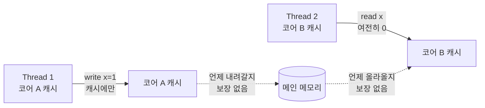

# 딥다이브 — 자바 메모리 모델 (JMM): volatile vs synchronized

> 관련 노트: [gc-gotchas.md](gc-gotchas.md) · [cs-foundations.md](cs-foundations.md)

---

## 0. 30초 직관

여러 명이 회의실에서 일하는데, **각자 자기 자리 메모장(코어 캐시)** 에 계산 결과를 적는다. 칠판(메인 메모리)은 공용이다. 문제는 두 가지다.

1. **가시성(visibility)**: 내가 메모장에 적은 값을 언제 칠판에 옮겨 적을지, 남이 언제 칠판을 다시 읽을지 아무 약속이 없다. → 내가 `stop = true`로 바꿔도 옆 사람은 영원히 옛날 값만 볼 수 있다.
2. **순서(reordering)**: 컴파일러와 CPU는 성능을 위해 "결과만 같으면 된다"며 **내 코드 순서를 마음대로 뒤섞는다**. 나 혼자 볼 때는 문제없지만, 남이 중간 상태를 훔쳐보면 앞뒤가 뒤바뀐 걸 본다.

JMM(Java Memory Model)은 "언제 칠판에 옮기고, 언제 다시 읽으며, 어떤 순서는 보장되는가"를 정의한 **규칙집**이다. 그 핵심 개념 하나가 **happens-before**다. `volatile`과 `synchronized`는 이 규칙을 발동시키는 두 개의 스위치다.

한 줄 요약: **`volatile`은 "이 변수 하나의 가시성+순서"를 보장하고, `synchronized`는 "구간 전체의 상호 배제+가시성+순서"를 보장한다.**

---

## 1. 핵심 문제 — 왜 멀티스레드는 직관을 배신하는가

싱글스레드 프로그램에서는 컴파일러/CPU가 무슨 짓을 해도 **as-if-serial** 규칙 때문에 "코드에 쓴 순서대로 실행한 것과 같은 결과"가 보장된다. 그래서 우리는 리오더링을 신경 쓸 필요가 없었다.

멀티스레드에서는 이 보장이 **한 스레드 내부에서만** 성립한다. 다른 스레드가 그 변수를 동시에 관찰하면 세 가지 하드웨어/컴파일러 현상이 드러난다.

| 현상 | 무슨 일이 벌어지나 | 원인 |
|---|---|---|
| **컴파일러 리오더링** | JIT가 명령어 순서를 바꿈 | 최적화 (레지스터 할당, 루프 호이스팅) |
| **CPU 리오더링** | 프로세서가 out-of-order 실행 | 파이프라인, 스토어 버퍼 |
| **캐시 비가시성** | write가 코어 캐시에만 남고 메인 메모리로 안 내려감 | 코어별 L1/L2 캐시, 스토어 버퍼 |

핵심은 이것이 **버그가 아니라 설계**라는 점이다. 이 자유가 없으면 현대 CPU/컴파일러는 절반의 성능도 못 낸다. JMM은 이 자유를 인정하되, **개발자가 명시적으로 동기화를 요청한 지점**에서만 순서와 가시성을 보장하기로 타협한 계약이다.

> JSR-133 FAQ의 표현: 동기화가 없으면 컴파일러/런타임/하드웨어는 "메모리 액션이 마치 발생하지 않은 것처럼 보이는" 최적화를 자유롭게 할 수 있다. 동기화된 프로그램만이 순차적 일관성(sequential consistency)의 착시를 누린다.


*(도식 설명: Thread 1이 코어 A 캐시에 `x=1`을 썼지만 메인 메모리로 언제 내려갈지 보장이 없고, Thread 2는 코어 B 캐시의 옛날 값 `0`을 계속 읽는다. 동기화가 없으면 두 캐시가 메인 메모리와 언제 동기화되는지 정의되지 않는다.)*

---

## 2. happens-before — JMM의 심장

JMM은 "메모리가 물리적으로 언제 동기화되는가"를 말하지 않는다. 대신 **더 추상적이고 강력한 규칙**을 준다: 두 액션 사이에 **happens-before 관계**가 성립하면, 앞 액션의 결과는 뒤 액션에게 **반드시 보인다**.

> 정의(JLS §17.4.5): 액션 A가 액션 B와 happens-before 관계에 있으면(A hb B), A는 B보다 먼저 일어난 것으로 **보장**되며, A의 메모리 쓰기는 B에게 가시적이다.

주의: happens-before는 "**시간적으로 먼저**"가 아니라 "**가시성과 순서가 보장된다**"는 의미다. hb 관계가 없는 두 write는 서로에게 어떤 순서로 보일지 알 수 없다(= 데이터 레이스).

### happens-before 규칙 목록 (핵심)

1. **프로그램 순서 규칙**: 한 스레드 안에서, 코드상 앞 액션은 뒤 액션보다 hb.
2. **모니터 락 규칙**: 어떤 락의 `unlock`은, 그 뒤 같은 락의 `lock`보다 hb. (synchronized의 근거)
3. **volatile 규칙**: `volatile` 변수에 대한 write는, 그 뒤 같은 변수의 read보다 hb.
4. **스레드 시작 규칙**: `Thread.start()`는 시작된 스레드의 모든 액션보다 hb.
5. **스레드 종료 규칙**: 스레드의 모든 액션은 다른 스레드가 그 스레드에 대해 `join()`이 성공적으로 리턴한 것보다 hb.
6. **전이성(transitivity)**: A hb B, B hb C 이면 A hb C.

전이성이 실전에서 가장 중요하다. 예를 들어 "Thread 1이 일반 변수 `data`를 쓰고 → `volatile flag = true` 쓰기 / Thread 2가 `flag`를 읽어 true 확인 → `data`를 읽기"를 조합하면, 규칙 1+3+6 전이로 **`data`(volatile 아님에도)가 Thread 2에게 보인다**. 이것이 volatile을 "깃발" 삼아 다른 데이터를 안전하게 넘기는 **piggyback(편승)** 패턴의 원리다.

### 🍳 12살 버전 — "칠판과 깃발" (규칙을 언제·어떻게 잇나)

엄마(스레드 A)가 **칠판에 요리 3개를 적고 → 깃발을 올린다.** 아이(스레드 B)는 **깃발이 올라간 걸 보면 → 칠판을 읽는다.** 깃발(volatile)이 없으면 아이는 **반쯤 지워진 칠판**(a,b,c가 0)을 볼 수 있다.

```java
class Kitchen {
    int a, b, c;              // 일반 변수 (칠판)
    volatile boolean ready;   // 깃발 (volatile!)

    void 엄마() {             // 스레드 A
        a = 1; b = 2; c = 3;  // (1) 칠판에 적기
        ready = true;         // (2) 깃발 올림
    }
    void 아이() {             // 스레드 B
        if (ready) {          // (3) 깃발 봄
            use(a, b, c);     // (4) 칠판 읽음 → 1,2,3 보장!
        }
    }
}
```

**다리 조각을 이어보면** (`hb` = "반드시 보인다"):
- `(1) hb (2)` — 같은 스레드, 코드 순서 (규칙 1)
- `(2) hb (3)` — 깃발 write hb 깃발 read (규칙 3, volatile)
- `(3) hb (4)` — 같은 스레드, 코드 순서 (규칙 1)
- **∴ 전이(규칙 6)로 `(1) hb (4)`** → 아이는 `a,b,c = 1,2,3`을 **무조건** 본다.

```
엄마:  칠판쓰기(1) ──프로그램순서──▶ 깃발올림(2)
                                        │ volatile 다리(규칙3)
아이:                      깃발봄(3) ──프로그램순서──▶ 칠판읽기(4)
        └───────────── 전이(규칙6): (1) hb (4) ─────────────┘
```

→ 핵심: **`volatile` 깃발 하나가 그 앞의 일반 변수(a,b,c)까지 통째로 실어 나른다**(piggyback). 규칙 1은 공짜(한 스레드 안), **규칙 2~5가 스레드 사이 "다리"**, 전이가 그 다리로 앞의 모든 쓰기를 보낸다.

**언제 어떤 다리를 놓나:**

| 다리 | 규칙 | 상황 |
|------|------|------|
| `volatile` 깃발 | 3 | "다 됐다" 플래그, 안전 발행 |
| `synchronized`/락 | 2 | 임계구역, 공유 자료구조 |
| `Thread.start()` | 4 | 새 스레드에 초기 데이터 넘기기 |
| `join()` | 5 | 스레드 끝난 뒤 결과 받기 |

다리를 **안 놓으면** 스레드 사이엔 "보인다는 보장"이 전혀 없다(데이터 레이스).

**Java 개발자 관점**: `happens-before`는 인터페이스의 "계약(contract)"과 같다. 구현체(CPU/JIT)가 내부적으로 무엇을 하든 상관없이, 이 계약만 지키면 된다. 우리는 물리 캐시가 아니라 **계약에 대해 프로그래밍**한다.

---

## 3. `volatile` — 가시성 + 순서 보장 (단, 원자성은 아님)

`volatile`은 변수 하나에 대해 세 가지를 보장한다.

1. **가시성**: `volatile` write는 즉시 메인 메모리로 flush되고, read는 항상 메인 메모리에서 최신값을 가져온다. → 캐시된 옛날 값을 절대 안 본다.
2. **리오더링 금지**: `volatile` 변수에 대한 접근은 그 주변 명령어와 뒤섞이지 않는다(메모리 배리어 삽입). write 앞의 일반 write들은 volatile write를 넘어 뒤로 못 가고, read 뒤의 일반 read들은 volatile read를 넘어 앞으로 못 온다.
3. **happens-before 확립**: 규칙 3에 의해 write→read 사이에 hb를 만든다.

### 하지만 원자성은 보장하지 않는다

이것이 `volatile`의 가장 흔한 함정이다. `volatile`은 **읽기 하나, 쓰기 하나**의 가시성을 보장할 뿐, **읽고-수정하고-쓰는 복합 연산(compound action)** 을 원자적으로 만들지 못한다.

`x++`은 사실 세 개의 연산이다: ① `x` 읽기 → ② `+1` → ③ `x`에 쓰기. `volatile`이어도 두 스레드가 ①을 동시에 하면 같은 값을 읽고 둘 다 +1 해서 **한 번의 증가가 사라진다**(lost update).

```java
// x++ 이 원자적이지 않음을 보이는 예 — volatile 로도 못 고친다
class Counter {
    volatile long count = 0;          // volatile 이어도 소용없다
    void increment() { count++; }     // read-modify-write, 3단계
}
// 스레드 2개가 각각 100만 번 increment() 하면
// 기대: 2,000,000  /  실제: 그보다 작은 값 (경쟁으로 증가분 유실)
```

원자성이 필요하면 `synchronized`나 아래의 **atomic 클래스**를 써야 한다.

```java
import java.util.concurrent.atomic.AtomicLong;

class Counter {
    final AtomicLong count = new AtomicLong(0);
    void increment() { count.incrementAndGet(); } // CAS 기반, 원자적 + 가시적
}
```

### volatile을 언제 쓰나

- **한 스레드가 쓰고 나머지는 읽기만** 하는 상태 플래그 (아래 §7 stop 플래그).
- 값이 **다른 변수에 의존하지 않는** 경우 (즉, 새 값이 이전 값과 무관해야 함 — 그래서 카운터엔 부적합).
- 성능상 락보다 훨씬 가볍다. 배리어만 있고 블로킹/컨텍스트 스위치가 없다.

---

## 4. `synchronized` — 상호 배제 + happens-before

`synchronized`는 두 가지를 동시에 준다.

1. **상호 배제(mutual exclusion)**: 같은 모니터(락)를 두 스레드가 동시에 잡을 수 없다. → 복합 연산의 원자성 보장.
2. **가시성/순서(happens-before)**: 규칙 2에 의해, 한 스레드가 락을 **release**할 때 그 스레드가 지금껏 한 모든 write가 flush되고, 다른 스레드가 그 락을 **acquire**할 때 최신값을 읽어온다.

즉 `synchronized`는 "원자성만" 주는 게 아니라 **원자성 + 가시성 + 순서**를 한 번에 준다. 초보자가 흔히 "락은 경쟁만 막는 것"으로 오해하는데, **가시성 보장이 없으면 락도 무의미**하다. 락 진입/해제 시점의 메모리 배리어가 진짜 핵심이다.

```java
class Counter {
    private long count = 0;                 // volatile 불필요
    synchronized void increment() { count++; }      // 원자적 + 가시적
    synchronized long get() { return count; }       // 읽기도 동기화해야 가시성 보장
}
```

주의: **읽기도 같은 락으로 동기화**해야 한다. write만 동기화하고 read를 안 하면, read하는 스레드는 hb 관계가 없어 옛날 값을 볼 수 있다.

### volatile vs synchronized 정리

| | `volatile` | `synchronized` |
|---|---|---|
| 가시성 | O | O |
| 리오더링 방지 | O (해당 변수) | O (구간) |
| 원자성(복합연산) | **X** | O |
| 상호 배제 | X | O |
| 블로킹 | 없음 (논블로킹) | 있음 (대기/컨텍스트 스위치) |
| 적용 대상 | 필드 하나 | 코드 블록/메서드 |
| 비용 | 낮음 | 높음 |

---

## 5. Double-Checked Locking (DCL) — volatile이 고치는 고전 버그

지연 초기화(lazy init) 싱글턴에서, 매번 락 잡기 싫어서 "락 밖에서 한 번, 락 안에서 한 번" 두 번 검사하는 패턴이다.

```java
// 깨진 버전 — volatile 없음. Java 5 이전엔 유명한 함정.
class Singleton {
    private static Singleton instance;          // volatile 없음 (버그)
    static Singleton get() {
        if (instance == null) {                 // 1차 검사 (락 없이)
            synchronized (Singleton.class) {
                if (instance == null) {         // 2차 검사 (락 안)
                    instance = new Singleton(); // 문제의 지점
                }
            }
        }
        return instance;
    }
}
```

### 왜 깨지는가

`instance = new Singleton()` 한 줄은 실제로 세 단계다.

1. 객체용 메모리 **할당**
2. 생성자 실행으로 필드 **초기화**
3. `instance` 참조에 주소 **대입**

JMM은 데이터 레이스 상황에서 **2와 3의 리오더링을 허용**한다. 즉 순서가 1 → 3 → 2가 될 수 있다. 그러면 이런 참사가 난다.

- Thread A가 1 → 3까지 실행 (instance는 이제 non-null인데 **생성자는 아직 안 돌았다**).
- Thread B가 락 밖 1차 검사에서 `instance != null`을 보고, **초기화 안 된 반쪽짜리 객체**를 그대로 반환/사용 → 필드가 기본값(0/null)이거나 깨진 상태.

`volatile`이 이걸 고치는 이유: (1) volatile write의 리오더링 금지로 **2가 3보다 반드시 먼저** 일어나고, (2) volatile read/write가 hb를 확립해 A의 생성자 write들이 B에게 **완전히 보인다**.

```java
// 올바른 버전 — volatile 하나로 해결 (Java 5+ JMM 에서 정상 동작)
class Singleton {
    private static volatile Singleton instance;   // volatile 필수
    static Singleton get() {
        if (instance == null) {
            synchronized (Singleton.class) {
                if (instance == null) {
                    instance = new Singleton();
                }
            }
        }
        return instance;
    }
}
```

> 참고: 사실 더 단순하고 안전한 대안은 **holder 관용구**(정적 내부 클래스의 클래스 로딩 초기화 보장 이용)나 `enum` 싱글턴이다. DCL은 "왜 volatile이 필요한가"를 이해하기 위한 교보재로서 가치가 크다. JSR-133 FAQ도 DCL을 volatile 없이는 고장 난 패턴으로 명시한다.

---

## 6. Atomic 클래스 & CAS — 락 없는 동시성

`java.util.concurrent.atomic`(예: `AtomicInteger`, `AtomicLong`, `AtomicReference`)은 락 없이 원자적 연산을 제공한다. 핵심 무기는 **CAS(Compare-And-Swap)** 라는 CPU 명령이다.

### CAS의 동작

`CAS(주소, 기대값, 새값)`: "그 주소의 현재 값이 **기대값과 같으면** 새값으로 바꾸고 성공(true), 다르면 아무것도 안 하고 실패(false)". 이 비교-교환 전체가 하드웨어 수준에서 **원자적**이다 (x86의 `LOCK CMPXCHG`).

`incrementAndGet()`의 내부는 대략 이런 **CAS 재시도 루프**다.

```java
// AtomicInteger.incrementAndGet() 개념적 구현
int incrementAndGet() {
    int cur, next;
    do {
        cur  = get();          // 현재 값 읽기
        next = cur + 1;        // 새 값 계산
    } while (!compareAndSet(cur, next)); // 그새 값이 안 바뀌었으면 교체, 바뀌었으면 재시도
    return next;
}
```

경쟁이 있으면 CAS가 실패하고 루프를 다시 돌 뿐, **블로킹/컨텍스트 스위치가 없다**. 이것이 **lock-free**다. 경쟁이 낮을 때 `synchronized`보다 훨씬 빠르다. (경쟁이 매우 심하면 재시도 낭비로 역전될 수 있다.)

### ABA 문제

CAS는 "값이 **기대값과 같은지**"만 본다. 그런데 값이 A → B → A로 바뀐 뒤 돌아왔다면, CAS는 "안 바뀌었다"고 오판한다. 값은 같지만 그 사이 **다른 일이 일어났다**는 맥락이 사라진다.

- 대표 사례: 락프리 스택에서 top 노드를 A라고 읽고 CAS 준비 중, 다른 스레드가 A를 pop → B를 pop → A를 다시 push. 내 CAS는 top==A를 보고 성공하지만, 그 A의 `next`는 이미 사라진 노드를 가리킬 수 있다.
- 해결: **버전(스탬프)** 을 값에 붙여 함께 CAS한다. Java의 `AtomicStampedReference`(참조+정수 스탬프)나 `AtomicMarkableReference`(참조+불린 마크)가 이를 위한 도구다. 스탬프가 매번 증가하므로 A→B→A라도 스탬프가 달라 CAS가 실패한다.

```java
import java.util.concurrent.atomic.AtomicStampedReference;

AtomicStampedReference<Node> top = new AtomicStampedReference<>(head, 0);
int[] stampHolder = new int[1];
Node cur = top.get(stampHolder);          // 값과 스탬프를 함께 읽음
int  stamp = stampHolder[0];
// ...
top.compareAndSet(cur, next, stamp, stamp + 1); // 값+스탬프 둘 다 맞아야 성공
```

---

## 7. 가시성 버그 — stop 플래그가 영원히 안 멈추는 예

가장 교과서적인 가시성 버그. 워커 스레드가 플래그를 보고 도는데, `volatile`이 없으면 **영원히 멈추지 않을 수 있다**.

```java
// 버그: stopped 가 volatile 이 아님
class Worker extends Thread {
    private boolean stopped = false;     // 가시성 보장 없음
    public void run() {
        while (!stopped) {               // JIT 가 이걸 while(true) 로 호이스팅 가능
            // ... 작업 ...
        }
    }
    public void shutdown() { stopped = true; } // 다른 스레드가 호출 → 워커는 못 볼 수 있음
}
```

왜 영원히 도는가: `run()` 안에서 `stopped`가 바뀌지 않으므로, JIT는 "이 변수는 안 변한다"고 판단해 값을 **레지스터에 캐싱**하거나 아예 루프 밖으로 끌어내(`hoisting`) `while(true)`로 바꿔버린다. `shutdown()`이 다른 스레드에서 `stopped = true`를 해도 워커의 레지스터/캐시엔 반영되지 않는다.

```java
// 수정: volatile 한 단어. write→read 에 happens-before 확립.
class Worker extends Thread {
    private volatile boolean stopped = false;   // 이제 매 반복마다 메인 메모리에서 읽음
    public void run() {
        while (!stopped) { /* ... */ }
    }
    public void shutdown() { stopped = true; }
}
```

`volatile` 하나로 (1) 캐싱/호이스팅 금지 → 매 반복 최신값 확인, (2) `shutdown()`의 write가 `run()`의 read에 hb 로 보장된다. 이 플래그는 값이 이전 값에 의존하지 않는 단순 상태라서 `volatile`이 딱 맞다(§3 조건 충족).

---

## 8. `final` 필드 의미론 & 안전한 공개(safe publication)

`final` 필드는 JMM에서 특별 대우를 받는다. **생성자가 정상 종료되면, 그 시점에 대입된 `final` 필드의 값은 다른 스레드에게 (동기화 없이도) 올바르게 보인다** — 단, 생성 중인 객체 참조가 생성자 밖으로 새어나가지 않는 한.

이것이 왜 중요한가: §5 DCL 문제의 뿌리는 "초기화 안 끝난 객체가 보이는 것"이었다. `final` 필드는 JMM이 "생성자 안의 final 필드 write는 생성자 종료 전에 완료되고, 그 이후 리오더링으로 앞당겨지지 않는다"를 **freeze 규칙**으로 보장한다. 그래서 `String`처럼 불변 객체는 데이터 레이스가 있어도 안전하게 공유된다.

```java
final class Point {                 // 불변 객체
    private final int x, y;         // final → 안전 공개 보장
    Point(int x, int y) { this.x = x; this.y = y; }
    int x() { return x; }  int y() { return y; }
}
// 여러 스레드가 동기화 없이 Point 를 공유해도, x/y 는 항상 생성자에서 설정한 값으로 보인다.
```

### 안전한 공개(safe publication)의 4가지 방법 (Goetz, JCIP)

객체를 여러 스레드에 노출할 때, **참조 대입만 보이고 내부 상태는 안 보이는** 사고를 막으려면 다음 중 하나를 써야 한다.

1. **정적 초기화자**에서 초기화 (클래스 로딩이 hb 보장).
2. `volatile` 필드나 `AtomicReference`에 저장.
3. 올바르게 생성된 객체의 `final` 필드에 저장.
4. **락으로 보호된** 필드에 저장 (synchronized/`ConcurrentHashMap` 등).

`final` 필드조차 **생성자에서 `this`가 탈출**하면(예: 생성자 안에서 리스너에 자기 등록) 보장이 깨진다. "생성이 끝난 뒤에만 공개하라"가 원칙이다.

---

## 9. 데드락 — Coffman 4조건과 락 순서화

데드락은 두 스레드가 서로가 쥔 락을 기다리며 영원히 멈추는 상황이다. **Coffman의 4가지 조건이 동시에 모두 성립**할 때만 발생한다.

| 조건 | 뜻 | 깨는 방법 |
|---|---|---|
| **상호 배제(Mutual Exclusion)** | 자원을 한 번에 하나만 소유 | (락의 본질이라 보통 못 깸) |
| **점유 대기(Hold and Wait)** | 하나 쥔 채 다른 것 대기 | 필요한 락을 **한 번에** 모두 획득 |
| **비선점(No Preemption)** | 남의 락을 강제로 뺏을 수 없음 | `tryLock(timeout)`으로 포기 가능하게 |
| **순환 대기(Circular Wait)** | 대기 사이클 존재 (A→B, B→A) | **전역 락 순서** 강제 |

실무에서 가장 실용적인 예방은 **순환 대기 제거 = 락 순서화(lock ordering)**: 모든 스레드가 항상 **같은 전역 순서로** 락을 획득하면 사이클이 생길 수 없다.

```java
// 데드락 위험: 두 계좌를 서로 반대 순서로 잠글 수 있음
void transfer(Account from, Account to, long amt) {
    synchronized (from) {              // Thread1: A→B,  Thread2: B→A 이면 데드락
        synchronized (to) { /* ... */ }
    }
}

// 수정: 식별자로 전역 순서 강제 → 순환 대기 조건 파괴
void transfer(Account from, Account to, long amt) {
    Account first  = from.id() < to.id() ? from : to;   // 항상 작은 id 먼저
    Account second = from.id() < to.id() ? to   : from;
    synchronized (first) {
        synchronized (second) { /* ... */ }
    }
}
```

`java.util.concurrent.locks.Lock`의 `tryLock(timeout)`은 **비선점 조건**을 깨는 대안이다. 시간 내 못 잡으면 쥔 락을 풀고 물러났다 재시도 → 데드락 대신 라이브락 위험은 남지만 회복 가능하다.

---

## 10. 용어 구분 — race condition vs visibility vs atomicity

세 개념은 자주 뭉뚱그려지지만 **다른 문제**다.

| 개념 | 무엇이 문제인가 | 전형적 증상 | 해결 |
|---|---|---|---|
| **가시성(Visibility)** | 한 스레드의 write를 다른 스레드가 **못 봄** (옛날 값) | stop 플래그가 안 멈춤 | `volatile`, `synchronized`, `final` |
| **원자성(Atomicity)** | 복합 연산이 **중간에 끼어들기** 당함 | `x++` 증가분 유실 | atomic 클래스(CAS), `synchronized` |
| **경쟁 상태(Race Condition)** | 결과가 스레드 **타이밍/스케줄에 의존** | 실행마다 결과 다름, 재현 어려움 | 위 둘을 적절히 조합 |

관계 정리:

- **가시성 문제**는 "값을 못 본다". **원자성 문제**는 "봤는데 그새 바뀐다".
- **경쟁 상태**는 상위 개념 — 가시성 결여든 원자성 결여든, **타이밍에 따라 결과가 달라지면** 경쟁 상태다. 대표 유형이 **check-then-act**(예: DCL의 null 검사, `if (!map.containsKey(k)) map.put(k, v)`)와 **read-modify-write**(예: `x++`).
- 중요한 오해: `volatile`로 **가시성을 고쳐도 원자성 경쟁은 그대로 남는다**(§3의 `x++`). 반대로 `synchronized`는 둘 다 잡는다. "어떤 종류의 문제인가"를 먼저 진단해야 올바른 도구를 고른다.

---

## 11. 실전 체크리스트 (Java 개발자용)

- [ ] 여러 스레드가 공유하는 필드에 **동기화가 하나라도 있나**? 없으면 데이터 레이스 = 결과 미정의.
- [ ] **읽기 쪽도** 동기화했나? write만 `synchronized`/`volatile`이고 read가 맨몸이면 가시성 깨짐.
- [ ] 그 연산이 **check-then-act / read-modify-write** 인가? 그렇다면 `volatile`로는 부족 → atomic/락.
- [ ] 카운터/누산기 → `AtomicLong`/`LongAdder`. 단순 플래그 → `volatile`. 불변 데이터 공유 → `final` + 불변 객체.
- [ ] 락을 2개 이상 잡나? → **전역 락 순서**를 정해 순환 대기 차단.
- [ ] 지연 초기화 싱글턴? → DCL보다 **holder 관용구**나 `enum`을 우선.
- [ ] 고성능이 필요하면 `synchronized`(무거움) → `java.util.concurrent`(`ConcurrentHashMap`, `AtomicX`, `ReadWriteLock`) 먼저 검토.

---

## 용어 사전

| 용어 | 뜻 |
|---|---|
| **JMM (Java Memory Model)** | 멀티스레드에서 어떤 write가 어떤 read에게 보이는지, 어떤 순서가 보장되는지를 규정한 명세 (JLS Ch.17). |
| **happens-before** | 두 액션 A, B에 대해 A의 결과가 B에게 가시적임을 보장하는 JMM의 순서 관계. "시간 순"이 아니라 "가시성/순서 보장". |
| **가시성(Visibility)** | 한 스레드의 메모리 쓰기가 다른 스레드에게 보이는 성질. |
| **원자성(Atomicity)** | 연산이 쪼개지지 않고 통째로 실행되는(중간 상태가 안 보이는) 성질. |
| **경쟁 상태(Race Condition)** | 결과가 스레드 실행 타이밍에 의존해 달라지는 오류. |
| **데이터 레이스(Data Race)** | happens-before로 정렬되지 않은 두 접근 중 하나 이상이 write인 상황. JMM상 결과 미정의. |
| **리오더링(Reordering)** | 컴파일러/CPU가 성능을 위해 명령어 실행 순서를 바꾸는 것. |
| **메모리 배리어(Memory Barrier / Fence)** | 리오더링과 캐시 flush/refresh를 강제하는 CPU 명령. `volatile`/락이 내부적으로 삽입. |
| **CAS (Compare-And-Swap)** | "기대값과 같으면 새값으로 교체"를 원자적으로 수행하는 하드웨어 명령. lock-free의 기반. |
| **ABA 문제** | 값이 A→B→A로 돌아와 CAS가 "안 바뀜"으로 오판하는 문제. 스탬프/버전으로 해결. |
| **안전한 공개(Safe Publication)** | 객체 참조와 내부 상태를 함께, 올바르게 다른 스레드에 노출하는 것. |
| **DCL (Double-Checked Locking)** | 락 밖/안에서 두 번 null 검사하는 지연 초기화 패턴. `volatile` 없으면 버그. |
| **Coffman 조건** | 데드락 발생의 4가지 필요조건(상호배제·점유대기·비선점·순환대기). |
| **lock-free** | 락 없이(주로 CAS로) 스레드 안전을 달성하는 방식. 블로킹 없음. |
| **freeze (final 필드)** | 생성자 종료 시 final 필드 값을 고정해 안전 공개를 보장하는 JMM 규칙. |

## 출처

- **JSR-133 FAQ** — Jeremy Manson & Brian Goetz, "JSR-133 (Java Memory Model) FAQ": https://www.cs.umd.edu/~pugh/java/memoryModel/jsr-133-faq.html (happens-before, volatile 강화, DCL, final 필드 의미론의 표준 해설)
- **JLS SE17, Chapter 17 "Threads and Locks"** — Java Language Specification: https://docs.oracle.com/javase/specs/jls/se17/html/jls-17.html (§17.4 JMM, §17.4.5 happens-before, §17.5 final 필드 의미론의 규범적 정의)
- **Brian Goetz 외, _Java Concurrency in Practice_ (2006)** — 3장(공유 객체·가시성·안전 공개), 10장(데드락·락 순서화), 15장(atomic 변수·CAS·논블로킹 알고리즘)

---

> 관련 노트: [gc-gotchas.md](gc-gotchas.md) · [cs-foundations.md](cs-foundations.md)
