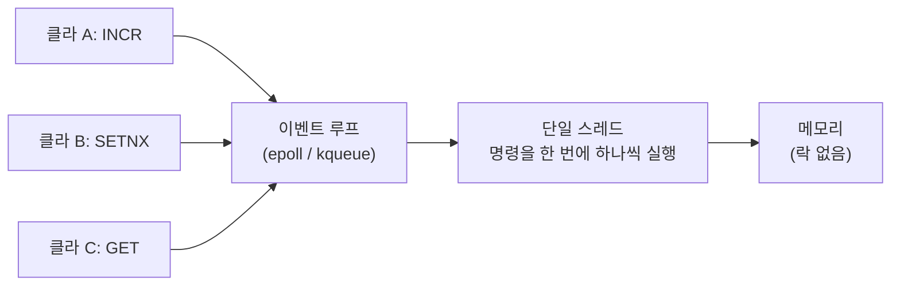

# 딥다이브 — Redis: 단일 스레드를 고른 대가, 그리고 분산 락 논쟁

> 기반: **Redis 공식 문서 / antirez 블로그** · **Kleppmann, *How to do distributed locking* (2016)** · **antirez, *Is Redlock safe?* (2016)** · **Redis 설계 배경(LLOOGG, 2009)**
> 형식: 30초 직관 → **왜 만들어졌나** → 원리 → 트레이드오프.
> **선행**: JVM 안의 동시성은 [deep-jmm.md](deep-jmm.md). 이 노트는 **그 도구가 전부 무효가 되는 지점**에서 시작한다. 학습 순서는 [../backend-roadmap.md](../backend-roadmap.md).

---

## 0. 30초 직관 — `synchronized`가 죽는 순간

서버를 2대로 늘렸다. 선착순 100명 이벤트를 연다.

```java
public synchronized void apply(User u) {     // ⚠️ 서버가 1대일 때만 맞는 코드
    if (count < 100) { count++; save(u); }
}
```

**`synchronized`는 JVM 하나 안에서만 유효하다.** 서버가 2대면 JVM이 2개고, 락도 2개다. 두 서버가 각각 "지금 99명"이라고 믿고 동시에 통과시킨다. → **101명 당첨.**

[deep-jmm.md](deep-jmm.md)에서 배운 것들(`volatile`·CAS·`synchronized`)은 전부 **"하나의 메모리를 공유하는 스레드들"** 을 전제한다. 프로세스가 둘이 되는 순간 그 전제가 깨진다.

> **그래서 필요한 게 "바깥에 있는 심판"이다.** 모든 서버가 공통으로 물어보는 한 곳. 그게 보통 Redis다.

그런데 이 심판을 믿어도 되는지를 두고 **2016년에 유명한 논쟁**이 벌어졌다. 그게 이 노트의 6장이고, 결론은 꽤 불편하다 — **"Redis 락은 정확성을 보장하지 못한다."**

---

## 1. 역사 — MySQL이 못 버텨서 태어났다

### 1-1. 2009년, 시칠리아

Salvatore Sanfilippo(필명 **antirez**)는 **LLOOGG**라는 실시간 웹 분석 서비스를 만들고 있었다. 방문자의 최근 페이지뷰를 실시간으로 보여주는 서비스였다.

문제는 이 작업의 성격이었다:

```
이벤트가 들어옴 → 리스트 맨 앞에 추가 → 오래된 건 잘라냄 → 최근 N개 조회
                 (초당 수백 번, 매번 즉시 응답 필요)
```

**MySQL로는 안 됐다.** 리스트 push/pop을 초당 수백 번 하면서 즉시 응답을 받는 건 디스크 기반 RDB가 잘하는 일이 아니다.

그래서 그는 집에서 **Tcl로 300줄짜리 메모리 DB 프로토타입**을 짰다. 이름은 **LMDB(LLOOGG Memory Database)**. 이걸 C로 다시 쓴 게 **Redis(REmote DIctionary Server)** 다.

### 1-2. 그래서 Redis는 "캐시"가 아니다

여기가 중요하다. Redis는 **캐시를 만들려고 만든 게 아니다.** 원래 문제가 "리스트 조작"이었기 때문에, 처음부터 **자료구조가 1급 시민**이었다.

| Redis 타입 | 자바로 치면 | 원래 용도 |
|---|---|---|
| String | `String` / `AtomicLong` | 카운터·캐시 |
| **List** | `LinkedList` / `Deque` | **최근 이벤트 (원래 목적)** |
| **Set** | `HashSet` | 중복 제거·태그 |
| **Sorted Set** | `TreeMap` (점수 순) | **랭킹·선착순·지연 큐** |
| Hash | `HashMap` | 객체 필드 |

> **공식 명칭도 "data structure server"** 다. 캐시로 쓰는 건 **가능한 용도 중 하나**일 뿐이다.
> 선착순을 구현할 때 락을 걸 게 아니라 **Sorted Set이나 `INCR`로 푸는 게 더 자연스러운 이유**가 여기 있다 (→ 7장).

---

## 2. 단일 스레드를 **일부러** 골랐다

Redis는 명령을 **하나의 스레드가 순서대로** 처리한다. 성능을 포기한 게 아니라, **성능을 위해** 그렇게 했다.



*(도식 설명: 여러 클라이언트의 명령이 동시에 도착해도 이벤트 루프가 큐에 모으고, 단 하나의 스레드가 순서대로 하나씩 실행한다. 동시에 두 명령이 메모리를 건드리는 일이 없으므로 락이나 뮤텍스가 아예 필요 없다.)*

### 왜 그게 빠른가

메모리 연산은 **마이크로초 이하**로 끝난다. 그런데 **락을 걸고 푸는 비용, 스레드 컨텍스트 스위칭 비용은 그보다 클 수 있다.** 즉 —

> **작업 자체가 극도로 짧으면, 병렬화 비용이 병렬화 이득보다 크다.**

**자바 비유**: 서버 전체를 `synchronized` 블록 하나로 감싼 것과 같다. 보통은 최악의 설계지만, **블록 안이 0.5마이크로초 만에 끝난다면** 경합 관리 비용을 치르는 것보다 낫다.

### 공짜로 따라온 것 — 모든 명령이 원자적

이게 분산 락의 토대다. `INCR`, `SETNX`, `LPUSH`는 **중간 상태가 없다.** 두 클라이언트가 동시에 `INCR`를 보내도 결과는 반드시 +2다. 락 없이도 원자성이 보장된다.

### 대가 — 하나가 막히면 전부 막힌다

| 위험 명령 | 왜 위험 | 대안 |
|---|---|---|
| `KEYS *` | 전체 키 스캔 O(n). **운영 중 절대 금지** | `SCAN` (커서 방식) |
| `FLUSHALL` | 전부 삭제 | `FLUSHALL ASYNC` |
| 큰 컬렉션 `DEL` | 원소 수만큼 O(n) | `UNLINK` (백그라운드 회수) |
| 복잡한 Lua 스크립트 | 스크립트 도는 동안 전부 대기 | 짧게 유지 |

**단일 스레드라서 "느린 명령 하나 = 전체 장애"** 다. 이건 설계상 피할 수 없는 청구서다.

> Redis 6부터 **I/O만** 멀티스레드로 처리한다(네트워크 읽기/쓰기). **명령 실행은 여전히 단일 스레드**다. 핵심 설계는 안 바뀌었다.

---

## 3. 캐시 전략 — 어느 쪽이 DB를 책임지나

| 전략 | 읽기 | 쓰기 | 특징 |
|---|---|---|---|
| **Cache-Aside** (Lazy Loading) | 앱이 캐시 확인 → 없으면 DB → 캐시에 채움 | 앱이 DB 쓰고 **캐시 무효화** | **가장 흔함.** 캐시가 죽어도 서비스는 산다 |
| **Read-Through** | 캐시가 알아서 DB에서 읽어옴 | — | 앱 코드가 깔끔. 라이브러리 지원 필요 |
| **Write-Through** | — | 캐시에 쓰면 캐시가 DB에도 씀 | 항상 일관. **쓰기가 느림** |
| **Write-Behind** | — | 캐시에 쓰고 DB는 **나중에 비동기** | 쓰기 매우 빠름. **죽으면 데이터 유실** |

**대부분 Cache-Aside를 쓴다.** 이유는 단순하다 — 캐시는 언제든 죽을 수 있다고 가정하는 게 안전하고, Cache-Aside는 캐시가 통째로 사라져도 DB에서 다시 채우면 그만이다.

```java
// Cache-Aside 읽기
public Parking find(Long id) {
    Parking cached = redis.get("parking:" + id);
    if (cached != null) return cached;              // 히트
    Parking fromDb = repository.findById(id);       // 미스 → DB
    redis.setex("parking:" + id, 300, fromDb);      // 채워넣기 (TTL 300초)
    return fromDb;
}
```

### 무효화(invalidation)가 진짜 어려운 부분

> "There are only two hard things in Computer Science: cache invalidation and naming things." — Phil Karlton

**쓰기 시 캐시를 지울까, 갱신할까?** 대개 **지우는 쪽(무효화)** 이 안전하다. 갱신하면 두 번의 쓰기가 순서가 뒤바뀌어 **낡은 값이 최종으로 남는** 경쟁이 생긴다.

그래도 **불일치 창(window)** 은 남는다:

```
스레드 A: DB 읽음(값 1) ────────────────→ 캐시에 1 저장  ← 낡은 값이 박힘
스레드 B:        DB에 2 쓰기 → 캐시 삭제 ↗
```

완전히 없애려면 분산 락이나 버전 검사가 필요한데, **대개는 짧은 TTL로 감수한다.** "정합성을 얼마나 포기할 것인가"가 곧 캐시 설계다.

---

## 4. 캐시 스탬피드 — TTL이 동시에 터질 때

인기 상품 하나를 초당 1만 명이 조회한다. 그 키의 TTL이 만료된 **바로 그 순간**:

```
1만 개 요청이 동시에 캐시 미스 → 1만 개가 동시에 DB로 → DB 사망
```

이걸 **캐시 스탬피드(cache stampede)** 또는 **thundering herd**라고 한다. 캐시를 붙였는데 오히려 캐시 때문에 죽는다.

**해법 3종**

| 해법 | 방법 | 대가 |
|---|---|---|
| **TTL 지터(jitter)** | TTL을 `300 + random(0~60)`초로 흩뿌림 | 가장 간단. 근본 해결은 아님 |
| **논리적 만료** | TTL은 길게 두고 값 안에 `expireAt`을 넣어, 만료됐으면 **낡은 값을 주면서 뒤에서 갱신** | 잠깐 낡은 값이 나감 |
| **뮤텍스 / single-flight** | 미스 시 락을 딴 **한 놈만** DB에 가고 나머지는 대기 | 대기 시간 발생, 락 관리 필요 |

> **논리적 만료가 실무에서 자주 쓰인다.** "잠깐 낡은 값"과 "DB 사망" 중에 고르라면 답이 명확하기 때문. 이게 **가용성을 위해 일관성을 파는** 전형적 거래다.

---

## 5. 분산 락 — 순진한 구현이 깨지는 3단계

### 시도 1 — `SETNX`

```
SETNX lock:order:42 1      # 없으면 세팅하고 1 반환, 있으면 0
... 작업 ...
DEL lock:order:42
```

**깨지는 지점**: 작업 도중 서버가 죽으면 `DEL`이 영영 실행되지 않는다. → **락이 영구히 남는다(deadlock).**

### 시도 2 — TTL 추가

```
SET lock:order:42 1 NX EX 30    # 없으면 세팅 + 30초 후 자동 삭제
```

**깨지는 지점**: 작업이 30초보다 오래 걸리면? 락이 먼저 풀리고 **B가 락을 잡는다.** 그 뒤 A가 작업을 끝내고 `DEL`을 부르면 — **B의 락을 지운다.**

### 시도 3 — 소유자 토큰 + Lua 원자 삭제

```
SET lock:order:42 <랜덤토큰> NX EX 30
```
해제는 **"내 토큰일 때만 삭제"** 를 원자적으로:

```lua
if redis.call("get", KEYS[1]) == ARGV[1] then
  return redis.call("del", KEYS[1])
else
  return 0
end
```

`GET` 후 `DEL`을 따로 하면 그 사이에 만료될 수 있으므로 **Lua로 묶어 단일 스레드에서 원자 실행**시킨다(2장의 성질을 이용).

**그런데 이래도 안 끝난다.** 시도 2의 근본 문제 — **"작업이 TTL보다 길면 두 클라이언트가 동시에 자기가 락을 가졌다고 믿는다"** — 는 여전히 남아 있다. 토큰은 *남의 락을 지우는 것*만 막을 뿐, *동시 실행 자체*는 못 막는다.

---

## 6. ⭐ Redlock 논쟁 (2016) — 분산 시스템 공학의 명장면

### 6-1. Redlock이란

Redis 노드 하나가 죽으면 락이 사라지니, antirez는 **독립적인 Redis 노드 N개(보통 5개)의 과반에서 락을 얻는** 알고리즘을 제안했다. 이게 **Redlock**이다.

### 6-2. Kleppmann의 반박

2016년 2월 8일, *Designing Data-Intensive Applications*의 저자 **Martin Kleppmann**이 반박 글을 올린다.

**핵심 ①: 락에는 두 종류가 있다**

> **효율성(efficiency)**: "Taking a lock saves you from unnecessarily doing the same work twice... If the lock fails and two nodes end up doing the same piece of work, the result is a **minor increase in cost**."
>
> **정확성(correctness)**: "...If the lock fails and two nodes concurrently work on the same piece of data, the result is a **corrupted file, data loss, permanent inconsistency**."
> — [Kleppmann (2016)](https://martin.kleppmann.com/2016/02/08/how-to-do-distributed-locking.html)

**효율성 목적이면** 단일 Redis로 충분하다. 실패해도 중복 작업 한 번일 뿐이다.
**정확성 목적이면** Redlock으로는 부족하다. 이유가 다음이다.

**핵심 ②: GC 정지 시나리오**

```
1. 클라A가 락 획득 성공
2. 응답이 돌아오는 중, 클라A에 stop-the-world GC 발생  ← 자바 개발자에겐 남 얘기가 아니다
3. GC 도는 동안 TTL 만료 → 락이 풀림
4. 클라B가 락 획득 성공
5. 클라A가 GC에서 깨어남 — 자기 락이 풀린 줄 모른다
6. A와 B가 동시에 "내가 락 주인"이라고 믿고 데이터를 건드린다  ← 정합성 파괴
```

> **이건 Redis 구현의 버그가 아니다.** 클라이언트가 멈출 수 있는 모든 시스템에서 성립한다.
> GC뿐 아니라 페이지 폴트, VM 라이브 마이그레이션, 네트워크 지연 전부 같은 결과를 낸다.
> **"락을 확인한 시점"과 "실제로 쓰는 시점" 사이에는 언제나 틈이 있다.**

**핵심 ③: 펜싱 토큰(fencing token)이 없다**

Kleppmann의 해법은 락 서비스가 **단조 증가하는 번호**를 함께 발급하는 것이다.

```
클라A: 락 획득 → 토큰 33  → (GC로 멈춤)
클라B: 락 획득 → 토큰 34  → 저장소에 쓰기(토큰 34) → 저장소가 "34 처리함" 기록
클라A: 깨어나서 쓰기 시도(토큰 33) → 저장소가 거부  ✅
```

> "The storage server remembers that it has already processed a write with a higher token number (34), and so it **rejects the request with token 33**."

**핵심은 저장소가 방어한다는 것이다.** 락을 믿는 게 아니라, **최종 쓰기 지점에서 순서를 검증**한다. Redlock에는 이 토큰을 만들 방법이 없다.

**결론**

> "the Redlock algorithm is a poor choice because it is **'neither fish nor fowl'**: it is unnecessarily heavyweight and expensive for efficiency-optimization locks, but it is **not sufficiently safe** for situations in which correctness depends on the lock."

정확성이 필요하면 **ZooKeeper 같은 합의(consensus) 시스템**을 쓰라는 게 그의 권고다.

### 6-3. antirez의 반박

antirez는 같은 날 [반박 글](http://antirez.com/news/101)을 올렸다. 요지는 — Redlock은 **시계가 완전히 정확할 필요는 없고** 일정 범위의 오차만 가정하며, 실무의 많은 사례에서 그 가정은 합리적이라는 것. 또 펜싱 토큰이 필요한 시스템이라면 애초에 그 저장소가 순서 검증을 지원해야 하는데, 그런 저장소가 흔치 않다는 지적도 했다.

### 6-4. 이 논쟁에서 실제로 배울 것

승패를 가리는 게 요점이 아니다. **둘 다 동의한 사실**이 핵심이다:

> **"락을 가졌다는 믿음"과 "실제로 락을 가진 것"은 다르다.**
> 분산 환경에서 클라이언트는 자기가 멈췄었는지조차 알 수 없다.

그래서 실무 원칙이 나온다:

1. **정확성이 걸린 일에 Redis 락 하나만 믿지 마라.**
2. **최종 지점에서 한 번 더 검증하라** — 펜싱 토큰이든, DB 유니크 제약이든, 조건부 업데이트든.
3. 락은 **"대부분의 경우 중복 작업을 줄이는 최적화"** 로 취급하라.

---

## 7. 그래서 선착순은 어떻게 구현하나

앞의 논의를 실전 문제에 적용해 보자. **"선착순 100명"** 을 여러 서버에서 안전하게 처리하려면?

| 방법 | 정확성 | 성능 | 평가 |
|---|---|---|---|
| `synchronized` | ❌ 서버 1대에서만 | 최고 | **틀림** (0장) |
| Redis 분산 락 + 카운터 | ⚠️ 6장의 틈 존재 | 좋음 | 락 경합이 병목 |
| **Redis `INCR`** | ✅ 원자적, 락 불필요 | 최고 | **초과분 롤백 필요** |
| **Redis Sorted Set** | ✅ 원자적 + 순위까지 | 좋음 | 중복 신청도 자동 방지 |
| **DB 유니크 제약 + 조건부 UPDATE** | ✅ 가장 확실 | 낮음 | 최종 방어선 |

> **핵심 통찰: 락을 쓰지 않는 게 최선이다.**
> `INCR`는 2장의 "모든 명령이 원자적"이라는 성질을 그대로 쓴다. **락을 걸고 읽고 더하고 쓰는 대신, 원자적 연산 하나로 끝낸다.** 락은 "여러 연산을 묶어야 할 때" 어쩔 수 없이 꺼내는 도구다.

```java
Long rank = redis.incr("event:1:count");
if (rank > 100) {
    redis.decr("event:1:count");   // 초과분 되돌리기
    throw new SoldOutException();
}
// DB에도 유니크 제약을 걸어 최종 방어  ← 6장의 "최종 지점 검증"
```

**Redis로 빠르게 거르고, DB 제약으로 최종 보증한다.** 이 이중 구조가 실무 표준이다.

---

## 8. 3단 요약 (암기용)

### Q1. 서버가 여러 대면 `synchronized`가 왜 안 되나?

- **① 결론 · WHAT** `synchronized`는 **JVM 하나 안의 스레드**만 통제한다. 서버가 2대면 JVM이 2개라 **락도 2개**다. 서로를 모른다.
- **② 원리 · HOW** 자바의 동시성 도구는 전부 **하나의 메인 메모리를 공유하는 스레드**를 전제한다([deep-jmm.md](deep-jmm.md)). 프로세스가 분리되면 그 전제가 성립하지 않는다. 그래서 **모두가 물어보는 외부 심판**(Redis·DB·ZooKeeper)이 필요해진다.
- **③ 확장 · TRADE-OFF** 외부 심판은 **네트워크 왕복 비용**과 **새로운 단일 장애점**을 만든다. 그리고 6장에서 보듯 **완전한 정확성도 보장하지 못한다.** 그래서 가능하면 락 대신 **원자적 연산 하나**(`INCR`)나 **DB 제약**으로 푸는 게 낫다.

### Q2. Redis는 왜 단일 스레드인데 빠른가?

- **① 결론 · WHAT** 메모리 연산이 워낙 짧아서 **락 경합·컨텍스트 스위칭 비용이 병렬화 이득보다 크기 때문**이다. 병렬화를 안 한 게 아니라 **일부러 포기**했다.
- **② 원리 · HOW** 이벤트 루프(epoll/kqueue)가 요청을 모으고 한 스레드가 순서대로 처리한다. 덕분에 **모든 명령이 자동으로 원자적**이 되고 내부에 락이 전혀 없다. 이 성질이 분산 락과 `INCR` 같은 도구의 토대다.
- **③ 확장 · TRADE-OFF** **느린 명령 하나가 전체를 멈춘다.** `KEYS *`, 큰 컬렉션 `DEL`, 긴 Lua 스크립트가 운영 중 금지되는 이유다(각각 `SCAN`·`UNLINK`로 대체). Redis 6의 멀티스레드는 **I/O에만** 적용되고 명령 실행은 여전히 단일 스레드다.

### Q3. Redis 분산 락을 믿어도 되나?

- **① 결론 · WHAT** **효율성 목적이면 충분하고, 정확성 목적이면 부족하다.** 2016년 Kleppmann과 antirez의 논쟁이 이 구분을 남겼다.
- **② 원리 · HOW** 클라이언트가 락을 얻은 뒤 **stop-the-world GC나 네트워크 지연으로 멈추면** 그 사이 TTL이 만료돼 다른 클라이언트가 락을 얻는다. 깨어난 첫 클라이언트는 **자기 락이 풀린 줄 모른다.** Redis의 버그가 아니라 **"확인 시점과 사용 시점 사이의 틈"** 이라는 구조적 문제다.
- **③ 확장 · TRADE-OFF** 해법은 **최종 저장 지점에서 검증**하는 것이다 — 단조 증가 **펜싱 토큰**을 발급해 오래된 토큰의 쓰기를 거부하거나, **DB 유니크 제약·조건부 UPDATE**로 막는다. 정말 정확성이 걸렸다면 ZooKeeper 같은 합의 시스템을 쓰라는 게 Kleppmann의 권고다. 실무에서는 **Redis로 빠르게 거르고 DB로 최종 보증**하는 이중 구조가 흔하다.

---

## 용어 사전

| 용어 | 뜻 |
|------|-----|
| 이벤트 루프 | epoll/kqueue로 다중 연결을 한 스레드가 처리하는 방식 |
| 원자적(atomic) | 중간 상태가 관측되지 않음 |
| Cache-Aside | 앱이 캐시를 직접 확인·채우는 전략. 가장 흔함 |
| 캐시 스탬피드 | TTL 동시 만료로 요청이 한꺼번에 DB로 몰리는 현상 |
| TTL 지터 | 만료 시각을 무작위로 흩뿌려 동시 만료를 막는 기법 |
| 논리적 만료 | 값 안에 만료 시각을 넣고, 낡은 값을 주면서 뒤에서 갱신 |
| single-flight | 같은 키의 중복 조회를 하나로 합치는 기법 |
| Redlock | 여러 Redis 노드의 과반으로 락을 얻는 알고리즘 |
| 펜싱 토큰 | 단조 증가 번호. 저장소가 오래된 요청을 거부하게 함 |
| 효율성 락 vs 정확성 락 | 실패해도 비용만 늘어남 vs 데이터가 깨짐 |
| `SCAN` / `UNLINK` | `KEYS` / `DEL`의 논블로킹 대체 명령 |

## 연결 지도
- **JVM 안의 동시성 (선행)**: → [deep-jmm.md](deep-jmm.md)
- **트랜잭션 경계와 커넥션**: → [../lang/java/deep-spring-transaction.md](../lang/java/deep-spring-transaction.md)
- **DB 락·격리수준**: → [qna/database.md](qna/database.md)
- **메모리 계층 (왜 메모리가 빠른가)**: → [deep-memory-hierarchy.md](deep-memory-hierarchy.md)
- **학습 순서**: → [../backend-roadmap.md](../backend-roadmap.md)

## 출처
- Kleppmann, M. *How to do distributed locking.* 2016-02-08 — https://martin.kleppmann.com/2016/02/08/how-to-do-distributed-locking.html
- Sanfilippo, S. (antirez). *Is Redlock safe?* 2016 — http://antirez.com/news/101
- Redis 공식 문서, *Distributed Locks with Redis* — https://redis.io/docs/latest/develop/use-cases/patterns/distributed-locks/
- Redis 공식 문서, *Redis programming patterns / data types* — https://redis.io/docs/latest/develop/
- Kleppmann, M. *Designing Data-Intensive Applications.* O'Reilly, 2017 — 8~9장(신뢰할 수 없는 시계·분산 락)

_짧은 인용은 출처 표기. Redis 버전에 따라 명령·동작이 달라질 수 있으니 사용 중인 버전 문서를 확인할 것._
