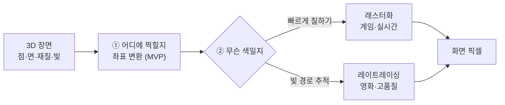

# 컴퓨터 그래픽스 (렌더링): 상세 학습 노트

> **용도**: NotebookLM 소스로 업로드해 요약·퀴즈·타임라인·개념정리에 활용.
> **읽는 순서**: 위에서 아래로 (개념이 계단식으로 쌓이도록 배치).
> **표기**: 한국어 설명 + (영어 용어). 각 단원 끝에 `참조` 링크. 문서 맨 끝에 전체 출처.
> **연결**: AI 학습 노트(`../ai-ml/concept.md`)와 GPU를 공유한다 — 12단원 참고.
> **주의**: 개념 이해용 요약. 정확한 수식·구현은 참조 원문 확인.

---

## 0. 큰 그림 — 3D 세계를 어떻게 "찍어" 화면에 담나

게임을 켜면 눈앞에 3D 세계가 펼쳐진다. 하지만 모니터는 결국 **납작한 픽셀 격자**일 뿐이다. 그러니 어딘가에서 누군가는 매 순간 "이 3차원 세계를, 지금 카메라 각도에서, 각 픽셀에 무슨 색으로 찍을지"를 **초당 수십 번** 계산하고 있어야 한다. 이 계산이 바로 **렌더링(rendering)** — 3D 장면(점·면·재질·빛·카메라)을 2D 픽셀 색으로 바꾸는 일이다. 사진사가 3D 세상을 필름 한 장에 담는 것과 본질이 같다.

이 "찍기"에는 오래된 두 철학이 있다. **래스터화(rasterization)**는 실용주의자다 — 물체를 이루는 삼각형들을 화면에 **빠르게 칠해** 치우고, 그림자·반사 같은 건 영리한 트릭으로 흉내 낸다. 속도가 생명인 **게임·실시간**의 방식이다. 반대로 **레이트레이싱(ray tracing)**은 이상주의자다 — 픽셀마다 **빛의 경로를 실제로 추적**해, 반사·굴절·그림자를 물리 그대로 계산한다. 느리지만 사실적이라 **영화·고품질**이 택한다. (요즘은 둘을 섞는다.)

두 방식 모두 픽셀·정점이 수백만 개라 **똑같은 계산을 대량으로 병렬** 수행해야 한다. 그래서 등장한 전용 하드웨어가 **GPU**다. 그리고 바로 이 "행렬을 대량으로 곱하는" 병렬성이 신경망 학습과 판박이라, 그래픽스용으로 태어난 GPU가 오늘날 **AI 붐**까지 떠받치게 됐다.



**학습 지도**

| 부 | 단원 | 한 줄 |
|----|------|-------|
| 1부 | 1. 렌더링이란 | 3D → 2D 픽셀로 변환 |
| 1부 | 2. 3D 장면의 구성 | 정점·메시·좌표계 |
| 1부 | 3. 변환 행렬 | 모델·뷰·투영(MVP) |
| 2부 | 4. 그래픽스 파이프라인 | 정점→래스터→픽셀 흐름 |
| 2부 | 5. 정점 셰이더 | 위치를 화면 좌표로 |
| 2부 | 6. 래스터화 | 삼각형을 픽셀로 채움 |
| 2부 | 7. 프래그먼트·깊이버퍼 | 픽셀 색과 가림 처리 |
| 2부 | 8. 셰이더와 GPU | 병렬 프로그램 |
| 3부 | 9. 조명 모델 | 확산·반사·앰비언트 |
| 3부 | 10. 텍스처 매핑 | 표면에 이미지 입히기 |
| 3부 | 11. 물리 기반 렌더링(PBR) | 실제 빛 물리 흉내 |
| 4부 | 12. 레이트레이싱 | 빛의 경로 추적 |
| 4부 | 13. 실시간 레이트레이싱 | RTX와 하이브리드 |

---

# 1부. 기초 개념

## 1. 컴퓨터 그래픽스와 렌더링이란

**컴퓨터 그래픽스(computer graphics)**: 컴퓨터로 이미지를 생성·조작하는 분야.
**렌더링(rendering)**: 3D 장면 데이터(형태·재질·조명·카메라)를 입력받아 2D 이미지(픽셀 색 배열)를 만들어내는 과정.

**두 갈래**
- **실시간 렌더링(real-time)**: 초당 30~120장 이상을 즉시 생성. 게임·VR. 주로 래스터화.
- **오프라인 렌더링(offline)**: 한 장에 몇 초~몇 시간. 영화·CG. 주로 레이/패스 트레이싱. 품질 우선.

**핵심 요약**: 렌더링 = 3D 장면을 2D 픽셀 이미지로 바꾸는 계산. 속도 우선(실시간) vs 품질 우선(오프라인).

`참조`: [Scratchapixel – Rendering 입문](https://www.scratchapixel.com/) · [위키백과: 렌더링](https://ko.wikipedia.org/wiki/렌더링)

## 2. 3D 장면의 구성 요소

- **정점(vertex)**: 3D 공간의 한 점 (x, y, z). 색·법선·텍스처 좌표 등 추가 속성을 가짐.
- **삼각형(polygon/triangle)**: 정점 3개로 이루는 면. GPU가 다루는 기본 단위(면을 삼각형으로 쪼갬).
- **메시(mesh)**: 삼각형이 모여 이룬 하나의 3D 물체 표면.
- **법선(normal)**: 면이 향하는 방향 벡터. 조명 계산의 핵심.
- **좌표계(coordinate space)**: 로컬(물체 기준) → 월드(장면 기준) → 뷰(카메라 기준) → 클립/스크린(화면).

> 왜 삼각형? 세 점은 항상 한 평면을 이루고(평면성 보장), 볼록해서 래스터화·보간이 간단하다.

**핵심 요약**: 3D 물체 = 정점으로 만든 삼각형 메시. 각 정점은 위치+법선+텍스처좌표를 가진다.

`참조`: [LearnOpenGL – Hello Triangle](https://learnopengl.com/Getting-started/Hello-Triangle) · [Scratchapixel – Geometry](https://www.scratchapixel.com/lessons/mathematics-physics-for-computer-graphics/geometry/)

## 3. 변환 행렬 (Model · View · Projection)

3D 물체를 화면에 놓으려면 좌표를 단계적으로 변환한다. 각 변환은 **4×4 행렬**로 표현하고, 곱해서 합친다.

1. **모델 행렬(Model)**: 물체를 월드 공간에 배치(이동·회전·크기).
2. **뷰 행렬(View)**: 카메라 시점으로 세상을 옮김(카메라가 원점을 보도록).
3. **투영 행렬(Projection)**: 3D를 2D 화면으로 눌러 담음.
   - *원근 투영(perspective)*: 멀수록 작게 (사람 눈처럼).
   - *직교 투영(orthographic)*: 거리와 무관하게 크기 유지 (설계도·2D).

```
화면 좌표 = Projection × View × Model × 정점좌표   (MVP)
```

> 3D 좌표에 w를 붙인 **동차좌표(homogeneous coordinates)**를 쓰면 이동·회전·투영을 모두 행렬 곱 하나로 통일할 수 있다.

**핵심 요약**: 정점은 Model→View→Projection 행렬을 거쳐 화면 좌표가 된다(MVP).

`참조`: [LearnOpenGL – Coordinate Systems](https://learnopengl.com/Getting-started/Coordinate-Systems) · [Scratchapixel – Transforms](https://www.scratchapixel.com/lessons/mathematics-physics-for-computer-graphics/geometry/row-major-vs-column-major-vector.html)

---

# 2부. 래스터화 파이프라인 (실시간 렌더링)

## 4. 그래픽스 파이프라인 개요

**그래픽스 파이프라인(graphics pipeline)**: 정점 데이터가 여러 단계를 거쳐 최종 픽셀이 되는 고정된 흐름. GPU가 이 단계들을 대량 병렬로 처리한다.

```
정점 데이터
  → [정점 셰이더]  각 정점을 화면 좌표로 변환 (프로그래머블)
  → [도형 조립]    정점을 삼각형으로 묶음
  → [래스터화]     삼각형을 덮는 픽셀(프래그먼트) 생성 (고정)
  → [프래그먼트 셰이더] 각 픽셀의 색 계산 (프로그래머블)
  → [테스트·블렌딩] 깊이/투명도 처리
  → 최종 프레임버퍼(화면)
```

- **프로그래머블 단계**: 정점·프래그먼트 셰이더 등 — 개발자가 코드(셰이더)로 바꿀 수 있음.
- **고정 단계**: 래스터화·깊이 테스트 등 — GPU 하드웨어가 정해진 방식으로 처리.

**핵심 요약**: 파이프라인 = 정점 셰이더 → 래스터화 → 프래그먼트 셰이더 → 출력. 일부는 프로그래머블, 일부는 고정.

`참조`: [Khronos – Rendering Pipeline Overview](https://www.khronos.org/opengl/wiki/Rendering_Pipeline_Overview) · [LearnOpenGL – Hello Triangle](https://learnopengl.com/Getting-started/Hello-Triangle) · [Fabian Giesen – A Trip Through the Graphics Pipeline](https://fgiesen.wordpress.com/2011/07/09/a-trip-through-the-graphics-pipeline-2011-index/)

## 5. 정점 셰이더 (Vertex Shader)

각 정점마다 한 번씩 실행되는 작은 프로그램. 주 역할은 **MVP 변환**으로 정점의 최종 화면 위치를 계산하는 것. 그 외에 조명용 값, 텍스처 좌표 등을 다음 단계로 넘긴다.

- 입력: 정점 하나의 속성(위치·법선·색·UV).
- 출력: 클립 공간 좌표 + 프래그먼트 셰이더로 전달할 값들.
- 정점끼리 독립적이라 GPU가 수천 개를 동시에 처리한다.

**핵심 요약**: 정점 셰이더 = 정점 위치를 화면 좌표로 바꾸는 병렬 프로그램.

`참조`: [LearnOpenGL – Shaders](https://learnopengl.com/Getting-started/Shaders) · [WebGL Fundamentals](https://webglfundamentals.org/)

## 6. 래스터화 (Rasterization)

**래스터화**: 삼각형이 화면에서 덮는 픽셀들을 찾아내는 과정. 각 픽셀 후보를 **프래그먼트(fragment)**라 한다.

- 삼각형 내부에 들어오는 픽셀을 판정하고, 정점의 값(색·깊이·UV)을 내부 픽셀들에 **보간(interpolation)**한다.
- "벡터(도형) → 래스터(픽셀 격자)"로 바꾼다고 해서 래스터화.
- 매우 빠르다: 삼각형 하나를 픽셀로 채우는 건 단순·병렬 작업.

**핵심 요약**: 래스터화 = 삼각형을 덮는 픽셀(프래그먼트)들을 찾고 정점 값을 보간하는 고정 단계.

`참조`: [Scratchapixel – Rasterization](https://www.scratchapixel.com/lessons/3d-basic-rendering/rasterization-practical-implementation/) · [위키백과: 래스터화](https://ko.wikipedia.org/wiki/래스터화)

## 7. 프래그먼트 셰이딩과 깊이 버퍼

**프래그먼트 셰이더(fragment/pixel shader)**: 각 프래그먼트(픽셀 후보)마다 실행되어 **최종 색**을 계산. 조명·텍스처·그림자 등 대부분의 "보이는 품질"이 여기서 결정된다.

**가림 처리 – 깊이 버퍼(Z-buffer)**: 여러 삼각형이 같은 픽셀을 덮을 때, 각 픽셀의 깊이(카메라와의 거리)를 저장해 **더 가까운 것만** 남긴다. 덕분에 앞 물체가 뒤 물체를 자연스럽게 가린다.

- **블렌딩(blending)**: 반투명 물체는 뒤 색과 섞어 처리.
- **안티에일리어싱(anti-aliasing)**: 계단현상(삐죽삐죽한 가장자리)을 부드럽게(MSAA 등).

**핵심 요약**: 프래그먼트 셰이더가 픽셀 색을 정하고, 깊이 버퍼가 앞뒤 가림을 처리한다.

`참조`: [LearnOpenGL – Depth Testing](https://learnopengl.com/Advanced-OpenGL/Depth-testing) · [Scratchapixel – Rasterization Stage](https://www.scratchapixel.com/lessons/3d-basic-rendering/rasterization-practical-implementation/rasterization-stage.html)

## 8. 셰이더와 GPU

**셰이더(shader)**: 파이프라인의 프로그래머블 단계에서 도는 작은 프로그램. GLSL/HLSL 같은 언어로 작성.
**GPU(그래픽 처리 장치)**: 단순 계산 코어 수천 개로 **같은 연산을 대량 데이터에 동시에**(SIMD/병렬) 수행. 픽셀·정점이 수백만 개라도 병렬로 처리.

> **AI와의 연결**: 신경망 학습도 거대한 행렬 곱의 병렬 연산이라 GPU가 최적이다. 그래픽스용으로 발전한 GPU가 딥러닝 붐을 이끈 이유. (→ AI 노트 5~7단원과 연결)

**핵심 요약**: 셰이더 = GPU에서 도는 병렬 프로그램. GPU의 대량 병렬성이 그래픽스와 AI 모두를 떠받친다.

`참조`: [The Book of Shaders](https://thebookofshaders.com/) · [LearnOpenGL – Shaders](https://learnopengl.com/Getting-started/Shaders)

---

# 3부. 조명과 셰이딩

## 9. 조명 모델 (Lighting / Shading)

빛이 표면에 닿아 보이는 밝기를 근사하는 계산. 고전 **퐁 반사 모델(Phong)**은 세 성분의 합:

1. **앰비언트(ambient)**: 사방에서 오는 은은한 기본 밝기(간접광 근사).
2. **디퓨즈(diffuse, 확산)**: 표면이 빛을 사방으로 퍼뜨림. 빛 방향과 법선의 각도로 결정(정면일수록 밝음).
3. **스페큘러(specular, 반사)**: 매끈한 표면의 하이라이트(반짝임). 시선·반사 방향이 일치할수록 강함.

- 계산 위치에 따라: **플랫**(면 단위), **고러드(Gouraud)**(정점 단위 후 보간), **퐁 셰이딩**(픽셀 단위, 부드러움).

**핵심 요약**: 밝기 ≈ 앰비언트 + 디퓨즈(각도) + 스페큘러(반짝임). 법선과 빛/시선 방향으로 계산.

`참조`: [LearnOpenGL – Basic Lighting](https://learnopengl.com/Lighting/Basic-Lighting) · [위키백과: 퐁 반사 모델](https://ko.wikipedia.org/wiki/퐁_반사_모델)

## 10. 텍스처 매핑 (Texture Mapping)

3D 표면에 2D 이미지(텍스처)를 입혀 디테일을 준다. 각 정점의 **UV 좌표**(텍스처 상의 위치)를 지정하면, 래스터화가 픽셀마다 보간해 알맞은 텍스처 색을 가져온다.

- **밉맵(mipmap)**: 멀리 있는 텍스처용으로 미리 축소한 버전들. 반짝임(에일리어싱) 방지·속도 향상.
- 응용 텍스처: **노멀맵**(요철을 가짜로 표현), **러프니스/메탈릭 맵**(PBR 재질), **환경맵**(주변 반사).

**핵심 요약**: 텍스처 매핑 = UV 좌표로 표면에 이미지를 붙이기. 밉맵으로 원거리 품질·속도 확보.

`참조`: [LearnOpenGL – Textures](https://learnopengl.com/Getting-started/Textures) · [Scratchapixel – Texturing](https://www.scratchapixel.com/)

## 11. 물리 기반 렌더링 (PBR)

**PBR(Physically Based Rendering)**: 빛과 재질의 상호작용을 실제 물리 법칙에 가깝게 계산해, 어떤 조명에서도 일관되게 사실적인 결과를 내는 방식.

- **에너지 보존**: 반사된 빛이 들어온 빛보다 많을 수 없다.
- **재질 파라미터**: *알베도(기본색)*, *메탈릭(금속성)*, *러프니스(거칠기)*. 이 값으로 다양한 재질을 표현.
- **BRDF**: 표면이 빛을 어느 방향으로 얼마나 반사하는지 기술하는 함수.

> 실시간(게임)과 오프라인(영화) 모두 오늘날 PBR 재질 워크플로를 표준으로 쓴다.

**핵심 요약**: PBR = 빛의 물리를 흉내 내 어떤 조명에서도 사실적. 알베도·메탈릭·러프니스로 재질 표현.

`참조`: [LearnOpenGL – PBR Theory](https://learnopengl.com/PBR/Theory) · [Physically Based Rendering Book (무료)](https://pbr-book.org/)

---

# 4부. 레이트레이싱

## 12. 레이트레이싱 (Ray Tracing) 원리

**레이트레이싱**: 카메라(눈)에서 각 픽셀로 **광선(ray)**을 쏘아, 장면의 물체와 부딪히는 지점을 찾고, 그 지점에서 빛이 어떻게 오는지를 추적해 색을 계산한다. 빛의 물리를 직접 시뮬레이션하므로 사실적이다.

- **부딪힘(intersection)**: 광선과 삼각형·구 등의 교차점 계산.
- **그림자 광선**: 교차점에서 광원으로 광선을 쏴, 막히면 그림자.
- **반사·굴절 광선**: 거울·유리는 광선을 튕기거나 꺾어 재귀적으로 추적.
- **패스 트레이싱(path tracing)**: 광선을 여러 번 무작위로 튕겨 간접광까지 계산 → 매우 사실적(영화용).
- 단점: 광선이 매우 많아 **무겁다**. 그래서 오랫동안 오프라인 전용이었다.

**핵심 요약**: 레이트레이싱 = 픽셀마다 빛의 경로를 추적해 색 계산. 사실적이지만 무겁다.

`참조`: [Ray Tracing in One Weekend (Peter Shirley, 무료)](https://raytracing.github.io/) · [Scratchapixel – Ray Tracing](https://www.scratchapixel.com/lessons/3d-basic-rendering/introduction-to-ray-tracing/)

## 13. 실시간 레이트레이싱과 하이브리드 (RTX)

최근 GPU(예: NVIDIA RTX)는 광선-교차 계산을 가속하는 전용 하드웨어를 넣어 **실시간 레이트레이싱**을 가능케 했다. 다만 전부 레이트레이싱하면 여전히 무거워, 보통 **하이브리드**로 쓴다.

- **하이브리드 렌더링**: 기본 화면은 빠른 **래스터화**로 그리고, 반사·그림자·전역조명 등 어려운 부분만 **레이트레이싱**으로 보강.
- **가속 구조(BVH)**: 광선이 매번 모든 삼각형을 검사하지 않도록 공간을 트리로 나눠 빠르게 찾음.
- **디노이징(denoising)**: 광선을 적게 쏴 생긴 노이즈를 AI 등으로 깨끗하게 — 여기서도 AI가 그래픽스와 만난다.

**핵심 요약**: 실시간 RT = 래스터화(빠름) + 레이트레이싱(사실적)을 섞고, BVH·디노이징으로 가속.

`참조`: [Real-Time Rendering (책 포털·자료)](https://www.realtimerendering.com/) · [NVIDIA – Ray Tracing 소개](https://developer.nvidia.com/discover/ray-tracing)

---

## 래스터화 vs 레이트레이싱 한눈 비교

| 항목 | 래스터화 | 레이트레이싱 |
|------|----------|--------------|
| 방식 | 도형을 픽셀로 투영·채움 | 픽셀에서 빛 경로를 추적 |
| 속도 | 매우 빠름 | 무거움 |
| 사실성 | 조명은 근사(트릭 필요) | 반사·그림자·굴절이 자연스러움 |
| 주 용도 | 게임·실시간·VR | 영화·CG·고품질, 최근 실시간 보강 |
| 그림자·반사 | 별도 기법으로 흉내 | 물리적으로 자동 |

---

## 한 줄 용어 사전 (한↔영)

| 한국어 | English | 뜻 |
|--------|---------|-----|
| 렌더링 | rendering | 3D 장면을 2D 이미지로 변환 |
| 정점 | vertex | 3D 공간의 점(속성 포함) |
| 메시 | mesh | 삼각형이 모인 3D 표면 |
| 법선 | normal | 면이 향하는 방향 벡터 |
| MVP | model/view/projection | 좌표 변환 3단계 행렬 |
| 파이프라인 | graphics pipeline | 정점→픽셀 처리 흐름 |
| 셰이더 | shader | GPU에서 도는 병렬 프로그램 |
| 래스터화 | rasterization | 삼각형을 픽셀로 채우기 |
| 프래그먼트 | fragment | 픽셀 후보(색 계산 대상) |
| 깊이 버퍼 | z-buffer | 앞뒤 가림 처리용 거리 저장 |
| 보간 | interpolation | 정점 값을 픽셀에 나눠 채움 |
| 텍스처 | texture | 표면에 입히는 이미지 |
| UV 좌표 | UV coordinates | 텍스처 상의 위치 |
| 밉맵 | mipmap | 축소 텍스처 버전들 |
| 디퓨즈/스페큘러 | diffuse/specular | 확산광/반사 하이라이트 |
| PBR | physically based rendering | 물리 기반 렌더링 |
| 알베도 | albedo | 재질의 기본색 |
| 레이트레이싱 | ray tracing | 빛 경로 추적 렌더링 |
| 패스 트레이싱 | path tracing | 간접광까지 추적하는 방식 |
| BVH | bounding volume hierarchy | 광선 교차 가속 트리 |

---

## NotebookLM 활용 팁

- 시켜볼 만한 것:
  - "래스터화와 레이트레이싱을 비교 표로 정리하고 5문항 퀴즈 만들어줘"
  - "그래픽스 파이프라인 단계를 순서도처럼 설명해줘"
  - "MVP 변환을 중학생에게 설명하듯 다시 써줘"
  - "이 노트와 AI 노트에서 GPU가 공통으로 쓰이는 이유를 요약해줘"

### NotebookLM에 소스로 직접 추가하면 좋은 링크 (복사용)

```
https://learnopengl.com/
https://www.scratchapixel.com/
https://www.khronos.org/opengl/wiki/Rendering_Pipeline_Overview
https://thebookofshaders.com/
https://pbr-book.org/
https://raytracing.github.io/
https://www.realtimerendering.com/
https://webglfundamentals.org/
https://fgiesen.wordpress.com/2011/07/09/a-trip-through-the-graphics-pipeline-2011-index/
```

---

## 전체 참조 출처

**입문·전반**
- Scratchapixel — https://www.scratchapixel.com/
- LearnOpenGL (Joey de Vries) — https://learnopengl.com/
- WebGL Fundamentals — https://webglfundamentals.org/
- MIT OpenCourseWare 6.837 Computer Graphics — https://ocw.mit.edu/courses/6-837-computer-graphics-fall-2012/

**파이프라인·GPU**
- Khronos OpenGL Wiki – Rendering Pipeline Overview — https://www.khronos.org/opengl/wiki/Rendering_Pipeline_Overview
- Fabian Giesen – A Trip Through the Graphics Pipeline — https://fgiesen.wordpress.com/2011/07/09/a-trip-through-the-graphics-pipeline-2011-index/
- The Book of Shaders — https://thebookofshaders.com/

**조명·PBR·레이트레이싱**
- Physically Based Rendering (Pharr, Jakob, Humphreys, 무료) — https://pbr-book.org/
- Ray Tracing in One Weekend (Peter Shirley) — https://raytracing.github.io/
- Real-Time Rendering (Akenine-Möller 외, 자료 포털) — https://www.realtimerendering.com/
- NVIDIA – Ray Tracing — https://developer.nvidia.com/discover/ray-tracing

_작성: 2026-07 · 개념 이해용 학습 노트 (정확한 수식·구현은 원문 확인). 링크는 접속 시점에 따라 변동될 수 있음._
