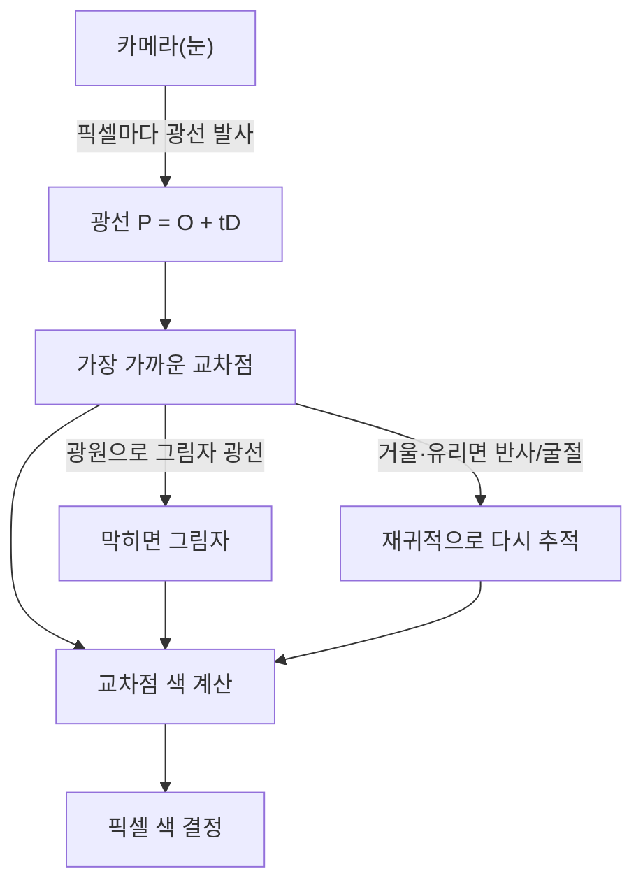

# 딥다이브 — 렌더링 수학 (좌표변환·래스터화·레이트레이싱)

> 기반: **LearnOpenGL – Coordinate Systems** ([링크](https://learnopengl.com/Getting-started/Coordinate-Systems)) · **Scratchapixel – Ray Tracing / Rasterization** ([링크](https://www.scratchapixel.com/)) · **PBR Book** ([링크](https://pbr-book.org/))
> 형식: 12살 요약 → 수식 심화. 얕은 버전은 [qna.md](qna.md), [concept.md](concept.md).

---

## 0. 30초 직관 — 3D 세계를 사진 한 장으로

게임 화면이든 픽사 영화든, 결국 하는 일은 하나다: **3차원 공간에 떠 있는 점들을, 2차원 화면의 픽셀 색으로 바꾸기.** 사진사가 3D 세상을 카메라로 찍어 평면 사진으로 만드는 것과 똑같다.

이 "찍기"는 두 단계다. 먼저 **어디에 찍힐지**(위치) — 물체 좌표를 여러 번 행렬로 변환해 화면 좌표로 옮긴다(모델→카메라→화면). 그다음 **무슨 색일지**(빛) — 두 가지 방식이 있다. **래스터화**는 삼각형을 픽셀로 빠르게 칠하고(게임), **레이트레이싱**은 픽셀마다 빛의 경로를 추적해 사실적으로 계산한다(영화). 아래에서 그 수학을 하나씩 본다.

---

## 1. 좌표 변환 파이프라인 (MVP)

정점(vertex)은 다섯 좌표계를 차례로 거친다:

*(도식 설명: 물체의 로컬 좌표가 Model→View→Projection 행렬을 차례로 거쳐 클립 공간으로 가고, 마지막 원근 나눗셈(÷w)으로 화면 픽셀 좌표가 된다.)*
행렬 곱으로 (오른쪽→왼쪽 순서로 적용):
$$
V_{clip} = M_{proj}\,M_{view}\,M_{model}\,V_{local}
$$
- **Model 행렬**: 물체를 로컬 원점에서 월드로 배치(이동·회전·크기).
- **View 행렬**: 씬 전체를 카메라 시점으로 옮김.
- **Projection 행렬**: 3D를 클립 공간으로 눌러 담아 원근을 준비.

> LearnOpenGL: 곱은 오른쪽부터 평가 — Model이 먼저, 그다음 View, 마지막 Projection.

---

## 2. 투영과 원근 나눗셈

### 동차좌표(homogeneous coordinates)
3D 점 (x,y,z)에 네 번째 성분 **w**를 붙여 (x,y,z,w)로 다룬다. 이 w가 **원근 나눗셈**을 가능케 하는 열쇠. 덕분에 이동·회전·투영을 **행렬 곱 하나로 통일**한다.

### 원근 투영(perspective) vs 직교(orthographic)
- **원근**: 멀수록 w가 커진다. LearnOpenGL: *"the further away a vertex is, the higher its w component becomes."* 이후 **원근 나눗셈**(각 좌표를 w로 나눔)으로 먼 물체가 작아진다 → 사람 눈처럼.
- **직교**: w=1로 유지 → 나눗셈이 효과 없음 → 거리와 무관하게 크기 유지(설계도·2D).

---

## 3. 래스터화 수학

투영된 삼각형이 화면에서 덮는 픽셀을 찾는다.

### 무게중심 좌표(barycentric coordinates)
삼각형 정점 A,B,C에 대해 내부 점 P를:
$$
P = \alpha A + \beta B + \gamma C,\quad \alpha+\beta+\gamma = 1,\quad \alpha,\beta,\gamma \ge 0
$$
- α,β,γ가 모두 0 이상이면 **P는 삼각형 내부** → 그 픽셀은 삼각형에 속함.
- 같은 α,β,γ로 정점의 색·깊이·UV를 **보간(interpolation)**해 픽셀 값을 만든다.

### 깊이 버퍼(z-buffer)
여러 삼각형이 같은 픽셀을 덮으면, 보간한 **깊이 z**를 비교해 **가장 가까운 것**만 남긴다 → 앞 물체가 뒤를 가림.

> 래스터화가 빠른 이유: 삼각형 하나를 픽셀로 채우는 건 단순·병렬 작업이라 GPU에 최적.

---

## 4. 레이트레이싱 수학

카메라(눈)에서 픽셀로 광선을 쏴, 부딪힌 물체의 색을 계산.

### 광선(ray) 정의
$$
P(t) = O + tD, \quad t \ge 0 \qquad (O=\text{카메라}, \ D=\text{방향})
$$

### 카메라 광선 생성 (Scratchapixel 단계)
픽셀 좌표 → 월드 방향으로 변환:
1. **Raster→NDC**: 픽셀을 이미지 크기로 나눠 [0,1].
2. **NDC→Screen**: [-1,1]로 재매핑(중앙 기준).
3. **종횡비 보정**: x에 width/height 곱해 정사각 픽셀 유지.
4. **시야각(FOV)**: 좌표에 `tan(FOV/2)` 곱해 보이는 범위 조절.
5. **카메라→월드 변환**: 카메라 공간 방향을 월드로.

### 교차(intersection)
- 광선과 물체(구·삼각형)의 교차점 t를 구함. 여러 개면 **가장 작은 t(가장 가까운 hit)** 채택.
- Scratchapixel: 교차하면 *"the color of the pixel ... is set with the color of the object at this intersection point."*

### 광선 종류 (재귀)
- **1차 광선(primary)**: 카메라 → 픽셀.
- **그림자 광선(shadow)**: 교차점 → 광원. 막히면 그림자.
- **반사/굴절 광선**: 거울·유리에서 튕기거나 꺾여 재귀적으로 추적.
- **패스 트레이싱**: 여러 번 무작위로 튕겨 간접광까지 → 매우 사실적(영화).

*(도식 설명: 카메라에서 픽셀마다 광선을 쏴 가장 가까운 교차점을 찾고, 그 점에서 그림자·반사/굴절 광선을 재귀로 추적해 색을 계산한 뒤 픽셀 색을 정한다.)*

---

## 5. 조명 모델 — 퐁(Phong) 수식

한 점의 밝기 = 세 성분의 합:
$$
I = k_a I_a + k_d\,(N\cdot L)\,I_d + k_s\,(R\cdot V)^n\,I_s
$$
- **앰비언트** `k_a·I_a`: 사방의 은은한 기본 밝기.
- **디퓨즈** `k_d·(N·L)`: 표면 법선 N과 빛 방향 L의 내적. 정면일수록(N·L 큼) 밝음.
- **스페큘러** `k_s·(R·V)^n`: 반사 방향 R과 시선 V의 내적을 n제곱. n(광택)이 클수록 하이라이트가 좁고 날카로움.
- 내적(dot product)이 "두 방향이 얼마나 일치하나"를 재는 도구로 조명의 핵심.

> 현대는 물리 기반(PBR): 에너지 보존·BRDF로 더 사실적. (→ [concept.md](concept.md) 11장)

---

## 6. 왜 GPU인가 (연결)

- 좌표 변환(행렬 곱)·픽셀 셰이딩·광선 교차 모두 **대량 병렬 계산** → GPU가 수천 코어로 동시에 처리.
- 이 행렬 곱 병렬성은 **신경망 학습과 동일한 연산** → 그래픽스 GPU가 AI 붐도 이끔. (→ [../graphics-vs-ml.md](../graphics-vs-ml.md))

---

## 용어 사전
| 용어 | 뜻 |
|------|-----|
| MVP | Model·View·Projection 변환 |
| 동차좌표 | (x,y,z,w), w로 원근 나눗셈 |
| 원근 나눗셈 | 좌표를 w로 나눠 원근 부여 |
| 무게중심좌표 | α,β,γ로 삼각형 내부·보간 |
| z-buffer | 깊이 비교로 가림 처리 |
| ray = O+tD | 광선의 원점+방향 표현 |
| N·L | 법선·빛 내적(디퓨즈) |
| BRDF | 표면의 빛 반사 함수(PBR) |

## 출처
- Joey de Vries. *LearnOpenGL – Coordinate Systems.* — https://learnopengl.com/Getting-started/Coordinate-Systems
- Scratchapixel. *Ray Tracing: Generating Camera Rays / Rasterization.* — https://www.scratchapixel.com/
- Pharr, Jakob, Humphreys. *Physically Based Rendering.* — https://pbr-book.org/

_짧은 인용은 출처 표기, 수식은 표준 표기로 재정리._
