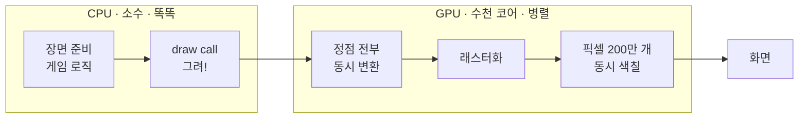

# 자바 개발자를 위한 컴퓨터 그래픽스 — 아는 걸로 이해하기

> 관점: 그래픽스도 **아는 Java 개념의 재배치**로 볼 수 있다. 특히 **파이프라인 = Stream, 셰이더 = 람다, GPU = parallelStream 극한, 레이트레이싱 = 재귀**.
> 관련: [concept.md](concept.md) · [../ai-ml/for-java-devs.md](../ai-ml/for-java-devs.md) · [../roadmap.md](../roadmap.md).

---

## 0. 한 장 요약 — 그래픽스 ↔ Java 대응표

| 그래픽스 개념 | Java로 치면 | 한 줄 |
|--------------|------------|-------|
| **정점(Vertex)·메시** | POJO + 리스트 | `class Vertex{float x,y,z;}`, mesh = `List<Vertex>` |
| **변환행렬 MVP** | **함수 합성/데코레이터** | model→view→proj = `f(g(h(x)))`, 행렬곱 = 합성 |
| **렌더링 파이프라인** | **Stream 파이프라인** | 정점 → 변환 → 래스터화 → 픽셀, 단계마다 `.map()` |
| **정점/프래그먼트 셰이더** | **파이프라인에 꽂는 람다(콜백)** | 각 원소에 적용하는 `Function` |
| **GPU 병렬** | **`parallelStream()`의 극한(SIMD)** | 같은 함수를 수백만 개에 동시에 |
| **셰이더 uniform** | **`final` 상수 필드(config)** | 모든 호출에 공통 값 |
| **정점 attribute** | **메서드 파라미터** | 원소마다 다른 입력 |
| **깊이 버퍼(z-buffer)** | **`float[][]` + "더 가까우면 덮어쓰기"** | 픽셀별 최소 z 유지(reduce/min) |
| **텍스처** | **룩업 테이블·`BufferedImage` 인덱싱** | `texture[u][v]` 샘플 |
| **레이트레이싱** | **재귀(recursion)** | 광선이 맞으면 반사·굴절 광선 재귀 호출, 깊이 제한 = base case |
| **draw call** | **GPU에 메서드 호출** | 그려라 명령 1건 |
| **GLSL** | **JVM 밖 별도 미니 언어(DSL)** | GPU에서 컴파일·실행 |
| **조명(Phong)** | **순수 함수** | normal·light·view로 색 계산 |

---

## 1. 렌더링 파이프라인 = Stream 파이프라인 (핵심)

그래픽스 파이프라인은 데이터가 **단계를 거치며 변환**된다 — 정확히 자바 Stream이다.

```java
// 개념적 의사코드
List<Pixel> frame = mesh.vertices.stream()
    .map(v -> vertexShader(v))      // 정점 변환 (MVP)
    .collect(rasterize())            // 삼각형 → 픽셀 조각
    .stream()
    .map(frag -> fragmentShader(frag))  // 픽셀 색 결정
    .collect(toFrameBuffer());
```

- 각 **단계(stage)** = `.map()` 하나. 데이터(정점→조각→픽셀)가 흐르며 모양이 바뀐다.
- (→ [concept.md](concept.md) 4장 파이프라인 개요와 같은 그림.)

---

## 2. 셰이더 = 람다 콜백, GPU = parallelStream 극한

- **셰이더**는 파이프라인 단계에 **당신이 꽂는 함수**다. `Function<Vertex, Vertex>`(정점) / `Function<Fragment, Color>`(프래그먼트).
- **GPU**는 이 함수를 **수백만 개 데이터에 동시에** 실행한다. `vertices.parallelStream().map(shader)`의 **극한판**(SIMD).
  - 차이: 자바 `parallelStream`은 CPU 코어 몇 개. GPU는 코어 **수천 개**가 같은 코드를 일제히.
- **uniform** = 모든 호출이 공유하는 `final` 상수(예: 카메라 위치). **attribute** = 원소마다 다른 파라미터(예: 각 정점 좌표).

---

## 3. 변환행렬(MVP) = 함수 합성

- 모델→월드→뷰→투영은 **변환을 차례로 적용**하는 것. 자바로는 **함수 합성**:
  ```java
  Matrix mvp = projection.multiply(view).multiply(model); // f∘g∘h
  Vertex clip = mvp.apply(vertex);
  ```
- **행렬 곱 = 함수 합성**이라는 한 문장이 핵심. (데코레이터로 변환을 겹겹이 감싸는 것과 같은 감각.)

---

## 4. 레이트레이싱 = 재귀

- 광선을 쏘고, 물체에 **맞으면** 그 지점에서 **반사·굴절 광선을 또 쏜다** → **재귀 호출**.
  ```java
  Color trace(Ray ray, int depth) {
      if (depth == 0) return BLACK;              // base case (재귀 종료)
      Hit hit = scene.intersect(ray);
      if (hit == null) return background;
      Color reflected = trace(hit.reflectRay(), depth - 1); // 재귀
      return shade(hit) .add(reflected);
  }
  ```
- **깊이 제한(depth)** = 재귀 스택 폭발을 막는 base case. 래스터화(2장)가 Stream이라면, 레이트레이싱은 **재귀**다.

---

## 5. 비유가 깨지는 지점 (주의)

- **GPU는 JVM이 아니다**: 셰이더(GLSL)는 자바처럼 JVM에서 안 돈다. **별도로 컴파일**돼 GPU에서 실행되는 **다른 언어**(C 비슷). 자바에서 문자열/파일로 넘겨 올린다.
- **분기(if)가 비싸다**: 자바 스레드는 각자 다른 길을 가도 되지만, GPU는 **수천 코어가 보조를 맞춰** 실행(SIMD)해서 셰이더 안 `if`로 갈라지면 성능이 뚝 떨어진다(divergence). "병렬 = 공짜"가 아니다.
- **객체지향보다 데이터지향**: 그래픽스는 `List<Vertex>` 같은 **거대한 배열을 통째로** 빠르게 미는 게 핵심(캐시·SIMD). OOP 추상화보다 **데이터 배치(layout)**가 성능을 지배한다.

---

## 6. 누가 언제 그리나 — CPU·GPU·병렬 (실행 모델)

처음 배울 때 가장 헷갈리는 부분: 그래픽은 **CPU 한 스레드가 하나씩 그리는 게 아니다.** CPU는 **명령만** 내리고, **GPU 수천 코어가 픽셀을 동시에** 칠한다.

| | CPU | GPU |
|---|-----|-----|
| 일꾼 수 | 소수(4~16) | **수천** |
| 성격 | 똑똑, 복잡한 일 | 단순, 같은 일 반복 |
| 역할 | 장면 준비·**명령(draw call)**·게임 로직 | **실제 그리기**(정점 변환·픽셀 색칠) |

**자바 렌즈**: GPU는 `parallelStream()`의 극한 — 코어가 수천 개.
```java
// CPU 방식이면 느림 — 한 스레드가 픽셀 하나씩
for (Pixel p : pixels) p.color = shade(p);

// GPU 방식 — 픽셀마다 일꾼이 붙어 동시에 (코어 수천 개)
pixels.parallelStream().forEach(p -> p.color = shade(p));
```



*(도식 설명: CPU가 장면을 준비하고 'draw call'로 명령하면, GPU가 정점을 동시에 변환하고 래스터화한 뒤 수백만 픽셀을 동시에 색칠해 화면에 낸다. CPU는 그동안 다음 프레임을 준비한다.)*

- **왜 병렬 가능?** 픽셀 하나 계산은 **옆 픽셀과 독립**(embarrassingly parallel) → 다 동시에. 반대로 게임 로직은 순서 의존이라 CPU가 맡는다.
- **CPU·GPU는 동시에**(비동기): CPU가 다음 프레임 준비하는 동안 GPU가 현재 프레임을 그린다. (작업을 큐에 `submit`하는 비동기 워커 풀 감각)
- **스레드 성격 차이**: 자바 스레드 = 수십 개가 **각자 다른 일**(MIMD). GPU = 수천 개가 **전부 같은 셰이더**를 다른 픽셀에(SIMD) → 그래서 셰이더 `if` 분기가 비싸다(§5 divergence).

---

## 한 줄 요약

그래픽스를 자바로 번역하면: **파이프라인 = Stream, 셰이더 = 람다 콜백, GPU = parallelStream의 극한, MVP = 함수 합성, 레이트레이싱 = 재귀.** 단 **GPU는 JVM 밖 별도 언어이고, 분기가 비싸며, OOP보다 데이터 배치가 성능을 좌우**한다는 세 가지가 다르다.

## 참조
- [concept.md](concept.md) · [deep-rendering-math.md](deep-rendering-math.md) · [../ai-ml/for-java-devs.md](../ai-ml/for-java-devs.md)
