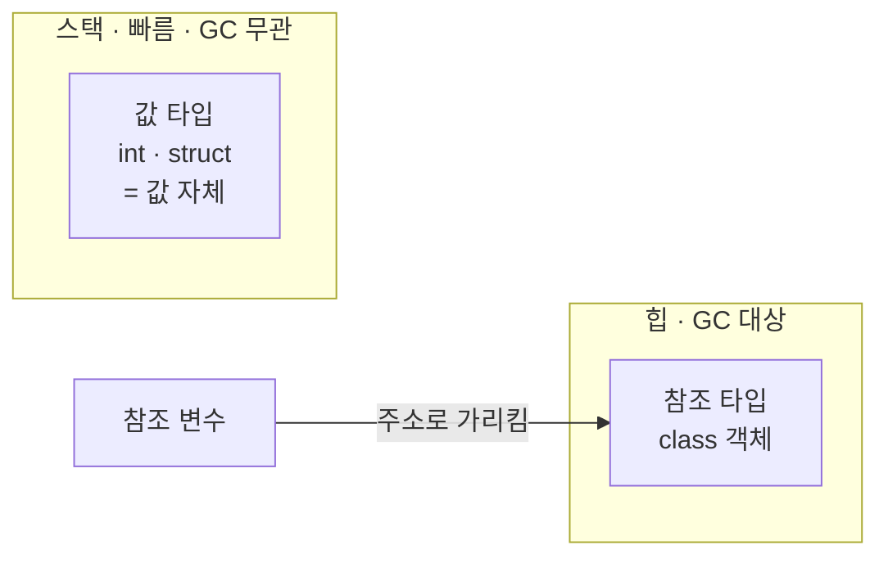

# C# — 개념 노트 (얕게 시작)

> 용도: Unity와 직결되는 언어. Java를 알면 90%는 익숙하다.
> 심화는 물어보면서 점점 파기. 관련: [../java/concept.md](../java/concept.md) · [../../unity/concept.md](../../unity/concept.md)

---

## 0. 큰 그림 — Java를 알면 C#은 거의 공짜

좋은 소식부터: Java를 할 줄 알면 C#은 **이미 90%를 아는 셈**이다. 문법 대부분이 겹치니까. 그러니 "새 언어 하나 더"가 아니라 "몇 가지 차이만 더"로 접근하면 된다.

C#은 마이크로소프트가 만든 언어로, **Java와 매우 비슷한 객체지향 언어**다. Unity 게임 개발의 기본 언어이기도 하다. Java를 안다면 문법 대부분이 친숙하고, 몇 가지 차이(값/참조 타입 구분, `struct`, LINQ, `async/await`)만 새로 익히면 된다.

## 1. Java와 비슷한 점
- 클래스·객체·상속·인터페이스 등 **OOP 기본이 거의 동일**.
- 자동 메모리 관리(**GC**), 강한 타입.
- 중괄호 문법(`{}`)도 비슷.

## 2. Java와 다른 핵심 (얕게)
- **값 타입 vs 참조 타입**: `struct`(값, 스택/인라인) vs `class`(참조, 힙). Java의 원시/객체 구분과 닮았지만 C#은 **내가 struct를 직접 만들 수 있다.**
- **박싱**: 값 타입을 `object`로 감싸면 **힙 할당** → Unity에서 GC 부담(→ [../java/types-boxing.md](../java/types-boxing.md)와 같은 원리).
- **LINQ**: 데이터를 SQL처럼 질의(`where`, `select`).
- **async/await**: 비동기 코드를 동기처럼 쉽게 쓰는 문법.

*(도식 설명: 값 타입(struct·int)은 스택에 값 자체로 놓여 GC와 무관하고, 참조 타입(class)은 힙에 객체로 생겨 참조 변수가 그 주소를 가리킨다.)*

값 타입은 복사하면 서로 딴 몸이 되고, 참조 타입은 같은 객체를 함께 가리킨다. 게임 루프에서 값 타입(struct)을 잘 쓰면 힙 할당이 줄어 **GC 부담이 낮아진다** — Unity 최적화의 핵심.

**핵심 요약**: C# = "Java와 사촌". 값/참조 타입, struct, LINQ, async만 새로 익히면 된다.

## 참조
- Microsoft, C# 문서 — https://learn.microsoft.com/dotnet/csharp/

_이 노트는 얕은 시작. 값/참조 타입, LINQ, async 등은 물어보면 더 깊이 파봄._
