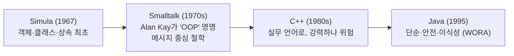

# Java의 OOP·상속: 개념 → 어원 → 추구하는 방향

> **용도**: NotebookLM 소스 및 복습용. 이미 쓰는 Java를 "문법"이 아니라 **개념·역사·철학**으로 이해.
> **관점**: 언어는 도구지만, 그 도구가 *왜 그렇게 설계됐는지*를 알면 훨씬 잘 쓴다.
> **연결**: [../../roadmap.md](../../roadmap.md) · [types-boxing.md](types-boxing.md) · 게임엔진(Unity C#/Unreal C++)도 OOP 기반이라 그래픽스 트랙과도 연결.

---

## 0. 큰 그림

**객체지향 프로그래밍(OOP)**은 프로그램을 "데이터(상태)와 그 데이터를 다루는 동작(메서드)을 하나로 묶은 **객체(object)**들의 상호작용"으로 바라보는 설계 방식이다. 현실 세계를 객체로 모델링해 **복잡도를 관리**하는 것이 목적. 이 아이디어는 1960년대 **Simula**에서 시작해 **Smalltalk**(Alan Kay가 "object-oriented"라는 말을 만듦)에서 꽃폈고, **C++**를 거쳐 **Java**(1995)가 대중화했다. Java는 "복잡하고 위험한 C++"의 대안으로 **단순함·안전함·이식성(WORA)**을 추구하며 OOP를 주류로 끌어올렸다.

---

## 1. OOP의 4대 개념 (Java의 뼈대)

| 개념 | 뜻 | 한 줄 |
|------|-----|-------|
| **캡슐화(encapsulation)** | 데이터를 숨기고 메서드로만 접근 | 내부는 감추고 필요한 창구만 연다 (`private` + getter/setter) |
| **상속(inheritance)** | 기존 클래스의 특성을 물려받아 확장 | 공통을 부모에 두고 자식이 이어받는다 (`extends`) |
| **다형성(polymorphism)** | 같은 호출이 객체에 따라 다르게 동작 | `draw()` 하나로 원·사각형이 각자 그림 |
| **추상화(abstraction)** | 핵심만 남기고 세부를 감춤 | "무엇을 하는가"만 노출, "어떻게"는 숨김 (인터페이스) |

**핵심 요약**: OOP = 캡슐화·상속·다형성·추상화로 복잡한 프로그램을 객체 단위로 나눠 관리.

`참조`: [위키백과: 객체 지향 프로그래밍](https://ko.wikipedia.org/wiki/객체_지향_프로그래밍) · [Wikipedia: OOP](https://en.wikipedia.org/wiki/Object-oriented_programming)

---

## 2. 상속(Inheritance) — 자세히

**정의**: 어떤 클래스(자식/subclass)가 다른 클래스(부모/superclass)의 필드·메서드를 물려받는 것. 공통 코드를 부모에 모아 **재사용**하고, 자식은 차이점만 추가·변경한다.

```java
class Animal {              // 부모
    String name;
    void breathe() { ... }  // 공통 동작
    void sound() { System.out.println("..."); }
}

class Dog extends Animal {  // 자식: Animal을 상속
    @Override
    void sound() { System.out.println("멍멍"); }  // 재정의(오버라이드)
}
```

- **is-a 관계**: "Dog **is a** Animal"이 성립할 때 상속이 적절하다.
- **오버라이드(override)**: 부모 메서드를 자식이 다시 정의 → **다형성**의 핵심.
- **`super`**: 부모의 생성자·메서드 호출.

**상속의 그림자 (현대적 주의)**
- 부모가 바뀌면 자식이 줄줄이 영향받는 **강한 결합**. (취약한 기반 클래스 문제)
- Java는 **다중 상속(부모 여럿) 금지** — 충돌·복잡도 때문. 대신 **인터페이스**로 여러 타입을 구현.
- 그래서 현대 설계 격언: **"상속보다 조합(Composition over Inheritance)"** — 물려받기보다 필요한 객체를 *가지고 있게* 하라.

**핵심 요약**: 상속 = 공통을 부모에 두고 자식이 물려받아 확장(is-a). 강하게 얽히므로, 요즘은 "상속보다 조합"을 권한다.

`참조`: [Oracle Java Tutorials – Inheritance](https://docs.oracle.com/javase/tutorial/java/IandI/subclasses.html)

---

## 3. 어원과 역사 (왜 이렇게 생겼나)

객체지향은 어느 날 뚝 떨어진 게 아니라, **"복잡한 프로그램을 어떻게 인간이 감당할까"**라는 고민이 30년에 걸쳐 다듬어진 결과다. 시뮬레이션에서 태어나(Simula), 철학이 붙고(Smalltalk), 실무로 내려왔다가(C++), 대중화됐다(Java).



### 3-1. Simula (1960년대) — 최초의 객체
- 노르웨이의 O.-J. Dahl과 K. Nygaard가 **시뮬레이션**을 위해 설계.
- **객체·클래스·상속·서브클래스·가상 메서드** 개념을 처음 도입. → OOP의 조상.

### 3-2. Smalltalk / Alan Kay (1970년대) — "object-oriented"라는 말의 탄생
- Alan Kay가 Simula에 영감받아, Xerox PARC에서 Smalltalk 개발.
- **"object-oriented programming"이라는 용어를 만든 사람**(1960년대 후반부터 사용).
- 그의 원래 핵심은 흔히 오해하는 "상속"이 아니라 → **① 메시지 전달(messaging) ② 상태 캡슐화 ③ 늦은 바인딩(late binding)**. 객체끼리 *메시지를 주고받는* 것이 본질이라 봄.

### 3-3. C++ (1980년대) — OOP를 실무 언어로
- Bjarne Stroustrup이 C에 객체 개념을 붙여 만듦("C with Classes").
- 강력하지만 **복잡하고, 메모리를 직접 관리해 위험**(포인터, 수동 해제).

### 3-4. Java (1991 Oak → 1995) — 단순·안전·이식성
- James Gosling(Sun)이 처음엔 **작은 임베디드 기기**용으로 시작(프로젝트명 *Oak*).
- 목표: C 같은 익숙한 문법 + C/C++보다 **더 정밀하고 단순하며 안전하고 이식성 있게**.
- 1995년 공개, **"Write Once, Run Anywhere(WORA)"** — 한 번 짜면 어디서든 실행(JVM 위에서).

**핵심 요약**: 객체·상속은 Simula(1967)에서, "OOP"라는 말과 메시지 철학은 Alan Kay/Smalltalk에서, 실무화는 C++, 대중화는 Java에서. Java는 "복잡한 C++"의 안전·단순 대안으로 나왔다.

`참조`: [A Brief History of OOP (UT EECS)](https://web.eecs.utk.edu/~bvanderz/cs302/notes/oo-intro.html) · [Wikipedia: James Gosling](https://en.wikipedia.org/wiki/James_Gosling) · [Gosling – Java: an Overview (1995, PDF)](https://horstmann.com/corejava/java-an-overview/7Gosling.pdf)

---

## 4. Java가 추구하는 방향 (설계 철학)

| 철학 | 무슨 뜻 | 어떻게 구현했나 |
|------|---------|-----------------|
| **단순함(Simplicity)** | C++의 복잡·위험 요소 제거 | 포인터 산술·다중상속·연산자 오버로딩 제거 |
| **안전함(Safety)** | 프로그래머 실수를 막음 | **가비지 컬렉션(GC)**으로 메모리 자동 관리, 강한 타입 검사, 예외 처리 |
| **이식성(Portability, WORA)** | 어디서든 같은 결과 | 소스 → **바이트코드** → 어떤 **JVM**에서든 실행 |
| **객체지향 일관성** | 거의 모든 것을 객체로 | 클래스 중심 설계, 표준 라이브러리도 객체 |
| **네트워크·분산 지향** | 초기부터 인터넷 시대를 겨냥 | 안전한 실행, 플랫폼 독립 |

> **한 줄 철학**: "복잡하고 위험한 부분을 걷어내고(단순·안전), 어디서든 돌게 한다(이식성)." 이 방향이 Java를 기업용 표준으로 만들었다.

**핵심 요약**: Java의 방향 = 단순·안전(GC)·이식성(WORA). "강력하지만 위험한" C++의 대안으로 설계됨.

`참조`: [Gosling – Java: an Overview (1995)](https://horstmann.com/corejava/java-an-overview/7Gosling.pdf) · [Wikipedia: Java (programming language)](https://en.wikipedia.org/wiki/Java_(programming_language))

---

## 5. 다른 관점과의 연결 (개념 확장)

- **절차지향 vs 객체지향**: 절차지향은 "함수의 흐름" 중심, 객체지향은 "데이터+동작 묶음" 중심.
- **OOP vs 함수형(FP)**: FP는 상태 변화를 피하고 함수 조합을 강조. 현대 언어(Java도 8부터 람다·스트림)로 둘을 섞어 씀.
- **그래픽스/게임엔진과의 연결**: Unity(C#)·Unreal(C++)은 OOP로 게임 객체를 모델링(캐릭터=객체, 상속으로 적 종류 확장). → 그래픽스 트랙 ③ 게임엔진에서 이 개념이 그대로 쓰인다.

**핵심 요약**: OOP는 여러 패러다임 중 하나. 현대는 FP와 섞어 쓰며, 게임엔진 등 실무에서 여전히 뼈대다.

---

## 한 줄 용어 사전 (한↔영)

| 한국어 | English | 뜻 |
|--------|---------|-----|
| 객체 | object | 상태+동작을 묶은 것 |
| 클래스 | class | 객체를 찍어내는 틀 |
| 캡슐화 | encapsulation | 내부를 감추고 창구만 노출 |
| 상속 | inheritance | 부모 특성을 물려받아 확장 |
| 다형성 | polymorphism | 같은 호출이 객체별로 다르게 동작 |
| 추상화 | abstraction | 핵심만 남기고 세부를 감춤 |
| 오버라이드 | override | 부모 메서드를 자식이 재정의 |
| 인터페이스 | interface | "무엇을 하는가"의 계약 |
| 조합 | composition | 물려받기보다 객체를 가지고 있기 |
| 바이트코드 | bytecode | JVM이 실행하는 중간 코드 |
| GC | garbage collection | 메모리 자동 회수 |
| WORA | write once, run anywhere | 한 번 짜면 어디서든 실행 |

---

## NotebookLM 활용 팁
- "OOP 4대 개념을 예시와 함께 5문항 퀴즈로"
- "상속과 조합의 차이를 표로, 언제 뭘 쓸지"
- "Simula→Smalltalk→C++→Java 발전 타임라인을 만들어줘"
- "Alan Kay가 말한 진짜 OOP와, 흔히 아는 상속 중심 OOP의 차이를 설명해줘"

## 전체 참조 출처
- 위키백과, *객체 지향 프로그래밍* — https://ko.wikipedia.org/wiki/객체_지향_프로그래밍
- Wikipedia, *Object-oriented programming* — https://en.wikipedia.org/wiki/Object-oriented_programming
- UT EECS, *A Brief History of OOP* — https://web.eecs.utk.edu/~bvanderz/cs302/notes/oo-intro.html
- James Gosling, *Java: an Overview* (1995) — https://horstmann.com/corejava/java-an-overview/7Gosling.pdf
- Wikipedia, *James Gosling* — https://en.wikipedia.org/wiki/James_Gosling
- Oracle, *Java Tutorials – Inheritance* — https://docs.oracle.com/javase/tutorial/java/IandI/subclasses.html

_작성: 2026-07 · 개념·역사 정리. 세부 문법·최신 버전은 공식 문서 확인._
