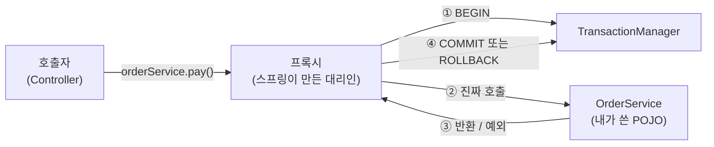

# 딥다이브 — `@Transactional`은 왜 그렇게 생겼나 (프록시·전파·readOnly)

> 기반: **Spring Framework Reference — Declarative Transaction Management** · **Rod Johnson, *Expert One-on-One J2EE Design and Development* (2002)** · **Garcia-Molina & Salem, *Sagas* (SIGMOD 1987)**
> 형식: 30초 직관 → **왜 이렇게 만들어졌나** → 원리 → 트레이드오프. 락·격리수준은 [../../cs/qna/database.md](../../cs/qna/database.md), 프록시 패턴은 [design-patterns.md](design-patterns.md), 학습 순서는 [../../backend-roadmap.md](../../backend-roadmap.md).

---

## 0. 30초 직관 — 대리인이 문을 여닫는다

`@Transactional`이 붙은 메서드를 호출하면, **내 객체가 직접 불리는 게 아니다.** 스프링이 만든 **대리인(프록시)** 이 먼저 불리고, 그가 이렇게 한다:

```
프록시.호출()
  ├─ 트랜잭션 시작 (BEGIN)
  ├─ 진짜객체.호출()      ← 내가 쓴 코드는 여기서만 돈다
  └─ 성공? COMMIT : ROLLBACK
```

이 한 장의 그림에서 이 노트의 거의 모든 내용이 나온다. 특히 **가장 악명 높은 함정**도 여기서 바로 나온다:

> **같은 클래스 안에서 자기 메서드를 부르면 프록시를 안 거친다. 트랜잭션이 안 걸린다.**

이건 버그가 아니라 **스프링이 태어난 이유의 직접적인 대가**다. 왜 그런지가 1장이다.

---

## 1. 역사 — EJB에서 도망치다가 생긴 구조

### 1-1. 2000년대 초, 트랜잭션을 쓰려면 치러야 했던 값

트랜잭션 경계를 코드에 직접 쓰면 이렇게 된다:

```java
Connection con = null;
try {
    con = dataSource.getConnection();
    con.setAutoCommit(false);
    // ... 진짜 업무 로직 3줄 ...
    con.commit();
} catch (Exception e) {
    if (con != null) con.rollback();   // 이것도 예외를 던진다
    throw e;
} finally {
    if (con != null) con.close();
}
```

업무 로직 3줄을 위해 **배관 코드 10줄**. 모든 메서드마다 반복되고, 빠뜨리면 커넥션이 샌다.

당시 자바 진영의 공식 해법은 **EJB(Enterprise JavaBeans)의 컨테이너 관리 트랜잭션(CMT)** 이었다.

> 📖 **EJB가 뭔가 (1998~, 지금은 거의 안 씀)**
>
> **"기업용 자바 부품 규격"**. 1998년 Sun이 만든 서버 컴포넌트 표준이다.
>
> 아이디어는 이렇다 — 업무 로직만 규격에 맞게 짜서 **애플리케이션 서버(컨테이너)** 에 넣으면,
> **트랜잭션·보안·동시성·원격 호출·풀링**을 컨테이너가 대신 처리해 준다.
> 개발자는 "이 메서드는 트랜잭션 필요"라고 **선언만** 하면 됐다. 이게 **CMT(컨테이너 관리 트랜잭션)** 다.
>
> | | EJB 시절 | 지금 (스프링) |
> |---|---|---|
> | 실행 환경 | **무거운 WAS 필수** (WebLogic·WebSphere·JEUS 등) | 내장 톰캣으로 `java -jar` |
> | 내 클래스 | EJB 인터페이스를 **상속·구현해야 함** | 아무것도 안 붙은 **POJO** |
> | 단위 테스트 | 서버를 띄워야 가능 → 사실상 불가 | `new`로 만들어 바로 |
> | 설정 | XML 배포 서술자 (악명 높음) | 애노테이션 |
>
> 그래서 **"아이디어는 훌륭한데 값이 너무 비싸다"** 는 평가를 받았고, 스프링이 그 아이디어만 뽑아 왔다.
> ※ 참고로 **JEUS·WebLogic 같은 자바 EE 애플리케이션 서버는 지금도 공공·금융권에서 현역**이다.
> 그런 환경에서 일한다면 EJB는 남의 옛날이야기가 아니라 **내 스택의 조상**이다.
 배포 서술자에 "이 메서드는 트랜잭션 필요"라고 선언하면 컨테이너가 알아서 열고 닫아줬다. **아이디어 자체는 훌륭했다.**

문제는 값이었다:
- **무거운 애플리케이션 서버**가 반드시 필요했다 (WebLogic·WebSphere)
- 내 클래스가 EJB 인터페이스를 **상속·구현**해야 했다 → 프레임워크에 코드가 종속
- 컨테이너 없이는 **단위 테스트가 불가능**했다 → 테스트하려면 서버를 띄워야 함
- XML 배포 서술자가 지옥이었다

### 1-2. Rod Johnson의 질문

2002년 Rod Johnson은 *Expert One-on-One J2EE Design and Development*에서 질문을 던진다:

> **"선언적 트랜잭션이라는 좋은 아이디어를, EJB 컨테이너 없이 평범한 자바 객체(POJO)에 줄 수는 없나?"**

이 책의 예제 코드가 스프링 프레임워크가 됐다(2003). **스프링의 창립 목표는 "EJB 없는 J2EE"** 였고, 그 1번 항목이 트랜잭션이었다.

### 1-3. 답 — AOP 프록시

컨테이너가 없으니 바이트코드를 갈아끼울 권한도 없다. 남은 방법은 하나였다:

> **내 객체를 감싸는 대리 객체를 런타임에 만들어, 그 대리인이 트랜잭션을 열고 닫는다.**



*(도식 설명: 컨트롤러가 서비스를 부르면 실제로는 스프링이 만든 프록시가 먼저 호출된다. 프록시가 트랜잭션 매니저에게 트랜잭션 시작을 지시하고, 그다음 내가 작성한 진짜 객체의 메서드를 부른다. 정상 반환이면 커밋, 예외가 올라오면 롤백을 지시한다. 내가 쓴 코드에는 트랜잭션 관련 코드가 한 줄도 없다.)*

**얻은 것**: 내 클래스는 아무것도 상속하지 않는 평범한 POJO다. `new`로 만들어 단위 테스트할 수 있다. 애플리케이션 서버가 필요 없다.

**치른 값**: **프록시를 안 거치면 아무 일도 안 일어난다.** 이게 다음 장의 함정 전부의 뿌리다.

> 💡 **패턴 이름표**: 이건 GoF의 **Proxy 패턴**이다 → [design-patterns.md](design-patterns.md)에 이미 "Proxy = `@Transactional`"로 정리돼 있다. 이 노트는 그 한 줄의 속을 여는 것.

---

## 2. 프록시라서 생기는 함정 4개

### 2-1. self-invocation — 가장 많이 당하는 것

```java
@Service
public class OrderService {

    public void placeOrder(Order o) {
        validate(o);
        savePayment(o);          // ❌ 트랜잭션 안 걸린다!
    }

    @Transactional
    public void savePayment(Order o) { ... }
}
```

`placeOrder`가 `savePayment`를 부를 때 쓰는 참조는 **`this`** 다. 프록시가 아니다. 프록시는 바깥에서 들어오는 첫 호출만 가로챈다. 스프링 공식 문서도 이 한계를 명시한다:

> "Consider using AspectJ mode ... if you expect **self-invocations** to be wrapped with transactions as well. In this case, **there is no proxy in the first place.**"
> — [Spring Framework Reference, Using @Transactional](https://docs.spring.io/spring-framework/reference/data-access/transaction/declarative/annotations.html)

**해결책**
1. **다른 빈으로 분리** (권장) — `PaymentService`로 빼서 주입받아 호출. 프록시를 거친다.
2. 자기 자신을 주입받기 (`@Lazy` 필요, 순환참조라 냄새남)
3. AspectJ 위빙으로 전환 (프록시가 아예 없어지지만 빌드가 복잡해진다)

> 🔎 **왜 `private` 메서드에도 안 걸리나**: 프록시는 상속(CGLIB) 또는 인터페이스 구현(JDK 동적 프록시)으로 만들어진다. `private`은 오버라이드가 불가능하니 가로챌 방법이 없다. `final` 메서드·`final` 클래스도 같은 이유로 CGLIB 프록시가 못 감싼다.

### 2-2. 체크 예외는 기본적으로 롤백하지 않는다

```java
@Transactional
public void pay() throws IOException {
    repository.save(...);
    throw new IOException("벤더 응답 없음");   // ⚠️ 커밋된다!
}
```

- **언체크 예외(`RuntimeException`·`Error`)** → 롤백
- **체크 예외(`Exception` 하위)** → **커밋**

납득이 안 가는 규칙인데, 이유는 **역사**다. EJB의 관례를 그대로 물려받았다. EJB에서 체크 예외는 "예상된 업무 상황"(재고 없음 같은), 언체크 예외는 "시스템 고장"으로 보는 문화가 있었다.

**해결**: `@Transactional(rollbackFor = Exception.class)`

> **실무 함의**: 외부 벤더 연계는 `IOException`·`TimeoutException` 같은 **체크 예외**를 던지는 경우가 많다. 여기서 조용히 커밋되면 **"결제는 안 됐는데 주문은 저장된"** 상태가 만들어진다. 정합성 사고의 단골 경로다.

### 2-3. `try-catch`로 삼키면 롤백 신호가 사라진다

```java
@Transactional
public void process() {
    try {
        riskyUpdate();
    } catch (Exception e) {
        log.error("실패", e);      // ❌ 예외를 먹었다 → 프록시는 성공으로 안다 → COMMIT
    }
}
```

프록시가 롤백 여부를 판단하는 유일한 신호가 **"예외가 밖으로 나왔는가"** 다. 삼키면 성공으로 본다.

반대 함정도 있다 — **내부 메서드가 `REQUIRES_NEW`가 아닌데 예외를 던지고 바깥이 잡으면**, 트랜잭션은 이미 `rollback-only`로 표시돼 있어서 마지막에 `UnexpectedRollbackException`이 터진다. "분명 잡았는데 왜 롤백되지?"의 정체.

### 2-4. 트랜잭션 안에서 외부 API를 부르지 마라

```java
@Transactional
public void pay(Order o) {
    orderRepository.save(o);
    vendorClient.charge(o);      // ⚠️ 응답이 30초 걸리면?
    o.markPaid();
}
```

트랜잭션이 열려 있는 동안 **DB 커넥션을 점유**한다. 벤더가 느려지면:

```
벤더 지연 30초 → 커넥션 30초 점유 → 커넥션 풀 고갈
   → 무관한 API까지 전부 대기 → 서비스 전체 장애
```

**하나의 느린 외부 시스템이 전체를 끌어내리는** 전형적 경로다. 게다가 외부 호출은 **롤백이 안 된다** — DB는 되돌려도 벤더 쪽 결제는 이미 나갔다.

**해결 방향**: 트랜잭션 경계를 외부 호출 **바깥**으로 빼고, 그 사이의 정합성은 **멱등성 + Outbox**로 잡는다 → [../../cs/deep-distributed-consistency.md](../../cs/deep-distributed-consistency.md)

---

## 3. 전파(propagation) — 트랜잭션 안에서 또 트랜잭션을 만나면

이미 트랜잭션이 열려 있는데 `@Transactional` 메서드를 또 부르면 어떻게 되나? 그 규칙이 **전파 속성**이다.

| 전파 | 기존 트랜잭션이 있으면 | 없으면 | 쓰는 곳 |
|---|---|---|---|
| **REQUIRED** (기본) | **합류** | 새로 시작 | 대부분 |
| **REQUIRES_NEW** | **잠시 멈추고 별도 트랜잭션** | 새로 시작 | 감사 로그·이력 |
| **NESTED** | 세이브포인트 생성 | 새로 시작 | 부분 롤백 |
| SUPPORTS | 합류 | 트랜잭션 없이 실행 | 조회 |
| MANDATORY | 합류 | **예외** | 반드시 상위가 있어야 하는 내부 메서드 |
| NEVER | **예외** | 트랜잭션 없이 실행 | 트랜잭션 금지 구간 |
| NOT_SUPPORTED | 잠시 멈춤 | 트랜잭션 없이 실행 | 긴 배치 |

### REQUIRED vs REQUIRES_NEW — 실전에서 갈리는 지점

**상황**: 결제를 처리하고, 성공/실패와 무관하게 **시도 이력은 반드시 남겨야** 한다.

```java
@Transactional                                  // REQUIRED
public void pay(Order o) {
    auditService.log(o);        // 여기가 REQUIRED면 → 같이 롤백돼서 이력이 사라진다
    paymentGateway.charge(o);   // 여기서 예외 발생
}
```

`auditService.log()`가 **REQUIRED**면 같은 트랜잭션에 합류하므로 **함께 롤백**된다. 정작 실패 기록이 남지 않는다.

```java
@Service
public class AuditService {
    @Transactional(propagation = Propagation.REQUIRES_NEW)
    public void log(Order o) { ... }    // ✅ 독립 커밋 → 바깥이 롤백돼도 살아남는다
}
```

**REQUIRES_NEW의 대가**: 별도 트랜잭션이므로 **커넥션을 하나 더 쓴다.** 바깥 트랜잭션은 그동안 멈춘 채 커넥션을 쥐고 있다 → **커넥션 2개 동시 점유**. 루프 안에서 `REQUIRES_NEW`를 부르면 풀이 순식간에 마른다. 최악의 경우 자기 자신을 기다리는 **데드락**이 난다.

### NESTED — 세이브포인트

부분 롤백이 필요할 때 쓴다. 하지만 **JDBC 세이브포인트에 의존**하므로 JPA 환경에서는 제약이 많고, 지원하지 않는 트랜잭션 매니저도 있다. 실무에서는 드물다.

> ⚠️ **2-1과 결합되는 함정**: `REQUIRES_NEW`를 **같은 클래스 안에서** 호출하면 프록시를 안 거치므로 **아무 일도 안 일어난다.** 새 트랜잭션은커녕 기존 트랜잭션에 그냥 묻힌다. 전파 속성 문제로 보이지만 실제 원인은 self-invocation인 경우가 대단히 흔하다.

---

## 4. `readOnly = true`가 실제로 하는 일

"읽기 전용이니 빠르겠지"라고 뭉뚱그리기 쉬운데, 실제로는 **층마다 다른 일**이 일어난다.

| 층 | 하는 일 | 효과 |
|---|---|---|
| **JPA / Hibernate** | 플러시 모드를 `MANUAL`로 → **더티 체킹 안 함** | 가장 큰 이득. 스냅샷 비교 비용과 메모리가 사라진다 |
| **JDBC** | `Connection.setReadOnly(true)` — 드라이버·DB에 **힌트** | DB마다 다름. 무시하는 경우도 있다 |
| **라우팅** | `AbstractRoutingDataSource`로 **읽기 복제본**에 보냄 | 직접 구현해야 함. 자동 아님 |

**핵심은 첫 줄이다.** 하이버네이트는 영속성 컨텍스트에 올라온 엔티티의 **스냅샷을 떠서 커밋 시점에 비교**(더티 체킹)한다. 조회만 하는데도 이 비용이 든다. `readOnly = true`면 이걸 통째로 건너뛴다. 조회량이 많은 목록 API에서 체감이 크다.

> ⚠️ **오해 주의**: `readOnly = true`는 **쓰기를 막는 보안 장치가 아니다.** 순수 JDBC/MyBatis 환경에서는 드라이버가 힌트를 무시하면 **UPDATE가 그냥 나간다.** "읽기 전용이라 안전하다"고 믿으면 안 된다.

> **MyBatis 쓰는 경우**: 하이버네이트의 더티 체킹이 없으므로 `readOnly`의 이득은 **JDBC 힌트와 복제본 라우팅뿐**이다. JPA만큼 극적이지 않다. 스택에 따라 기대치를 조정해야 한다.

---

## 5. 그런데 왜 짧은 트랜잭션이어야 하나 — 1987년의 통찰

트랜잭션을 길게 잡으면 안 된다는 조언은 어디서 왔나. 놀랍게도 **1987년 논문**이 뿌리다.

Garcia-Molina & Salem의 *Sagas*(SIGMOD 1987)는 **장기 실행 트랜잭션(LLT)** 문제를 이렇게 정리한다:

> 장기 트랜잭션은 데이터베이스 자원을 오래 붙들고 있어서, **짧고 흔한 트랜잭션들의 완료를 심각하게 지연**시킨다. 게다가 롤백해야 하면 되돌릴 일이 엄청나게 많아진다.
> — [Sagas, SIGMOD 1987](https://dl.acm.org/doi/10.1145/38713.38742) (요지 정리)

논문의 해법은 **긴 트랜잭션을 짧은 트랜잭션 여러 개로 쪼개고**, 실패하면 **보상 트랜잭션(compensating transaction)** 으로 되돌리는 것이었다.

> 🎭 **재미있는 지점**: 이 논문은 **마이크로서비스와 아무 상관없이 쓰였다.** 1987년에는 분산 서비스라는 개념도 없었고, 단일 데이터베이스 안의 긴 배치 작업이 문제였다. 그런데 40년 뒤 **Saga 패턴**이라는 이름으로 마이크로서비스 정합성의 표준 해법이 됐다. 문제의 형태가 같았기 때문이다 — **"원자성을 포기하고 보상으로 대신한다."**

**그래서 4장(외부 API 호출)과 이어진다.** 트랜잭션 안에서 벤더를 부르면 그게 곧 LLT다. 1987년에 이미 나쁜 생각이라고 밝혀진 것을, 2026년에 `@Transactional` 한 줄로 무심코 만들 수 있다.

---

## 6. 3단 요약 (암기용)

### Q1. `@Transactional`을 붙였는데 롤백이 안 된다. 원인 후보는?

- **① 결론 · WHAT** ① **self-invocation**(같은 클래스 내부 호출) ② **체크 예외**(기본은 커밋) ③ **예외를 `try-catch`로 삼킴**. 이 셋이 대부분이다.
- **② 원리 · HOW** 셋 다 뿌리가 같다 — **프록시가 판단할 근거를 못 받는 것**. 내부 호출은 프록시를 아예 안 거치고, 삼킨 예외는 프록시까지 도달하지 않으며, 체크 예외는 도달해도 롤백 대상이 아니라고 규정돼 있다(EJB 시절 관례를 물려받음).
- **③ 확장 · TRADE-OFF** 이 함정들은 버그가 아니라 **"EJB 컨테이너 없이 POJO에 선언적 트랜잭션을 주겠다"는 창립 결정의 대가**다. 그 대가로 얻은 게 컨테이너 독립성과 단위 테스트 가능성이다. 없애려면 AspectJ 위빙으로 가야 하는데, 그러면 빌드 복잡도를 다시 치른다.

### Q2. `readOnly = true`는 왜 성능이 좋아지나?

- **① 결론 · WHAT** 주 효과는 **하이버네이트의 더티 체킹 제거**다. JDBC 힌트와 복제본 라우팅은 부수적이다.
- **② 원리 · HOW** JPA는 영속성 컨텍스트의 엔티티 **스냅샷을 떠 커밋 시점에 비교**해 변경을 감지한다. 조회만 해도 이 비용이 든다. `readOnly`면 플러시 모드가 `MANUAL`이 되어 이 과정을 건너뛴다.
- **③ 확장 · TRADE-OFF** **쓰기를 막는 보안 장치가 아니다.** MyBatis·순수 JDBC 환경에서는 드라이버가 힌트를 무시하면 UPDATE가 그냥 나간다. 또 복제본 라우팅은 자동이 아니라 직접 구현해야 하고, 붙이는 순간 **복제 지연(replication lag)** 이라는 새 문제를 떠안는다.

### Q3. `REQUIRED`와 `REQUIRES_NEW`는 언제 갈리나?

- **① 결론 · WHAT** **바깥이 실패해도 살아남아야 하는 작업**이면 `REQUIRES_NEW`. 대표적으로 감사 로그·시도 이력.
- **② 원리 · HOW** `REQUIRED`는 기존 트랜잭션에 합류하므로 **운명을 공유**한다 — 바깥이 롤백하면 같이 사라진다. `REQUIRES_NEW`는 기존 것을 잠시 멈추고 **독립 트랜잭션**으로 커밋한다.
- **③ 확장 · TRADE-OFF** 독립성의 값은 **커넥션이다.** 바깥 트랜잭션이 커넥션을 쥔 채 멈춰 있으므로 **동시에 2개**를 쓴다. 루프 안에서 부르면 풀이 마르고, 심하면 자기 자신을 기다리는 데드락이 난다. 그리고 `REQUIRES_NEW`를 **같은 클래스 안에서 부르면 아무 효과가 없다**(Q1의 self-invocation).

---

## 용어 사전

| 용어 | 뜻 |
|------|-----|
| 선언적 트랜잭션 | 코드가 아니라 애노테이션·설정으로 트랜잭션 경계를 지정 |
| AOP 프록시 | 대상 객체를 감싸 부가 기능을 넣는 런타임 대리 객체 |
| self-invocation | 같은 객체 내부에서 자기 메서드를 호출 — 프록시를 안 거침 |
| CGLIB / JDK 동적 프록시 | 상속 기반 / 인터페이스 기반 프록시 생성 방식 |
| 전파(propagation) | 기존 트랜잭션을 만났을 때의 처리 규칙 |
| 더티 체킹 | JPA가 스냅샷 비교로 변경을 감지하는 것 |
| LLT (장기 실행 트랜잭션) | 자원을 오래 붙드는 트랜잭션. 1987년부터 안티패턴 |
| 보상 트랜잭션 | 이미 커밋된 작업을 되돌리는 별도 트랜잭션 |
| rollback-only | 롤백이 예약된 상태 표시. 커밋 시도 시 예외 |

## 연결 지도
- **Proxy 패턴 자체**: → [design-patterns.md](design-patterns.md)
- **격리수준·락**: → [../../cs/qna/database.md](../../cs/qna/database.md)
- **인덱스와 락 범위**: → [../../cs/deep-btree-index.md](../../cs/deep-btree-index.md)
- **프로세스가 여러 개면?**: → [../../cs/deep-redis-cache-and-lock.md](../../cs/deep-redis-cache-and-lock.md)
- **트랜잭션이 시스템을 넘어가면?**: → [../../cs/deep-distributed-consistency.md](../../cs/deep-distributed-consistency.md)
- **학습 순서**: → [../../backend-roadmap.md](../../backend-roadmap.md)

## 출처
- Spring Framework Reference, *Using @Transactional* — https://docs.spring.io/spring-framework/reference/data-access/transaction/declarative/annotations.html
- Spring Framework Reference, *Data Access / Transaction Management* — https://docs.spring.io/spring-framework/reference/data-access/transaction.html
- Johnson, Rod. *Expert One-on-One J2EE Design and Development.* Wrox, 2002 — 스프링의 출발점이 된 책
- Garcia-Molina, H. & Salem, K. *Sagas.* ACM SIGMOD 1987, pp. 249–259 — https://dl.acm.org/doi/10.1145/38713.38742
- Baeldung, *Transactions with Spring and JPA* — https://www.baeldung.com/transaction-configuration-with-jpa-and-spring

_짧은 인용은 출처 표기. 스프링 버전에 따라 세부 동작이 달라질 수 있으니 사용 중인 버전의 레퍼런스를 확인할 것._
