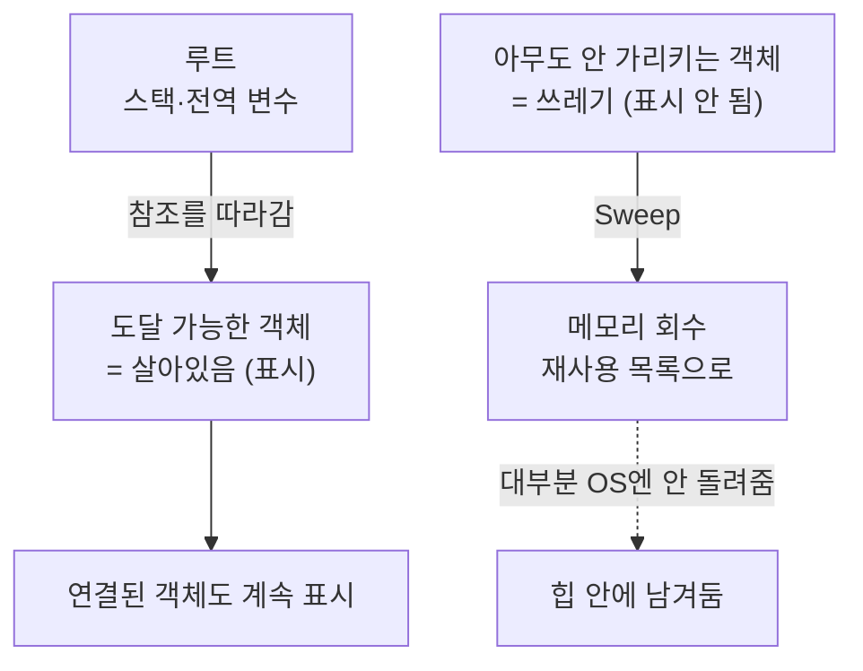

# 딥다이브 — Unity 가비지 컬렉션 내부 (공식 문서 기반)

> 기반: **Unity Manual – Garbage collector / Incremental GC / Understanding the managed heap** ([GC](https://docs.unity3d.com/6000.1/Documentation/Manual/performance-garbage-collector.html) · [Incremental](https://docs.unity3d.com/6000.1/Documentation/Manual/performance-incremental-garbage-collection.html))
> 형식: 12살 요약 → 내부 동작 심화. 얕은 버전은 [qna.md](qna.md), [concept.md](concept.md).

---

## 0. 12살 눈높이 요약 (30초)

게임이 만든 물건(객체)들이 메모리에 쌓여요. 안 쓰는 걸 자동으로 치우는 청소부가 **GC(가비지 컬렉션)**예요. 그런데 이 청소부는 (1) 한 번에 몰아 치우면 게임이 **잠깐 멈칫**하고, (2) 넓힌 방(힙)을 잘 **안 돌려줘요**. 그래서 청소를 **여러 프레임에 나눠서**(Incremental) 하고, 근본적으로는 **쓰레기를 덜 만드는 것**이 답이에요. 아래는 그 내부 동작이에요.

---

## 1. 왜 GC가 있나

C/C++는 메모리를 **손으로** 할당·해제한다 → 실수하면 누수·크래시. Unity(C#)는 **GC**가 안 쓰는 메모리를 자동 회수한다. 편하지만 **언제·얼마나 오래 도는지 통제가 어렵다** → 게임의 프레임 끊김 원인.

Unity 매뉴얼: GC는 *"관리 힙의 모든 객체를 검사해, 앱이 더는 참조하지 않는 객체를 삭제 대상으로 표시(mark)"*한다.

---

## 2. Boehm-Demers-Weiser GC의 성격

Unity의 GC(Mono·IL2CPP 공통)는 **Boehm–Demers–Weiser** 방식. 세 가지 핵심 성질:

1. **보수적(conservative)**: 메모리를 훑어 **포인터처럼 보이는 값이면 전부 "참조"로 간주**한다. 진짜 포인터인지 100% 확신 못 하므로, 실제론 쓰레기인데 못 지우는 경우가 생길 수 있다(보수적으로 살려둠).
2. **비세대(non-generational)**: "새 객체 / 오래된 객체"를 구분해 자주 쓰는 영역만 빨리 청소하는 세대별 최적화가 **없다** → 매번 전체를 본다.
3. **비압축(non-compacting)**: 살아남은 객체를 한쪽으로 모아 **빈 공간을 합치지 않는다** → **단편화(fragmentation)**가 남는다.

기본 동작은 **Stop-The-World**(청소 동안 게임 정지) — 이걸 완화한 게 Incremental(5장).

---

## 3. Mark & Sweep 두 단계

1. **Mark(표시)**: 루트(스택·전역 등)에서 시작해 **도달 가능한(reachable) 객체를 전부 표시**. 표시 안 된 건 아무도 안 쓰는 쓰레기.
2. **Sweep(청소)**: 표시 안 된 객체의 메모리를 **회수해 재사용 목록에 넣는다.**

> 중요: Sweep은 메모리를 **관리 힙 안에서 재사용**하도록 되돌릴 뿐, 대부분 **OS에 바로 반환하지 않는다**(4장).

*(도식 설명: 루트에서 참조를 따라가 도달 가능한 객체를 '살아있음'으로 표시하고, 표시 안 된 쓰레기는 회수해 재사용 목록에 넣는다. 회수한 메모리는 대부분 OS로 안 돌려주고 힙에 남긴다.)*

---

## 4. 왜 힙이 안 줄어드나 (핵심)

- **비압축 + 단편화**: 객체가 여기저기 흩어져 죽으면, 빈칸이 조각나 **큰 페이지를 통째로 비우지 못한다** → 힙을 못 줄임.
- **낙관적 유지**: Unity는 재확장 비용을 피하려 넓힌 힙을 **일부러 붙잡는다**(비어 있어도).
- **반환 정책**(Understanding the managed heap):
  - 대부분 플랫폼에서 **빈 페이지를 "언젠가" OS에 반환**하나 **시점 보장 없음, 의존 금지**.
  - **주소공간(address space)은 절대 반환 안 함.**
  - **WebGL은 아예 반환 안 함** — 힙은 오직 커짐.
- 실무 결론: **"피크 사용량 = 상주 메모리"**로 메모리 예산을 잡아라.
- → 이건 CS의 "남은 메모리보다 작은데 OOM"(단편화)과 **같은 원리**. (→ [../cs/concept.md](../cs/concept.md))

---

## 5. Incremental GC 상세 (2019+)

**문제**: Mark를 한 프레임에 다 하면 그 프레임이 **길게 멈칫(GC spike)**.

**해결**: Mark 단계를 **여러 프레임에 잘게 나눠** 수행. 매뉴얼: *"spreads out the process of garbage collection over multiple frames."*

### 왜 어려운가 — 참조가 바뀐다
Mark를 조각내면, 조각 사이에 **객체의 참조가 바뀔 수 있다.** 그러면 이미 표시한 결과가 틀려진다. 매뉴얼: 참조가 바뀌면 *"the garbage collector must scan those objects again."* 참조가 **너무 자주** 바뀌면 *"the marking phase never finishes"* → **전체(비증분) GC로 되돌아간다(fallback).**

### Write Barrier(쓰기 장벽)
이를 위해 Unity는 **write barrier** 코드를 자동 삽입 — *참조가 바뀔 때마다 GC에 "이 객체 다시 스캔해야 함"을 알려주는* 추가 코드. 이걸로 마킹 조각들 사이의 변경을 추적한다. (약간의 상시 오버헤드)

### 한계
- **총 작업량은 안 줄어든다.** 매뉴얼: *"doesn't make garbage collection faster"* — 스파이크를 **분산**할 뿐.
- 프레임 간 참조 변경이 많으면 효율↓ / fallback 위험.
- **WebGL 미지원.**

---

## 6. 근본 해결 — 할당(garbage)을 줄여라 (심화)

GC 튜닝보다 **쓰레기를 안 만드는 것**이 정석. 힙 할당을 유발하는 것들과 대책:

| 유발 원인 | 왜 힙 할당 | 대책 |
|-----------|-----------|------|
| **string 조작** | `a+b+c`가 임시 문자열을 계속 생성 | `StringBuilder`, 캐싱 |
| **boxing** | 값 타입→object 감싸며 힙에 객체 (→ [../lang/java/types-boxing.md](../lang/java/types-boxing.md)) | 제네릭·struct로 회피 |
| **람다 캡처(closure)** | 외부 변수 캡처 시 힙 객체 생성 | 캡처 없는 람다·정적 메서드 |
| **LINQ / foreach 일부** | 이터레이터·델리게이트 할당 | 핫패스에선 for 루프 |
| **컬렉션 재할당** | List 용량 초과 시 재할당 | 초기 용량 지정·풀링 |

- **풀링(Object Pool)**: 미리 만들어 재사용 → 신규 할당 회피.
- **struct(값 타입)**: 스택/인라인이라 GC 대상이 아님.
- **`GC.Collect()` 강제 호출**: 실시간 플레이 중 금지 — **로딩 화면 등 비실시간 구간**에서만.
- **측정 우선**: Unity **Profiler**의 GC Alloc 열로 "어디서 할당이 나는지" 먼저 찾아라. (추측 금지)

---

## 7. 연결 지도
- **박싱 → 힙 → GC**: Java·C#·Unity 공통 원리 (→ [../lang/java/types-boxing.md](../lang/java/types-boxing.md), [../lang/csharp/concept.md](../lang/csharp/concept.md)).
- **비압축 → 단편화 → OOM**: CS 메모리 개념과 동일 (→ [../cs/concept.md](../cs/concept.md)).

## 용어 사전
| 용어 | 뜻 |
|------|-----|
| 보수적 GC | 포인터처럼 보이면 참조로 간주 |
| Mark & Sweep | 도달 가능 표시 → 나머지 회수 |
| 비압축 | 객체를 모으지 않음 → 단편화 |
| 단편화 | 빈칸이 조각나 큰 공간 확보 실패 |
| Incremental GC | Mark를 여러 프레임에 분할 |
| Write Barrier | 참조 변경을 GC에 알리는 삽입 코드 |
| GC spike | 청소로 프레임이 순간 멈칫 |
| Object Pool | 객체 재사용으로 할당 회피 |

## 출처
- Unity Technologies. *Manual – Garbage collector overview.* — https://docs.unity3d.com/6000.1/Documentation/Manual/performance-garbage-collector.html
- Unity Technologies. *Manual – Incremental garbage collection.* — https://docs.unity3d.com/6000.1/Documentation/Manual/performance-incremental-garbage-collection.html
- Unity Technologies. *Manual – Understanding the managed heap.* — https://docs.unity3d.com/2020.1/Documentation/Manual/BestPracticeUnderstandingPerformanceInUnity4-1.html

_짧은 인용은 출처 표기. Unity 버전에 따라 세부는 달라질 수 있으니 최신 매뉴얼 확인._
